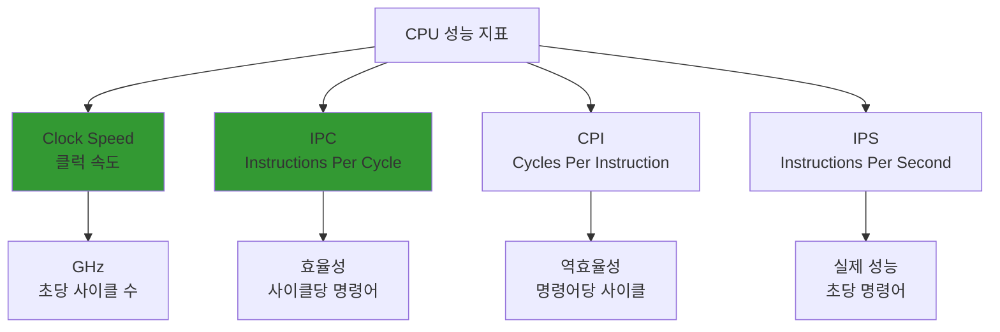
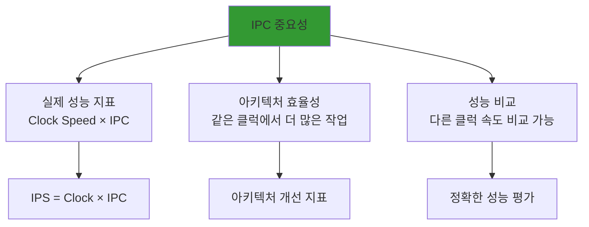
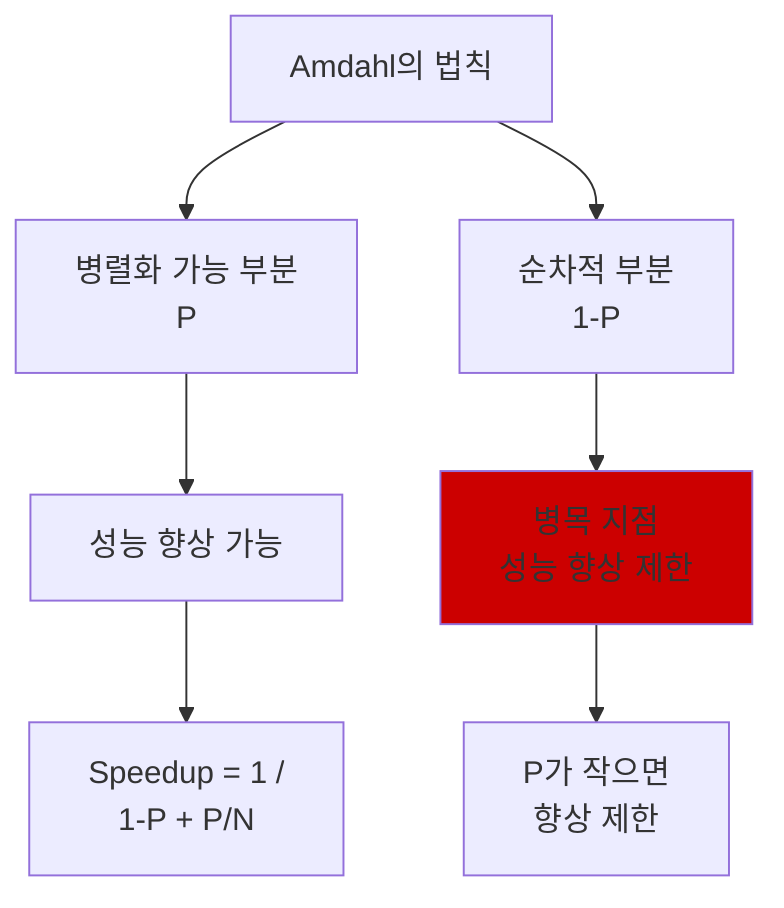
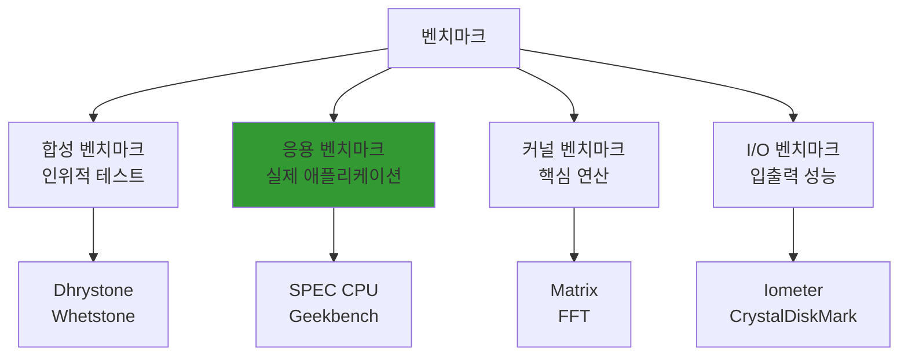
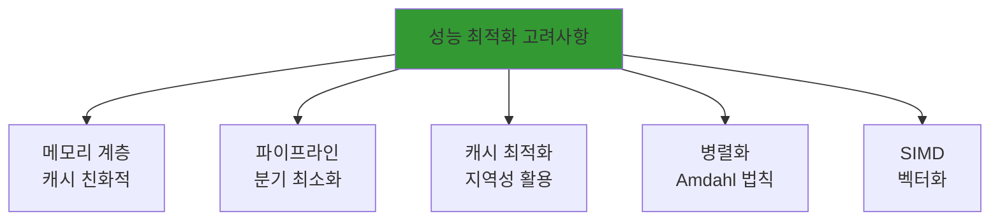
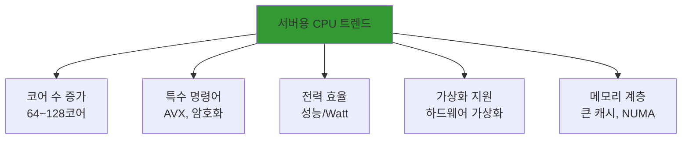
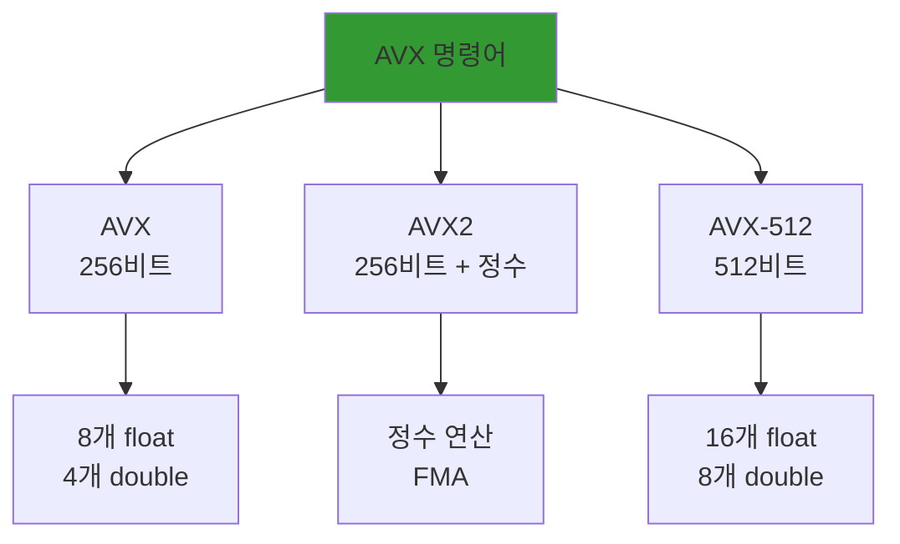
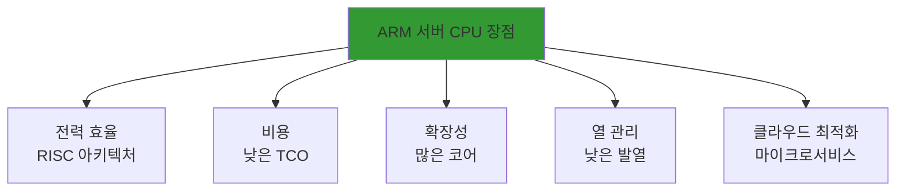
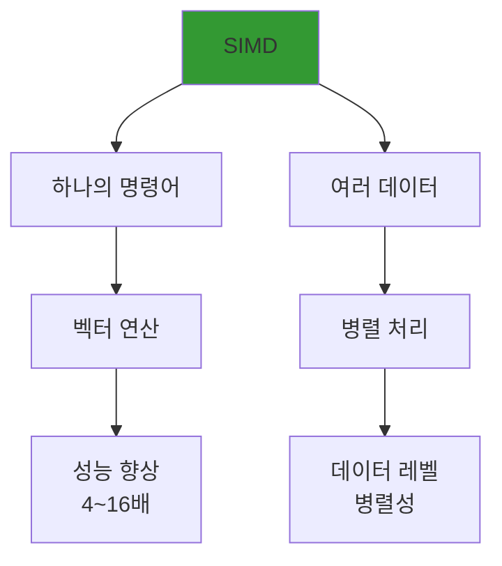
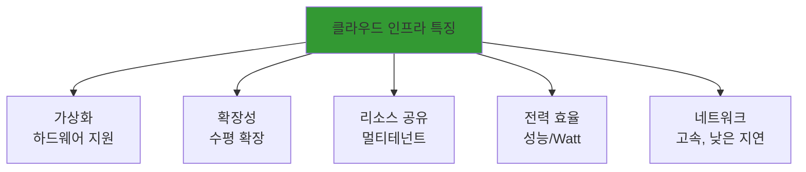

---

## 📌 성능 측정 및 최적화

### ARCH-041
Q. CPU 성능을 측정하는 지표(Clock Speed, IPC, CPI 등)에 대해 설명해주세요.

**CPU 성능 측정 지표는 클럭 속도, IPC, CPI 등으로, 각각 다른 측면의 성능을 나타냄.**

**주요 지표:**

**1. Clock Speed (클럭 속도)**
- **정의**: CPU가 초당 수행하는 클럭 사이클 수
- **단위**: Hz (헤르츠), GHz (기가헤르츠)
- **의미**: 클럭이 빠를수록 더 많은 작업 수행 가능
- **예시**: 3.0 GHz = 초당 30억 사이클

**2. IPC (Instructions Per Cycle)**
- **정의**: 한 클럭 사이클당 실행되는 명령어 수
- **의미**: CPU 효율성 지표
- **값**: 보통 0.5 ~ 4 사이
- **높을수록**: 더 효율적

**3. CPI (Cycles Per Instruction)**
- **정의**: 하나의 명령어를 실행하는데 필요한 클럭 사이클 수
- **의미**: IPC의 역수 (CPI = 1 / IPC)
- **낮을수록**: 더 효율적

**4. IPS (Instructions Per Second)**
- **정의**: 초당 실행되는 명령어 수
- **계산**: IPS = Clock Speed × IPC
- **의미**: 실제 성능 지표



**관계식:**

**성능 계산:**
```
성능 = Clock Speed × IPC
     = Clock Speed / CPI
     = IPS
```

**예시:**
```
CPU A: 3.0 GHz, IPC = 2.0
→ IPS = 3.0 × 2.0 = 6.0 GIPS

CPU B: 2.5 GHz, IPC = 2.5
→ IPS = 2.5 × 2.5 = 6.25 GIPS

→ CPU B가 더 빠름 (IPC가 높아서)
```

**성능에 영향을 주는 요소:**

**Clock Speed:**
- 제조 공정
- 전압
- 발열

**IPC:**
- 파이프라인 깊이
- 분기 예측
- Out-of-Order Execution
- 캐시 성능

**비교표:**

| 지표 | 의미 | 높을수록 좋은가? | 영향 요소 |
|------|------|------------------|-----------|
| **Clock Speed** | 클럭 속도 | ✅ | 제조 공정, 전압 |
| **IPC** | 사이클당 명령어 | ✅ | 아키텍처, 최적화 |
| **CPI** | 명령어당 사이클 | ❌ | 아키텍처, 최적화 |
| **IPS** | 초당 명령어 | ✅ | Clock Speed × IPC |

**실제 사용:**

**성능 비교:**
- Clock Speed만으로는 부족
- IPC도 함께 고려
- 실제 워크로드로 측정

**최적화:**
- IPC 향상: 파이프라인, 분기 예측
- Clock Speed 향상: 제조 공정 개선

**결론:**
- **Clock Speed**: 클럭 속도, 기본 성능 지표
- **IPC**: 효율성, 사이클당 명령어 수
- **CPI**: IPC의 역수
- **IPS**: 실제 성능 = Clock Speed × IPC
- **종합**: 모든 지표를 함께 고려해야 정확한 성능 평가

### ARCH-042
Q. IPC(Instructions Per Cycle)가 무엇이고 왜 중요한가요?

**IPC (Instructions Per Cycle)**는 한 클럭 사이클당 실행되는 명령어 수로, CPU의 효율성을 나타내는 핵심 지표.

**정의:**
- Instructions Per Cycle
- 한 사이클에 몇 개의 명령어를 실행하는가
- CPU 아키텍처의 효율성 지표

**계산:**
```
IPC = 총 실행 명령어 수 / 총 클럭 사이클 수
```

**중요성:**

**1. 실제 성능 지표**
- Clock Speed만으로는 부족
- IPC가 높으면 같은 클럭에서 더 많은 작업
- 실제 성능 = Clock Speed × IPC

**2. 아키텍처 효율성**
- 같은 클럭 속도에서 IPC가 높으면 더 효율적
- 아키텍처 개선의 핵심 지표

**3. 성능 비교**
- 다른 클럭 속도의 CPU 비교 가능
- 실제 성능을 정확히 평가



**IPC에 영향을 주는 요소:**

**1. 파이프라인 깊이**
- 깊은 파이프라인: 높은 IPC 가능
- 하지만 해저드 증가 가능

**2. 분기 예측**
- 정확한 예측: 파이프라인 중단 감소
- IPC 향상

**3. Out-of-Order Execution**
- 명령어 재정렬로 효율성 향상
- IPC 향상

**4. 캐시 성능**
- 캐시 히트율이 높으면 대기 시간 감소
- IPC 향상

**5. 멀티스레딩**
- 동시에 여러 명령어 실행
- IPC 향상

**실제 값:**

**일반적인 IPC:**
- 단순 파이프라인: 0.5 ~ 1.0
- 현대 CPU: 1.5 ~ 3.0
- 최적화된 워크로드: 3.0 ~ 4.0

**예시:**
```
CPU A: 3.0 GHz, IPC = 1.5
→ 성능 = 4.5 GIPS

CPU B: 2.5 GHz, IPC = 2.0
→ 성능 = 5.0 GIPS

→ CPU B가 더 빠름 (IPC가 높아서)
```

**IPC 향상 방법:**

**하드웨어:**
- 더 깊은 파이프라인
- 더 나은 분기 예측
- Out-of-Order Execution
- 더 큰 캐시

**소프트웨어:**
- 컴파일러 최적화
- 코드 최적화
- 캐시 친화적 프로그래밍

**결론:**
- **IPC**: 사이클당 명령어 수, 효율성 지표
- **중요성**: 실제 성능 평가, 아키텍처 효율성, 성능 비교
- **영향 요소**: 파이프라인, 분기 예측, OoO, 캐시
- **향상**: 하드웨어/소프트웨어 최적화

### ARCH-043
Q. Amdahl의 법칙에 대해 설명하고, 병렬화의 한계를 설명해주세요.

**Amdahl의 법칙(Amdahl's Law)**은 병렬화로 인한 성능 향상의 한계를 설명하는 법칙.

**정의:**
- 프로그램의 일부만 병렬화 가능
- 병렬화 가능한 부분의 비율에 따라 성능 향상 제한
- 병렬화 불가능한 부분이 병목

**공식:**
```
Speedup = 1 / ((1 - P) + P/N)

P: 병렬화 가능한 부분의 비율 (0 ~ 1)
N: 프로세서/코어 수
(1 - P): 순차적 부분의 비율
```

**해석:**
- P가 1 (100% 병렬화 가능): 이론적으로 무한대 속도 향상
- P가 0 (병렬화 불가능): 속도 향상 없음
- N이 증가해도 (1-P) 부분 때문에 한계 존재



**예시:**

**시나리오 1: P = 0.9 (90% 병렬화 가능)**
```
N = 2: Speedup = 1 / (0.1 + 0.9/2) = 1.82배
N = 4: Speedup = 1 / (0.1 + 0.9/4) = 3.08배
N = 8: Speedup = 1 / (0.1 + 0.9/8) = 4.71배
N = ∞: Speedup = 1 / 0.1 = 10배 (한계)
```

**시나리오 2: P = 0.5 (50% 병렬화 가능)**
```
N = 2: Speedup = 1 / (0.5 + 0.5/2) = 1.33배
N = 4: Speedup = 1 / (0.5 + 0.5/4) = 1.60배
N = 8: Speedup = 1 / (0.5 + 0.5/8) = 1.78배
N = ∞: Speedup = 1 / 0.5 = 2배 (한계)
```

**병렬화의 한계:**

**1. 순차적 부분의 제약**
- 프로그램의 일부는 순차적으로 실행되어야 함
- 이 부분이 병목이 됨
- 코어 수를 늘려도 이 부분은 개선 안 됨

**2. 한계 속도 향상**
```
최대 Speedup = 1 / (1 - P)
```
- P가 작으면 한계가 낮음
- 예: P=0.5 → 최대 2배

**3. 오버헤드**
- 병렬화 오버헤드 (동기화, 통신)
- 실제로는 더 낮은 성능 향상

**4. 암달의 법칙 vs 구스타프슨의 법칙**
- **암달**: 작업량 고정, 시간 단축
- **구스타프슨**: 시간 고정, 작업량 증가
- 실제로는 둘 다 적용

**실제 적용:**

**병렬화 전략:**
- 순차적 부분 최소화
- 병렬화 가능 부분 최대화
- 오버헤드 고려

**예시:**
```
프로그램:
  - 순차적 부분: 10% (초기화, 정리)
  - 병렬화 가능: 90% (계산)

코어 수 증가:
  - 2코어: 1.82배
  - 4코어: 3.08배
  - 8코어: 4.71배
  - 16코어: 6.40배
  - 한계: 10배
```

**결론:**
- **Amdahl의 법칙**: 병렬화 성능 향상의 한계 설명
- **공식**: Speedup = 1 / ((1-P) + P/N)
- **한계**: 순차적 부분이 병목, 최대 Speedup = 1/(1-P)
- **의미**: 병렬화만으로는 무한한 성능 향상 불가능

### ARCH-044
Q. 벤치마크(Benchmark)의 종류와 성능 측정 방법에 대해 설명해주세요.

**벤치마크(Benchmark)**는 컴퓨터 성능을 측정하고 비교하기 위한 표준 테스트.

**벤치마크 종류:**

**1. 합성 벤치마크 (Synthetic Benchmark)**
- **정의**: 인위적으로 만든 테스트
- **예시**: Dhrystone, Whetstone, Linpack
- **특징**: 특정 기능만 측정
- **용도**: 특정 성능 특성 평가

**2. 응용 벤치마크 (Application Benchmark)**
- **정의**: 실제 애플리케이션 사용
- **예시**: SPEC CPU, Geekbench, Cinebench
- **특징**: 실제 워크로드 반영
- **용도**: 실제 성능 평가

**3. 커널 벤치마크 (Kernel Benchmark)**
- **정의**: 핵심 연산만 측정
- **예시**: Matrix multiplication, FFT
- **특징**: 특정 연산 집중
- **용도**: 특정 연산 성능 평가

**4. I/O 벤치마크**
- **정의**: 입출력 성능 측정
- **예시**: Iometer, CrystalDiskMark
- **특징**: 디스크, 네트워크 성능
- **용도**: 저장 장치 성능 평가



**주요 벤치마크:**

**SPEC CPU:**
- 표준 성능 평가 회사 (SPEC)
- CPU 성능 측정
- 실제 애플리케이션 기반
- 업계 표준

**Geekbench:**
- 크로스 플랫폼 벤치마크
- CPU, GPU 성능 측정
- 모바일, 데스크톱 지원

**Cinebench:**
- 3D 렌더링 성능
- CPU, GPU 테스트
- 시네마 4D 기반

**성능 측정 방법:**

**1. 실행 시간 측정**
- 프로그램 실행 시간
- Wall-clock time
- CPU time

**2. 처리량 측정**
- 단위 시간당 처리량
- Throughput
- 예: 초당 연산 수

**3. 지연 시간 측정**
- 응답 시간
- Latency
- 예: 요청-응답 시간

**4. 리소스 사용률**
- CPU 사용률
- 메모리 사용량
- 전력 소비

**측정 시 고려사항:**

**1. 환경 통제**
- 같은 하드웨어
- 같은 소프트웨어 버전
- 같은 설정

**2. 여러 번 실행**
- 평균값 사용
- 이상치 제거
- 통계적 유의성

**3. 워크로드 선택**
- 실제 사용 패턴 반영
- 다양한 워크로드 테스트

**4. 공정한 비교**
- 같은 조건에서 테스트
- 편향 제거

**벤치마크의 한계:**

**1. 실제 성능과 차이**
- 벤치마크는 특정 패턴
- 실제 사용은 다를 수 있음

**2. 최적화 문제**
- 벤치마크에 특화된 최적화
- 실제 성능과 불일치

**3. 워크로드 의존성**
- 특정 워크로드에만 유리
- 다른 워크로드에서는 다를 수 있음

**결론:**
- **벤치마크 종류**: 합성, 응용, 커널, I/O
- **측정 방법**: 실행 시간, 처리량, 지연 시간, 리소스 사용률
- **고려사항**: 환경 통제, 여러 번 실행, 워크로드 선택
- **한계**: 실제 성능과 차이, 최적화 문제

### ARCH-045
Q. 프로그램 성능 최적화 시 컴퓨터 구조적 관점에서 고려해야 할 사항은 무엇인가요?

**프로그램 성능 최적화 시 메모리 계층, 파이프라인, 캐시, 병렬화 등 컴퓨터 구조적 특성을 고려해야 함.**

**주요 고려사항:**

**1. 메모리 계층 구조**
- 캐시 친화적 코드 작성
- 지역성 활용 (시간, 공간)
- 캐시 미스 최소화
- 메모리 접근 패턴 최적화

**2. 파이프라인 효율성**
- 분기 예측 친화적 코드
- 분기 최소화
- 데이터 의존성 최소화
- 명령어 순서 최적화

**3. 캐시 최적화**
- 캐시 라인 크기 고려
- False sharing 방지
- 데이터 정렬 (Alignment)
- 캐시 블로킹 (Cache Blocking)

**4. 병렬화**
- Amdahl의 법칙 고려
- 순차적 부분 최소화
- 동기화 오버헤드 최소화
- 부하 균형

**5. SIMD 활용**
- 벡터화 가능한 연산
- 데이터 정렬
- SIMD 명령어 사용



**상세 설명:**

**1. 메모리 계층 구조:**

**캐시 친화적 코드:**
```c
// 나쁜 예: 랜덤 접근
for (int i = 0; i < n; i++) {
    result += array[random_index[i]];
}

// 좋은 예: 순차 접근
for (int i = 0; i < n; i++) {
    result += array[i];
}
```

**지역성 활용:**
- 시간 지역성: 같은 데이터 재사용
- 공간 지역성: 인접 데이터 접근

**2. 파이프라인 효율성:**

**분기 최소화:**
```c
// 나쁜 예: 많은 분기
if (condition1) { ... }
if (condition2) { ... }
if (condition3) { ... }

// 좋은 예: 분기 예측 친화적
if (likely_condition) { ... }
```

**데이터 의존성:**
- 의존성 체인 최소화
- 독립적인 연산 병렬화

**3. 캐시 최적화:**

**캐시 블로킹:**
```c
// 큰 배열을 작은 블록으로 나눠 처리
for (int i = 0; i < n; i += block_size) {
    // 블록 단위로 처리
}
```

**False Sharing 방지:**
- 서로 다른 스레드가 같은 캐시 라인 접근 방지
- 패딩 사용

**4. 병렬화:**

**순차적 부분 최소화:**
- 초기화, 정리 작업 최소화
- 병렬화 가능 부분 최대화

**부하 균형:**
- 작업을 균등하게 분배
- 동적 스케줄링

**5. SIMD 활용:**

**벡터화:**
```c
// 스칼라 연산
for (int i = 0; i < n; i++) {
    c[i] = a[i] + b[i];
}

// SIMD 연산 (의사 코드)
for (int i = 0; i < n; i += 4) {
    c[i:i+3] = a[i:i+3] + b[i:i+3];  // 4개씩 병렬
}
```

**최적화 우선순위:**

**1. 알고리즘 최적화**
- 시간 복잡도 개선
- 가장 큰 영향

**2. 데이터 구조 최적화**
- 캐시 친화적 구조
- 메모리 접근 패턴

**3. 컴파일러 최적화**
- 최적화 플래그
- 인라인 함수

**4. 하드웨어 특화 최적화**
- SIMD
- 특수 명령어

**결론:**
- **메모리 계층**: 캐시 친화적, 지역성 활용
- **파이프라인**: 분기 최소화, 의존성 최소화
- **캐시**: 블로킹, False sharing 방지
- **병렬화**: 순차 부분 최소화, 부하 균형
- **SIMD**: 벡터화 가능 연산 활용

---

## 📌 최신 기술 동향

### ARCH-056
Q. 최근 서버용 CPU의 발전 트렌드(코어 수 증가, 특수 명령어 등)에 대해 설명해주세요.

**최근 서버용 CPU는 코어 수 증가, 특수 명령어, 전력 효율, 가상화 지원 등으로 발전.**

**주요 트렌드:**

**1. 코어 수 증가**
- 멀티코어 프로세서 확산
- 수십 개의 코어 (예: 64코어, 128코어)
- 멀티스레딩 지원 (SMT/Hyper-Threading)
- 워크로드 병렬화 활용

**2. 특수 명령어 세트**
- SIMD 명령어 (AVX, AVX-512)
- 암호화 가속 (AES-NI)
- 압축 가속
- AI/ML 가속 (Tensor Processing)

**3. 전력 효율**
- 전력 대비 성능 향상
- 동적 전압/주파수 조절 (DVFS)
- 저전력 코어 (E-core)
- 전력 제한 모드

**4. 가상화 지원**
- 하드웨어 가상화 (VT-x, AMD-V)
- 중첩 페이지 테이블
- I/O 가상화 (SR-IOV)
- 컨테이너 최적화

**5. 메모리 계층**
- 더 큰 캐시
- NUMA 최적화
- 고속 메모리 (DDR5, HBM)
- 메모리 대역폭 증가



**상세 설명:**

**1. 코어 수 증가:**

**예시:**
- AMD EPYC: 64코어, 128스레드
- Intel Xeon: 56코어, 112스레드
- ARM Neoverse: 128코어

**이점:**
- 병렬 워크로드 처리
- 가상화 환경에서 여러 VM 지원
- 멀티테넌트 환경

**2. 특수 명령어:**

**AVX (Advanced Vector Extensions):**
- 벡터 연산 가속
- 과학 계산, 머신러닝

**AES-NI:**
- 암호화/복호화 가속
- 보안 성능 향상

**AI/ML 가속:**
- Tensor Processing Unit (TPU)
- Neural Processing Unit (NPU)

**3. 전력 효율:**

**성능/Watt:**
- 같은 전력으로 더 많은 성능
- 데이터센터 운영 비용 절감

**하이브리드 아키텍처:**
- P-core (성능 코어)
- E-core (효율 코어)
- 워크로드에 따라 선택

**4. 가상화 지원:**

**하드웨어 가상화:**
- 가상화 오버헤드 감소
- VM 성능 향상

**컨테이너:**
- 경량 가상화
- 빠른 시작 시간

**5. 메모리 계층:**

**큰 캐시:**
- L3 캐시 수십 MB
- 메모리 접근 감소

**NUMA:**
- Non-Uniform Memory Access
- 멀티소켓 최적화

**향후 전망:**

**1. 더 많은 코어**
- 수백 개의 코어
- 특수 목적 코어

**2. AI/ML 통합**
- 하드웨어 AI 가속기
- 엣지 AI

**3. 전력 효율 지속 개선**
- 제조 공정 개선 (3nm, 2nm)
- 새로운 소재

**결론:**
- **코어 수**: 수십~수백 개로 증가
- **특수 명령어**: AVX, 암호화, AI 가속
- **전력 효율**: 성능/Watt 지속 개선
- **가상화**: 하드웨어 지원 강화
- **메모리**: 큰 캐시, NUMA 최적화

### ARCH-057
Q. AVX(Advanced Vector Extensions) 명령어가 무엇이고, 어떤 작업에 유용한가요?

**AVX (Advanced Vector Extensions)**는 Intel이 개발한 SIMD 명령어 세트로, 벡터 연산을 가속하는 명령어.

**정의:**
- Single Instruction Multiple Data (SIMD)
- 하나의 명령어로 여러 데이터 동시 처리
- 벡터 연산 가속

**버전:**

**AVX (2011):**
- 256비트 레지스터
- 8개의 32비트 float 또는 4개의 64비트 double

**AVX2 (2013):**
- 256비트 레지스터
- 정수 연산 추가
- FMA (Fused Multiply-Add)

**AVX-512 (2016):**
- 512비트 레지스터
- 16개의 32비트 float 또는 8개의 64비트 double
- 더 많은 명령어



**유용한 작업:**

**1. 과학 계산**
- 행렬 연산
- FFT (Fast Fourier Transform)
- 수치 시뮬레이션

**2. 이미지/비디오 처리**
- 픽셀 연산
- 필터링
- 인코딩/디코딩

**3. 머신러닝**
- 행렬 곱셈
- 신경망 연산
- 벡터화된 연산

**4. 암호화**
- 대량 데이터 암호화
- 해시 함수

**5. 데이터 처리**
- 대량 데이터 연산
- 벡터화 가능한 루프

**예시:**

**스칼라 연산 (AVX 없음):**
```c
for (int i = 0; i < n; i++) {
    c[i] = a[i] + b[i];
}
// n번의 연산
```

**AVX 연산:**
```c
// 의사 코드
for (int i = 0; i < n; i += 8) {
    __m256 va = _mm256_load_ps(&a[i]);
    __m256 vb = _mm256_load_ps(&b[i]);
    __m256 vc = _mm256_add_ps(va, vb);
    _mm256_store_ps(&c[i], vc);
}
// n/8번의 연산 (8배 빠름)
```

**성능 향상:**

**일반적인 향상:**
- 4~8배 (AVX)
- 8~16배 (AVX-512)
- 워크로드에 따라 다름

**조건:**
- 데이터 정렬 필요
- 벡터화 가능한 코드
- 컴파일러 최적화

**사용 방법:**

**컴파일러 플래그:**
```bash
gcc -mavx -mavx2 -mavx512f program.c
```

**인트린직 사용:**
```c
#include <immintrin.h>

__m256 a = _mm256_load_ps(array);
__m256 b = _mm256_load_ps(array2);
__m256 c = _mm256_add_ps(a, b);
```

**제한사항:**

**1. 데이터 정렬**
- 32바이트 (AVX) 또는 64바이트 (AVX-512) 정렬 필요

**2. 벡터화 가능성**
- 모든 코드가 벡터화 가능한 것은 아님
- 분기, 의존성 제한

**3. 전력 소비**
- AVX 사용 시 전력 소비 증가
- 클럭 속도 다운클럭 가능

**결론:**
- **AVX**: SIMD 명령어 세트, 벡터 연산 가속
- **버전**: AVX (256비트), AVX2, AVX-512 (512비트)
- **유용한 작업**: 과학 계산, 이미지 처리, 머신러닝, 암호화
- **성능 향상**: 4~16배 (워크로드에 따라)
- **조건**: 데이터 정렬, 벡터화 가능한 코드

### ARCH-058
Q. ARM 서버 CPU(예: AWS Graviton)가 x86 대비 어떤 장점이 있나요?

**ARM 서버 CPU는 전력 효율, 비용, 확장성 측면에서 x86 대비 장점이 있음.**

**주요 장점:**

**1. 전력 효율**
- RISC 아키텍처로 전력 효율 우수
- 성능 대비 전력 소비 낮음
- 데이터센터 운영 비용 절감

**2. 비용**
- 라이선스 비용 없음 (x86은 라이선스 필요)
- 하드웨어 비용 낮음
- TCO (Total Cost of Ownership) 낮음

**3. 확장성**
- 많은 코어 수 (예: 128코어)
- 높은 밀도
- 클라우드 환경에 적합

**4. 열 관리**
- 낮은 전력 소비로 발열 적음
- 더 높은 밀도 배치 가능
- 냉각 비용 절감

**5. 클라우드 최적화**
- 클라우드 워크로드에 최적화
- 마이크로서비스 아키텍처에 적합
- 컨테이너 환경에 유리



**비교:**

| 구분 | ARM | x86 |
|------|-----|-----|
| **전력 효율** | 높음 | 상대적으로 낮음 |
| **비용** | 낮음 | 상대적으로 높음 |
| **코어 수** | 많음 (128+) | 적음 (64 이하) |
| **성능 (단일 코어)** | 상대적으로 낮음 | 높음 |
| **소프트웨어 호환성** | 제한적 | 넓음 |
| **에코시스템** | 성장 중 | 성숙 |

**AWS Graviton 예시:**

**Graviton2:**
- 64코어
- ARM Neoverse 기반
- x86 대비 40% 비용 절감
- 전력 효율 우수

**Graviton3:**
- 64코어
- DDR5 메모리
- 더 높은 성능
- 향상된 전력 효율

**적합한 워크로드:**

**1. 웹 서버**
- 높은 동시성
- 많은 코어 활용

**2. 컨테이너**
- 경량 워크로드
- 마이크로서비스

**3. 데이터 처리**
- 병렬 처리
- 배치 작업

**4. 캐시 서버**
- 메모리 집약적
- 낮은 지연 시간

**제한사항:**

**1. 소프트웨어 호환성**
- x86 전용 소프트웨어 실행 불가
- 재컴파일 필요
- 일부 소프트웨어 미지원

**2. 단일 코어 성능**
- x86 대비 낮을 수 있음
- 단일 스레드 성능 중요 시 불리

**3. 에코시스템**
- x86보다 작음
- 성장 중이지만 아직 제한적

**전망:**

**1. 클라우드 확산**
- AWS, Azure, GCP에서 ARM 인스턴스 제공
- 점진적 확산

**2. 소프트웨어 지원 증가**
- 주요 소프트웨어 ARM 지원
- 에코시스템 성장

**3. 성능 개선**
- 지속적인 성능 향상
- x86과의 격차 축소

**결론:**
- **전력 효율**: RISC 아키텍처로 우수
- **비용**: 낮은 TCO
- **확장성**: 많은 코어, 높은 밀도
- **적합한 워크로드**: 웹 서버, 컨테이너, 데이터 처리
- **제한사항**: 소프트웨어 호환성, 단일 코어 성능
- **전망**: 클라우드 환경에서 지속 성장

### ARCH-059
Q. SIMD(Single Instruction Multiple Data)가 무엇이고 어떻게 활용할 수 있나요?

**SIMD (Single Instruction Multiple Data)**는 하나의 명령어로 여러 데이터를 동시에 처리하는 병렬 처리 기법.

**정의:**
- Single Instruction: 하나의 명령어
- Multiple Data: 여러 데이터
- 벡터 연산 가속
- 데이터 레벨 병렬성 (DLP)

**원리:**
```
일반 연산:
  a[0] + b[0]
  a[1] + b[1]
  a[2] + b[2]
  a[3] + b[3]
→ 4번의 명령어

SIMD 연산:
  [a[0], a[1], a[2], a[3]] + [b[0], b[1], b[2], b[3]]
→ 1번의 명령어
```



**SIMD 구현:**

**1. x86:**
- MMX (64비트)
- SSE (128비트)
- AVX (256비트)
- AVX-512 (512비트)

**2. ARM:**
- NEON (128비트)
- SVE (Scalable Vector Extension)

**3. 기타:**
- GPU (CUDA, OpenCL)
- 특수 프로세서

**활용 방법:**

**1. 컴파일러 자동 벡터화**
```c
// 컴파일러가 자동으로 SIMD 변환
for (int i = 0; i < n; i++) {
    c[i] = a[i] + b[i];
}
// -O3 -mavx2 플래그로 자동 벡터화
```

**2. 인트린직 사용**
```c
#include <immintrin.h>

__m256 va = _mm256_load_ps(a);  // 8개 float 로드
__m256 vb = _mm256_load_ps(b);
__m256 vc = _mm256_add_ps(va, vb);  // 8개 동시 덧셈
_mm256_store_ps(c, vc);  // 결과 저장
```

**3. 라이브러리 사용**
- Intel MKL (Math Kernel Library)
- OpenBLAS
- Eigen

**적용 가능한 작업:**

**1. 수학 연산**
- 벡터 덧셈/뺄셈
- 행렬 연산
- 내적, 외적

**2. 이미지 처리**
- 픽셀 연산
- 필터링
- 변환

**3. 신호 처리**
- FFT
- 컨볼루션
- 필터링

**4. 과학 계산**
- 시뮬레이션
- 수치 해석
- 물리 엔진

**5. 암호화**
- 대량 데이터 암호화
- 해시 함수

**예시:**

**스칼라 코드:**
```c
void add_arrays(float *a, float *b, float *c, int n) {
    for (int i = 0; i < n; i++) {
        c[i] = a[i] + b[i];
    }
}
```

**SIMD 코드 (AVX):**
```c
#include <immintrin.h>

void add_arrays_simd(float *a, float *b, float *c, int n) {
    int i;
    for (i = 0; i < n - 7; i += 8) {
        __m256 va = _mm256_load_ps(&a[i]);
        __m256 vb = _mm256_load_ps(&b[i]);
        __m256 vc = _mm256_add_ps(va, vb);
        _mm256_store_ps(&c[i], vc);
    }
    // 나머지 처리
    for (; i < n; i++) {
        c[i] = a[i] + b[i];
    }
}
```

**성능 향상:**

**일반적인 향상:**
- 4~8배 (128비트 SIMD)
- 8~16배 (256비트 SIMD)
- 16~32배 (512비트 SIMD)

**조건:**
- 데이터 정렬
- 벡터화 가능한 코드
- 충분한 데이터

**제한사항:**

**1. 데이터 정렬**
- 메모리 정렬 필요
- 정렬되지 않은 데이터는 느림

**2. 벡터화 가능성**
- 분기가 많으면 어려움
- 데이터 의존성 제한

**3. 데이터 크기**
- 작은 데이터는 오버헤드
- 충분한 데이터 필요

**최적화 팁:**

**1. 데이터 정렬**
```c
float array[1024] __attribute__((aligned(32)));
```

**2. 루프 최적화**
- 단순한 루프
- 분기 최소화
- 데이터 의존성 최소화

**3. 컴파일러 힌트**
```c
#pragma vector aligned
for (int i = 0; i < n; i++) {
    ...
}
```

**결론:**
- **SIMD**: 하나의 명령어로 여러 데이터 처리
- **구현**: x86 (AVX), ARM (NEON)
- **활용**: 컴파일러 자동화, 인트린직, 라이브러리
- **적용 작업**: 수학 연산, 이미지 처리, 신호 처리
- **성능 향상**: 4~32배 (SIMD 크기에 따라)
- **조건**: 데이터 정렬, 벡터화 가능한 코드

### ARCH-060
Q. 컴퓨터 구조 관점에서 클라우드 인프라의 특징과 고려사항은 무엇인가요?

**클라우드 인프라는 가상화, 확장성, 리소스 공유, 전력 효율 등 컴퓨터 구조적 특성을 고려해야 함.**

**주요 특징:**

**1. 가상화**
- 하드웨어 가상화 (VT-x, AMD-V)
- 중첩 페이지 테이블
- I/O 가상화 (SR-IOV)
- 가상화 오버헤드 최소화

**2. 확장성**
- 수평 확장 (Scale-out)
- 많은 코어 활용
- 멀티테넌트 환경
- 동적 리소스 할당

**3. 리소스 공유**
- CPU, 메모리, 스토리지 공유
- 오버커밋 (Overcommit)
- 리소스 격리
- QoS 보장

**4. 전력 효율**
- 전력 대비 성능 최적화
- 동적 전압/주파수 조절
- 저전력 코어 활용
- 데이터센터 운영 비용

**5. 네트워크**
- 고속 네트워크 (10Gbps, 100Gbps)
- 네트워크 가상화
- SDN (Software Defined Networking)
- 낮은 지연 시간



**고려사항:**

**1. 가상화 오버헤드**
- 하드웨어 가상화로 오버헤드 최소화
- 중첩 페이지 테이블로 메모리 오버헤드 감소
- I/O 가상화로 네트워크 성능 향상

**2. NUMA (Non-Uniform Memory Access)**
- 멀티소켓 시스템
- 메모리 접근 시간 차이
- VM 배치 최적화
- 메모리 지역성 고려

**3. 캐시 공유**
- 여러 VM이 캐시 공유
- 캐시 경합 가능
- 캐시 격리 필요
- 성능 예측 어려움

**4. 전력 관리**
- 동적 전압/주파수 조절 (DVFS)
- 전력 제한 모드
- 전력 예산 관리
- 성능과 전력 트레이드오프

**5. 보안**
- 하드웨어 보안 기능 (TEE)
- 메모리 암호화
- 사이드 채널 공격 방지
- 격리 강화

**6. 컨테이너 최적화**
- 경량 가상화
- 빠른 시작 시간
- 리소스 오버헤드 최소화
- 마이크로서비스 아키텍처

**실제 구현:**

**하드웨어 가상화:**
- Intel VT-x, AMD-V
- 가상화 오버헤드 감소
- VM 성능 향상

**SR-IOV:**
- Single Root I/O Virtualization
- 네트워크 성능 향상
- 하드웨어 직접 접근

**NUMA 인식:**
- VM을 적절한 NUMA 노드에 배치
- 메모리 지역성 최적화
- 성능 향상

**전력 효율:**
- ARM 서버 (Graviton)
- 저전력 코어 활용
- 동적 전력 관리

**클라우드 특화 아키텍처:**

**1. 마이크로서비스**
- 작은 서비스 단위
- 독립적 확장
- 컨테이너 활용

**2. 서버리스**
- 이벤트 기반
- 빠른 시작
- 자동 확장

**3. 엣지 컴퓨팅**
- 지연 시간 최소화
- 분산 처리
- 엣지 디바이스

**향후 전망:**

**1. 특수 목적 프로세서**
- AI/ML 가속기
- 네트워크 가속기
- 스토리지 가속기

**2. 하이브리드 아키텍처**
- CPU + GPU
- CPU + FPGA
- 이종 프로세서

**3. 메모리 계층**
- 고속 메모리 (HBM)
- 영구 메모리 (PMEM)
- 메모리 계층 최적화

**결론:**
- **가상화**: 하드웨어 지원, 오버헤드 최소화
- **확장성**: 수평 확장, 많은 코어 활용
- **리소스 공유**: 멀티테넌트, 오버커밋
- **전력 효율**: 성능/Watt 최적화
- **고려사항**: NUMA, 캐시 공유, 전력 관리, 보안
- **전망**: 특수 목적 프로세서, 하이브리드 아키텍처

---