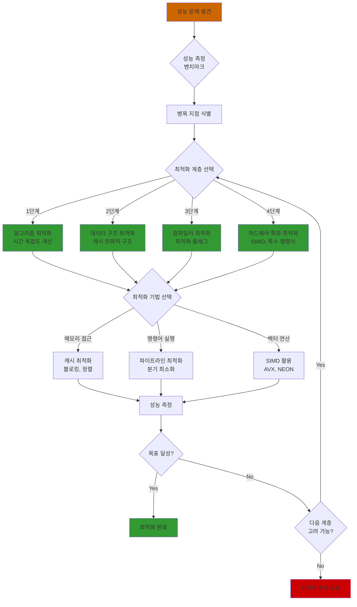
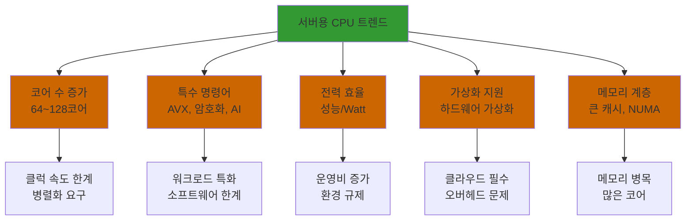
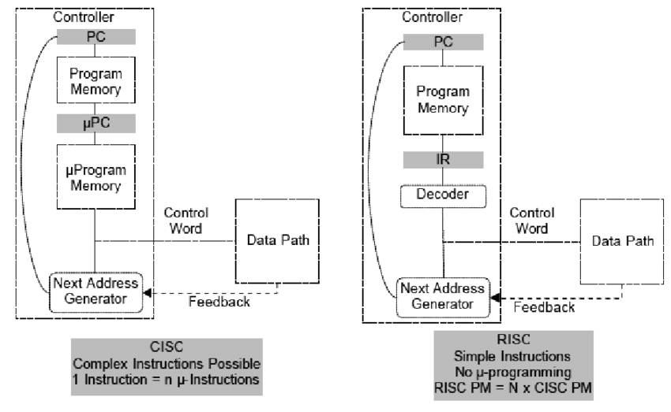
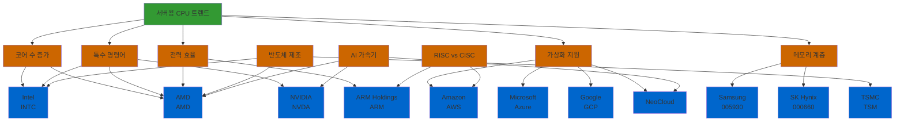

# 컴퓨터 구조: 성능 측정 및 최적화, 최신 기술 동향

## 1. 성능 측정 및 최적화

### 1.1 CPU 성능 측정 지표 (ARCH-041)

#### 1.1.1 배경지식: CPU 성능의 다차원적 특성

CPU 성능은 단일 지표로 측정할 수 없으며, 여러 지표를 종합적으로 고려해야 합니다. 과거에는 클럭 속도(Clock Speed)만으로 성능을 평가했지만, 현대 CPU는 아키텍처 개선으로 같은 클럭 속도에서도 더 많은 작업을 수행할 수 있습니다.

**핵심 개념:**
- **클럭 사이클**: CPU의 기본 시간 단위, 모든 연산은 클럭 사이클 단위로 수행
- **명령어 실행**: 하나의 명령어가 완료되는데 필요한 클럭 사이클 수는 명령어와 아키텍처에 따라 다름
- **파이프라인**: 여러 명령어를 동시에 처리하여 IPC 향상
- **성능 = 속도 × 효율성**: 클럭 속도와 IPC의 곱이 실제 성능

**필수 용어:**
- **Hz (Hertz)**: 초당 사이클 수, 1Hz = 1 cycle/second
- **GHz (Gigahertz)**: 10^9 Hz, 초당 10억 사이클
- **GIPS (Giga Instructions Per Second)**: 초당 10억 명령어

#### 1.1.2 각 지표의 의미와 관계

**Clock Speed (클럭 속도):**
- CPU의 기본 동작 속도
- 제조 공정, 전압, 발열에 의해 결정
- 높을수록 좋지만, 전력 소비와 발열 증가

**IPC (Instructions Per Cycle):**
- CPU 아키텍처의 효율성 지표
- 파이프라인, 분기 예측, Out-of-Order Execution 등에 영향
- 현대 CPU: 1.5 ~ 3.0 (워크로드에 따라 다름)

**CPI (Cycles Per Instruction):**
- IPC의 역수
- 낮을수록 효율적
- 명령어 복잡도와 아키텍처에 따라 다름

**IPS (Instructions Per Second):**
- 실제 성능 지표
- IPS = Clock Speed × IPC
- 최종 성능 평가에 사용

#### 1.1.3 성능 평가 시 고려사항

- 단일 지표로는 부족: Clock Speed만으로는 정확한 평가 불가
- 워크로드 의존성: 실제 사용 패턴에 따라 성능이 다를 수 있음
- 벤치마크 활용: 실제 워크로드 기반 벤치마크로 측정

### 1.2 IPC의 중요성 (ARCH-042)

#### 1.2.1 배경지식: CPU 아키텍처의 진화

과거 CPU는 클럭 속도 향상에 집중했지만, 물리적 한계와 전력 소비 문제로 인해 아키텍처 개선(IPC 향상)에 집중하게 되었습니다.

**역사적 맥락:**
- **1990년대**: 클럭 속도 경쟁 (MHz → GHz)
- **2000년대 초**: 클럭 속도 한계 도달 (발열, 전력 문제)
- **2000년대 중반 이후**: 멀티코어, IPC 향상에 집중

**IPC 향상 기술:**
- 파이프라인 깊이 증가
- 분기 예측 정확도 향상
- Out-of-Order Execution
- 캐시 크기 증가

#### 1.2.2 IPC가 중요한 이유

**1. 실제 성능 결정:**
- 같은 클럭 속도에서 IPC가 높으면 더 빠름
- 예: 3.0 GHz, IPC 1.5 vs 2.5 GHz, IPC 2.0
  - 전자: 4.5 GIPS
  - 후자: 5.0 GIPS (더 빠름)

**2. 아키텍처 비교:**
- 다른 제조사의 CPU 비교
- 같은 세대의 CPU 성능 차이 설명

**3. 최적화 방향:**
- 소프트웨어 최적화의 목표
- 컴파일러 최적화의 기준

### 1.3 Amdahl의 법칙과 병렬화 한계 (ARCH-043)

#### 1.3.1 배경지식: 병렬 컴퓨팅의 역사

1960년대 Gene Amdahl이 제안한 법칙으로, 병렬화로 인한 성능 향상의 한계를 수학적으로 설명합니다.

**역사적 배경:**
- 1960년대: 슈퍼컴퓨터 개발 시기
- 병렬화의 한계를 이론적으로 설명
- 현대 멀티코어 시대에도 여전히 유효

**핵심 통찰:**
- 프로그램의 일부는 순차적으로 실행되어야 함
- 순차적 부분이 병목이 됨
- 코어 수를 무한히 늘려도 한계 존재

#### 1.3.2 수학적 배경

**Amdahl의 법칙 공식:**

Amdahl의 법칙은 병렬화로 인한 성능 향상의 한계를 수학적으로 설명합니다.

**기본 공식:**
```
Speedup = 1 / ((1-P) + P/N)
```

**변수 설명:**

**P (병렬화 가능한 부분의 비율):**
- **정의**: 전체 프로그램 실행 시간 중 병렬화 가능한 부분의 비율
- **범위**: 0 ≤ P ≤ 1
- **의미**:
  - P = 0: 병렬화 불가능 (100% 순차적)
  - P = 1: 완전히 병렬화 가능 (100% 병렬)
  - P = 0.9: 90% 병렬화 가능, 10% 순차적
- **예시**:
  - 이미지 처리: P ≈ 0.95 (픽셀 연산은 병렬 가능)
  - 데이터베이스 쿼리: P ≈ 0.7 (일부는 순차적)
  - 웹 서버: P ≈ 0.8 (요청 처리는 병렬, 초기화는 순차)

**N (프로세서/코어 수):**
- **정의**: 병렬 처리에 사용되는 프로세서 또는 코어의 개수
- **범위**: N ≥ 1
- **의미**:
  - N = 1: 순차 실행 (병렬화 없음)
  - N = 2: 2개 코어로 병렬 처리
  - N = 8: 8개 코어로 병렬 처리
  - N → ∞: 이론적 최대 (무한대 코어)

**(1-P) (순차적 부분의 비율):**
- **정의**: 전체 프로그램 실행 시간 중 반드시 순차적으로 실행되어야 하는 부분의 비율
- **의미**: 병렬화할 수 없는 부분
- **예시**: 초기화, 데이터 로딩, 결과 수집, 정리 작업

**공식 유도:**

**1단계: 실행 시간 분석**
```
원래 실행 시간 (T_original):
  T_original = T_sequential + T_parallel

개선된 실행 시간 (T_improved):
  T_improved = T_sequential + T_parallel / N
  
여기서:
  T_sequential = (1-P) × T_original  (순차적 부분)
  T_parallel = P × T_original        (병렬화 가능 부분)
```

**2단계: Speedup 계산**
```
Speedup = T_original / T_improved
        = T_original / ((1-P) × T_original + P × T_original / N)
        = 1 / ((1-P) + P/N)
```

**수식 예시:**

**예시 1: P = 0.4, N = 2 (40% 병렬화 가능, 2개 코어)**
```
Speedup = 1 / ((1-0.4) + 0.4/2)
        = 1 / (0.6 + 0.2)
        = 1 / 0.8
        = 1.25배
```

**예시 2: P = 0.4, N = 4 (40% 병렬화 가능, 4개 코어)**
```
Speedup = 1 / ((1-0.4) + 0.4/4)
        = 1 / (0.6 + 0.1)
        = 1 / 0.7
        = 1.43배
```

**예시 3: P = 0.4, N → ∞ (40% 병렬화 가능, 무한대 코어)**
```
Speedup = 1 / ((1-0.4) + 0.4/∞)
        = 1 / (0.6 + 0)
        = 1 / 0.6
        = 1.67배 (한계)
```

**극한값 분석:**

**N → ∞일 때:**
```
Speedup_max = lim(N→∞) 1 / ((1-P) + P/N)
            = 1 / (1-P)
```

**의미:**
- 코어 수를 무한히 늘려도 최대 성능 향상은 `1 / (1-P)`로 제한됨
- 순차적 부분 (1-P)이 병목
- P가 작으면 (순차적 부분이 크면) 한계가 낮음

**P 값에 따른 최대 Speedup:**

| P (병렬화 가능) | 1-P (순차적) | 최대 Speedup |
|----------------|-------------|-------------|
| 0.5 (50%) | 0.5 (50%) | 2배 |
| 0.7 (70%) | 0.3 (30%) | 3.33배 |
| 0.9 (90%) | 0.1 (10%) | 10배 |
| 0.95 (95%) | 0.05 (5%) | 20배 |
| 0.99 (99%) | 0.01 (1%) | 100배 |

**관찰:**
- 순차적 부분이 10%만 있어도 최대 10배 향상
- 순차적 부분이 1%만 있어도 최대 100배 향상
- 순차적 부분을 줄이는 것이 매우 중요

**구체적 예시:**

**시나리오 1: P = 0.9 (90% 병렬화 가능)**
```
N = 2: Speedup = 1 / (0.1 + 0.9/2) = 1.82배
N = 4: Speedup = 1 / (0.1 + 0.9/4) = 3.08배
N = 8: Speedup = 1 / (0.1 + 0.9/8) = 4.71배
N = 16: Speedup = 1 / (0.1 + 0.9/16) = 6.40배
N = ∞: Speedup = 1 / 0.1 = 10배 (한계)
```

**시나리오 2: P = 0.5 (50% 병렬화 가능)**
```
N = 2: Speedup = 1 / (0.5 + 0.5/2) = 1.33배
N = 4: Speedup = 1 / (0.5 + 0.5/4) = 1.60배
N = 8: Speedup = 1 / (0.5 + 0.5/8) = 1.78배
N = ∞: Speedup = 1 / 0.5 = 2배 (한계)
```

**관찰:**
- 코어 수를 2배로 늘려도 성능 향상은 점점 감소
- P가 작으면 (순차적 부분이 크면) 한계가 낮음
- 무한히 많은 코어를 사용해도 한계 존재

#### 1.3.3 병렬화의 한계

**1. 순차적 부분의 제약**

**문제:**
- 프로그램의 일부는 반드시 순차적으로 실행되어야 함
- 예: 초기화, 데이터 로딩, 결과 수집, 정리 작업
- 이 부분은 병렬화할 수 없음

**영향:**
- 순차적 부분이 병목이 됨
- 코어 수를 늘려도 이 부분은 개선되지 않음
- 전체 성능 향상이 제한됨

**예시:**
```
프로그램 구조:
  - 초기화 (순차): 5%
  - 계산 (병렬화 가능): 90%
  - 결과 수집 (순차): 5%

→ 순차적 부분: 10%
→ 최대 Speedup = 1 / 0.1 = 10배 (한계)
```

**2. 한계 속도 향상**

**수학적 한계:**
```
최대 Speedup = 1 / (1 - P)
```

**의미:**
- P가 작으면 (순차적 부분이 크면) 한계가 낮음
- 예: P=0.5 → 최대 2배
- 예: P=0.9 → 최대 10배
- 예: P=0.99 → 최대 100배

**실제 의미:**
- 코어 수를 무한히 늘려도 이 한계를 넘을 수 없음
- 순차적 부분을 줄이는 것이 더 중요

**3. 오버헤드**

**병렬화 오버헤드의 종류:**

**동기화 오버헤드:**
- Lock, Mutex, Barrier 등
- 스레드 간 동기화 비용
- 경쟁 상태 방지 비용

**통신 오버헤드:**
- 프로세스/스레드 간 데이터 전송
- 메모리 공유 비용
- 네트워크 통신 (분산 시스템)

**부하 불균형:**
- 작업 분배의 불균형
- 일부 코어는 유휴, 일부는 과부하
- 동적 부하 균형 필요

**실제 영향:**
- 이론적 성능 향상보다 실제로는 더 낮음
- 오버헤드가 크면 오히려 성능 저하 가능
- 코어 수가 많을수록 오버헤드 증가

**4. Amdahl의 법칙 vs 구스타프슨의 법칙**

**Amdahl의 법칙:**
- **가정**: 작업량 고정, 시간 단축
- **목표**: 같은 작업을 더 빠르게
- **적용**: 작업량이 고정된 경우 (예: 이미지 처리)

**4. Amdahl의 법칙 vs 구스타프슨의 법칙**

**구스타프슨의 법칙 (Gustafson's Law):**

**배경:**
- 1988년 John Gustafson이 제안
- Amdahl의 법칙의 한계를 지적
- 실제 워크로드는 작업량이 증가하는 경우가 많음

**기본 공식:**
```
Speedup = N - α × (N - 1)

여기서:
  N: 프로세서/코어 수
  α: 순차적 부분의 비율 (0 ≤ α ≤ 1)
```

**또는:**
```
Speedup = N + (1 - N) × (1 - P)

여기서:
  N: 프로세서/코어 수
  P: 병렬화 가능한 부분의 비율
  (1-P): 순차적 부분의 비율 = α
```

**변수 설명:**

**α (순차적 부분의 비율):**
- **정의**: 전체 실행 시간 중 순차적으로 실행되는 부분의 비율
- **범위**: 0 ≤ α ≤ 1
- **의미**: Amdahl의 법칙에서 (1-P)와 동일

**N (프로세서/코어 수):**
- **정의**: 병렬 처리에 사용되는 프로세서 또는 코어의 개수
- **범위**: N ≥ 1

**핵심 차이점:**

**Amdahl의 법칙:**
- **가정**: 작업량 고정 (Fixed Workload)
- **목표**: 같은 작업을 더 빠르게 완료
- **측정 KPI**: 실행 시간 단축 (Time Reduction)
- **공식**: `Speedup = 1 / ((1-P) + P/N)`
- **특징**: N이 증가해도 한계 존재

**구스타프슨의 법칙:**
- **가정**: 시간 고정 (Fixed Time)
- **목표**: 같은 시간에 더 많은 작업 처리
- **측정 KPI**: 처리량 증가 (Throughput Increase)
- **공식**: `Speedup = N - α × (N - 1)`
- **특징**: N이 증가하면 선형적으로 향상 가능

**수식 비교:**

**Amdahl의 법칙 (작업량 고정):**
```
원래 실행 시간: T
개선된 실행 시간: T' = (1-P) × T + P × T / N
Speedup = T / T' = 1 / ((1-P) + P/N)

N → ∞일 때: Speedup = 1 / (1-P) (한계 존재)
```

**구스타프슨의 법칙 (시간 고정):**
```
원래 실행 시간: T (1개 프로세서)
고정된 실행 시간: T (N개 프로세서, 시간은 동일)

원래 작업량: W
새로운 작업량: W' = (1-P) × W + P × W × N

Speedup = W' / W = (1-P) + P × N
         = 1 - P + P × N
         = N - (N-1) × (1-P)
         = N - α × (N-1)

N → ∞일 때: Speedup → ∞ (선형 증가)
```

**구체적 예시:**

**시나리오: P = 0.9 (90% 병렬화 가능), α = 0.1**

**Amdahl의 법칙 (작업량 고정):**
```
N = 2: Speedup = 1 / (0.1 + 0.9/2) = 1.82배
N = 4: Speedup = 1 / (0.1 + 0.9/4) = 3.08배
N = 8: Speedup = 1 / (0.1 + 0.9/8) = 4.71배
N = ∞: Speedup = 1 / 0.1 = 10배 (한계)
```

**구스타프슨의 법칙 (시간 고정):**
```
N = 2: Speedup = 2 - 0.1 × (2-1) = 1.9배
N = 4: Speedup = 4 - 0.1 × (4-1) = 3.7배
N = 8: Speedup = 8 - 0.1 × (8-1) = 7.3배
N = 16: Speedup = 16 - 0.1 × (16-1) = 14.5배
N → ∞: Speedup → ∞ (선형 증가)
```

**KPI (Key Performance Indicator) 비교:**

| 측정 지표 | Amdahl의 법칙 | 구스타프슨의 법칙 |
|----------|-------------|-----------------|
| **측정 대상** | 실행 시간 단축 | 처리량 증가 |
| **고정 변수** | 작업량 (Workload) | 실행 시간 (Time) |
| **변화 변수** | 실행 시간 | 작업량 |
| **KPI** | Latency 감소 | Throughput 증가 |
| **목표** | 같은 작업을 더 빠르게 | 같은 시간에 더 많은 작업 |
| **적용 분야** | 배치 처리, 과학 계산 | 실시간 처리, 대화형 시스템 |

**실제 적용 예시:**

**Amdahl의 법칙이 적합한 경우:**
- **배치 작업**: 이미지 변환, 비디오 인코딩
  - 작업량이 고정됨
  - 목표: 완료 시간 단축
  - KPI: 처리 시간 (Processing Time)

- **과학 계산**: 시뮬레이션, 모델링
  - 입력 데이터가 고정됨
  - 목표: 결과를 더 빠르게 얻기
  - KPI: 계산 시간 (Computation Time)

**구스타프슨의 법칙이 적합한 경우:**
- **실시간 처리**: 웹 서버, 게임 서버
  - 시간 제약이 있음 (예: 1초 내 응답)
  - 목표: 같은 시간에 더 많은 요청 처리
  - KPI: 초당 요청 수 (Requests Per Second)

- **대화형 시스템**: 사용자 인터페이스, 실시간 분석
  - 응답 시간이 고정됨 (예: 100ms 이내)
  - 목표: 더 많은 데이터 처리
  - KPI: 처리량 (Throughput)

**비교표:**

| 법칙 | 가정 | 목표 | 측정 KPI | 적용 분야 |
|------|------|------|---------|----------|
| **Amdahl** | 작업량 고정 | 시간 단축 | Latency (지연 시간) | 배치 처리, 과학 계산 |
| **Gustafson** | 시간 고정 | 작업량 증가 | Throughput (처리량) | 실시간 처리, 대화형 시스템 |

**실제 적용:**
- 실제로는 둘 다 적용
- 워크로드에 따라 다름
- 두 법칙을 모두 고려해야 함
- **배치 작업**: Amdahl의 법칙 적용
- **실시간 시스템**: 구스타프슨의 법칙 적용
- **하이브리드**: 두 법칙 모두 고려

#### 1.3.4 실제 적용 및 전략

**병렬화 전략:**

**1. 순차적 부분 최소화:**
- 초기화, 정리 작업 최소화
- 데이터 로딩 최적화
- 결과 수집 효율화

**2. 병렬화 가능 부분 최대화:**
- 알고리즘 재설계
- 데이터 구조 최적화
- 의존성 제거

**3. 오버헤드 고려:**
- 동기화 최소화
- 통신 비용 고려
- 부하 균형 유지

**실제 예시:**

```
프로그램 분석:
  - 순차적 부분: 10% (초기화, 정리)
  - 병렬화 가능: 90% (계산)

코어 수에 따른 성능 향상:
  - 2코어: 1.82배
  - 4코어: 3.08배
  - 8코어: 4.71배
  - 16코어: 6.40배
  - 32코어: 7.69배
  - 64코어: 8.70배
  - 한계: 10배

관찰:
  - 코어 수가 많아질수록 향상 폭 감소
  - 16코어 이후로는 향상이 미미
  - 오버헤드 고려 시 더 낮은 성능
```

**결론:**

**Amdahl의 법칙의 핵심 교훈:**
- 병렬화만으로는 무한한 성능 향상 불가능
- 순차적 부분이 병목
- 순차적 부분을 줄이는 것이 더 중요
- 코어 수 증가의 수익 체감

**실용적 의미:**
- 병렬화는 필수이지만 만능은 아님
- 알고리즘 개선이 더 중요할 수 있음
- 워크로드에 맞는 최적 코어 수 선택
- 오버헤드를 고려한 설계 필요

### 1.4 벤치마크의 종류와 측정 방법 (ARCH-044)

#### 1.4.1 배경지식: 성능 측정의 필요성

컴퓨터 성능을 객관적으로 비교하고 평가하기 위해 표준화된 테스트가 필요합니다.

**측정의 어려움:**
- 워크로드에 따라 성능이 다름
- 여러 요인(CPU, 메모리, I/O)이 복합적으로 작용
- 공정한 비교를 위한 표준 필요

#### 1.4.2 벤치마크의 발전

**초기 벤치마크:**
- Dhrystone (1984): 정수 연산
- Whetstone (1976): 부동소수점 연산
- 단순하고 인위적

**현대 벤치마크:**
- SPEC CPU: 실제 애플리케이션 기반
- Geekbench: 크로스 플랫폼
- 실제 워크로드 반영

#### 1.4.3 측정 방법론

**측정 시 주의사항:**
- 환경 통제: 같은 하드웨어, 소프트웨어, 설정
- 통계적 유의성: 여러 번 실행, 평균값 사용
- 워크로드 선택: 실제 사용 패턴 반영

**측정 지표:**
- 실행 시간 (Wall-clock time, CPU time)
- 처리량 (Throughput)
- 지연 시간 (Latency)
- 리소스 사용률

### 1.5 성능 최적화 고려사항 (ARCH-045)

#### 1.5.1 배경지식: 컴퓨터 구조와 성능

프로그램 성능은 알고리즘뿐만 아니라 하드웨어 특성에도 크게 영향을 받습니다.

**메모리 계층 구조:**
- 레지스터 → L1 캐시 → L2 캐시 → L3 캐시 → 메모리 → 디스크
- 접근 시간 차이: 레지스터(1 cycle) vs 메모리(100+ cycles)
- 지역성 원리: 시간 지역성, 공간 지역성

**파이프라인:**
- 명령어를 여러 단계로 나눠 병렬 처리
- 해저드 발생 시 성능 저하
- 분기 예측이 중요

#### 1.5.2 최적화 계층

**1. 알고리즘 최적화:**
- 시간 복잡도 개선
- 가장 큰 영향

**2. 데이터 구조 최적화:**
- 캐시 친화적 구조
- 메모리 접근 패턴

**3. 컴파일러 최적화:**
- 최적화 플래그
- 인라인 함수

**4. 하드웨어 특화 최적화:**
- SIMD
- 특수 명령어

#### 1.5.3 실제 최적화 기법

**캐시 최적화:**
- 캐시 블로킹 (Cache Blocking)
- False Sharing 방지
- 데이터 정렬 (Alignment)

**파이프라인 최적화:**
- 분기 최소화
- 데이터 의존성 최소화
- 명령어 순서 최적화

#### 1.5.4 성능 최적화 의사 결정 과정



---

## 2. 최신 기술 동향

### 2.1 서버용 CPU 발전 트렌드 (ARCH-056)

#### 2.1.1 배경지식: 서버 환경의 특수성

서버용 CPU는 데스크톱 CPU와 다른 요구사항을 가집니다.

**서버 환경의 특징:**
- 24/7 운영
- 전력 효율 중요 (데이터센터 운영 비용)
- 가상화 환경
- 멀티테넌트
- 높은 동시성

**역사적 발전:**
- 2000년대: 단일 코어 → 멀티코어 전환
- 2010년대: 코어 수 증가, 가상화 지원
- 2020년대: 특수 목적 코어, AI 가속

#### 2.1.2 주요 트렌드의 구체적 분석

서버용 CPU는 클라우드 환경의 요구사항에 맞춰 다섯 가지 주요 트렌드로 발전하고 있습니다.

**트렌드 개요:**

| 트렌드 | 핵심 목표 | 주요 기술 | 발전 동기 |
|--------|----------|----------|----------|
| **코어 수 증가** | 병렬 처리 능력 향상 | 멀티코어, SMT | 클럭 속도 한계, 워크로드 병렬화, 가상화 요구 |
| **특수 명령어** | 워크로드 특화 가속 | AVX, AES-NI, AI 가속 | 워크로드 특화, 소프트웨어 처리 한계, 보안/성능 요구 |
| **전력 효율** | 성능/Watt 최적화 | DVFS, 하이브리드 | 데이터센터 운영비 증가, 환경 규제, 지속가능성 |
| **가상화 지원** | VM 성능 보장 | 하드웨어 가상화, SR-IOV | 클라우드 필수, 소프트웨어 가상화 한계, 멀티테넌트 |
| **메모리 계층** | 메모리 병목 해결 | 큰 캐시, NUMA, DDR5 | 메모리-CPU 속도 격차, 많은 코어의 메모리 요구, 멀티소켓 복잡성 |



**1. 코어 수 증가**

**발전 동기:**

**배경:**
- **2000년대 초**: 클럭 속도 경쟁의 한계 도달
  - 발열 문제: 클럭 속도 증가 → 전력 소비 증가 → 발열 증가
  - 물리적 한계: 트랜지스터 크기 감소의 한계
  - 전력 효율 저하: 클럭 속도 증가 대비 성능 향상 비율 감소
- **클라우드 환경의 요구사항**:
  - 가상화 환경: 하나의 물리 서버에 여러 VM 실행 필요
  - 멀티테넌트: 여러 고객의 워크로드를 동시에 처리
  - 워크로드 병렬화: 빅데이터, AI/ML 등 병렬 처리 요구 증가

**문제 → 해결 → 결과:**

| 단계 | 내용 |
|------|------|
| **문제** | 클럭 속도 한계, 단일 코어 성능 향상의 물리적 제약, 클라우드 환경의 동시성 요구 |
| **해결** | 멀티코어 아키텍처, SMT 기술, 코어 간 통신 최적화 |
| **결과** | 병렬 처리 능력 향상, 가상화 환경 지원, 동시성 요구 충족 |

**구체적 예시:**

| 제조사 | 모델 | 코어 수 | 스레드 수 | 특징 |
|--------|------|---------|----------|------|
| AMD | EPYC | 64 | 128 | SMT 지원, 가상화 최적화 |
| Intel | Xeon | 56 | 112 | 하이퍼스레딩, AI 가속 |
| ARM | Neoverse | 최대 128 | 128+ | 전력 효율, 클라우드 최적화 |

**이점:**
- ✅ 병렬 워크로드 처리 능력 향상
- ✅ 가상화 환경에서 여러 VM 동시 실행 (예: 64코어 = 64개 VM)
- ✅ 멀티테넌트 환경에서 리소스 효율적 분배
- ✅ 높은 동시성 요구사항 충족

**기술적 특징:**
- **멀티스레딩 (SMT/Hyper-Threading)**: 물리 코어당 2개 스레드
- **코어 간 통신 최적화**: 고속 인터커넥트 (Infinity Fabric, UPI)
- **전력 관리**: 개별 코어 전력 제어, 동적 클럭 조절

**2. 특수 명령어 세트**

**발전 동기:**

**배경:**
- **워크로드의 변화**:
  - 1990년대: 멀티미디어 처리 증가 (비디오, 오디오)
  - 2000년대: 과학 계산, 암호화 요구 증가
  - 2010년대: 머신러닝, 빅데이터 처리 폭발적 증가
  - 2020년대: AI/ML이 모든 분야로 확산
- **소프트웨어 처리의 한계**:
  - 범용 CPU로는 특화 워크로드 처리에 비효율적
  - 반복적인 연산 패턴 (행렬 곱셈, 암호화 등)
  - 소프트웨어 구현의 성능 한계
- **보안 요구사항**:
  - HTTPS, TLS/SSL의 필수화
  - 데이터 암호화 의무화
  - 사이드 채널 공격 방지 필요

**문제 → 해결 → 결과:**

| 단계 | 내용 |
|------|------|
| **문제** | 워크로드 특화 요구, 소프트웨어 처리 한계, 보안/성능 요구사항 증가 |
| **해결** | 하드웨어 가속 명령어 세트 (SIMD, 암호화, AI 가속) |
| **결과** | 특화 워크로드 성능 향상, 보안 강화, 전력 효율 개선 |

**특수 명령어 비교:**

| 명령어 세트 | 목적 | 활용 분야 | 성능 향상 | 예시 |
|------------|------|----------|----------|------|
| **SIMD (AVX)** | 벡터 연산 | 과학 계산, ML, 이미지 | 4~16배 | 행렬 곱셈, FFT |
| **AES-NI** | 암호화 | TLS/SSL, 데이터 보안 | 10배+ | HTTPS 가속 |
| **압축 가속** | 데이터 압축 | 전송, 저장 | 5~10배 | QuickAssist |
| **AI/ML 가속** | 딥러닝 | 추론, 학습 | 10~100배 | DL Boost, NPU |

**상세 설명:**

**SIMD 명령어 (AVX, AVX-512):**

**목적**: 벡터 연산 가속
**활용**: 과학 계산, 머신러닝, 이미지 처리
**성능**: 4~16배 성능 향상 (워크로드에 따라)
**기술**: 256비트 (AVX) → 512비트 (AVX-512) 레지스터

**왜 특화된 instruction set이 필요한가?**

**문제: 일반 명령어의 한계**

**일반 명령어 (스칼라 연산):**
```c
// 배열 덧셈 예시
for (int i = 0; i < n; i++) {
    c[i] = a[i] + b[i];
}
```

**컴파일된 어셈블리 (일반 명령어):**
```asm
loop:
    movss   xmm0, [rax]      ; a[i] 로드 (1개 float)
    addss   xmm0, [rbx]      ; b[i] 더하기 (1개 float)
    movss   [rcx], xmm0      ; c[i] 저장 (1개 float)
    add     rax, 4           ; 다음 요소로
    add     rbx, 4
    add     rcx, 4
    dec     rdx              ; 카운터 감소
    jnz     loop              ; 반복
```

**문제점:**
- 한 번에 1개씩만 처리 (스칼라 연산)
- n개 요소 처리 시 n번의 명령어 필요
- 루프 오버헤드 (분기, 카운터 관리)
- 파이프라인 효율 저하

**해결: AVX 명령어 (벡터 연산)**

**AVX 명령어 사용:**
```c
#include <immintrin.h>

// AVX를 사용한 벡터 덧셈
for (int i = 0; i < n; i += 8) {
    __m256 va = _mm256_load_ps(&a[i]);  // 8개 float 로드
    __m256 vb = _mm256_load_ps(&b[i]);  // 8개 float 로드
    __m256 vc = _mm256_add_ps(va, vb);  // 8개 동시 덧셈
    _mm256_store_ps(&c[i], vc);         // 8개 저장
}
```

**컴파일된 어셈블리 (AVX 명령어):**
```asm
loop:
    vmovaps ymm0, [rax]       ; 8개 float 로드 (256비트)
    vaddps  ymm0, ymm0, [rbx] ; 8개 동시 덧셈
    vmovaps [rcx], ymm0       ; 8개 저장
    add     rax, 32           ; 32바이트 이동 (8개 × 4바이트)
    add     rbx, 32
    add     rcx, 32
    sub     rdx, 8            ; 8개씩 처리했으므로 8 감소
    jnz     loop
```

**AVX 명령어의 장점:**
- **vaddps**: 8개 float를 동시에 더함 (Single Instruction)
- **vmovaps**: 256비트 레지스터로 8개를 한 번에 로드/저장
- **루프 반복 횟수**: n/8로 감소
- **성능**: 이론적으로 8배 향상 (실제로는 4~6배)

**실제 명령어 예시:**

**1. 벡터 덧셈 (vaddps):**
```asm
; 8개 float 동시 덧셈
vaddps ymm0, ymm1, ymm2
; ymm0 = ymm1 + ymm2 (8개 요소 각각)
```

**2. 벡터 곱셈 (vmulps):**
```asm
; 8개 float 동시 곱셈
vmulps ymm0, ymm1, ymm2
; ymm0 = ymm1 * ymm2 (8개 요소 각각)
```

**3. 벡터 내적 (FMA - Fused Multiply-Add):**
```asm
; 곱셈과 덧셈을 한 번에 (AVX2)
vfmadd231ps ymm0, ymm1, ymm2
; ymm0 = ymm0 + (ymm1 * ymm2)
; 정밀도 향상: 한 번의 반올림만 수행
```

**왜 특화된 instruction set이 필요한가?**

**1. 하드웨어 최적화:**
- 일반 명령어: 범용 ALU 사용, 1개씩 처리
- AVX 명령어: 전용 벡터 유닛 사용, 병렬 처리
- 하드웨어 레벨에서 병렬 처리 지원

**2. 메모리 대역폭 활용:**
- 일반 명령어: 작은 데이터 단위로 접근 (비효율)
- AVX 명령어: 큰 데이터 블록으로 접근 (효율적)
- 캐시 라인 크기(64바이트)에 맞춘 접근

**3. 파이프라인 효율:**
- 일반 명령어: 루프 오버헤드, 분기 예측 실패
- AVX 명령어: 적은 반복 횟수, 분기 감소
- 파이프라인 스톨 감소

**구체적 예시:**

**1. 행렬 곱셈 (Matrix Multiplication):**
```c
// 일반 코드 (스칼라)
for (int i = 0; i < n; i++) {
    for (int j = 0; j < n; j++) {
        c[i][j] = 0;
        for (int k = 0; k < n; k++) {
            c[i][j] += a[i][k] * b[k][j];  // n³번의 연산
        }
    }
}

// AVX 사용 (벡터화)
// 8개씩 병렬 처리
// 연산 횟수: n³/8 (이론적으로 8배 빠름)
```

**2. 이미지 필터링 (Image Filtering):**
```c
// 픽셀별 연산을 벡터화
// 예: 가우시안 블러, 엣지 검출
// 8개 픽셀을 동시에 처리
// 성능 향상: 6~8배
```

**3. FFT (Fast Fourier Transform):**
- 신호 처리, 오디오 처리
- 라이브러리: Intel MKL, FFTW
- AVX-512 사용 시 10~16배 향상

**4. 신경망 연산:**
- 행렬 곱셈, 컨볼루션
- 라이브러리: Intel MKL-DNN, OpenBLAS
- AVX-512 사용 시 8~16배 향상

**실제 사용 사례:**
- **OpenCV**: 이미지 처리 라이브러리 (AVX 최적화)
- **NumPy**: 과학 계산 라이브러리 (AVX 사용)
- **TensorFlow**: 머신러닝 프레임워크 (AVX 가속)

**암호화 가속 (AES-NI):**

**목적**: 암호화/복호화 하드웨어 가속
**활용**: TLS/SSL, 데이터 암호화
**성능**: 소프트웨어 대비 10배 이상 향상
**보안**: 사이드 채널 공격 방지
**중요성**: 현대 웹 보안의 필수 요소

**왜 특화된 instruction set이 필요한가?**

**문제: 소프트웨어 암호화의 한계**

**소프트웨어 AES 구현:**
```c
// AES 암호화 (소프트웨어)
void aes_encrypt(uint8_t *data, uint8_t *key) {
    // SubBytes, ShiftRows, MixColumns, AddRoundKey
    // 각 라운드마다 복잡한 비트 연산
    // 10~14 라운드 반복
    // 수백 개의 명령어 필요
}
```

**컴파일된 어셈블리 (소프트웨어):**
```asm
; AES SubBytes 단계 (S-box 조회)
mov     al, [data]
mov     al, [sbox + al]  ; 테이블 조회
mov     [data], al
; 수백 개의 명령어 필요
; 처리 속도: ~100 MB/s
```

**문제점:**
- 복잡한 비트 연산 (XOR, AND, OR, Shift)
- S-box 테이블 조회 (캐시 미스)
- 많은 명령어 필요 (수백 개)
- 느린 처리 속도
- 사이드 채널 공격 취약 (타이밍 공격)

**해결: AES-NI 명령어 (하드웨어 가속)**

**AES-NI 명령어 사용:**
```c
#include <wmmintrin.h>

// AES-NI를 사용한 암호화
__m128i data = _mm_loadu_si128((__m128i*)plaintext);
__m128i key = _mm_loadu_si128((__m128i*)aes_key);

// AES 암호화 (하드웨어)
data = _mm_aesenc_si128(data, key);  // 1 라운드
data = _mm_aesenc_si128(data, key);  // 2 라운드
// ... (10~14 라운드)
data = _mm_aesenclast_si128(data, key);  // 마지막 라운드
```

**컴파일된 어셈블리 (AES-NI):**
```asm
; AES 암호화 (하드웨어)
vaesenc xmm0, xmm1, xmm2  ; 1 라운드 암호화 (1개 명령어)
vaesenc xmm0, xmm0, xmm3  ; 2 라운드 암호화
; ... (10~14 라운드)
vaesenclast xmm0, xmm0, xmm4  ; 마지막 라운드

; 처리 속도: ~1,000 MB/s (10배 향상)
```

**AES-NI 명령어의 장점:**
- **vaesenc**: 1개 명령어로 1 라운드 완료
- **하드웨어 구현**: 전용 암호화 유닛 사용
- **보안**: 사이드 채널 공격 방지 (타이밍 일정)
- **성능**: 소프트웨어 대비 10배 이상 향상

**실제 명령어 예시:**

**1. AES 암호화 (vaesenc):**
```asm
; AES 암호화 라운드
vaesenc xmm0, xmm1, xmm2
; xmm0 = AES_Encrypt(xmm1, xmm2)
; 128비트 블록을 1개 명령어로 암호화
```

**2. AES 복호화 (vaesdec):**
```asm
; AES 복호화 라운드
vaesdec xmm0, xmm1, xmm2
; xmm0 = AES_Decrypt(xmm1, xmm2)
```

**3. AES 키 확장 (aeskeygenassist):**
```asm
; 라운드 키 생성
aeskeygenassist xmm1, xmm2, imm8
; AES 키 스케줄 생성
```

**왜 특화된 instruction set이 필요한가?**

**1. 복잡한 알고리즘:**
- AES는 복잡한 비트 연산 (SubBytes, ShiftRows, MixColumns)
- 소프트웨어로는 수백 개의 명령어 필요
- 하드웨어로는 1개 명령어로 처리

**2. 보안 요구사항:**
- 사이드 채널 공격 방지 (타이밍 공격, 전력 분석)
- 하드웨어 구현은 타이밍이 일정
- 소프트웨어는 타이밍 차이로 공격 가능

**3. 성능 요구사항:**
- 현대 웹은 모든 통신이 암호화 (HTTPS)
- 실시간 암호화/복호화 필요
- 소프트웨어로는 병목 발생

**구체적 예시:**

**1. HTTPS/TLS 암호화:**
```c
// OpenSSL에서 AES-NI 사용
// TLS 핸드셰이크 시 대칭키 암호화
// AES-128, AES-192, AES-256 지원

// 소프트웨어 구현: ~100 MB/s
// AES-NI 사용: ~1,000 MB/s (10배 향상)
```

**2. 데이터베이스 암호화:**
- MySQL, PostgreSQL의 암호화 컬럼
- 디스크 암호화 (LUKS, BitLocker)
- 전송 중 데이터 암호화

**3. VPN 암호화:**
- OpenVPN, WireGuard
- 실시간 암호화/복호화
- AES-NI 없으면 성능 저하

**4. 암호화 파일 시스템:**
- Linux: dm-crypt, LUKS
- Windows: BitLocker
- 전체 디스크 암호화

**실제 사용 사례:**
- **웹 서버**: Nginx, Apache (HTTPS 가속)
- **데이터베이스**: MySQL, PostgreSQL (암호화 컬럼)
- **VPN**: OpenVPN, WireGuard (터널 암호화)
- **클라우드**: AWS, Azure (전송 중 암호화)

**압축 가속:**

**목적**: 데이터 압축/해제 가속
**활용**: 데이터 전송, 저장 공간 절약
**성능**: 5~10배 향상
**예시**: Intel QuickAssist Technology

**왜 특화된 instruction set이 필요한가?**

**문제: 소프트웨어 압축의 한계**

**소프트웨어 압축 (gzip):**
```c
// gzip 압축 (소프트웨어)
void gzip_compress(uint8_t *data, size_t len) {
    // LZ77 알고리즘: 반복 패턴 찾기
    // Huffman 코딩: 빈도 기반 인코딩
    // 많은 메모리 접근, 복잡한 알고리즘
    // 처리 속도: ~50 MB/s
}
```

**문제점:**
- 복잡한 알고리즘 (LZ77, Huffman)
- 많은 메모리 접근 (딕셔너리 조회)
- 비트 단위 연산 (비트 패킹)
- 느린 처리 속도

**해결: 하드웨어 가속 (Intel QuickAssist)**

**하드웨어 가속:**
- 전용 압축 하드웨어 사용
- 병렬 처리
- 처리 속도: ~500 MB/s (10배 향상)

**실제 명령어/API 예시:**

**Intel QuickAssist Technology:**
```c
// QAT API 사용
QzCompress(qz_session, input, output, &input_len, &output_len);
// 하드웨어에서 압축 수행
// 처리 속도: 5~10배 향상
```

**왜 특화된 instruction set이 필요한가?**

**1. 복잡한 알고리즘:**
- 압축 알고리즘은 복잡한 패턴 매칭
- 소프트웨어로는 많은 명령어 필요
- 하드웨어로는 병렬 처리 가능

**2. 실시간 처리 요구:**
- 웹 서버에서 실시간 압축 필요
- 소프트웨어로는 CPU 부하 높음
- 하드웨어로는 CPU 부하 감소

**구체적 예시:**

**1. 데이터 전송 압축:**
```c
// HTTP 압축 (gzip, deflate)
// 웹 서버에서 응답 압축
// 전송 데이터 크기 70~90% 감소

// 소프트웨어: CPU 부하 높음
// 하드웨어 가속: CPU 부하 감소, 처리량 증가
```

**2. 데이터베이스 압축:**
- MySQL InnoDB 페이지 압축
- PostgreSQL TOAST 압축
- 저장 공간 절약, I/O 감소

**3. 백업 압축:**
- tar.gz, zip 파일 생성
- 백업 시간 단축
- 저장 공간 절약

**4. 로그 압축:**
- 실시간 로그 압축
- 저장 공간 절약
- 검색 성능 향상

**압축 알고리즘:**
- **gzip/deflate**: 일반적인 압축
- **zstd**: 최신 고성능 압축
- **LZ4**: 빠른 압축/해제
- **Snappy**: Google의 빠른 압축

**실제 사용 사례:**
- **웹 서버**: Nginx, Apache (gzip 압축)
- **데이터베이스**: MySQL, PostgreSQL (페이지 압축)
- **백업 시스템**: tar, zip (압축 백업)
- **로그 시스템**: 로그 로테이션, 압축 저장

**AI/ML 가속 (Tensor Processing):**

**목적**: 딥러닝 연산 가속
**특징**: 낮은 정밀도 연산 (INT8, FP16) 지원
**활용**: 추론, 학습 가속
**성능**: 10~100배 향상 (워크로드에 따라)
**예시**: Intel DL Boost, AMD AI Engine, NPU

**왜 특화된 instruction set이 필요한가?**

**문제: 일반 명령어로 행렬 곱셈의 한계**

**일반 명령어로 행렬 곱셈:**
```c
// 행렬 곱셈 C = A × B
for (int i = 0; i < n; i++) {
    for (int j = 0; j < n; j++) {
        float sum = 0;
        for (int k = 0; k < n; k++) {
            sum += a[i][k] * b[k][j];  // 스칼라 곱셈
        }
        c[i][j] = sum;
    }
}
// n³번의 곱셈 연산
// 처리 시간: O(n³)
```

**컴파일된 어셈블리 (일반 명령어):**
```asm
; 스칼라 곱셈
movss   xmm0, [rax]      ; a[i][k] 로드
mulss   xmm0, [rbx]      ; b[k][j] 곱하기 (1개)
addss   xmm1, xmm0       ; 누적
; n³번 반복 필요
```

**문제점:**
- 한 번에 1개씩만 처리
- n×n 행렬 곱셈에 n³번의 연산
- 매우 느림 (예: 1000×1000 행렬 = 10억 번 연산)

**해결: Tensor Processing 명령어**

**Intel DL Boost (VNNI - Vector Neural Network Instructions):**
```c
#include <immintrin.h>

// INT8 행렬 곱셈 (VNNI)
__m512i a_vec = _mm512_loadu_si512(a);  // 64개 INT8 로드
__m512i b_vec = _mm512_loadu_si512(b);  // 64개 INT8 로드
__m512i c_vec = _mm512_dpbusd_epi32(c_vec, a_vec, b_vec);
// 64개 INT8 곱셈을 1개 명령어로 처리
```

**컴파일된 어셈블리 (VNNI):**
```asm
; VNNI 명령어 (AVX-512)
vpdpbusd zmm0, zmm1, zmm2
; zmm0 = zmm0 + dot_product(zmm1, zmm2)
; 64개 INT8 곱셈을 1개 명령어로 처리
; 성능: FP32 대비 4배 빠름
```

**실제 명령어 예시:**

**1. INT8 행렬 곱셈 (vpdpbusd):**
```asm
; Vector Neural Network Instruction
vpdpbusd zmm0, zmm1, zmm2
; zmm0 = zmm0 + (zmm1의 INT8 × zmm2의 INT8)
; 64개 INT8 곱셈을 동시에 처리
```

**2. FP16 행렬 곱셈 (vfmadd231ph):**
```asm
; FP16 Fused Multiply-Add
vfmadd231ph zmm0, zmm1, zmm2
; zmm0 = zmm0 + (zmm1 × zmm2)
; 32개 FP16 곱셈을 동시에 처리
```

**왜 특화된 instruction set이 필요한가?**

**1. 대량의 연산:**
- 딥러닝은 수백만~수억 개의 곱셈 연산
- 일반 명령어로는 처리 불가능
- 전용 하드웨어로만 실시간 처리 가능

**2. 낮은 정밀도 활용:**
- 추론에는 높은 정밀도 불필요
- INT8, FP16으로도 충분한 정확도
- 메모리 대역폭 절약, 처리량 증가

**3. 실시간 추론 요구:**
- 이미지 분류: 100ms 이내
- 음성 인식: 실시간 처리
- 일반 명령어로는 불가능

**구체적 예시:**

**1. 이미지 분류 (Image Classification):**
```python
# TensorFlow에서 INT8 추론
# ResNet, MobileNet 등
# FP32 대비 4배 빠름, 메모리 4배 적음

# FP32: 100ms, 메모리 100MB
# INT8: 25ms, 메모리 25MB (4배 향상)
```

**2. 자연어 처리 (NLP):**
- BERT, GPT 모델 추론
- 텍스트 생성, 번역
- INT8/FP16 사용 시 2~4배 향상

**3. 음성 인식:**
- 실시간 음성-텍스트 변환
- 딥러닝 모델 추론
- 지연 시간 감소

**4. 추천 시스템:**
- 협업 필터링
- 딥러닝 기반 추천
- 실시간 추론

**정밀도별 성능:**

| 정밀도 | 성능 | 메모리 | 정확도 | 활용 |
|--------|------|--------|--------|------|
| **FP32** | 1x | 1x | 높음 | 학습 |
| **FP16** | 2x | 0.5x | 높음 | 추론 |
| **INT8** | 4x | 0.25x | 적절 | 추론 |

**실제 사용 사례:**
- **추론 서버**: TensorFlow Serving, ONNX Runtime
- **엣지 AI**: 모바일, IoT 디바이스
- **실시간 추론**: 음성 인식, 이미지 분류
- **클라우드 AI**: AWS SageMaker, Google Cloud AI

**하드웨어 예시:**
- **Intel DL Boost**: CPU 내장 AI 가속
- **AMD AI Engine**: CPU 내장 AI 가속
- **NPU (Neural Processing Unit)**: 전용 AI 칩
- **TPU (Tensor Processing Unit)**: Google의 전용 AI 칩

**3. 전력 효율**

**발전 동기:**

**배경:**
- **데이터센터 운영 비용 구조**:
  - 전력 비용이 운영비의 40~50% 차지
  - 서버 수 증가 → 전력 소비 증가 → 비용 폭증
  - 냉각 비용도 전력에 비례하여 증가
- **환경 규제 강화**:
  - 탄소 배출 규제 (EU, 미국 등)
  - 기업의 ESG (환경, 사회, 지배구조) 요구
  - 재생 에너지 사용 의무화
- **지속 가능성 요구**:
  - 기업의 사회적 책임
  - 장기적 운영 비용 고려
  - 환경 친화적 이미지

**문제 → 해결 → 결과:**

| 단계 | 내용 |
|------|------|
| **문제** | 데이터센터 운영비의 대부분이 전력, 환경 규제 강화, 지속 가능성 요구 |
| **해결** | 성능/Watt 최적화, 하이브리드 아키텍처, 제조 공정 개선 |
| **결과** | 전력 비용 절감, 환경 규제 대응, 지속 가능한 운영 |

**전력 효율 기술 비교:**

| 기술 | 방법 | 전력 절감 | 적용 시점 |
|------|------|----------|----------|
| **DVFS** | 동적 전압/주파수 조절 | 20~30% | 런타임 |
| **E-core** | 저전력 코어 활용 | 30~50% | 워크로드별 |
| **제조 공정** | 7nm → 5nm → 3nm | 20~30% 세대당 | 제조 단계 |
| **하이브리드** | P-core + E-core | 30~40% | 통합 설계 |

**성능/Watt 최적화:**
- 같은 전력으로 더 많은 성능 제공
- 데이터센터 운영 비용 절감 (연간 수억원 규모)
- 탄소 배출 감소 (환경 규제 대응)

**기술적 방법:**

**1. 동적 전압/주파수 조절 (DVFS):**
- 워크로드에 따라 전압/주파수 자동 조절
- 유휴 시 전력 소비 최소화
- 부하 증가 시 성능 향상

**2. 저전력 코어 (E-core):**
- 효율 코어 활용
- 배경 작업, 경량 워크로드 처리
- 전력 대비 성능 우수

**3. 전력 제한 모드:**
- 전력 예산 내에서 최적 성능
- 데이터센터 전력 예산 관리
- 성능과 전력의 트레이드오프

**4. 제조 공정 개선:**
- 7nm → 5nm → 3nm → 2nm
- 트랜지스터 크기 감소로 전력 효율 향상
- 세대당 20~30% 전력 절감

**하이브리드 아키텍처:**

| 코어 타입 | 성능 | 전력 | 활용 |
|----------|------|------|------|
| **P-core** | 높음 | 높음 | 성능 중요 작업 |
| **E-core** | 적절 | 낮음 | 배경 작업, 경량 워크로드 |

- **워크로드에 따라 선택**: OS가 작업 특성에 따라 코어 할당
- **전력 효율**: 전체 전력 소비 30~40% 절감

**4. 가상화 지원**

**발전 동기:**

**배경:**
- **클라우드 컴퓨팅의 확산**:
  - 2006년 AWS EC2 출시 이후 클라우드 시장 급성장
  - IaaS, PaaS 모델의 필수 요구사항
  - 멀티테넌트 환경 (여러 고객이 하나의 서버 공유)
- **소프트웨어 가상화의 한계**:
  - 높은 오버헤드 (50~90% 성능 손실)
  - 모든 명령어를 소프트웨어로 해석/변환
  - 특권 명령어 처리의 복잡성
- **VM 성능 요구**:
  - 고객이 네이티브 성능에 가까운 성능 요구
  - 경쟁력 있는 클라우드 서비스 제공 필요
  - 다양한 워크로드 지원 필요

**문제 → 해결 → 결과:**

| 단계 | 내용 |
|------|------|
| **문제** | 클라우드 환경 필수, 소프트웨어 가상화의 높은 오버헤드, VM 성능 보장 필요 |
| **해결** | 하드웨어 가상화 (VT-x, AMD-V), 중첩 페이지 테이블, SR-IOV |
| **결과** | 오버헤드 최소화, 네이티브 성능에 근접, 클라우드 서비스 경쟁력 확보 |

**가상화 기술 비교:**

| 기술 | 목적 | 오버헤드 감소 | 성능 향상 |
|------|------|-------------|----------|
| **하드웨어 가상화** | CPU 가상화 | 90%+ | 10배+ |
| **중첩 페이지 테이블** | 메모리 가상화 | 80%+ | 메모리 접근 최적화 |
| **SR-IOV** | I/O 가상화 | 70%+ | 네트워크 2~3배 |
| **컨테이너** | 경량 가상화 | 95%+ | 빠른 시작 |

**하드웨어 가상화 (VT-x, AMD-V):**
- **목적**: 가상화 오버헤드 감소
- **기능**: 
  - 가상 머신 모드 지원
  - 하드웨어 레벨 격리
  - 직접 실행 (Direct Execution)
- **성능**: 소프트웨어 가상화 대비 10배 이상 향상
- **결과**: 네이티브 성능의 95%+ 달성

**중첩 페이지 테이블 (Nested Page Tables):**
- **목적**: 메모리 가상화 오버헤드 감소
- **기능**: 하드웨어 레벨 페이지 테이블 변환
- **성능**: 메모리 접근 오버헤드 최소화
- **중요성**: 메모리 집약적 워크로드에 필수

**I/O 가상화 (SR-IOV):**
- **목적**: 네트워크, 스토리지 성능 향상
- **기능**: 하드웨어 직접 접근
- **성능**: 네트워크 처리량 2~3배 향상
- **활용**: 고성능 네트워크, 스토리지 요구사항

**컨테이너 최적화:**
- **목적**: 경량 가상화 지원
- **특징**: 빠른 시작 시간 (밀리초 단위), 낮은 오버헤드
- **활용**: 마이크로서비스 아키텍처
- **장점**: VM 대비 10배 빠른 시작, 오버헤드 5% 미만

**5. 메모리 계층**

**발전 동기:**

**배경:**
- **메모리-CPU 속도 격차 (Memory Wall)**:
  - CPU 속도는 빠르게 증가 (매우 빠름)
  - 메모리 속도는 상대적으로 느리게 증가 (상대적으로 느림)
  - 속도 격차가 계속 벌어짐 (100+ cycles 대기)
- **코어 수 증가의 부작용**:
  - 많은 코어가 동시에 메모리 접근 요구
  - 메모리 대역폭이 병목이 됨
  - 코어 수 증가 대비 성능 향상이 제한적
- **멀티소켓 시스템의 복잡성**:
  - 여러 CPU 소켓이 메모리 공유
  - 메모리 접근 시간의 불균일성 (NUMA)
  - 성능 최적화의 어려움

**문제 → 해결 → 결과:**

| 단계 | 내용 |
|------|------|
| **문제** | 메모리-CPU 속도 격차, 많은 코어의 메모리 요구, 멀티소켓 시스템의 복잡성 |
| **해결** | 큰 캐시 (메모리 접근 감소), NUMA 최적화, 고속 메모리 (DDR5, HBM) |
| **결과** | 메모리 병목 해소, 전체 시스템 성능 향상, 많은 코어의 효율적 활용 |

**메모리 기술 비교:**

| 기술 | 목적 | 성능 향상 | 적용 분야 |
|------|------|----------|----------|
| **큰 캐시** | 메모리 접근 감소 | IPC 20~30% 향상 | 모든 워크로드 |
| **NUMA 최적화** | 멀티소켓 최적화 | 지연 시간 50% 감소 | 멀티소켓 시스템 |
| **DDR5** | 대역폭 증가 | 2배 대역폭 | 일반 서버 |
| **HBM** | 초고속 메모리 | 5~10배 대역폭 | AI/ML, HPC |

**더 큰 캐시:**
- **L3 캐시**: 수십 MB (예: 64MB, 128MB, 최대 256MB)
- **목적**: 메모리 접근 감소
- **성능**: 캐시 히트율 향상으로 IPC 20~30% 향상
- **효과**: 메모리 대기 시간 감소, 전체 성능 향상

**NUMA 최적화:**
- **목적**: 멀티소켓 시스템 성능 최적화
- **문제**: Non-Uniform Memory Access (메모리 접근 시간 차이)
  - 로컬 메모리: 빠름 (100ns)
  - 원격 메모리: 느림 (200~300ns)
- **해결**: 
  - 메모리 지역성 고려
  - CPU와 메모리 매핑 최적화
  - NUMA 인식 스케줄링
- **성능**: 지연 시간 50% 감소, 처리량 30% 향상

**고속 메모리:**

| 메모리 타입 | 대역폭 | 지연 시간 | 활용 |
|------------|--------|----------|------|
| **DDR4** | 25.6 GB/s | 50ns | 일반 서버 |
| **DDR5** | 51.2 GB/s | 45ns | 최신 서버 |
| **HBM** | 1 TB/s+ | 10ns | AI/ML, HPC |

- **DDR5**: DDR4 대비 2배 대역폭
- **HBM (High Bandwidth Memory)**: 매우 높은 대역폭, 낮은 지연 시간
- **활용**: AI/ML, 과학 계산, 고성능 컴퓨팅

**메모리 대역폭 증가:**
- **목적**: 많은 코어의 메모리 요구 충족
- **방법**: 
  - 메모리 채널 증가 (4채널 → 8채널)
  - 메모리 속도 향상 (3200MHz → 4800MHz+)
  - 메모리 계층 최적화
- **결과**: 전체 시스템 성능 향상, 병목 해소

**향후 전망:**

| 영역 | 현재 | 향후 (5~10년) | 기술 |
|------|------|-------------|------|
| **코어 수** | 64~128코어 | 256~512코어 | 특수 목적 코어 통합 |
| **AI/ML** | 별도 가속기 | CPU 내장 | 하드웨어 AI 통합 |
| **전력 효율** | 5nm 공정 | 2nm, 1nm | 새로운 소재, 3D 패키징 |
| **메모리** | DDR5, HBM | 차세대 메모리 | 3D 스택, 광 메모리 |

**1. 더 많은 코어:**
- 수백 개의 코어 (예: 256코어, 512코어)
- 특수 목적 코어 (AI, 네트워크, 스토리지)
- 이종 아키텍처 (P-core + E-core + 특수 코어)

**2. AI/ML 통합:**
- 하드웨어 AI 가속기 통합
- 엣지 AI 지원
- 실시간 추론 최적화
- CPU 내장 NPU

**3. 전력 효율 지속 개선:**
- 제조 공정 개선 (3nm, 2nm, 1nm)
- 새로운 소재 (GaN, SiC)
- 3D 패키징 기술
- 광학 인터커넥트

**핵심 요약:**

서버용 CPU의 5가지 트렌드는 모두 **클라우드 환경의 요구사항**에 맞춰 발전하고 있습니다:

1. **코어 수 증가** → 병렬 처리, 가상화 지원
2. **특수 명령어** → 워크로드 특화 가속
3. **전력 효율** → 운영 비용 절감
4. **가상화 지원** → 클라우드 필수 기능
5. **메모리 계층** → 성능 병목 해결

이러한 트렌드들은 서로 연관되어 있으며, 종합적으로 **성능 향상과 비용 절감**을 동시에 달성하는 것을 목표로 합니다.

### 2.2 ARM 서버 CPU (ARCH-058)

#### 2.2.1 배경지식: RISC vs CISC 아키텍처

ARM 서버 CPU가 x86 대비 전력 효율이 우수한 이유는 **RISC (Reduced Instruction Set Computer)** 아키텍처를 사용하기 때문입니다. RISC와 CISC (Complex Instruction Set Computer)의 근본적인 차이는 **제어 유닛(Control Unit)의 구조**에 있습니다.

**CISC vs RISC 제어 유닛 구조:**



**CISC (Complex Instruction Set Computer) 특징:**

**제어 유닛 구조:**
- **마이크로프로그래밍 (Microprogramming)** 사용
- **μPC (Micro Program Counter)**: 마이크로프로그램 카운터
- **μProgram Memory**: 마이크로프로그램 메모리
- **1개 복잡한 명령어 = n개의 마이크로 명령어**

**동작 과정:**
1. Program Memory에서 복잡한 명령어를 가져옴
2. 명령어가 μPC에 마이크로프로그램 시작 주소 제공
3. μProgram Memory에서 여러 마이크로 명령어를 순차 실행
4. 각 마이크로 명령어가 Control Word 생성
5. Data Path에서 실제 연산 수행

**특징:**
- 복잡한 명령어 가능 (예: 메모리에서 메모리로 직접 연산)
- 명령어 수가 적음 (하지만 각 명령어가 복잡)
- 마이크로프로그래밍 오버헤드 존재
- 하드웨어 복잡도 높음

**RISC (Reduced Instruction Set Computer) 특징:**

**제어 유닛 구조:**
- **하드와이어드 디코딩 (Hardwired Decoding)** 사용
- **IR (Instruction Register)**: 명령어 레지스터
- **Decoder**: 직접 디코더 (마이크로프로그램 없음)
- **마이크로프로그래밍 없음**

**동작 과정:**
1. Program Memory에서 간단한 명령어를 가져옴
2. IR에 명령어 저장
3. Decoder가 명령어를 직접 해석하여 Control Word 생성
4. Data Path에서 실제 연산 수행

**특징:**
- 간단한 명령어만 사용
- 명령어 수가 많음 (하지만 각 명령어가 간단)
- 마이크로프로그래밍 오버헤드 없음
- 하드와이어드 디코딩으로 빠른 실행
- 하드웨어 복잡도 낮음

**핵심 차이점:**

| 구분 | CISC | RISC |
|------|------|------|
| **제어 방식** | 마이크로프로그래밍 | 하드와이어드 디코딩 |
| **명령어 복잡도** | 복잡한 명령어 | 간단한 명령어 |
| **명령어 수** | 적음 | 많음 (RISC PM = N × CISC PM) |
| **하드웨어 복잡도** | 높음 | 낮음 |
| **전력 소비** | 높음 | 낮음 |
| **파이프라인 효율** | 낮음 (명령어 길이 다양) | 높음 (명령어 길이 일정) |
| **대표 예시** | x86 (Intel, AMD) | ARM, MIPS, RISC-V |

**왜 RISC가 전력 효율이 좋은가?**

**1. 하드웨어 복잡도:**
- CISC: 마이크로프로그램 메모리, μPC 등 추가 하드웨어 필요
- RISC: 간단한 디코더만 필요
- **결과**: 트랜지스터 수 감소 → 전력 소비 감소

**2. 명령어 실행 효율:**
- CISC: 마이크로프로그램 메모리 접근 오버헤드
- RISC: 직접 디코딩으로 빠른 실행
- **결과**: 같은 작업을 더 적은 사이클로 완료 → 전력 효율 향상

**3. 파이프라인 효율:**
- CISC: 명령어 길이가 다양하여 파이프라인 효율 저하
- RISC: 명령어 길이가 일정하여 파이프라인 효율 향상
- **결과**: IPC 향상 → 전력 대비 성능 향상

**4. 컴파일러 최적화:**
- CISC: 복잡한 명령어로 인한 최적화 어려움
- RISC: 간단한 명령어로 인한 최적화 용이
- **결과**: 더 효율적인 코드 생성 → 전력 효율 향상

**ARM 서버 CPU의 장점:**

**1. 전력 효율:**
- RISC 아키텍처로 전력 효율 우수
- 성능 대비 전력 소비 낮음
- 데이터센터 운영 비용 절감 (연간 수억원 규모)

**2. 비용:**
- 라이선스 비용 없음 (x86은 라이선스 필요)
- 하드웨어 비용 낮음
- TCO (Total Cost of Ownership) 낮음

**3. 확장성:**
- 많은 코어 수 (예: 128코어)
- 높은 밀도
- 클라우드 환경에 적합

**4. 열 관리:**
- 낮은 전력 소비로 발열 적음
- 더 높은 밀도 배치 가능
- 냉각 비용 절감

**5. 클라우드 최적화:**
- 클라우드 워크로드에 최적화
- 마이크로서비스 아키텍처에 적합
- 컨테이너 환경에 유리

**비교:**

| 구분 | ARM (RISC) | x86 (CISC) |
|------|------------|------------|
| **전력 효율** | 높음 | 상대적으로 낮음 |
| **비용** | 낮음 | 상대적으로 높음 |
| **코어 수** | 많음 (128+) | 적음 (64 이하) |
| **성능 (단일 코어)** | 상대적으로 낮음 | 높음 |
| **소프트웨어 호환성** | 제한적 | 넓음 |
| **에코시스템** | 성장 중 | 성숙 |

**AWS Graviton 예시:**

**Graviton2:**
- 64코어
- ARM Neoverse 기반
- x86 대비 40% 비용 절감
- 전력 효율 우수

**Graviton3:**
- 64코어
- DDR5 메모리
- 더 높은 성능
- 향상된 전력 효율

**적합한 워크로드:**

**1. 웹 서버:**
- 높은 동시성
- 많은 코어 활용

**2. 컨테이너:**
- 경량 워크로드
- 마이크로서비스

**3. 데이터 처리:**
- 병렬 처리
- 배치 작업

**4. 캐시 서버:**
- 메모리 집약적
- 낮은 지연 시간

**제한사항:**

**1. 소프트웨어 호환성:**
- x86 전용 소프트웨어 실행 불가
- 재컴파일 필요
- 일부 소프트웨어 미지원

**2. 단일 코어 성능:**
- x86 대비 낮을 수 있음
- 단일 스레드 성능 중요 시 불리

**3. 에코시스템:**
- x86보다 작음
- 성장 중이지만 아직 제한적

**전망:**

**1. 클라우드 확산:**
- AWS, Azure, GCP에서 ARM 인스턴스 제공
- 점진적 확산

**2. 소프트웨어 지원 증가:**
- 주요 소프트웨어 ARM 지원
- 에코시스템 성장

**3. 성능 개선:**
- 지속적인 성능 향상
- x86과의 격차 축소

**결론:**
- **RISC 아키텍처**: 하드와이어드 디코딩으로 전력 효율 우수
- **CISC 아키텍처**: 마이크로프로그래밍으로 복잡한 명령어 지원
- **ARM 서버 CPU**: RISC 아키텍처의 전력 효율을 활용하여 클라우드 환경에 최적화
- **전력 효율**: 데이터센터 운영 비용 절감의 핵심 요소
- **전망**: 클라우드 환경에서 지속 성장

---

## 3. 핵심 개념 정리

### 3.1 성능 측정 지표 관계

```
성능 = Clock Speed × IPC
     = Clock Speed / CPI
     = IPS
```

**실제 성능 평가:**
- 단일 지표로는 부족
- 모든 지표를 종합적으로 고려
- 실제 워크로드로 측정

### 3.2 병렬화의 한계

**Amdahl의 법칙:**
- 순차적 부분이 병목
- 최대 Speedup = 1 / (1-P)
- 코어 수 무한 증가해도 한계 존재

**실제 적용:**
- 순차적 부분 최소화
- 병렬화 가능 부분 최대화
- 오버헤드 고려

### 3.3 최적화 계층

**우선순위:**
1. 알고리즘 최적화 (가장 큰 영향)
2. 데이터 구조 최적화
3. 컴파일러 최적화
4. 하드웨어 특화 최적화

### 3.4 최신 기술의 동기

**서버용 CPU:**
- 클라우드 환경의 요구사항
- 전력 효율 중요성
- 워크로드 특화

**SIMD/AVX:**
- 벡터 연산의 증가
- 과학 계산, 머신러닝
- 하드웨어 가속 필요

**ARM 서버:**
- 전력 효율
- 비용 절감
- 클라우드 최적화

---

## 4. 주요 포인트

### 4.1 성능 측정

- **다차원적 접근**: 단일 지표로는 부족, 종합적 평가 필요
- **IPC의 중요성**: 클럭 속도만으로는 부족, 아키텍처 효율성 중요
- **실제 워크로드**: 벤치마크보다 실제 사용 패턴이 중요

### 4.2 병렬화

- **Amdahl의 법칙**: 병렬화의 한계를 수학적으로 설명
- **순차적 부분**: 병목 지점, 최소화 필요
- **실용적 접근**: 이론과 실제의 차이

### 4.3 최적화

- **계층적 접근**: 알고리즘 → 데이터 구조 → 컴파일러 → 하드웨어
- **트레이드오프**: 성능 vs 복잡도, 성능 vs 전력
- **측정 기반**: 추측이 아닌 측정 기반 최적화

### 4.4 최신 기술

- **트렌드 이해**: 왜 이런 기술이 등장했는지
- **실제 적용**: 이론이 아닌 실제 사용 사례
- **미래 전망**: 기술의 발전 방향

## 5. 참고 자료 (관련 주식 동향)

본 문서에서 다룬 서버용 CPU, ARM 아키텍처, 클라우드 인프라, AI 가속기 등의 기술 트렌드와 직접적으로 연관된 주요 주식 종목들의 최근 동향과 등락 원인을 분석합니다.

**주식 종목과 기술 개념 연결 관계:**



**주식 종목별 기술 개념 연결표:**

| 주식 종목 | 티커 | 관련 기술 개념 | 섹션 참조 |
|----------|------|--------------|----------|
| **Intel** | INTC | 코어 수 증가, 특수 명령어, 가상화 지원, 반도체 제조 | 2.1.2 (1, 2, 4), 5.5 |
| **AMD** | AMD | 코어 수 증가, 특수 명령어, 전력 효율, AI 가속기 | 2.1.2 (1, 2, 3), 5.4 |
| **ARM Holdings** | ARM | RISC vs CISC, 전력 효율, ARM 서버 CPU | 2.2, 2.2.1 |
| **Amazon (AWS)** | AMZN | 가상화 지원, 클라우드 인프라, ARM 서버 CPU (Graviton) | 2.1.2 (4), 2.2 |
| **Microsoft (Azure)** | MSFT | 가상화 지원, 클라우드 인프라, ARM 서버 | 2.1.2 (4) |
| **Google (GCP)** | GOOGL | 가상화 지원, 클라우드 인프라, AI 가속기 (TPU) | 2.1.2 (4), 5.4 |
| **NeoCloud** | - | AI 가속기, 클라우드 인프라, 특수 명령어 | 2.1.2 (2), 5.4 |
| **NVIDIA** | NVDA | AI 가속기, 특수 명령어, 메모리 계층 (HBM) | 2.1.2 (2, 5), 5.4 |
| **TSMC** | TSM | 반도체 제조, 전력 효율 (제조 공정) | 2.1.2 (3) |
| **Samsung** | 005930 | 메모리 계층, HBM, AI 메모리 | 2.1.2 (5) |
| **SK Hynix** | 000660 | 메모리 계층, HBM, AI 메모리 | 2.1.2 (5) |

**기술 개념별 주식 종목 매핑:**

| 기술 개념 | 관련 주식 종목 | 설명 |
|----------|--------------|------|
| **코어 수 증가** | Intel, AMD | 멀티코어 서버 CPU 제조 |
| **특수 명령어** | Intel, AMD, NVIDIA, NeoCloud | SIMD, AI 가속기, 암호화 가속 |
| **전력 효율** | ARM Holdings, AMD, TSMC | RISC 아키텍처, 제조 공정 개선 |
| **가상화 지원** | Intel, AMD, Amazon, Microsoft, Google, NeoCloud | 하드웨어 가상화, 클라우드 인프라 |
| **메모리 계층** | NVIDIA, Samsung, SK Hynix | HBM, 고대역폭 메모리 |
| **RISC vs CISC** | ARM Holdings, Amazon | ARM 아키텍처, Graviton |
| **반도체 제조** | TSMC, Intel | 파운드리, 제조 공정 |
| **AI 가속기** | NVIDIA, AMD, Google, NeoCloud | GPU, TPU, AI 전용 인프라 |

### 5.1 CPU 제조사

#### 5.1.1 Intel (INTC)

**관련 기술 개념 태그:** `코어 수 증가` `특수 명령어` `가상화 지원` `반도체 제조` `AI 가속기`

**주요 사업:**
- x86 서버 CPU (Xeon 시리즈)
- 클라이언트 CPU (Core 시리즈)
- AI 가속기 (Gaudi, DL Boost)
- 제조 공정 (IDM 2.0 전략)

**최근 동향 (2024-2025):**
- **주가 변동성**: 서버 CPU 시장 점유율 하락 우려로 변동성 증가
- **실적 압박**: AMD EPYC와 ARM 서버 CPU의 경쟁 심화
- **긍정 요인**:
  - AI 가속기 (Gaudi) 수요 증가
  - 제조 공정 개선 (Intel 3, Intel 20A)
  - 데이터센터 시장 성장

**등락 원인 분석:**

**하락 요인:**
- **시장 점유율 감소**: 서버 CPU 시장에서 AMD와 경쟁 심화
- **제조 공정 지연**: 7nm → 5nm 전환 지연으로 경쟁력 약화
- **ARM 서버 CPU 확산**: AWS Graviton 등 ARM 기반 서버 증가
- **클라이언트 PC 시장 침체**: 개인용 PC 수요 감소

**상승 요인:**
- **AI 가속기 수요**: Gaudi 시리즈의 AI 워크로드 수요 증가
- **제조 공정 개선**: Intel 3, Intel 20A 공정 성공으로 경쟁력 회복 기대
- **IDM 2.0 전략**: 외부 파운드리 사업 확대로 수익 다각화
- **정부 지원**: 미국 반도체법 (CHIPS Act) 수혜

**전망:**
- 서버 CPU 시장에서의 경쟁력 회복이 핵심
- AI 가속기 시장 진출로 새로운 성장 동력 확보 필요
- 제조 공정 개선이 중장기 주가에 결정적 영향

#### 5.1.2 AMD (AMD)

**관련 기술 개념 태그:** `코어 수 증가` `특수 명령어` `전력 효율` `가상화 지원` `AI 가속기`

**주요 사업:**
- x86 서버 CPU (EPYC 시리즈)
- 클라이언트 CPU (Ryzen 시리즈)
- GPU (Radeon, Instinct)
- AI 가속기 (MI300 시리즈)

**최근 동향 (2024-2025):**
- **강한 상승세**: 서버 CPU 시장 점유율 확대
- **AI 가속기 성공**: MI300 시리즈의 데이터센터 수요 급증
- **실적 호조**: 데이터센터 부문 매출 급성장

**등락 원인 분석:**

**상승 요인:**
- **서버 CPU 시장 점유율 확대**: EPYC 시리즈의 성능/가격 경쟁력 우수
- **AI 가속기 수요 폭증**: MI300 시리즈가 ChatGPT, Claude 등 AI 서비스에 활용
- **고성능 제품 포트폴리오**: CPU + GPU + AI 가속기 통합 솔루션
- **TSMC 제조 공정 활용**: 5nm, 3nm 공정으로 성능 우위 확보

**하락 요인:**
- **클라이언트 PC 시장 침체**: 개인용 PC 수요 감소
- **경쟁 심화**: NVIDIA의 AI 가속기 시장 지배력
- **ARM 서버 CPU 확산**: AWS Graviton 등으로 인한 시장 분산

**전망:**
- AI 가속기 시장에서 NVIDIA와의 경쟁이 핵심
- 서버 CPU 시장 점유율 확대 지속 전망
- 데이터센터 부문이 주요 성장 동력

### 5.2 ARM 아키텍처

#### 5.2.1 ARM Holdings (ARM)

**관련 기술 개념 태그:** `RISC vs CISC` `전력 효율` `ARM 서버 CPU`

**주요 사업:**
- ARM 아키텍처 라이선싱
- CPU 코어 설계 (Cortex 시리즈)
- 서버 CPU 아키텍처 (Neoverse)
- 반도체 IP (지적재산권) 제공

**최근 동향 (2024-2025):**
- **IPO 성공**: 2023년 9월 나스닥 상장
- **강한 상승세**: 서버 CPU 시장 확대 기대감
- **클라우드 기업 수요 증가**: AWS, Microsoft, Google의 ARM 서버 도입

**등락 원인 분석:**

**상승 요인:**
- **서버 CPU 시장 확대**: AWS Graviton, Azure Ampere 등 ARM 서버 증가
- **전력 효율 우위**: 데이터센터 운영 비용 절감 수요
- **라이선싱 모델**: 반복 수익 구조로 안정적 수익성
- **AI/ML 워크로드 최적화**: ARM 기반 AI 가속기 개발 증가

**하락 요인:**
- **x86 시장 지배력**: 여전히 x86이 서버 시장의 대부분 차지
- **소프트웨어 호환성**: 일부 소프트웨어의 ARM 지원 부족
- **경쟁 심화**: RISC-V 등 오픈소스 아키텍처 경쟁

**전망:**
- 클라우드 서버 시장에서 ARM 점유율 지속 증가 전망
- AI/ML 워크로드 최적화로 새로운 성장 동력 확보
- 모바일 시장에서의 지배력 유지

### 5.3 클라우드 인프라

#### 5.3.1 Amazon (AMZN) - AWS

**관련 기술 개념 태그:** `가상화 지원` `클라우드 인프라` `ARM 서버 CPU` `RISC vs CISC`

**주요 사업:**
- AWS (Amazon Web Services)
- Graviton 프로세서 (ARM 기반 서버 CPU)
- 데이터센터 인프라
- AI 서비스 (SageMaker, Bedrock)

**최근 동향 (2024-2025):**
- **AWS 성장 지속**: 클라우드 시장 1위 유지
- **Graviton 성공**: ARM 서버 CPU로 비용 절감 및 수익성 개선
- **AI 서비스 확대**: Bedrock, SageMaker 등 AI 플랫폼 성장

**등락 원인 분석:**

**상승 요인:**
- **AWS 성장**: 클라우드 시장 성장과 함께 매출 증가
- **Graviton 비용 절감**: ARM 서버로 인프라 비용 40% 절감
- **AI 서비스 수요**: Bedrock, SageMaker 등 AI 플랫폼 수요 증가
- **데이터센터 확장**: 글로벌 데이터센터 확장으로 용량 증가

**하락 요인:**
- **경쟁 심화**: Microsoft Azure, Google Cloud와의 경쟁
- **인프라 투자 부담**: 데이터센터 건설 비용 증가
- **규제 리스크**: 데이터 프라이버시, 반독점 규제

**전망:**
- 클라우드 시장 성장과 함께 AWS 매출 지속 증가
- Graviton을 통한 비용 절감으로 수익성 개선
- AI 서비스가 새로운 성장 동력

#### 5.3.2 Microsoft (MSFT) - Azure

**관련 기술 개념 태그:** `가상화 지원` `클라우드 인프라` `ARM 서버`

**주요 사업:**
- Azure 클라우드 플랫폼
- 서버 인프라 (x86, ARM)
- AI 서비스 (Azure OpenAI, Copilot)
- 엔터프라이즈 소프트웨어

**최근 동향 (2024-2025):**
- **Azure 강한 성장**: 클라우드 시장 2위, 빠른 성장세
- **AI 서비스 확대**: Azure OpenAI, Copilot 등 AI 플랫폼 성장
- **ARM 서버 도입**: Ampere 기반 ARM 서버 인스턴스 제공

**등락 원인 분석:**

**상승 요인:**
- **Azure 성장**: 클라우드 시장 성장과 함께 매출 급증
- **AI 서비스 수요**: Azure OpenAI, Copilot 등 AI 플랫폼 수요 폭증
- **엔터프라이즈 고객**: 기업 고객의 클라우드 전환 가속
- **통합 솔루션**: Office 365, Teams 등과의 통합

**하락 요인:**
- **경쟁 심화**: AWS, Google Cloud와의 경쟁
- **인프라 투자**: 데이터센터 건설 비용 증가
- **규제 리스크**: 반독점 규제, 데이터 프라이버시

**전망:**
- Azure가 Microsoft의 주요 성장 동력
- AI 서비스가 클라우드 매출 성장 견인
- 엔터프라이즈 시장에서의 강점 유지

#### 5.3.3 Alphabet (GOOGL) - Google Cloud

**관련 기술 개념 태그:** `가상화 지원` `클라우드 인프라` `AI 가속기` `특수 명령어`

**주요 사업:**
- Google Cloud Platform (GCP)
- TPU (Tensor Processing Unit)
- AI 서비스 (Gemini, Vertex AI)
- 데이터센터 인프라

**최근 동향 (2024-2025):**
- **GCP 성장**: 클라우드 시장 3위, 빠른 성장세
- **AI 서비스 확대**: Gemini, Vertex AI 등 AI 플랫폼 성장
- **TPU 활용**: 자체 AI 가속기로 차별화

**등락 원인 분석:**

**상승 요인:**
- **GCP 성장**: 클라우드 시장 성장과 함께 매출 증가
- **AI 서비스 수요**: Gemini, Vertex AI 등 AI 플랫폼 수요 증가
- **TPU 차별화**: 자체 AI 가속기로 성능 우위
- **검색/광고 사업**: 전통적 수익원의 안정성

**하락 요인:**
- **시장 점유율**: AWS, Azure 대비 낮은 점유율
- **경쟁 심화**: AWS, Azure와의 경쟁
- **규제 리스크**: 반독점 규제, 데이터 프라이버시

**전망:**
- GCP가 Alphabet의 성장 동력 중 하나
- AI 서비스가 클라우드 매출 성장 견인
- TPU를 통한 AI 가속기 시장 진출

#### 5.3.4 NeoCloud (네오클라우드) - AI 전용 클라우드

**관련 기술 개념 태그:** `AI 가속기` `클라우드 인프라` `특수 명령어` `가상화 지원`

**주요 사업:**
- AI 전용 클라우드 인프라
- 고성능 GPU 서버 (NVIDIA H100, GB300 등)
- AI 학습/추론 최적화 환경
- 대규모 AI 모델 학습 지원

**최근 동향 (2024-2025):**
- **시장 급성장**: AI 인프라 수요 폭증으로 신흥 시장 형성
- **대형 계약 체결**: 마이크로소프트, 오픈AI 등과 수십억 달러 규모 계약
- **전문 기업 등장**: 코어위브, 아이렌, 네비우스 등 AI 전용 클라우드 기업 성장

**등락 원인 분석:**

**상승 요인:**
- **AI 인프라 수요 폭증**: ChatGPT, Claude 등 대규모 AI 모델 학습/추론 수요 급증
- **전문성 차별화**: 기존 클라우드 대비 AI 워크로드 최적화
- **대형 계약**: 마이크로소프트, 오픈AI 등과의 수십억 달러 규모 계약
- **고성능 GPU 공급**: NVIDIA 최신 GPU (H100, GB300) 우선 공급

**하락 요인:**
- **시장 경쟁 심화**: AWS, Azure, GCP 등 대형 클라우드와의 경쟁
- **인프라 투자 부담**: 고성능 GPU 구매 및 데이터센터 건설 비용
- **고객 집중도**: 주요 고객(마이크로소프트, 오픈AI) 의존도
- **규제 리스크**: AI 규제, 데이터 프라이버시 규제

**전망:**
- AI 인프라 수요 지속 증가로 시장 성장 전망
- 기존 클라우드 대비 AI 특화 서비스로 차별화
- 대형 클라우드 기업과의 파트너십 확대

**주요 네오클라우드 기업:**

**1. CoreWeave (코어위브):**
- **소개**: 미국 뉴저지 기반 AI 클라우드 컴퓨팅 전문 기업
- **주요 계약**: 오픈AI와 119억 달러 규모 계약 체결
- **특징**: 암호화폐 채굴에서 AI 인프라 제공으로 사업 전환
- **투자**: NVIDIA로부터 투자 유치

**2. IREN (아이렌):**
- **소개**: 호주 기반 AI 인프라 기업
- **주요 계약**: 마이크로소프트와 5년간 97억 달러 규모 클라우드 서비스 계약
- **특징**: 비트코인 채굴업체에서 AI 인프라 제공업체로 전환
- **기술**: NVIDIA GB300 아키텍처 GPU 활용

**3. Nebius (네비우스):**
- **소개**: 유럽 기반 AI 클라우드 서비스 제공업체
- **주요 계약**: 마이크로소프트와 5년간 174억 달러 규모 인프라 구매 계약
- **특징**: 유연성과 다각화된 전략으로 경쟁력 확보

**네오클라우드 vs 기존 클라우드:**

| 구분 | 네오클라우드 | 기존 클라우드 (AWS, Azure, GCP) |
|------|-------------|-------------------------------|
| **초점** | AI 워크로드 최적화 | 범용 클라우드 서비스 |
| **GPU 공급** | 고성능 GPU 우선 공급 | GPU 인스턴스 제한적 |
| **가격** | AI 워크로드 특화 가격 | 범용 서비스 가격 |
| **고객** | AI 기업, 대규모 모델 학습 | 모든 기업, 다양한 워크로드 |
| **규모** | 중소형 전문 기업 | 대형 글로벌 기업 |

**시장 전망:**
- AI 인프라 시장의 급성장으로 네오클라우드 시장 확대
- 기존 클라우드 기업들도 AI 특화 서비스 강화
- 대형 클라우드와 네오클라우드 간 파트너십 확대 전망

### 5.4 AI 가속기

#### 5.4.1 NVIDIA (NVDA)

**관련 기술 개념 태그:** `AI 가속기` `특수 명령어` `메모리 계층` `HBM`

**주요 사업:**
- GPU (그래픽 처리 장치)
- AI 가속기 (H100, H200, Blackwell)
- 데이터센터 솔루션
- 자율주행 (DRIVE 플랫폼)

**최근 동향 (2024-2025):**
- **폭발적 성장**: AI 가속기 수요 급증으로 매출/주가 급등
- **데이터센터 부문**: 전체 매출의 80% 이상 차지
- **차세대 제품**: Blackwell 시리즈 출시

**등락 원인 분석:**

**상승 요인:**
- **AI 가속기 수요 폭증**: ChatGPT, Claude 등 대규모 AI 모델 학습/추론 수요
- **데이터센터 시장 지배**: AI 가속기 시장에서 90% 이상 점유율
- **고부가가치 제품**: H100, H200 등 고가 제품의 높은 수익성
- **소프트웨어 생태계**: CUDA 플랫폼의 강력한 생태계

**하락 요인:**
- **과도한 기대감**: 주가 상승으로 인한 밸류에이션 우려
- **경쟁 심화**: AMD MI300, Google TPU 등 경쟁 제품 등장
- **공급 제약**: 수요 대비 공급 부족으로 인한 주문 지연
- **규제 리스크**: 중국 수출 규제 등 지오폴리틱 리스크

**전망:**
- AI 가속기 시장 성장과 함께 지속 성장 전망
- 데이터센터 부문이 주요 성장 동력
- 경쟁 심화에도 불구하고 시장 지배력 유지 전망

### 5.5 반도체 제조

#### 5.5.1 TSMC (TSM)

**관련 기술 개념 태그:** `반도체 제조` `전력 효율` `제조 공정`

**주요 사업:**
- 반도체 파운드리 (제조 위탁)
- 고급 공정 (3nm, 5nm, 7nm)
- 고객: Apple, NVIDIA, AMD, Qualcomm 등

**최근 동향 (2024-2025):**
- **강한 실적**: AI 가속기 수요로 고급 공정 수주 증가
- **공정 개선**: 3nm, 2nm 공정 개발 성공
- **글로벌 확장**: 미국, 일본, 독일 등 해외 공장 건설

**등락 원인 분석:**

**상승 요인:**
- **AI 가속기 수요**: NVIDIA, AMD 등 AI 가속기 제조 수주 증가
- **고급 공정 독점**: 3nm, 5nm 공정에서 시장 지배력
- **글로벌 확장**: 미국, 일본 등 해외 공장으로 공급망 다각화
- **고객 다각화**: Apple, NVIDIA, AMD 등 주요 고객 포트폴리오

**하락 요인:**
- **지오폴리틱 리스크**: 대만-중국 관계, 미국-중국 갈등
- **투자 부담**: 고급 공정 개발 및 공장 건설 비용 증가
- **경쟁 심화**: Samsung, Intel 등 경쟁사 추격

**전망:**
- AI 가속기 수요로 고급 공정 수주 지속 증가
- 3nm, 2nm 공정으로 기술 리더십 유지
- 지오폴리틱 리스크에도 불구하고 시장 지배력 유지

### 5.6 메모리 반도체

#### 5.6.1 Samsung Electronics (005930)

**관련 기술 개념 태그:** `메모리 계층` `HBM` `AI 메모리`

**주요 사업:**
- 메모리 반도체 (DRAM, NAND Flash)
- 시스템 반도체 (AP, 이미지 센서)
- 디스플레이
- 모바일 기기

**최근 동향 (2024-2025):**
- **메모리 반도체 회복**: AI 수요로 HBM, 고용량 DRAM 수요 증가
- **HBM 시장 진출**: AI 가속기용 고대역폭 메모리 공급
- **실적 개선**: 메모리 반도체 가격 상승으로 수익성 개선

**등락 원인 분석:**

**상승 요인:**
- **AI 메모리 수요**: HBM, 고용량 DRAM 수요 급증
- **가격 상승**: 공급 부족으로 메모리 가격 상승
- **HBM 시장 진출**: AI 가속기용 고대역폭 메모리 공급 확대
- **고부가가치 제품**: HBM, 고용량 DRAM의 높은 수익성

**하락 요인:**
- **시장 변동성**: 메모리 반도체 시장의 높은 변동성
- **경쟁 심화**: SK Hynix, Micron과의 경쟁
- **투자 부담**: 고급 공정 개발 및 공장 건설 비용

**전망:**
- AI 메모리 수요로 HBM 시장 성장
- 메모리 가격 상승으로 수익성 개선
- 고부가가치 제품 포트폴리오 확대

#### 5.6.2 SK Hynix (000660)

**관련 기술 개념 태그:** `메모리 계층` `HBM` `AI 메모리`

**주요 사업:**
- 메모리 반도체 (DRAM, NAND Flash)
- HBM (High Bandwidth Memory)
- AI 메모리 솔루션

**최근 동향 (2024-2025):**
- **HBM 시장 리더**: AI 가속기용 HBM 시장 1위
- **강한 실적**: HBM 수요 급증으로 매출/이익 급증
- **고부가가치 제품**: HBM3, HBM3E 등 차세대 제품 공급

**등락 원인 분석:**

**상승 요인:**
- **HBM 시장 리더십**: NVIDIA 등 주요 고객에 HBM 공급
- **AI 메모리 수요**: AI 가속기 수요로 HBM 수요 폭증
- **고부가가치 제품**: HBM의 높은 수익성
- **기술 우위**: HBM3, HBM3E 등 차세대 제품 개발

**하락 요인:**
- **시장 변동성**: 메모리 반도체 시장의 높은 변동성
- **경쟁 심화**: Samsung, Micron과의 경쟁
- **고객 집중도**: NVIDIA 등 주요 고객 의존도

**전망:**
- HBM 시장 성장과 함께 지속 성장 전망
- AI 가속기 수요로 HBM 수요 지속 증가
- 차세대 HBM 제품으로 기술 리더십 유지

### 5.7 종합 분석

**주요 트렌드:**

1. **AI 가속기 수요 폭증**: NVIDIA, AMD 등 AI 가속기 제조사 주가 급등
2. **ARM 서버 CPU 확산**: AWS Graviton 등 ARM 서버 증가로 ARM Holdings 주가 상승
3. **클라우드 인프라 성장**: AWS, Azure, GCP 등 클라우드 플랫폼 지속 성장
4. **메모리 반도체 회복**: AI 수요로 HBM, 고용량 DRAM 수요 증가
5. **반도체 제조 수요 증가**: TSMC 등 파운드리 기업 수주 증가

**투자 시 고려사항:**

- **기술 트렌드**: AI, 클라우드, ARM 서버 등 기술 트렌드 모니터링
- **시장 점유율**: 각 기업의 시장 점유율 변화 추적
- **실적 발표**: 분기별 실적 발표를 통한 수익성 확인
- **경쟁 환경**: 경쟁사 동향 및 신제품 출시 모니터링
- **규제 리스크**: 반독점 규제, 수출 규제 등 규제 리스크 고려
- **지오폴리틱 리스크**: 미국-중국 갈등, 대만-중국 관계 등 리스크 평가

**전망:**

- **단기 (1-2년)**: AI 가속기 수요 지속, 클라우드 인프라 성장
- **중기 (3-5년)**: ARM 서버 CPU 시장 확대, 메모리 반도체 고성장
- **장기 (5-10년)**: AI 생태계 성숙, 클라우드 시장 성장 지속

**주의사항:**

- 반도체 산업은 높은 변동성을 가짐
- 기술 트렌드 변화에 민감하게 반응
- 지오폴리틱 리스크가 주가에 큰 영향
- 투자 전 충분한 리서치 및 리스크 관리 필요
