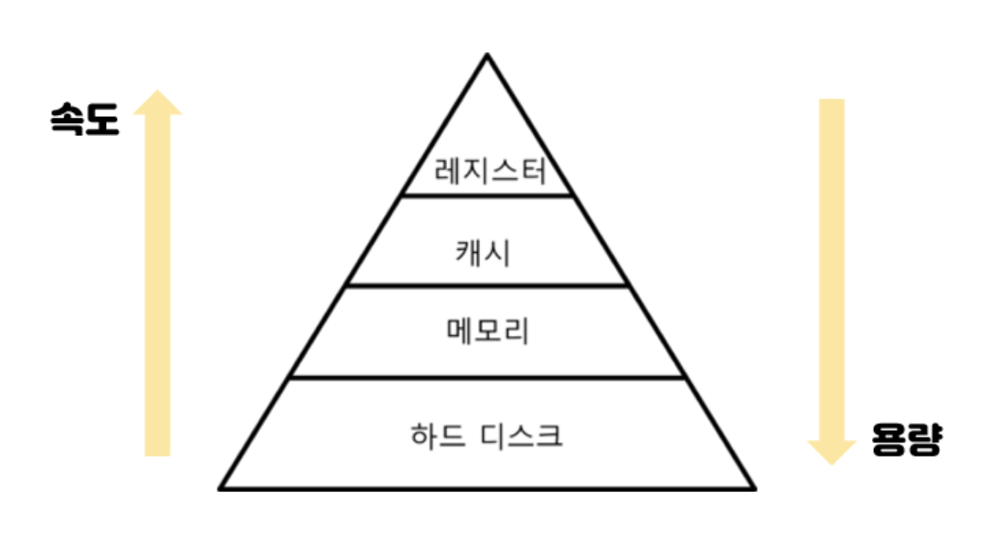
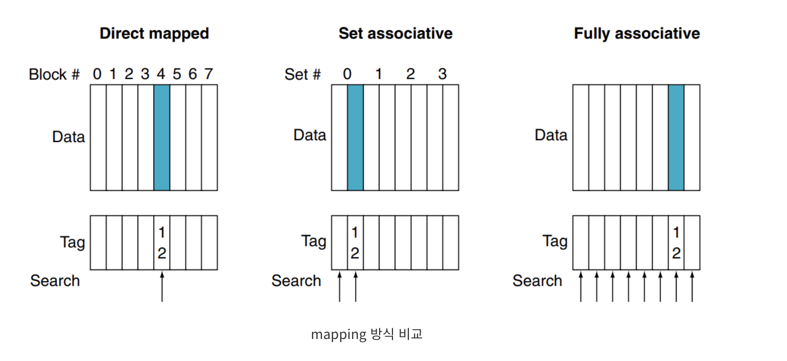
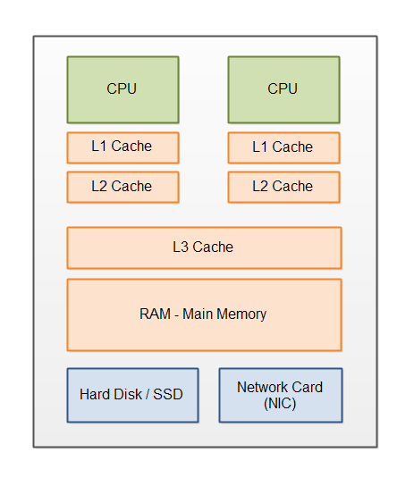

## 📌 메모리 계층 구조

## [ARCH-009] 메모리 계층 구조(Memory Hierarchy)에 대해 설명해주세요.

정답

메모리 계층 구조란 메모리 관련 주요 특성인 **용량, 접근 속도, 비용** 간의 균형을 맞추기 위해 구성한 메모리 계층

레지스터, 캐시, 메모리(RAM), 하드디스크로 구성 

CPU와 가장 가까울수록(레지스터, 캐시) 속도는 빠르지만 용량이 작고 비싸며, 멀수록(메모리,하드디스크) 속도는 느리지만 용량이 크고 저렴

개념

- 레지스터: CPU 내부의 작은 메모리. 휘발성이며 속도가 가장 빠르고 기억 용량이 가장 작음
    - 현재 연산 중인 데이터 저장
- 캐시: L1,L2,L3 캐시를 지칭. 휘발성이며 속도가 빠르고 기억 용량이 작음
    - CPU와 RAM 사이의 속도 차이 완화
- 주기억장치(메모리): RAM을 지칭. 휘발성이며 속도와 기억 용량 보통 
    - 실행 중인 프로그램과 데이터 임시 저장
    - RAM은 하드 디스크로부터 일정량의 데이터를 복사하여 임시 저장하고, 필요시마다 빠르게 CPU에 전달하는 역할
- 보조기억장치(디스크): HDD, SDD 지칭. 비휘발성이며 속도는 낮지만 기억 용량이 많음

## [ARCH-010] 레지스터, 캐시, 메인 메모리, 보조 기억장치의 속도와 용량을 비교해주세요.

정답

레지스터, 캐시, 메인 메모리, 보조 기억 장치 순서대로 속도가 빠르지만 용량은 작고, 가격 비쌈

개념

## [ARCH-011] 캐시 메모리가 왜 필요하고, 어떤 원리로 동작하나요?

정답

캐시는 CPU와 메인 메모리의 속도 차이를 개선하기 위해 사용하며, "지역성"을 바탕으로 CPU가 다시 참조할 가능성이 높은 데이터를 미리 가져다 놓음

개념

필요성
- 캐시 메모리 없는 경우, CPU가 데이터를 요청할 때마다 RAM에서 데이터를 가져와야 함
- 하지만 RAM에서 데이터를 가져오는 속도가 매우 느림
- CPU와 RAM 사이의 캐시 메모리를 통해 속도 격차 완화

RAM: DRAM과 SRAM
- RAM은 DRAM과 SRAM으로 나뉘며, 데이터 저장 방식과 용도가 다름
- DRAM: 주기억장치. PC의 메인 메로리. 메모리 계층 구조의 메모리. 메인보드 위에 위치
    - 일반적으로 RAM이라 부름. 대용량 가격 저렴하고 속도 느림
- SRAM: 캐시메모리. 메모리 계층 구조의 캐시. CPU 내부에 칩으로 존재
    - 가격이 매우 비싸며 속도 빠름

지역성
- 캐시는 무작위로 데이터를 저장하는 것이 아니라 효율적인 예측 시스템을 기반으로 작동
- 시간 지역성: 한 번 접근한 데이터는 가까운 미래에 또 접근할 확률이 높음 (Ex. 루프문의 변수)
- 공간 지역성: 특정 데이터에 접근하면 그 주변 데이터도 곧 접근할 확률이 높음 (Ex. 배열 데이터)

## [ARCH-012] 캐시의 지역성(Locality) 원리에 대해 설명해주세요.

정답

캐시의 지역성이란 CPU가 다시 참조할 가능성 높은 데이터를 캐시에 미리 가져오는 것

시간 지역성에 따라 한 번 접근한 데이터는 가까운 미래에 또 접근할 확률이 높고, 공간 지역성에 따라 특정 데이터에 접근하면 그 주변 데이터도 곧 접근할 확률이 높아 주변 데이터를 캐시에 미리 가져옴

개념

[ARCH-011] 참고

## [ARCH-013] 시간 지역성(Temporal Locality)과 공간 지역성(Spatial Locality)의 차이는 무엇인가요?

정답

시간 지역성에 따라 한 번 접근한 데이터는 가까운 미래에 또 접근할 확률이 높고, 공간 지역성에 따라 특정 데이터에 접근하면 그 주변 데이터도 곧 접근할 확률이 높아 주변 데이터를 캐시에 미리 가져옴

개념

[ARCH-011] 참고

## [ARCH-014] 캐시 라인(Cache Line)이 무엇이고, 크기가 성능에 어떤 영향을 미치나요?

정답

캐시 라인은 캐시에 데이터를 저장하는 최소 단위

묶음 단위로 데이터를 가져와 공간 지역성 활용

캐시 라인이 커지면 연속적인 데이터 접근 성능이 좋아지지만 캐시 미스 시 데이터 전송 시간이 길어지고 불필요한 데이터가 캐시 공간 차지

캐시 라인이 작아지면 데이터 전송은 빠르지만 캐시 적중률이 떨어질 위험이 있음

개념

필요성
- 캐시는 메인 메모리에 비해 크기가 매우 작아 1:1 매칭이 불가능
- 데이터가 캐시 내의 어느 곳에 저장되어 있는지 알아야 효율적인 시스템이 되므로, 캐시에 데이터를 저장할 때 캐시 라인이라는 단위의 묶음으로 저장

크기와 성능
- 캐시 라인이 커지면 연속적인 데이터 접근 성능이 좋아지지만 캐시 미스 시 데이터 전송 시간이 길어지고 불필요한 데이터가 캐시 공간 차지

- 캐시 라인이 작아지면 데이터 전송은 빠르지만 캐시 적중률이 떨어질 위험이 있음

## [ARCH-015] 캐시 히트(Cache Hit)와 캐시 미스(Cache Miss)에 대해 설명해주세요.

정답

CPU가 데이터를 찾을 때 캐시에 있으면 캐시 히트, 캐시에 없어서 메모리에서 가져와야 하면 캐시 미스라고 함

캐시 히트가 발생하면 시스템의 성능 향상

## [ARCH-016] 캐시 매핑 방식(Direct Mapped, Fully Associative, Set Associative)의 차이점을 설명해주세요.

정답

캐시 매핑 방식이란 메모리 주소를 캐시에 할당하는 방식

캐시의 크기가 메모리보다 작기 때문에 효율적으로 메모리의 데이터를 매핑하는 것이 중요

Direct Mapping(직접 매핑)은 모듈러 나머지 연산 사용해 메모리의 특정 블록을 특정 캐시에만 매핑하는 방식

Fully Associative는 메모리 블록이 캐시의 아무 장소에 들어갈 수 있는 방식

Set Associative는 순서를 일치시키고 편하게 저장하되, 일정 그룹을 두어 그룹 내에서 편하게 저장

개념

Direct Mapped
- 모듈러 나머지 연산 사용해 메모리의 특정 블록을 특정 캐시에만 매핑하는 방식
- Ex. 메모리의 주소가 1~100, 캐시의 주소가 1~10이라고 가정. 1~10까지의 주소는 1에, 11~20까지의 주소는 2에, ..., 91~100까지의 주소는 10에 매핑
- 장점: 구현이 단순하고 접근 속도가 빠름
- 단점: 교체가 자주 일어나 적중률 저조. 특정 동일한 캐시 블록에 매핑되는 다른 메모리 블록을 번갈아 참조하면 블록 충돌 발생해 적중률 저조
    - Ex. A,B,A,B 순서대로 참조하는 경우 매번 캐시 미스 발생
- 캐시 메모리가 대용량인 경우에만 사용

Associative
- 빈 공간이 존재하는 Direct Mapped를 해결하기 위한 방식
- Fully Associative와 Set Associative Cache로 나뉨

Fully Associative
- 메모리 블록이 캐시의 아무 장소에 들어갈 수 있는 방식
- 단점: 모든 entry 검색해야 함. 하드웨어 크기 증가
- 적은 메모리 블록의 경우 효율적

Set Associative
- Direct와 Fully Associative를 합친 방식
- 순서를 일치시키고 편하게 저장하되, 일정 그룹을 두어 그룹 내에서 편하게 저장
- Ex. 메모리 블록이 1~100, 캐시가 1~10이라 가정. 캐시 1~5에는 1~50까지의 데이터를 무작위로 저장
- 블록화가 되어 있어 검색은 효율적이고 저장 위치에 제약이 없어 적중률이 많이 떨어지지 않음

## [ARCH-017] 캐시 교체 정책(LRU, LFU, FIFO 등)에 대해 설명해주세요.

정답

캐시 교체 정책은 캐시 공간이 부족할 때 기존 데이터를 비우는 정책

가장 기본이자 현대 시스템에서 표준처럼 쓰이는 방식은 LRU(Least Recently Used)

LRU는 가장 오랫동안 사용되지 않은 데이터 교체 방식

LFU는 참조 횟수가 가장 작은 페이지 교체 방식

FIFIO는 가장 오래된 데이터 교체 방식

개념

FIFO (irst In First Out)
- 가장 오래된 데이터 교체 방식

LRU (Least Recently Used) 
- 가장 오랫동안 사용되지 않은 페이지 교체
- 가장 기본이자 현대 시스템에서 표준처럼 쓰이는 방식

LFU (Least Frequently Used)
- 참조 횟수가 가장 작은 페이지 교체

그밖의 페이지 교체 알고리즘
- MFU (Most Frequently used)
    - 참조 횟수가 가장 많은 페이지 교체
- NUR (Not Used Recently) 
    - 최근에 사용하지 않은 페이지 교체

## [ARCH-018] Write-Through와 Write-Back 캐시 쓰기 정책의 차이점은 무엇인가요?

정답

캐시 쓰기 정책이란 데이터 수정 시 메모리에 즉시 반영할지 나중에 반영할지 결정하는 정책

Write-Through는 캐시와 메모리를 동시에 업데이트하고, Write-Back은 캐시만 먼저 업데이트한 후 나중에 메모리 반영

개념

Write-Through
- 캐시와 메모리를 동시에 업데이트
- 데이터 일관성 확보 가능
- 속도 느림

Write-Back
- 캐시만 먼저 업데이트 후 나중에 메모리 반영
- 데이터 일관성 관리 필요
- 속도 빠름

## [ARCH-019] L1, L2, L3 캐시의 차이점과 각각의 역할에 대해 설명해주세요.

정답

L1,L2,L3 캐시 모두 메모리 계층 구조의 "캐시"에 해당

CPU 코어와의 거리와 공유 여부에 따라 나뉨

L1은 가장 빠르고 코어 전용이며, L2는 그다음 속도의 코어 전용 또는 일부 공유, L3는 모든 코어가 공유하며 가장 큰 용량을 가짐

데이터 탐색 시 L1->L2->L3->RAM 순서로 진행

개념

[ARCH-009] 메모리 계층 구조의 "캐시"에 해당

L1
- CPU 칩 내에 내장
- 속도 가장 빠름
- 이곳에서 데이터를 찾지 못하면 L2 캐시 메모리로 넘어감 

L2
- CPU 회로판에 별도의 칩으로 내장
- L1보다 느린 속도의 코어 전용 또는 일부 공유

L3
- CPU 칩 내부에 위치하며 코어 외부에 존재할 수 있음
- 모든 코어가 공유하며 가장 큰 용량을 가짐
- L2 캐시로도 충분히 커버 가능해 웬만한 프로세서에 L3 캐시 메모리를 달고 있지 않음

데이터 탐색 시 L1->L2->L3->RAM 순서로 진행

L1/L2는 개별 코어의 성능을, L3는 코어 간 데이터 공유 및 멀티태스킹 효율을 담당

## [ARCH-020] 캐시 일관성(Cache Coherence) 문제와 해결 방법에 대해 설명해주세요.

정답

캐시 일관성이란 멀티코어 환경에서 각 코어의 캐시가 동일한 메모리 주소에 대해 서로 다른 값을 가져 발생하는 문제
멀티 코어 시스템에서는 다른 코어에 의해 메모리 데이터가 변경될 수 있으므로 현재 캐시에 저장된 값이 항상 메모리의 최신 상태라고 보장할 수 없음

해결 방법은 쓰기 정책으로 Snooping과 MESI 프로토콜 적용

개념

캐시 일관성
- 멀티코어 환경에서 각 코어의 캐시가 동일한 메모리 주소에 대해 서로 다른 값을 가져 발생하는 문제
- 멀티 코어 시스템에서는 다른 코어에 의해 메모리 데이터가 변경될 수 있으므로 현재 캐시에 저장된 값이 항상 메모리의 최신 상태라고 보장할 수 없음

Snooping
- 주소 버스를 항상 감시해 캐시 상의 메모리에 대한 접근이 있는지 감시하는 구조

MESI 프로토콜 
- 멀티프로세서 시스템에서 각 캐시 라인의 상태를 관리하여 데이터 일관성을 유지하는 규칙
- 캐시 라인(데이터 블록)이 가질 수 있는 4가지 상태 정의
    - 수정(Modified): 캐시 내 라인이 수정되었으며 그 라인은 캐시에만 존재
    - 배타(Exclusive): 캐시 내 라인은 주기억장치에 있는 것과 동일하며 다른 캐시에는 존재하지 않음
    - 공유(Shared): 캐시 내 라인은 주기억장치에 있는 것과 동일하며, 다른 캐시에 있을 수 있음
    - 무효(Invalid): 캐시 내 라인은 유효한 데이터를 포함하고 있지 않음

## Reference

[캐시 메모리 매핑 기법](https://rlaehddnd0422.tistory.com/245)

[캐시 메모리 매핑 기법](https://hi-guten-tag.tistory.com/288)

[L1,L2,L3 캐시](https://dreamchaser3.tistory.com/8)