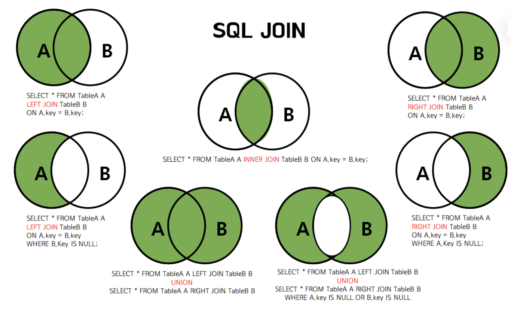
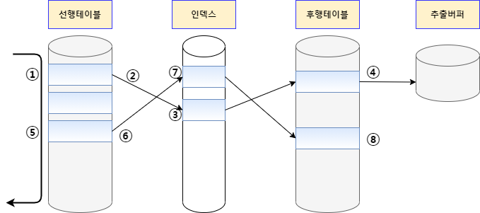
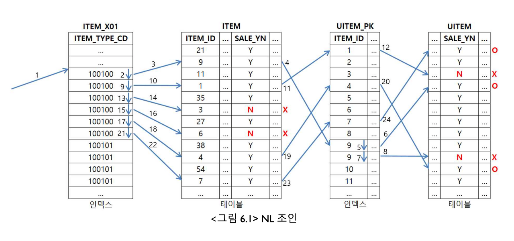
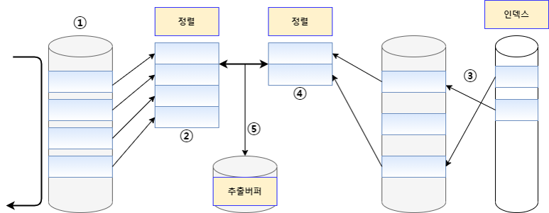
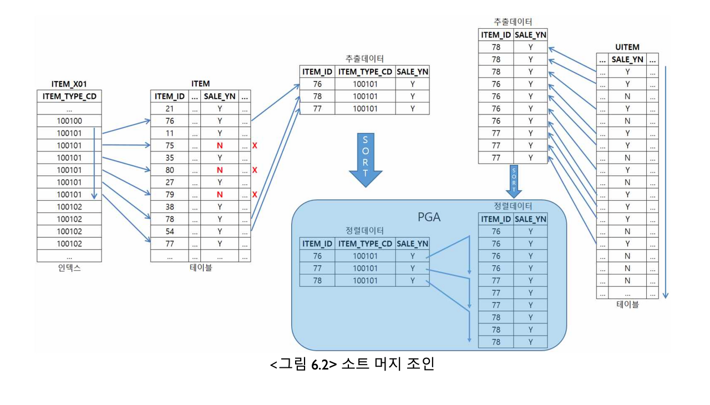
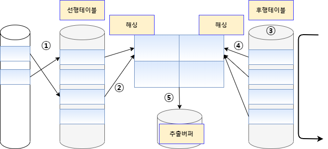

## 📌 JOIN
> 전체 질문 흐름: JOIN을 개념 -> 내부 동작 -> 성능 최적화까지 연결    
> => (1) DB Join의 정의와 종류 (2) JOIN의 내부 구현 방식 (알고리즘) (3) 실행 계획(Execution Plan) 확인법 (4) JOIN 성능과 인덱스의 관계 (5) 3중 조인의 동작 방식과 성능 영향    

### [DB-037] DB Join이 무엇인지 설명하고, 각각의 종류에 대해 설명해 주세요.
> 참고 문서: [테이블 조인(JOIN) - 그림으로 알기 쉽게 정리](https://inpa.tistory.com/entry/MYSQL-%F0%9F%93%9A-JOIN-%EC%A1%B0%EC%9D%B8-%EA%B7%B8%EB%A6%BC%EC%9C%BC%EB%A1%9C-%EC%95%8C%EA%B8%B0%EC%89%BD%EA%B2%8C-%EC%A0%95%EB%A6%AC)

JOIN은 여러 테이블을 특정 조건으로 합쳐 새로운 집합을 만드는 연산이다.

이러한 JOIN의 핵심 아이디어를 정리해보면 다음과 같다.
- JOIN = 두 테이블 간 Cartesian Product(곱집합) + 조건 필터링  
- 즉, `A JOIN B ON 조건`은 내부적으로 `A × B` 결과에서 조건을 만족하는 행만 필터링한 형태라고 볼 수 있다. 

JOIN의 종류에는 크게 INNER JOIN, LEFT OUTER JOIN, RIGHT OUTER JOIN, FULL OUTER JOIN이 있다.

| 구분 | 설명 | 예시 |
|------|------|------|
| INNER JOIN | 두 테이블 모두에 존재하는 데이터만 반환 | "교집합" |
| LEFT OUTER JOIN | 왼쪽 테이블의 모든 행 + 오른쪽 매칭 데이터 | "왼쪽 기준 전체" |
| RIGHT OUTER JOIN | 오른쪽 테이블의 모든 행 + 왼쪽 매칭 데이터 | "오른쪽 기준 전체" |
| FULL OUTER JOIN | 양쪽 테이블의 모든 행을 합침 (일치하지 않는 부분은 NULL) | "합집합" |

이때, MySQL과 MariaDb의 경우 FULL OUTER JOIN을 지원하고 있지 않기 때문에 LEFT JOIN UNION RIGHT JOIN로 대체하여 구현 가능하다.

추가로, SELF JOIN, CROSS JOIN이 존재한다. 

| 구분 | 설명 | SQL 예시 |
|------|------|----------|
| SELF JOIN (자기 자신과 JOIN) | 트리 구조나 상하관계 표현 시 사용 (조직도) | `SELECT e1.name AS employee, e2.name AS manager`<br>`FROM emp e1`<br>`JOIN emp e2 ON e1.manager_id = e2.emp_id;` |
| CROSS JOIN (모든 조합) | 조건 없이 모든 행 조합 (카테시안 곱) | `SELECT * FROM student CROSS JOIN enroll;` |



### [DB-038] 사실, JOIN은 상당한 시간이 걸릴 수 있기에 내부적으로 다양한 구현 방식을 사용하고 있습니다. 그 예시에 대해 설명해 주세요.
> 참고 문서: [SQL 조인(Join) 수행 원리 (NL Join, Sort Merge Join, Hash Join)](https://velog.io/@eunhye_/SQL-%EC%A1%B0%EC%9D%B8Join-%EC%88%98%ED%96%89-%EC%9B%90%EB%A6%AC)

#### NL Join(Nested Loop Join)

NL Join은 프로그래밍에서 사용하는 중첩된 반복문과 유사한 방식으로 조인을 수행한다. 반복문의 외부에 있는 테이블을 선행 테이블 또는 외부 테이블 (Outer Table)이라고 하고, 반복문의 내부에 있는 테이블을 후행 테이블 또는 내부 테이블(Inner Table)이라고 한다.



<details>
<summary>NL Join 과정</summary>

1. 선행 테이블에서 조건을 만족하는 첫 번째 행을 스캔 (이 때 선행 테이블에 주어진 조건을 만족하지 않는 경우 해당 데이터는 필터링)
2. 선행 테이블의 조인 키를 가지고 후행 테이블에 조인키가 존재하는지 스캔 -> 조인 시도
3. 후행 테이블의 인덱스에 선행 테이블의 조인 키가 존재하는지 확인 -> 선행 테이블의 조인 값이 후행 테이블에 존재하지 않으면 선행 테이블 데이터는 필터링 (더 이상 조인 작업을 진행할 필요 없음)
4. 인덱스에서 추출한 레코드 식별자를 이용하여 후행 테이블을 액세스 -> 인덱스 스캔을 통한 테이블 액세스. 후행 테이블에 주어진 조건까지 모두 만족하면 해당 행을 추출버퍼에 넣음

</details>

<details>
<summary>NL Join 특징</summary> 

- 절차적이며, 프로그래밍에서 FOR, WHILE문 과 같은 구조로 수행된다.
- 선행테이블은 풀스캔하므로, 선행테이블의 크기가 작을수록 유리하다. (So. 두 테이블의 크기 차이가 있는 경우, 유리하게 사용될 수 있는 방법임)
- 후행테이블에 대해서는 반드시 인덱스가 존재해야 NL 조인이 가능하다.
- 인덱스 구성 전략이 특히 중요하다. 조인 컬럼에 대한 인덱스가 있느냐 없느냐, 있다면 컬럼이 어떻게 구성됐느냐에 따라 조인 효율이 크게 달라진다.
- 랜덤 액세스 방식으로 데이터를 읽는다. -> 처리 범위가 좁은 것이 유리하다.

이런 여러가지 특징을 종합할 때, NL 조인은 소량의 데이터를 주로 처리하거나 부분범위처리가 가능한 온라인 트랜잭션 환경에 적합한 조인 방식이라고 할 수 있다.

</details>

<details>
<summary>NL Join 예시</summary> 



</details>

#### Sort Merge Join

Sort Merge Join은 조인 컬럼을 기준으로 데이터를 정렬하여 조인을 수행한다. NL Join은 주로 랜덤 액세스 방식으로 데이터를 읽는 반면 Sort Merge Join은 주로 스캔 방식으로 데이터를 읽는다. Sort Merge Join은 랜덤 액세스로 NL Join에서 부담이 되던 넓은 범위의 데이터를 처리할 때 이용되던 조인 기법이다다. 그러나 Sort Merge Join은 정렬할 데이터가 많아 메모리에서 모든 정렬 작업을 수행하기 어려운 경우에는 임시 영역(디스크)을 사용하기 때문에 성능이 떨어질 수 있다.

일반적으로 대량의 조인 작업에서 정렬 작업을 필요로 하는 Sort Merge Join 보다는 CPU 작업 위주로 처리하는 Hash Join이 성능상 유리하다. 그러나 Sort Merge Join은 Hash Join 과는 달리 동등 조인뿐만 아니라 비동등 조인에 대해서도 조인 작업이 가능하다는 장점이 있다.



<details>
<summary>Sort Merge Join 과정</summary>

1. 선행 테이블에서 주어진 조건을 만족하는 행을 찾음
2. 선행 테이블의 조인 키를 기준으로 정렬작업을 수행
    - 1 ~ 2번 작업을 선행 테이블의 조건을 만족하는 모든 행에 대해 반복 수행
3. 후행 테이블에서 주어진 조건을 만족하는 행을 찾음
4. 후행 테이블의 조인 키를 기준으로 정렬 작업을 수행
    - 3 ~ 4번 작업을 후행 테이블의 조건을 만족하는 모든 행에 대해 반복 수행
5. 정렬된 결과를 이용하여 조인을 수행하며 조인에 성공하면 추출버퍼에 넣음

</details>

<details>
<summary>Sort Merge Join 특징</summary>

1. 인덱스가 없어도 가능한 조인법
2. 대부분 해시조인인 보다 느린 성능을 보이나, 아래와 같은 상황에서는 소트머지 조인이 유용하다.
    - First 테이블에 소트연산을 대체할 인덱스가 있을 때
    - 조인할 First 집합이 이미 정렬되어 있을 때
    - 조인 조건식이 등차(=)조건이 아닐 때
3. 두 테이블의 사이즈가 비슷한경우에 유리하며, 사이즈 차이가 큰 경우에는 불리하고, 비효율적인 방법이다.

</details>

<details>
<summary>Sort Merge Join 예시</summary>



</details>

#### Hash Join

Hash Join은 해싱 기법을 이용하여 조인을 수행한다. 조인될 두 테이블 중 하나를 해시 테이블로 선정하여 조인될 테이블의 조인 키 값을 Hash 알고리즘으로 비교하여 매치되는 결과값을 얻는 방식이다.
HASH JOIN은 비용 기반 옵티마이저를 사용할 때만 사용될 수 있는 조인 방식이며 '=' 비교를 통한 조인에서만 사용될 수 있다. 주로 많은 양의 데이터를 조인해야 하는 경우에 주로 사용된다.



<details>
<summary>Hash Join 과정</summary>

1. 선행 테이블에서 주어진 조건을 만족하는 행을 찾음
2. 선행 테이블의 조인 키를 기준으로 해시함수를 적용하여 해시 테이블을 생성 -> 조인 컬럼과 SELECT 절에서 필요로 하는 컬럼도 함께 저장
    - 1 ~ 2번 작업을 선행 테이블의 조건을 만족하는 모든 행에 대해 반복 수행
3. 후행 테이블에서 주어진 조건을 만족하는 행을 찾음
4. 후행 테이블의 조인 키를 기준으로 해시 함수를 적용하여 해당 버킷을 찾음 -> 조인 키를 이용해서 실제 조인될 데이터를 찾음
5. 조인에 성공하면 추출버퍼에 넣음
    - 3 ~ 5번 작업을 후행 테이블의 조건을 만족하는 모든 행에 대해 반복 수행

</details>

<details>
<summary>Hash Join 특징</summary>

- 조인 칼럼의 인덱스를 사용하지 않기 때문에 조인 칼럼의 인덱스가 존재하지 않을 경우데도 사용할 수 있는 기법이다.
- 메모리 사용이 큰 대용량 테이블 조인시 메모리 외에 임시영역(PGA 메모리)까지 사용하여 저장할 수 있어 유리하다.
- 해쉬 함수를 이용하여 조인을 수행하기 때문에 '='로 수행하는 조인에서만 사용 가능하다.

</details>

### [DB-039] 그렇다면 입력한 쿼리에서 어떤 구현 방식을 사용하는지는 어떻게 알 수 있나요?

실행 계획(Execution Plan)을 통해 알 수 있다.

MySQL이랑 PostgreSQL 둘다 쿼리문 앞에 EXPLAIN ANALYZE를 붙이면 DB Client에서 실행 계획을 볼 수 있다. 

예를 들어, 직원 데이터베이스(`employees` 테이블, 약 50,000명의 데이터)에서 특정 이메일 주소를 검색하는 상황이라고 해보자.   
이때, 이메일을 대소문자 구분 없이 검색하기 위해 `lower()` 함수를 사용하는 쿼리의 성능 최적화하는 케이스에 대해 살펴보고자 한다. 

#### (1) 느린 케이스 (Seq Scan)

<details>
<summary>쿼리문</summary>

```sql
SELECT * FROM employees WHERE lower(email) = 'user1234@corp.com';
```

</details>

<details>
<summary>실행 계획</summary>

```
QUERY PLAN                                                                                                  |
------------------------------------------------------------------------------------------------------------+
Seq Scan on employees  (cost=0.00..1542.00 rows=250 width=94) (actual time=21.601..21.602 rows=0.00 loops=1)|
  Filter: (lower(email) = 'user1234@corp.com'::text)                                                        |
  Rows Removed by Filter: 50000                                                                             |
  Buffers: shared hit=792                                                                                   |
Planning Time: 0.092 ms                                                                                     |
Execution Time: 21.624 ms                                                                                   |
```

</details>

#### (2) 인덱스 붙여서 빨라진 케이스 (Index Only Scan)

<details>
<summary>쿼리문</summary>

```sql
-- 커버링 인덱스 생성
CREATE UNIQUE INDEX idx_emp_lower_email_covering 
ON employees (lower(email)) 
INCLUDE (employee_id, email);

-- 통계 정보 갱신 (Visibility Map 최신화)
VACUUM ANALYZE employees;

-- Index Only Scan 실행 쿼리
SELECT employee_id, email 
FROM employees 
WHERE lower(email) = 'user1234@corp.com';
```

</details>     

<details>
<summary>실행 계획</summary>

```
QUERY PLAN                                                                                                                                     |
-----------------------------------------------------------------------------------------------------------------------------------------------+
Index Only Scan using idx_emp_lower_email_covering on employees  (cost=0.41..4.43 rows=1 width=28) (actual time=0.051..0.051 rows=0.00 loops=1)|
  Index Cond: ((lower(email)) = 'user1234@corp.com'::text)                                                                                     |
  Heap Fetches: 0                                                                                                                              |
  Index Searches: 1                                                                                                                            |
  Buffers: shared hit=3                                                                                                                        |
Planning Time: 0.162 ms                                                                                                                        |
Execution Time: 0.077 ms                                                                                                                       |
```

</details>     

#### (3) 결론

- 성능 개선 효과: Execution Time이 21.624ms에서 0.077ms로 약 280배 향상됨
- 결론: 인덱스가 없어서 전체 테이블을 스캔하는 경우와 커버링 인덱스를 활용한 경우를 비교해보면 성능 차이가 존재함을 명확히 알 수 있다. 

### [DB-040] 앞 질문들을 통해 인덱스의 중요성을 알 수 있었는데, 그렇다면 JOIN의 성능도 인덱스의 유무의 영향을 받나요?

결론부터 말하자면, JOIN의 성능은 인덱스 유무에 절대적인 영향을 받는다.
특히 Nested Loop Join에서 그 영향력이 극대화된다.
    - 인덱스가 없을 때: 외부 테이블 행이 1,000개, 내부 테이블 행이 1,000개라면 총 $1,000 \times 1,000 = 1,000,000$번의 비교 작업을 생으로 반복해야 합니다.
    - 인덱스가 있을 때: 외부 테이블의 행 하나에 대해 내부 테이블을 전체 스캔할 필요 없이, 인덱스 트리를 타고 즉시 해당 위치로 점프할 수 있습니다.
따라서 조인 조건에 사용되는 컬럼(Foreign Key 등)에 인덱스가 없다면 시스템 전체의 성능 저하로 이어진다.

### [DB-041] 3중 조인 부터는 동작 방식이 약간 바뀝니다. 어떻게 동작하는지, 그리고 그 방식이 성능에 어떠한 영향을 주는지 설명해 주세요.

3개 이상의 테이블을 조인할 때, DB는 한 번에 세 테이블을 동시에 합치는 것이 아니라 "두 개씩 순차적으로" 조인한다.

1. 동작 방식:
    - 먼저 Table A와 Table B를 조인하여 **중간 결과물(Intermediate Result Set)**을 만든다.
    - 그다음, 이 중간 결과물과 Table C를 다시 조인한다.

2. 성능에 주는 영향:
    - 순서의 중요성: 어떤 테이블을 먼저 조인하느냐에 따라 중간 결과물의 크기가 달라진다. 중간 결과물이 작을수록 다음 조인 작업이 가벼워진다.
    - 부하 가중: 조인 단계가 늘어날수록 CPU와 메모리 사용량이 기하급수적으로 늘어날 수 있다. 옵티마이저가 최적의 조인 순서를 결정하는 계산 복잡도도 증가한다.

3. 추가: 3중 조인 이상에서는 실행 계획을 반드시 확인하여, 가장 필터링이 많이 되어 데이터 수를 대폭 줄여줄 수 있는 테이블이 먼저 조인(Driving)되고 있는지 체크하는 것이 성능 최적화의 핵심이다.
