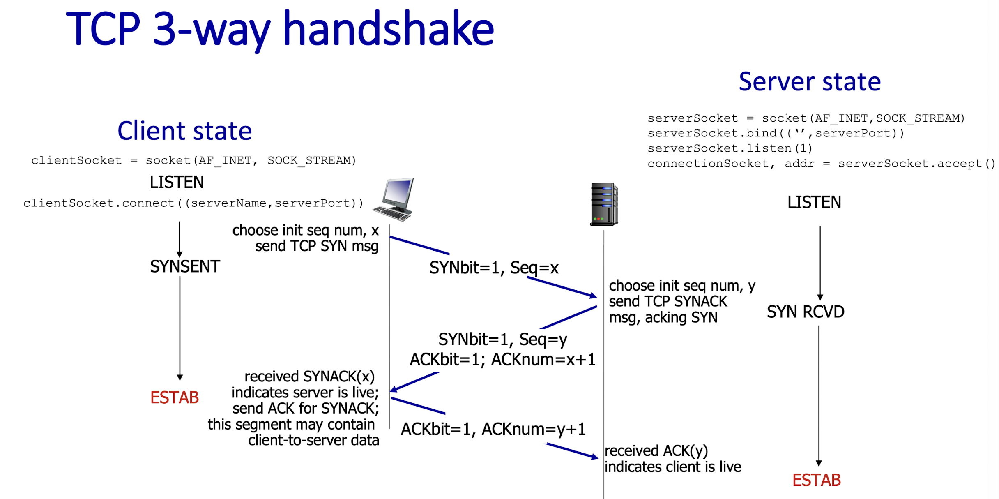
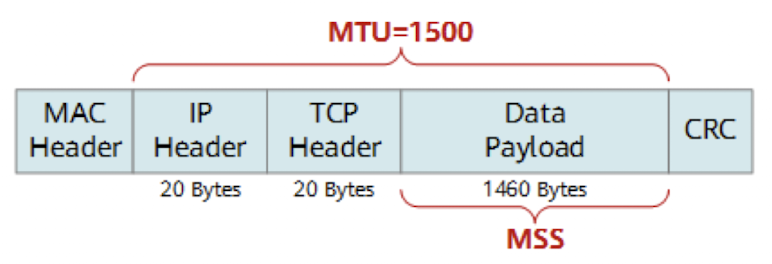
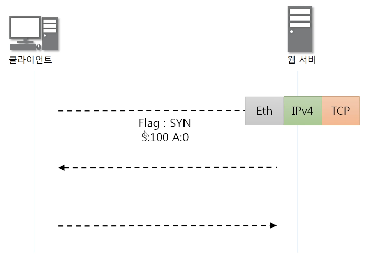
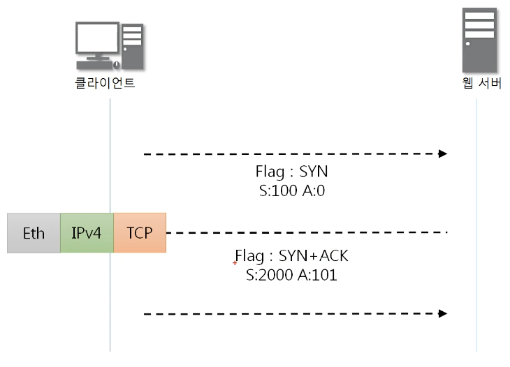
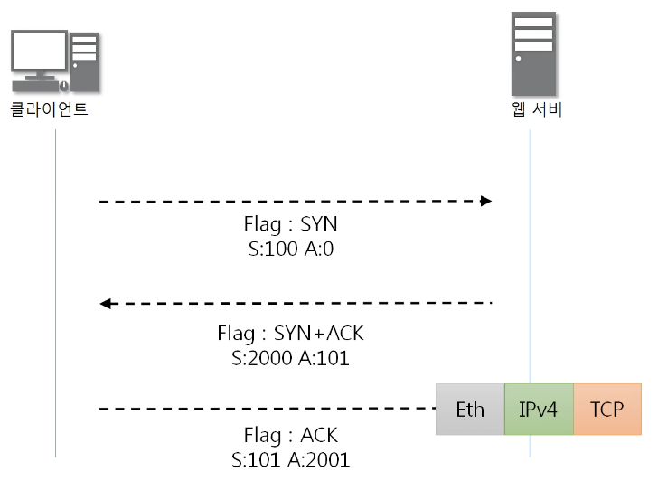
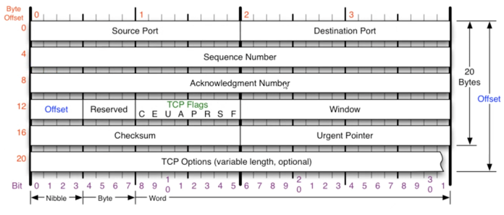
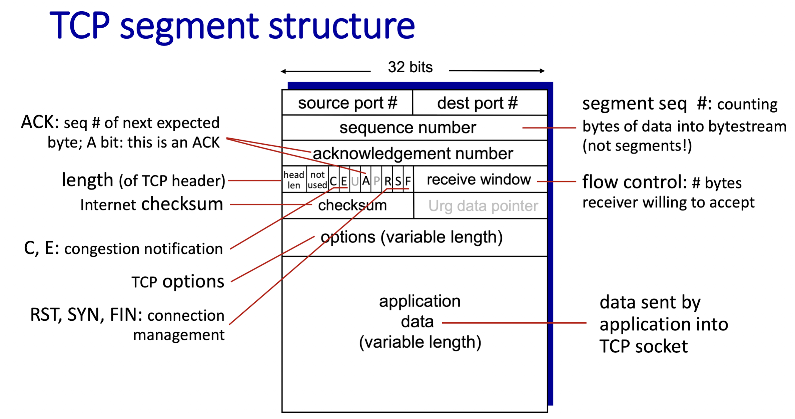
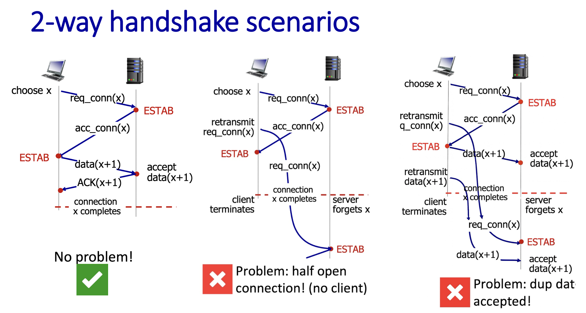
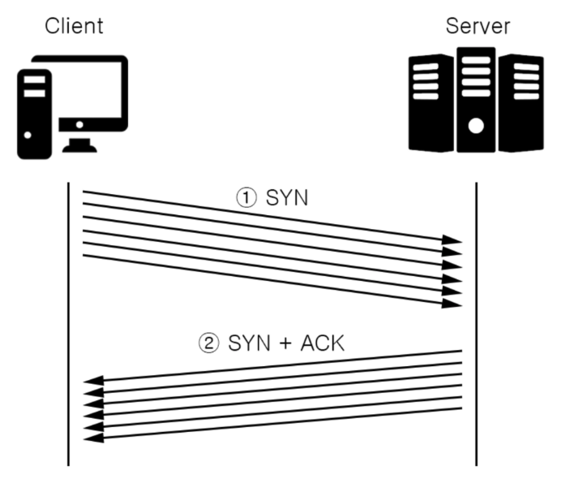
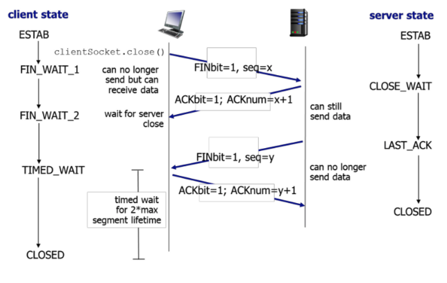

## [NET-042] 3-Way Handshake에 대해 설명해 주세요.

정답

3-Way Handshake는 TCP connection 수립 방식으로 총 3단계로 이루어짐

### connection 수립 특징
- 최초 seq#는 random으로 설정(∵보안) 
- sender: SYNbit=1 -> receiver: ACKbit=1 => connection 수립 성공
- sender: seq#=x -> receiver: ACK#=x+1 => 패킷 도착 성공 

### connection 수립 과정
1) client -> server : SYNbit=1, seq#=x
2) server -> client : ACKbit=1, ACK#=x+1 / SYNbit=1, seq#=y
3) client -> server : ACKbit=1, ACK#=y+1 

=> 3-way handshake을 통한 connection 수립 완료  

++ 편의를 위해 연결을 먼저 요청하는 Host를 client, 연결을 요청 받는 Host를 server로 설정

관련 개념

### TCP란?

- transport layer에서 프로세스 간 communication을 위해 사용하는 프로토콜
- UDP와 달리 패킷 순서가 뒤집힐 일이 없다는 점에서 신뢰성을 가짐
- transmission control protocol

### Host(Client, Server)끼리 주고받는 패킷/세그먼트의 크기 (IPv4 기준)

1) 패킷 전체 크기(3계층, Network Layer)
   - IP 헤더(20) + TCP 헤더(20) + MSS(1,460) = 1,500byte
   - MTU(Maximum Transmission Unit) : IPv4 기준 인터넷 선(이더넷)을 통해 한 번에 보낼 수 있는 패킷 전체의 최대 크기가 보통 1,500byte
2) 세그먼트 전체 크기(1480byte) = TCP 헤더(20byte) + MSS(1,460byte)
   - TCP 헤더(20) + MSS(1460) = 1,480byte
   - MSS(Maximum Segment Size) : 세그먼트 전체의 크기라고 오해하기 쉽지만, TCP 헤더를 뺀 순수 데이터(Payload)의 최대 크기를 의미
3) MSS(Max Segment Size)가 일반적으로 1,460인 이유
   - MTU 크기와 IP/TCP 헤더 크기로 인해 1,460byte

### connection 수립 과정 예시

<b>1단계: [Client -> Server] Seq#=100, Ack#=0 + Flags(SYN=1, ACK=0) + Options(MSS=1460)</b>

- Seq#=100: 클라이언트 시작 기준점이 100번임을 알림
- SYN=1: 최초 TCP 연결 수립 요청
- MSS=1460: 클라이언트가 받을 수 있는 최대 Payload 크기가 1460byte임을 알림

<b>2단계: [Client <- Server] Seq#=2000, Ack#=101 + Flags(SYN=1, ACK=1) + Options(MSS=1000)</b>

- Seq#=2000: 서버 시작 기준점이 2000번임을 알림
- Ack#=101: 클라이언트 데이터 시작 위치가 100번임을 확인했으니, 다음에는 101번부터 보내달라는 요청
- SYN=1, ACK=1: 클라이언트 요청을 수락(ACK)하고, 서버도 연결 요청(SYN)
- MSS=1000: 서버가 받을 수 있는 최대 Payload 크기가 1000byte임을 알림

<b>3단계: [Client -> Server] Seq#=101, Ack#=2001 + Flags(SYN=0, ACK=1) + Options()</b>

- Seq#=101: 이 패킷의 순서 번호를 101번으로 지정 (현재 상태를 의미)
- Ack#=2001: 서버 데이터 시작 위치가 2000번임을 확인했으니, 다음에는 2001번부터 보내달라는 요청
- SYN=0, ACK=1: 서버의 연결 요청에 대한 최종 수락 확인 (이 시점부터 연결 성립됨)
- MSS: 처음에 서로 확인(협상)을 마쳤으므로 더 이상 기록하지 않음 (Header Length(Offset)가 줄어듦)

## [NET-043] ACK, SYN 같은 정보는 어떻게 전달하는 것 일까요?

정답

ACK, SYN 같은 정보는 TCP 헤더의 Flag에 담아서 전달됨 

관련 개념

### TCP 헤더의 각 필드별 설명

> 3-Way Handskake에 사용되는 Seq#, Ack#, Seqbit, Ackbit만 알면 됨    
> Seq#는 위치보다는 스트림의 개념   

- Source Port : 출발지 포트 / Destination Port : 목적지 포트 
- ⭐️**Seq 번호 : TCP 패킷의 순서 번호** / ⭐️**Ack 번호 : Seq 번호에 대한 응답 번호**
- Offset : 헤더의 길이, IP 헤더의 길이와 성격이 비슷, 최대 15, Offset * 4 = 실제 헤더의 크기
- Reserved : 예약된 필드로써 사용하지 않는 곳
- TCP Flags : 현재 패킷의 종류를 표시  
	- URG(urgent): 긴급 bit, 우선순위가 높은 데이터를 포함한 패킷  
	- ⭐️**ACK(acknowledge): 승인 bit, 승인의 뜻을 포함한 패킷**
	- PSH(push): 밀어넣기 bit, TCP Buffer가 일정한 크기만큼 쌓여야 패킷을 추가 전송하는데 이를 생략하고 계속 데이터를 전송하게 함  
	- RST(reset): 초기화 bit, 데이터를 주고받는 거에 문제가 발생했으니 서로의 연결을 초기화하겠다는 패킷  
	- ⭐️**SYN(synchronize): 동기화 bit, Seq 번호를 동기화하고 연결 수립을 요청한다는 패킷** 
	- FIN(finish): 종료 bit, 서버와 클라이언트가 연결을 종료하겠다는 패킷
- Window : 남은 버퍼의 크기를 상대방에게 미리 알려주는 기능
- Checksum : 헤더의 오류를 확인하기 위한 값
- Urgent Pointer: 어디가 긴급 데이터인지를 가리키는 곳
- TCP Options
	- MSS(Maximum Segment Size): 세그먼트를 자르는 기준

### TCP segment 전체 구조

## [NET-044] 2-Way Handshake를 하지않는 이유에 대해 설명해 주세요.

정답

2-Way Handshake에서는 하나의 SYN 요청, 하나의 ACK 응답만 존재.   
하지만 네트워크 지연으로 인해, 클라이언트와 서버 간의 요청이 꼬일 수 있음. 

### 발생 가능한 문제점
1) ISN 동기화가 이루어지지 않는다 (클라이언트가 서버의 ISN을 알 수 없다).
   - 서버가 전송한 Segment의 순서를 구분할 수 없다.
   - Pkt Loss나 Delay를 탐지할 수 없다.
   - 작업 순서가 달라져 오류가 발생한다.
   - 작업의 중복 수행이 발생할 수 있다.
2) “half open connection” 상황이 발생할 수 있다.
   - 한 쪽 Host만 연결된 상태를 의미한다.
   - 연결된 Host는 계속 자원을 낭비하게 된다.
   - SYN Flooding(DoS의 일부)에 취약하다.

관련 개념

i) 정상적인 2-Way Handshake 과정

1. 클라이언트 ———(SYN)———> 서버
   - 클라이언트가 서버에게 연결을 요청한다.
   - SYN 패킷을 전송한다.
   - 서버는 SYN 패킷을 받고 ESTAB 상태가 된다.
2. 클라이언트 <———(ACK)——— 서버
   - 서버는 연결 수락 및 응답 패킷을 보낸다.
   - ACK 패킷을 전송한다.
   - 클라이언트는 ACK 패킷을 받고 ESTAB 상태가 된다.

ii) 클라이언트 소실: half open connection

1. 클라이언트 ———(SYN)———> 서버
   - 클라이언트가 서버에게 연결을 요청한다.
     - SYN 패킷을 전송한다.
   - 서버는 SYN 패킷을 받고 ESTAB 상태가 된다.
2. 클라이언트 <———(ACK)——— 서버
   - 서버는 연결 수락 및 응답 패킷을 보낸다.
     - ACK 패킷을 전송한다.
3. 클라이언트 ———(SYN)———> 서버
   - 2번 ACK 응답이 지연되고 클라이언트는 Timeout에 걸린다.
   - 클라이언트는 Packet Loss가 발생했다고 판단해 요청을 재전송한다.
4. 클라이언트는 2번 ACK 패킷을 받고 ESTAB 상태가 된다.
   - 3번 요청에 대한 ACK 패킷이 왔으나, 1번 요청에 대한 ACK 패킷이 도착했다고 착각한다.
5. 클라이언트와 서버의 연결이 종료된다.
6. 서버에게 3번 SYN 패킷이 도착한다.
   - 서버는 새로운 연결 요청이라고 착각한다.
   - 서버는 ACK 패킷을 보내고, ESTAB 상태가 된다.
7. 클라이언트는 이미 종료된 연결에 대한 ACK 패킷이 도착했기 때문에 무시한다.
   - 서버는 ESTAB 상태로 대기하며, 자원을 낭비하게 된다.

iii) 서버가 데이터를 중복으로 받음: duplicate data accepted

ii)상황과 3번까지는 동일하다.

1. 클라이언트 ———(Data)———> 서버
   - 클라이언트가 서버로 데이터를 전송한다.
2. 서버는 4번 데이터를 수신하고 ACK 패킷을 전송한다.
   - 첫 번째 data(x+1)을 진행한다.
   - 위 그림에서는 ACK 패킷이 손실되거나 지연되었다.
3. 클라이언트 ———(Data)———> 서버
   - ACK 패킷이 도착하지 않아 Time-Out이 발생한다.
   - 클라이언트가 4번 데이터를 재전송한다.
4. 클라이언트와 서버의 연결이 종료된다.
5. 서버에게 3번 SYN 패킷이 도착한다.
   - 서버는 새로운 연결 요청이라고 착각한다.
   - 서버는 ACK 패킷을 보내고, ESTAB 상태가 된다.
6. 서버에게 6번 재전송 패킷이 도착한다.
   - 두 번째 data(x+1)을 진행한다.

=> data(x+1) 작업이 중복 처리된다.

## [NET-045] 두 호스트가 동시에 연결을 시도하면, 연결이 가능한가요? 가능하다면 어떻게 통신 연결을 수행하나요?

정답

이를 **TCP Simultaneous Open**(동시 연결 개방)을 통해 연결 가능.    
일반적인 3-way Handshake와 달리, 두 호스트가 모두 SYN 패킷을 동시에 전송하면, 패킷이 네트워크 상에서 교차하게 되며 4단계의 과정을 거쳐 단 하나의 연결이 수립됨.    

1. 각자 서로 SYN Segment를 보낸다. - **SYN-SENT**
2. SYN Segment를 받으면 ACK Segment를 보낸다. - **SYN-RCVD**
3. ACK Segment가 도착하면 각자 **Established** 된다.

=> 3-Way Handshake 보다 빠르다.

## [NET-046] SYN Flooding에 대해 설명해 주세요.

정답

SYN flooding은 네트워크 보안 공격 중 하나로, 공격자가 대상 서버에 대량의 TCP SYN 요청 패킷을 보내서 서버의 리소스를 고갈시키는 공격이다.

1. 공격자 ———(SYN)———> 서버
   - 이 과정을 반복해 대량의 SYN 패킷을 전송한다.
   - 대량 연결 요청 자체에서 서버에게 부담을 준다.
       - 서버의 리소스가 모두 소진된다면 응답하지 못하는 상태가 된다. = 서비스 거부(Denial Of Service,DoS) 상태
   - 서버는 SYN 패킷을 받으면 SYN 패킷 관련 정보를 백 로그 큐에 저장해 관리한다.
2. 공격자 <———(SYN+ACK)——— 서버
   - SYN+ACK 패킷을 전송하고 ACK를 받을 때까지 대기한다.
       - 서버는 half-open 상태가 된다.
   - 하지만, 공격자는 ACK를 전송하지 않고 서버를 계속 기다리게 한다.
       - half-open 연결이 계속 쌓이고, 서버의 연결 테이블이 고갈되어 서비스 거부 상태가 된다.

## [NET-047] 위 질문과 모순될 수 있지만, 3-Way Handshake의 속도 문제 때문에 이동 수를 줄이는 0-RTT 기법을 많이 적용하고 있습니다. 어떤 방식으로 가능한 걸까요?

> 다음주에 추가 예정....

## [NET-048] 4-Way Handshake에 대해 설명해 주세요.

정답

> TCP에는 두 가지 연결 해제 방식이 있다.    
> 1. 4-Way Handshake를 통한 연결 해제     
> 2. RST(Reset)을 통한 연결 해제      

4-Way Handshake는 TCP connection 종료 과정

### connection 종료 특징
- sender: FINbit=1 -> receiver: ACKbit=1 => connection 종료 성공

### connection 종료 과정
  1) client : FINbit=1, seq#=x 
  2) server : ACKbit=1, ACK#=x+1 / FINbit=1, seq#=y;
  3) client : ACKbit=1, ACK#=y+1

=> connection 종료 완료

관련 개념

### connection 종료 과정 예시

[step 1] : 클라이언트 ———(FIN)———> 서버

- 클라이언트가 서버에게 연결 종료를 요청하는 FIN 세그먼트를 보낸다.
  - 세그먼트 헤더 내에 FIN 비트를 1로 설정한다.
- 이때 FIN 패킷에는 실질적으로 ACK도 포함되어있다.
- 클라이언트는 전송 후 FIN-WAIT-1 상태가 된다.

[step 2] : 클라이언트 <———(ACK)——— 서버

- 서버는 FIN을 받고, 확인했다는 ACK를 클라이언트에게 보내고 자신의 통신이 끝날때까지 기다린다.
- 아직 남은 데이터가 있다면 마저 전송을 마친 후에 close()를 호출한다.
- 클라이언트는 ACK를 받은 후에 서버가 남은 데이터 처리를 끝내고 FIN 패킷을 보낼 때까지 기다린다. (FIN_WAIT_2)

[step 3] : 클라이언트 <———(FIN)——— 서버

- 서버가 데이터를 모두 보냈다면, 연결 종료에 합의 한다는 의미로 FIN 패킷을 클라이언트에게 보낸다.
- 이후 ACK를 받을때까지 기다리는 LAST_ACK 상태가 된다.

[step 4] : 클라이언트 ———(ACK)———> 서버

- 클라이언트는 FIN을 받고, 응답 ACK를 서버에게 보낸다.
- 아직 서버로부터 받지 못한 데이터가 있을 수 있으므로 TIME_WAIT을 통해 기다린다.
  - TIME_WAIT 상태는 의도치 않은 에러로 인해 연결이 데드락으로 빠지는 것을 방지한다.

[after]

- 서버는 ACK를 받은 이후 소켓을 닫는다 (Closed)
- TIME_WAIT 시간이 끝나면 클라이언트도 소켓을 닫는다 (Closed)

## [NET-049] 패킷이 4-way handshake 목적인지 어떻게 파악할 수 있을까요?

정답

TCP 헤더의 Flags 필드를 통해 확인 가능.    
FIN 플래그가 1이면, 호스트(송신 측)에서 더 보낼 데이터가 없다는 뜻으로, TCP 연결 종료(4-way handshake)의 시작이라 볼 수 있음.

## [NET-050] 빨리 끊어야 할 경우엔, (즉, 4-way Handshake를 할 여유가 없다면) 어떻게 종료할 수 있을까요?

정답

RST 패킷 활용 가능.     
RST 플래그가 1이면, 정상적인 종료 절차인 4-way Handshake(FIN-ACK 주고받기) 과정을 생략하고, 즉시 강제로 연결을 끊어버릴 수 있음(Abort).    
하지만, 이때 송수신 버퍼에 남아있는 데이터는 전송되지 않고 버려질 수 있기 때문에 주의해야 함.    

## [NET-051] 4-Way Handshake 과정에서 중간에 한쪽 네트워크가 강제로 종료된다면, 반대쪽은 이를 어떻게 인식할 수 있을까요?

정답

인식할 수 없다.   
물리적인 케이블 단절이나 전원 차단 등으로 인해 FIN 패킷조차 보내지 못하고 종료된 경우(Silent Death), 반대쪽은 즉시 알 수 없다.   
해결 방안으로 TCP Keep-Alive 설정을 고려해볼 수 있다.
- TCP Keep-Alive: 데이터 교환이 없더라도 일정 시간마다 비어있는 패킷(Probe)을 주기적으로 보내 연결 상태를 확인합니다. 여기서 응답이 없으면 연결을 정리합니다.

## [NET-052] 왜 종료 후에 바로 끝나지 않고, TIME_WAIT 상태로 대기하는 것 일까요?

정답

> 3-way-handshake보다 한 단계가 더 있는 이유와 동일

클라이언트와 서버의 지연 패킷 대비용.   

클라이언트가 데이터 전송을 마쳤다고 하더라도 서버는 아직 보낼 데이터가 남아있을 수 있기 때문에 일단 FIN에 대한 ACK만 보내고, 데이터를 모두 전송한 후에 자신도 FIN 메시지를 보내기 때문이다.    

따라서, 클라이언트는 FIN을 받고도 TIME_WAIT를 통해 혹시 모를 패킷 수신을 기다린다.    

## 참고자료
- https://ddarahakit.tistory.com/11    
- https://velog.io/@averycode/%EB%84%A4%ED%8A%B8%EC%9B%8C%ED%81%AC-TCPUDP%EC%99%80-3-Way-Handshake4-Way-Handshake    
- https://hojunking.tistory.com/106
- https://hojunking.tistory.com/107
